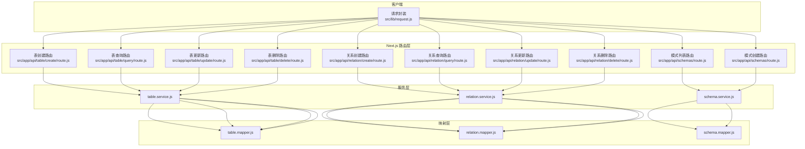
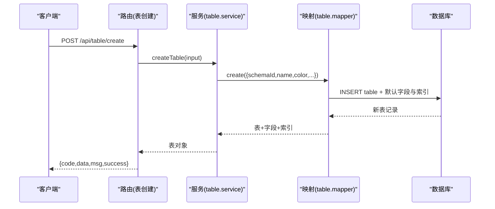
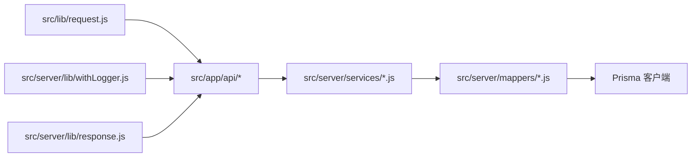

# API 接口文档

<cite>
**本文档引用的文件**
- [package.json](file://package.json)
- [src/lib/config.js](file://src/lib/config.js)
- [src/lib/request.js](file://src/lib/request.js)
- [src/server/lib/response.js](file://src/server/lib/response.js)
- [src/server/lib/withLogger.js](file://src/server/lib/withLogger.js)
- [src/app/api/table/create/route.js](file://src/app/api/table/create/route.js)
- [src/app/api/table/query/route.js](file://src/app/api/table/query/route.js)
- [src/app/api/table/update/route.js](file://src/app/api/table/update/route.js)
- [src/app/api/table/delete/route.js](file://src/app/api/table/delete/route.js)
- [src/app/api/relation/create/route.js](file://src/app/api/relation/create/route.js)
- [src/app/api/relation/query/route.js](file://src/app/api/relation/query/route.js)
- [src/app/api/relation/update/route.js](file://src/app/api/relation/update/route.js)
- [src/app/api/relation/delete/route.js](file://src/app/api/relation/delete/route.js)
- [src/app/api/schemas/route.js](file://src/app/api/schemas/route.js)
- [src/server/services/table.service.js](file://src/server/services/table.service.js)
- [src/server/services/relation.service.js](file://src/server/services/relation.service.js)
- [src/server/services/schema.service.js](file://src/server/services/schema.service.js)
- [src/server/mappers/table.mapper.js](file://src/server/mappers/table.mapper.js)
- [src/server/mappers/relation.mapper.js](file://src/server/mappers/relation.mapper.js)
- [src/server/mappers/schema.mapper.js](file://src/server/mappers/schema.mapper.js)
</cite>

## 目录
1. [简介](#简介)
2. [项目结构](#项目结构)
3. [核心组件](#核心组件)
4. [架构总览](#架构总览)
5. [详细组件分析](#详细组件分析)
6. [依赖分析](#依赖分析)
7. [性能考虑](#性能考虑)
8. [故障排除指南](#故障排除指南)
9. [结论](#结论)
10. [附录](#附录)

## 简介
本文件为 Vibe DB 的完整 API 接口技术参考，覆盖表管理、关系管理与模式管理三大类接口。文档从架构、端点定义、请求/响应格式、错误码、认证与安全、SDK 使用、版本与性能策略、常见场景与排障等方面进行系统化说明，帮助开发者与集成方快速上手。

## 项目结构
Vibe DB 基于 Next.js App Router，采用分层设计：前端请求封装在客户端工具中，服务端通过 App Router 路由暴露 RESTful 接口，路由层调用服务层，服务层再委托映射器访问数据库。日志与统一响应封装在服务端工具中，便于统一处理与可观测性。

图表来源
- [src/lib/request.js:1-142](file://src/lib/request.js#L1-L142)
- [src/app/api/table/create/route.js:1-16](file://src/app/api/table/create/route.js#L1-L16)
- [src/app/api/table/query/route.js:1-20](file://src/app/api/table/query/route.js#L1-L20)
- [src/app/api/table/update/route.js:1-16](file://src/app/api/table/update/route.js#L1-L16)
- [src/app/api/table/delete/route.js:1-16](file://src/app/api/table/delete/route.js#L1-L16)
- [src/app/api/relation/create/route.js:1-14](file://src/app/api/relation/create/route.js#L1-L14)
- [src/app/api/relation/query/route.js:1-20](file://src/app/api/relation/query/route.js#L1-L20)
- [src/app/api/relation/update/route.js:1-14](file://src/app/api/relation/update/route.js#L1-L14)
- [src/app/api/relation/delete/route.js:1-15](file://src/app/api/relation/delete/route.js#L1-L15)
- [src/app/api/schemas/route.js:1-23](file://src/app/api/schemas/route.js#L1-L23)
- [src/server/services/table.service.js:1-38](file://src/server/services/table.service.js#L1-L38)
- [src/server/services/relation.service.js:1-26](file://src/server/services/relation.service.js#L1-L26)
- [src/server/services/schema.service.js:1-26](file://src/server/services/schema.service.js#L1-L26)
- [src/server/mappers/table.mapper.js:1-110](file://src/server/mappers/table.mapper.js#L1-L110)
- [src/server/mappers/relation.mapper.js:1-28](file://src/server/mappers/relation.mapper.js#L1-L28)
- [src/server/mappers/schema.mapper.js:1-35](file://src/server/mappers/schema.mapper.js#L1-L35)

章节来源
- [package.json:1-55](file://package.json#L1-L55)
- [src/lib/config.js:1-33](file://src/lib/config.js#L1-L33)

## 核心组件
- 请求封装与拦截器：提供统一的请求/响应拦截器、超时控制、错误处理与提示。
- 路由层：App Router 路由文件，负责接收请求、调用服务层、返回统一响应。
- 服务层：业务逻辑编排，参数校验与默认值处理，必要时协调多个映射器。
- 映射层：基于 Prisma 的数据访问层，提供 CRUD 与事务操作。
- 统一日志与响应：统一记录请求/响应日志与错误，统一响应结构。

章节来源
- [src/lib/request.js:1-142](file://src/lib/request.js#L1-L142)
- [src/server/lib/response.js:1-14](file://src/server/lib/response.js#L1-L14)
- [src/server/lib/withLogger.js:1-76](file://src/server/lib/withLogger.js#L1-L76)

## 架构总览
下图展示一次典型“创建表”的端到端流程，体现客户端、路由、服务与映射层之间的交互。

图表来源
- [src/app/api/table/create/route.js:1-16](file://src/app/api/table/create/route.js#L1-L16)
- [src/server/services/table.service.js:1-38](file://src/server/services/table.service.js#L1-L38)
- [src/server/mappers/table.mapper.js:1-110](file://src/server/mappers/table.mapper.js#L1-L110)
- [src/server/lib/response.js:1-14](file://src/server/lib/response.js#L1-L14)

## 详细组件分析

### 认证与安全
- 当前路由层未实现鉴权中间件，所有接口均为公开访问。
- 建议在路由层引入鉴权与授权中间件，并结合会话/令牌进行权限控制。
- 生产环境建议启用 HTTPS、CORS 限制与速率限制。

章节来源
- [src/app/api/table/create/route.js:1-16](file://src/app/api/table/create/route.js#L1-L16)
- [src/app/api/table/query/route.js:1-20](file://src/app/api/table/query/route.js#L1-L20)
- [src/app/api/table/update/route.js:1-16](file://src/app/api/table/update/route.js#L1-L16)
- [src/app/api/table/delete/route.js:1-16](file://src/app/api/table/delete/route.js#L1-L16)
- [src/app/api/relation/create/route.js:1-14](file://src/app/api/relation/create/route.js#L1-L14)
- [src/app/api/relation/query/route.js:1-20](file://src/app/api/relation/query/route.js#L1-L20)
- [src/app/api/relation/update/route.js:1-14](file://src/app/api/relation/update/route.js#L1-L14)
- [src/app/api/relation/delete/route.js:1-15](file://src/app/api/relation/delete/route.js#L1-L15)
- [src/app/api/schemas/route.js:1-23](file://src/app/api/schemas/route.js#L1-L23)

### 统一响应与错误处理
- 成功响应：包含 code、data、msg、success 四个字段；HTTP 状态码通常为 200。
- 失败响应：包含 code、data、msg、success；HTTP 状态码为 400 或 500。
- 路由层通过 withLogger 包裹，统一记录请求日志与错误日志。

章节来源
- [src/server/lib/response.js:1-14](file://src/server/lib/response.js#L1-L14)
- [src/server/lib/withLogger.js:1-76](file://src/server/lib/withLogger.js#L1-L76)

### 表管理 API

#### 1) 创建表
- 方法与路径：POST /api/table/create
- 请求体参数（节选）：schemaId、name、color、positionX、positionY、fields、indexes
- 成功响应：返回表对象（包含字段与索引）
- 错误码：400（参数校验失败或业务异常）

章节来源
- [src/app/api/table/create/route.js:1-16](file://src/app/api/table/create/route.js#L1-L16)
- [src/server/services/table.service.js:11-24](file://src/server/services/table.service.js#L11-L24)
- [src/server/mappers/table.mapper.js:17-47](file://src/server/mappers/table.mapper.js#L17-L47)

#### 2) 查询表（按模式）
- 方法与路径：GET /api/table/query?schemaId=xxx
- 查询参数：schemaId（必填）
- 成功响应：表数组（包含字段与索引）
- 错误码：400（缺少 schemaId 或业务异常）

章节来源
- [src/app/api/table/query/route.js:1-20](file://src/app/api/table/query/route.js#L1-L20)
- [src/server/services/table.service.js:6-9](file://src/server/services/table.service.js#L6-L9)
- [src/server/mappers/table.mapper.js:9-15](file://src/server/mappers/table.mapper.js#L9-L15)

#### 3) 更新表
- 方法与路径：POST /api/table/update
- 请求体参数（节选）：id、name、color、positionX、positionY、fields、indexes
- 成功响应：返回更新后的表对象
- 错误码：400（参数校验失败或业务异常）

章节来源
- [src/app/api/table/update/route.js:1-16](file://src/app/api/table/update/route.js#L1-L16)
- [src/server/services/table.service.js:26-31](file://src/server/services/table.service.js#L26-L31)
- [src/server/mappers/table.mapper.js:49-101](file://src/server/mappers/table.mapper.js#L49-L101)

#### 4) 删除表
- 方法与路径：POST /api/table/delete
- 请求体参数：id（必填）
- 成功响应：返回空数据
- 错误码：400（缺少 id 或业务异常）

章节来源
- [src/app/api/table/delete/route.js:1-16](file://src/app/api/table/delete/route.js#L1-L16)
- [src/server/services/table.service.js:33-36](file://src/server/services/table.service.js#L33-L36)
- [src/server/mappers/table.mapper.js:103-108](file://src/server/mappers/table.mapper.js#L103-L108)

### 关系管理 API

#### 1) 创建关系
- 方法与路径：POST /api/relation/create
- 请求体参数（节选）：schemaId、fromTableId、toTableId、type 等
- 成功响应：返回关系对象
- 错误码：400（参数校验失败或业务异常）

章节来源
- [src/app/api/relation/create/route.js:1-14](file://src/app/api/relation/create/route.js#L1-L14)
- [src/server/services/relation.service.js:10-13](file://src/server/services/relation.service.js#L10-L13)
- [src/server/mappers/relation.mapper.js:11-13](file://src/server/mappers/relation.mapper.js#L11-L13)

#### 2) 查询关系（按模式）
- 方法与路径：GET /api/relation/query?schemaId=xxx
- 查询参数：schemaId（必填）
- 成功响应：关系数组
- 错误码：400（缺少 schemaId 或业务异常）

章节来源
- [src/app/api/relation/query/route.js:1-20](file://src/app/api/relation/query/route.js#L1-L20)
- [src/server/services/relation.service.js:5-8](file://src/server/services/relation.service.js#L5-L8)
- [src/server/mappers/relation.mapper.js:4-9](file://src/server/mappers/relation.mapper.js#L4-L9)

#### 3) 更新关系
- 方法与路径：POST /api/relation/update
- 请求体参数（节选）：id、schemaId、fromTableId、toTableId、type 等
- 成功响应：返回更新后的关系对象
- 错误码：400（参数校验失败或业务异常）

章节来源
- [src/app/api/relation/update/route.js:1-14](file://src/app/api/relation/update/route.js#L1-L14)
- [src/server/services/relation.service.js:15-19](file://src/server/services/relation.service.js#L15-L19)
- [src/server/mappers/relation.mapper.js:15-20](file://src/server/mappers/relation.mapper.js#L15-L20)

#### 4) 删除关系
- 方法与路径：POST /api/relation/delete
- 请求体参数：id（必填）
- 成功响应：返回 { id }
- 错误码：400（缺少 id 或业务异常）

章节来源
- [src/app/api/relation/delete/route.js:1-15](file://src/app/api/relation/delete/route.js#L1-L15)
- [src/server/services/relation.service.js:21-24](file://src/server/services/relation.service.js#L21-L24)
- [src/server/mappers/relation.mapper.js:22-26](file://src/server/mappers/relation.mapper.js#L22-L26)

### 模式管理 API

#### 1) 获取模式列表
- 方法与路径：GET /api/schemas
- 查询参数：无
- 成功响应：模式数组（含计数信息）
- 错误码：400（业务异常）

章节来源
- [src/app/api/schemas/route.js:1-23](file://src/app/api/schemas/route.js#L1-L23)
- [src/server/services/schema.service.js:5-7](file://src/server/services/schema.service.js#L5-L7)
- [src/server/mappers/schema.mapper.js:4-18](file://src/server/mappers/schema.mapper.js#L4-L18)

#### 2) 创建模式
- 方法与路径：POST /api/schemas
- 请求体参数（节选）：name、description
- 成功响应：新建模式对象
- 错误码：400（参数校验失败或业务异常）

章节来源
- [src/app/api/schemas/route.js:14-22](file://src/app/api/schemas/route.js#L14-L22)
- [src/server/services/schema.service.js:9-15](file://src/server/services/schema.service.js#L9-L15)
- [src/server/mappers/schema.mapper.js:26-33](file://src/server/mappers/schema.mapper.js#L26-L33)

### 请求/响应示例与 SDK 使用

- 客户端请求封装：支持请求/响应拦截器、超时控制、错误抛出与提示。
- 常见用法：通过 get/post/put/del 快捷方法发起请求；在开发环境可自动打印请求体日志。
- 错误处理：统一捕获非 2xx 与业务失败，抛出带 code 的错误对象。

章节来源
- [src/lib/request.js:1-142](file://src/lib/request.js#L1-L142)
- [src/server/lib/withLogger.js:11-30](file://src/server/lib/withLogger.js#L11-L30)

### 版本管理与速率限制
- 版本管理：当前未实现 API 版本号路由或头字段，建议在路由前缀或请求头中引入版本控制。
- 速率限制：当前未实现限流策略，建议在网关或中间件层增加限流与熔断。

章节来源
- [src/lib/config.js:1-33](file://src/lib/config.js#L1-L33)

## 依赖分析

图表来源
- [src/lib/request.js:1-142](file://src/lib/request.js#L1-L142)
- [src/server/lib/withLogger.js:1-76](file://src/server/lib/withLogger.js#L1-L76)
- [src/server/lib/response.js:1-14](file://src/server/lib/response.js#L1-L14)
- [src/server/services/table.service.js:1-38](file://src/server/services/table.service.js#L1-L38)
- [src/server/services/relation.service.js:1-26](file://src/server/services/relation.service.js#L1-L26)
- [src/server/services/schema.service.js:1-26](file://src/server/services/schema.service.js#L1-L26)
- [src/server/mappers/table.mapper.js:1-110](file://src/server/mappers/table.mapper.js#L1-L110)
- [src/server/mappers/relation.mapper.js:1-28](file://src/server/mappers/relation.mapper.js#L1-L28)
- [src/server/mappers/schema.mapper.js:1-35](file://src/server/mappers/schema.mapper.js#L1-L35)

## 性能考虑
- 事务批量更新：表更新采用事务批量删除与重建字段/索引，避免部分更新导致的数据不一致。
- 查询排序与过滤：按创建时间排序，查询时按 schemaId 过滤，减少扫描范围。
- 默认值与最小字段集：创建表时注入默认主键与索引，降低后续维护成本。
- 建议优化方向：对高频查询添加索引、缓存模式列表、对批量字段/索引更新做分页或异步化。

章节来源
- [src/server/mappers/table.mapper.js:49-101](file://src/server/mappers/table.mapper.js#L49-L101)
- [src/server/mappers/schema.mapper.js:4-18](file://src/server/mappers/schema.mapper.js#L4-L18)

## 故障排除指南
- 常见错误
  - 缺少 schemaId：表/关系查询需要 schemaId 参数。
  - 缺少 id：删除/更新接口需提供 id。
  - 参数校验失败：请求体不符合服务层 Zod 校验。
- 日志定位
  - 开发环境自动打印请求体；生产环境可通过日志查看请求/响应状态与耗时。
- 超时与网络
  - 客户端请求封装内置超时控制，超时会抛出特定错误码。
- 建议排查步骤
  - 确认路由路径与方法是否正确。
  - 检查请求体与查询参数是否符合接口要求。
  - 查看服务端日志定位异常堆栈。

章节来源
- [src/app/api/table/query/route.js:10-12](file://src/app/api/table/query/route.js#L10-L12)
- [src/app/api/relation/delete/route.js:8-9](file://src/app/api/relation/delete/route.js#L8-L9)
- [src/lib/request.js:109-114](file://src/lib/request.js#L109-L114)
- [src/server/lib/withLogger.js:66-73](file://src/server/lib/withLogger.js#L66-L73)

## 结论
本文档提供了 Vibe DB 的表、关系与模式管理 API 的完整技术参考。当前实现简洁清晰，具备良好的扩展性。建议尽快补齐鉴权、版本控制与速率限制等生产级能力，并持续完善日志与监控体系。

## 附录

### 统一响应结构
- 成功响应：code=HTTP状态码，data=业务数据，msg='ok'，success=true
- 失败响应：code=错误码，data=null，msg=错误信息，success=false

章节来源
- [src/server/lib/response.js:3-13](file://src/server/lib/response.js#L3-L13)

### 请求封装要点
- 支持请求/响应拦截器注册
- 自动拼接查询参数与 JSON Body
- 超时控制与错误抛出
- 开发环境自动打印请求体

章节来源
- [src/lib/request.js:36-121](file://src/lib/request.js#L36-L121)