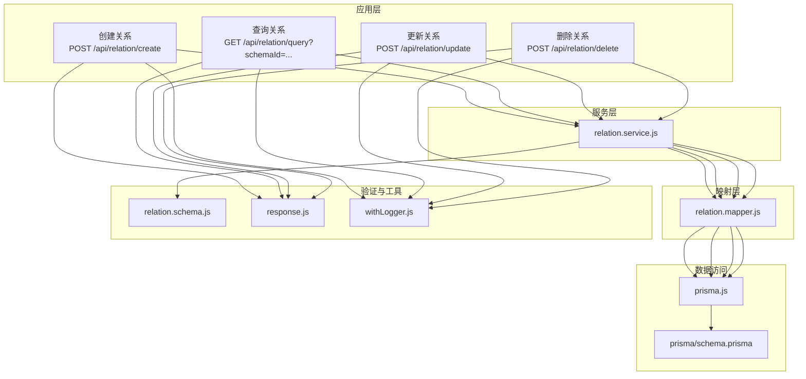
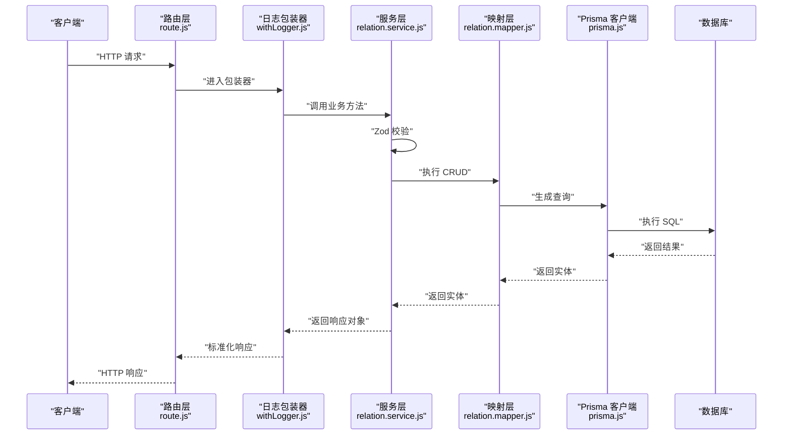
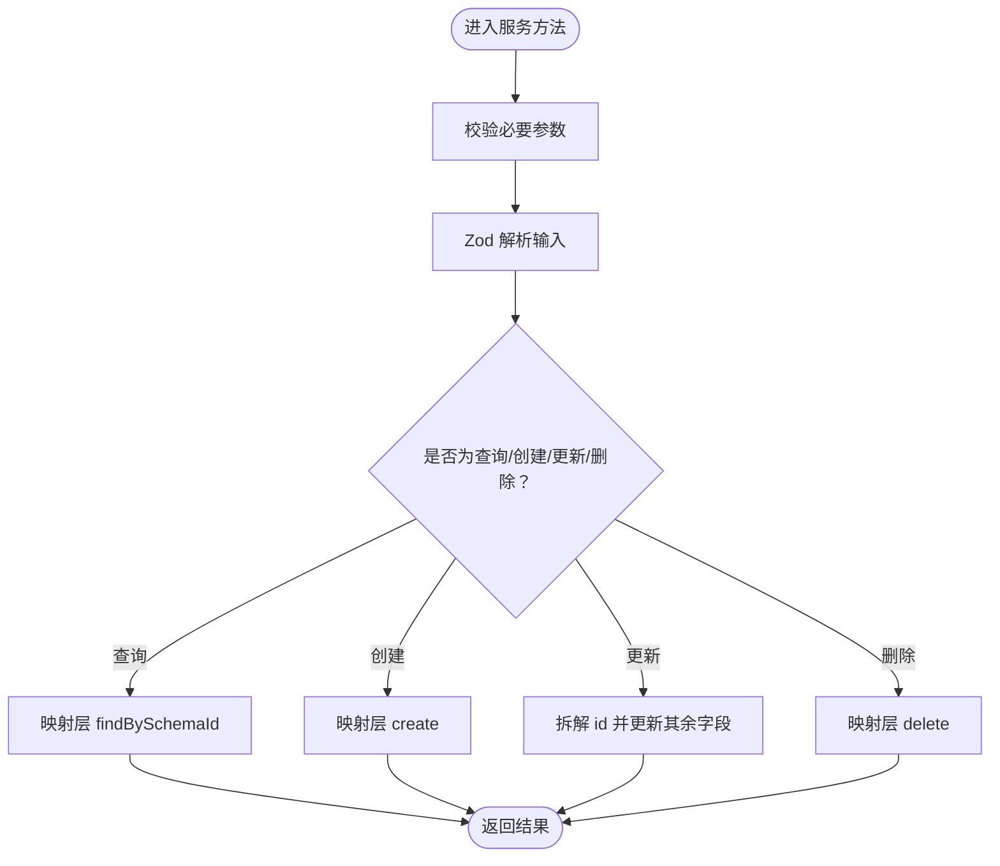
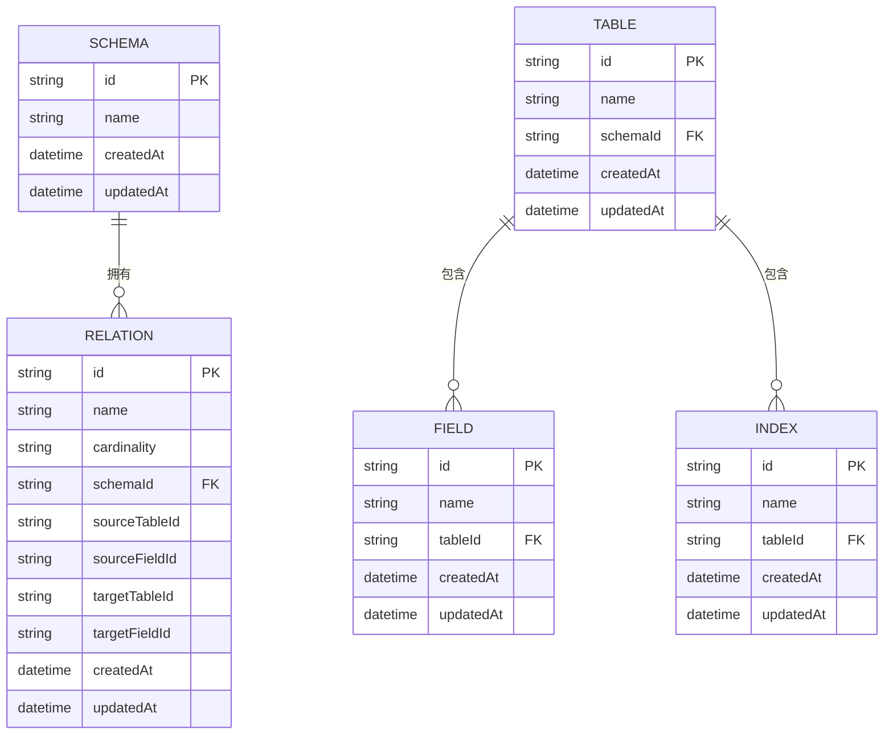
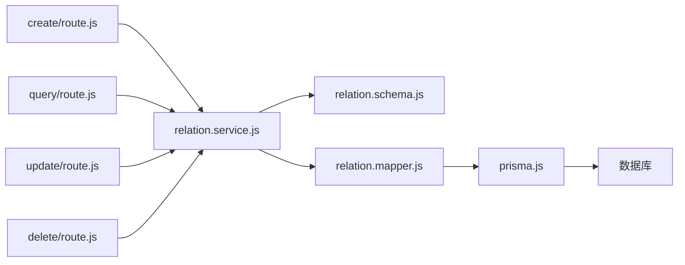

# 关系管理 API

<cite>
**本文档引用的文件**
- [src/app/api/relation/create/route.js](file://src/app/api/relation/create/route.js)
- [src/app/api/relation/query/route.js](file://src/app/api/relation/query/route.js)
- [src/app/api/relation/update/route.js](file://src/app/api/relation/update/route.js)
- [src/app/api/relation/delete/route.js](file://src/app/api/relation/delete/route.js)
- [src/server/services/relation.service.js](file://src/server/services/relation.service.js)
- [src/server/mappers/relation.mapper.js](file://src/server/mappers/relation.mapper.js)
- [src/server/schemas/relation.schema.js](file://src/server/schemas/relation.schema.js)
- [src/server/lib/response.js](file://src/server/lib/response.js)
- [src/server/lib/withLogger.js](file://src/server/lib/withLogger.js)
- [src/lib/prisma.js](file://src/lib/prisma.js)
- [prisma/schema.prisma](file://prisma/schema.prisma)
- [src/features/schema/RelationsPanel.jsx](file://src/features/schema/RelationsPanel.jsx)
- [src/features/canvas/CustomEdge.jsx](file://src/features/canvas/CustomEdge.jsx)
</cite>

## 目录
1. [简介](#简介)
2. [项目结构](#项目结构)
3. [核心组件](#核心组件)
4. [架构总览](#架构总览)
5. [详细组件分析](#详细组件分析)
6. [依赖分析](#依赖分析)
7. [性能考虑](#性能考虑)
8. [故障排查指南](#故障排查指南)
9. [结论](#结论)
10. [附录](#附录)

## 简介
本文件为“关系管理 API”的完整接口文档，覆盖表间关系的创建、查询、更新与删除等端点；明确关系类型（一对一、一对多、多对多）与外键约束；说明关系验证逻辑、引用完整性规则、以及前端可视化展示。文档同时给出服务层业务处理流程、数据映射器转换过程、请求/响应示例与最佳实践建议。

## 项目结构
关系管理 API 采用分层架构：应用层路由负责接收请求与返回标准响应；服务层进行输入校验与业务编排；映射层通过 Prisma 访问数据库；模式层使用 Zod 进行输入验证；工具层提供统一日志与响应封装。

图表来源
- [src/app/api/relation/create/route.js:1-14](file://src/app/api/relation/create/route.js#L1-L14)
- [src/app/api/relation/query/route.js:1-20](file://src/app/api/relation/query/route.js#L1-L20)
- [src/app/api/relation/update/route.js:1-14](file://src/app/api/relation/update/route.js#L1-L14)
- [src/app/api/relation/delete/route.js:1-15](file://src/app/api/relation/delete/route.js#L1-L15)
- [src/server/services/relation.service.js:1-26](file://src/server/services/relation.service.js#L1-L26)
- [src/server/mappers/relation.mapper.js:1-28](file://src/server/mappers/relation.mapper.js#L1-L28)
- [src/server/schemas/relation.schema.js:1-18](file://src/server/schemas/relation.schema.js#L1-L18)
- [src/server/lib/response.js:1-14](file://src/server/lib/response.js#L1-L14)
- [src/server/lib/withLogger.js:1-76](file://src/server/lib/withLogger.js#L1-L76)
- [src/lib/prisma.js:1-16](file://src/lib/prisma.js#L1-L16)
- [prisma/schema.prisma:1-69](file://prisma/schema.prisma#L1-L69)

章节来源
- [src/app/api/relation/create/route.js:1-14](file://src/app/api/relation/create/route.js#L1-L14)
- [src/app/api/relation/query/route.js:1-20](file://src/app/api/relation/query/route.js#L1-L20)
- [src/app/api/relation/update/route.js:1-14](file://src/app/api/relation/update/route.js#L1-L14)
- [src/app/api/relation/delete/route.js:1-15](file://src/app/api/relation/delete/route.js#L1-L15)
- [src/server/services/relation.service.js:1-26](file://src/server/services/relation.service.js#L1-L26)
- [src/server/mappers/relation.mapper.js:1-28](file://src/server/mappers/relation.mapper.js#L1-L28)
- [src/server/schemas/relation.schema.js:1-18](file://src/server/schemas/relation.schema.js#L1-L18)
- [src/server/lib/response.js:1-14](file://src/server/lib/response.js#L1-L14)
- [src/server/lib/withLogger.js:1-76](file://src/server/lib/withLogger.js#L1-L76)
- [src/lib/prisma.js:1-16](file://src/lib/prisma.js#L1-L16)
- [prisma/schema.prisma:1-69](file://prisma/schema.prisma#L1-L69)

## 核心组件
- 应用层路由：提供四个 REST 端点，分别对应创建、查询、更新、删除关系；统一使用日志包装器与标准响应格式。
- 服务层：负责输入校验（Zod）、业务编排与错误处理；将请求参数转换为映射层可执行的操作。
- 映射层：基于 Prisma 执行数据库 CRUD 操作；提供 findBySchemaId、create、update、delete 方法。
- 验证层：使用 Zod 定义创建与更新的输入模式，确保字段完整性与枚举值合法。
- 工具层：统一响应格式（Ok/BadRequest/NotFound/ServerError），以及带请求体提取的日志包装器。

章节来源
- [src/app/api/relation/create/route.js:1-14](file://src/app/api/relation/create/route.js#L1-L14)
- [src/app/api/relation/query/route.js:1-20](file://src/app/api/relation/query/route.js#L1-L20)
- [src/app/api/relation/update/route.js:1-14](file://src/app/api/relation/update/route.js#L1-L14)
- [src/app/api/relation/delete/route.js:1-15](file://src/app/api/relation/delete/route.js#L1-L15)
- [src/server/services/relation.service.js:1-26](file://src/server/services/relation.service.js#L1-L26)
- [src/server/mappers/relation.mapper.js:1-28](file://src/server/mappers/relation.mapper.js#L1-L28)
- [src/server/schemas/relation.schema.js:1-18](file://src/server/schemas/relation.schema.js#L1-L18)
- [src/server/lib/response.js:1-14](file://src/server/lib/response.js#L1-L14)
- [src/server/lib/withLogger.js:1-76](file://src/server/lib/withLogger.js#L1-L76)

## 架构总览
下图展示了从客户端到数据库的完整调用链路，以及各层职责与交互方式。

图表来源
- [src/app/api/relation/create/route.js:1-14](file://src/app/api/relation/create/route.js#L1-L14)
- [src/app/api/relation/query/route.js:1-20](file://src/app/api/relation/query/route.js#L1-L20)
- [src/app/api/relation/update/route.js:1-14](file://src/app/api/relation/update/route.js#L1-L14)
- [src/app/api/relation/delete/route.js:1-15](file://src/app/api/relation/delete/route.js#L1-L15)
- [src/server/lib/withLogger.js:1-76](file://src/server/lib/withLogger.js#L1-L76)
- [src/server/services/relation.service.js:1-26](file://src/server/services/relation.service.js#L1-L26)
- [src/server/mappers/relation.mapper.js:1-28](file://src/server/mappers/relation.mapper.js#L1-L28)
- [src/lib/prisma.js:1-16](file://src/lib/prisma.js#L1-L16)

## 详细组件分析

### 接口定义与行为
- 创建关系
  - 方法与路径：POST /api/relation/create
  - 请求体：包含 schemaId、name、cardinality、sourceTableId、sourceFieldId、targetTableId、targetFieldId
  - 成功响应：返回新建关系对象
  - 错误处理：参数缺失或校验失败时返回 400
- 查询关系
  - 方法与路径：GET /api/relation/query?schemaId=...
  - 查询参数：schemaId（必填）
  - 成功响应：返回该模式下的关系数组（按创建时间升序）
  - 错误处理：缺少 schemaId 或查询异常返回 400
- 更新关系
  - 方法与路径：POST /api/relation/update
  - 请求体：包含 id（必填）及可选字段 name、cardinality
  - 成功响应：返回更新后的关系对象
  - 错误处理：id 缺失或校验失败返回 400
- 删除关系
  - 方法与路径：POST /api/relation/delete
  - 请求体：包含 id（必填）
  - 成功响应：返回 { id }
  - 错误处理：id 缺失或删除异常返回 400

章节来源
- [src/app/api/relation/create/route.js:1-14](file://src/app/api/relation/create/route.js#L1-L14)
- [src/app/api/relation/query/route.js:1-20](file://src/app/api/relation/query/route.js#L1-L20)
- [src/app/api/relation/update/route.js:1-14](file://src/app/api/relation/update/route.js#L1-L14)
- [src/app/api/relation/delete/route.js:1-15](file://src/app/api/relation/delete/route.js#L1-L15)

### 输入验证与关系类型
- 关系类型枚举：ONE_TO_ONE、ONE_TO_MANY、MANY_TO_MANY，默认值为 ONE_TO_MANY
- 创建校验要点：
  - schemaId、name、sourceTableId、sourceFieldId、targetTableId、targetFieldId 均不可为空
  - name 长度限制为 1~128 字符
- 更新校验要点：
  - id 必填
  - name 可选且长度限制为 1~128
  - cardinality 可选，合法值来自上述枚举

章节来源
- [src/server/schemas/relation.schema.js:1-18](file://src/server/schemas/relation.schema.js#L1-L18)

### 服务层业务逻辑
- getRelationsBySchemaId：校验 schemaId 后委托映射层查询
- createRelation：使用创建模式解析输入，再委托映射层创建
- updateRelation：使用更新模式解析输入，拆解 id 后委托映射层更新
- deleteRelation：校验 id 后委托映射层删除

图表来源
- [src/server/services/relation.service.js:1-26](file://src/server/services/relation.service.js#L1-L26)
- [src/server/schemas/relation.schema.js:1-18](file://src/server/schemas/relation.schema.js#L1-L18)

章节来源
- [src/server/services/relation.service.js:1-26](file://src/server/services/relation.service.js#L1-L26)

### 映射层与数据访问
- findBySchemaId：按 schemaId 查询关系列表，按 createdAt 升序排序
- create：创建新关系
- update：按 id 更新关系
- delete：按 id 删除关系
- 数据库模型：Relation 模型包含 schemaId、sourceTableId、sourceFieldId、targetTableId、targetFieldId、cardinality、name 等字段；与 Schema 的级联删除关系在 Prisma 模式中定义

图表来源
- [prisma/schema.prisma:1-69](file://prisma/schema.prisma#L1-L69)
- [src/server/mappers/relation.mapper.js:1-28](file://src/server/mappers/relation.mapper.js#L1-L28)

章节来源
- [src/server/mappers/relation.mapper.js:1-28](file://src/server/mappers/relation.mapper.js#L1-L28)
- [prisma/schema.prisma:1-69](file://prisma/schema.prisma#L1-L69)

### 前端集成与可视化
- 关系面板 RelationsPanel：展示关系列表，支持修改关系类型（cardinality）与删除关系
- 自定义边 CustomEdge：根据关系类型渲染基数标签（如 1/N、1/1、N/N）

章节来源
- [src/features/schema/RelationsPanel.jsx:1-89](file://src/features/schema/RelationsPanel.jsx#L1-L89)
- [src/features/canvas/CustomEdge.jsx:1-87](file://src/features/canvas/CustomEdge.jsx#L1-L87)

### 请求/响应示例
- 创建关系
  - 请求体（字段说明见“输入验证与关系类型”）：包含 schemaId、name、cardinality、sourceTableId、sourceFieldId、targetTableId、targetFieldId
  - 成功响应：包含新建关系的完整信息
  - 失败响应：400，包含错误消息
- 查询关系
  - 请求：GET /api/relation/query?schemaId=xxx
  - 成功响应：关系数组（按创建时间升序）
  - 失败响应：400，缺少 schemaId 或查询异常
- 更新关系
  - 请求体：包含 id 与可选字段 name、cardinality
  - 成功响应：更新后的关系对象
  - 失败响应：400，id 缺失或校验失败
- 删除关系
  - 请求体：包含 id
  - 成功响应：{ id }
  - 失败响应：400，id 缺失或删除异常

章节来源
- [src/app/api/relation/create/route.js:1-14](file://src/app/api/relation/create/route.js#L1-L14)
- [src/app/api/relation/query/route.js:1-20](file://src/app/api/relation/query/route.js#L1-L20)
- [src/app/api/relation/update/route.js:1-14](file://src/app/api/relation/update/route.js#L1-L14)
- [src/app/api/relation/delete/route.js:1-15](file://src/app/api/relation/delete/route.js#L1-L15)

## 依赖分析
- 路由层依赖服务层与日志包装器；服务层依赖验证模式与映射层；映射层依赖 Prisma 客户端；Prisma 客户端依赖数据库连接配置。
- 关系类型与外键约束在 Prisma 模式中定义，映射层仅执行 CRUD，不包含业务规则校验。

图表来源
- [src/app/api/relation/create/route.js:1-14](file://src/app/api/relation/create/route.js#L1-L14)
- [src/app/api/relation/query/route.js:1-20](file://src/app/api/relation/query/route.js#L1-L20)
- [src/app/api/relation/update/route.js:1-14](file://src/app/api/relation/update/route.js#L1-L14)
- [src/app/api/relation/delete/route.js:1-15](file://src/app/api/relation/delete/route.js#L1-L15)
- [src/server/services/relation.service.js:1-26](file://src/server/services/relation.service.js#L1-L26)
- [src/server/schemas/relation.schema.js:1-18](file://src/server/schemas/relation.schema.js#L1-L18)
- [src/server/mappers/relation.mapper.js:1-28](file://src/server/mappers/relation.mapper.js#L1-L28)
- [src/lib/prisma.js:1-16](file://src/lib/prisma.js#L1-L16)

章节来源
- [src/server/lib/withLogger.js:1-76](file://src/server/lib/withLogger.js#L1-L76)
- [src/server/lib/response.js:1-14](file://src/server/lib/response.js#L1-L14)
- [src/lib/prisma.js:1-16](file://src/lib/prisma.js#L1-L16)
- [prisma/schema.prisma:1-69](file://prisma/schema.prisma#L1-L69)

## 性能考虑
- 查询优化：按 schemaId 查询关系列表，建议在 schemaId 上建立索引以提升查询效率（Prisma 模式未显式声明索引，可在迁移中补充）。
- 写入优化：批量创建/更新关系时，尽量减少网络往返；单条写入已通过 Prisma 客户端完成。
- 日志开销：开发环境启用请求体日志便于调试，生产环境建议关闭以降低 IO 压力。
- 前端渲染：关系列表滚动区域使用虚拟化组件，避免大量节点一次性渲染导致卡顿。

## 故障排查指南
- 常见错误
  - 参数缺失：schemaId 缺失、id 缺失、必填字段为空
  - 校验失败：name 长度超限、cardinality 非法枚举值
  - 数据库异常：删除不存在的 id、违反外键约束
- 建议排查步骤
  - 检查请求体结构与字段类型
  - 确认 schemaId 对应的模式是否存在
  - 确认 source/target 表与字段存在且属于同一 schema
  - 查看日志文件定位具体错误位置
- 错误响应格式
  - 统一为 { code, data, msg, success } 结构，便于前端一致化处理

章节来源
- [src/server/lib/response.js:1-14](file://src/server/lib/response.js#L1-L14)
- [src/server/lib/withLogger.js:1-76](file://src/server/lib/withLogger.js#L1-L76)

## 结论
本关系管理 API 提供了清晰的分层设计与严格的输入验证，结合 Prisma 的关系模型与前端可视化组件，能够满足常见的表间关系建模需求。建议在生产环境中补充数据库索引、完善边界条件测试与错误监控，以进一步提升稳定性与性能。

## 附录

### 关系类型与外键约束说明
- 关系类型
  - ONE_TO_ONE：一对一
  - ONE_TO_MANY：一对多（默认）
  - MANY_TO_MANY：多对多
- 外键与引用完整性
  - Relation 模型包含 sourceTableId/sourceFieldId/targetTableId/targetFieldId 字段，用于指向具体表与字段
  - Prisma 模式中 Relation 与 Schema 存在级联删除关系（onDelete: Cascade），删除模式会级联删除其下所有关系
  - 当前映射层未实现循环依赖检测与级联操作的业务层校验，建议在服务层增加额外校验逻辑（例如：禁止自引用、检测循环依赖、限制多对多的字段组合等）

章节来源
- [prisma/schema.prisma:56-68](file://prisma/schema.prisma#L56-L68)
- [src/server/mappers/relation.mapper.js:1-28](file://src/server/mappers/relation.mapper.js#L1-L28)

### 最佳实践
- 输入校验前置：所有外部输入必须通过 Zod 模式校验
- 事务一致性：批量变更关系时建议使用 Prisma 事务，保证原子性
- 级联策略：谨慎使用 onDelete: Cascade，避免误删造成数据丢失
- 循环依赖：在服务层增加循环依赖检测与提示，防止用户创建不可维护的关系网
- 性能优化：为高频查询字段建立索引；对大列表使用分页或懒加载
- 错误处理：统一响应格式与日志记录，便于问题追踪与告警