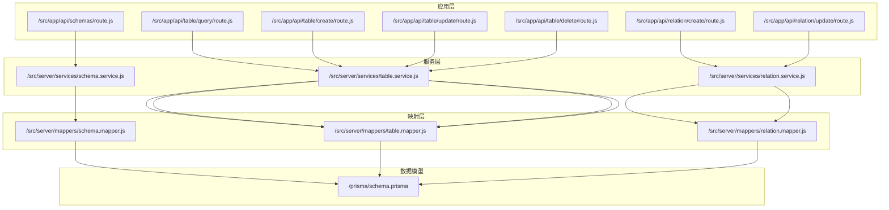
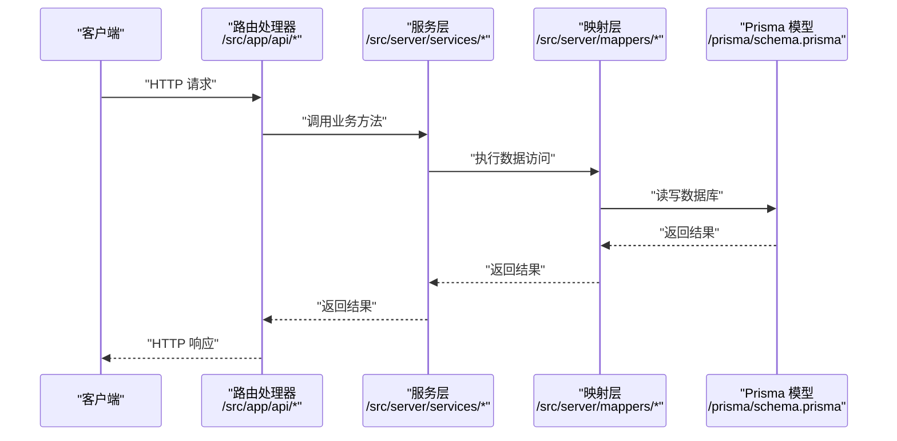
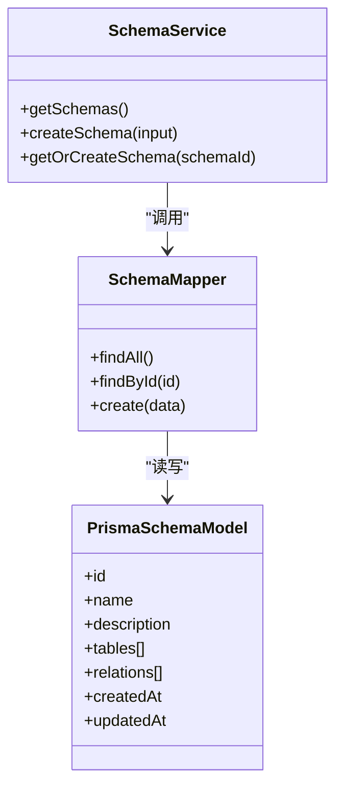
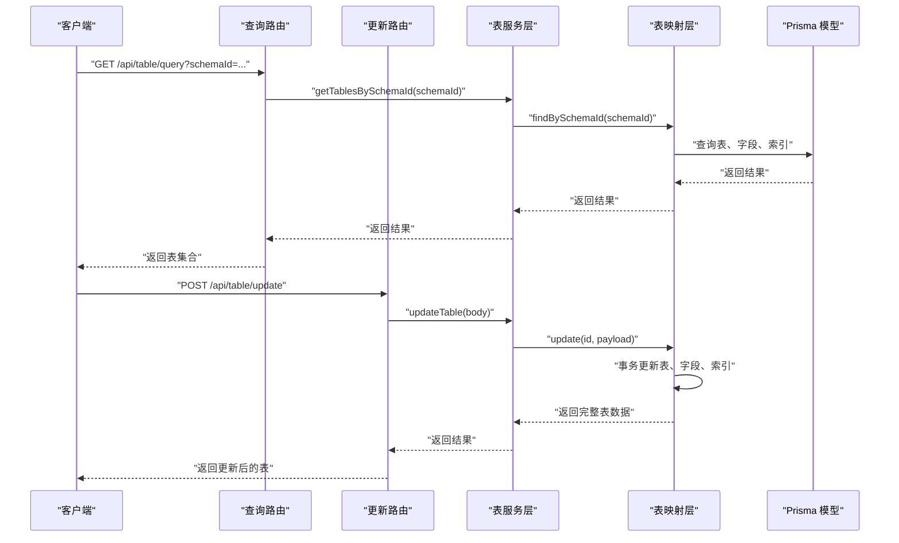
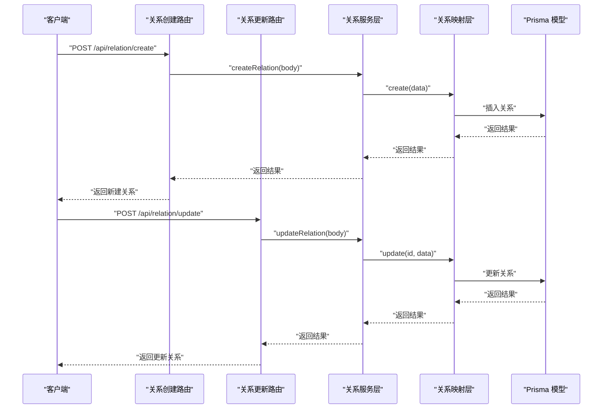
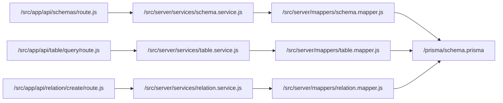
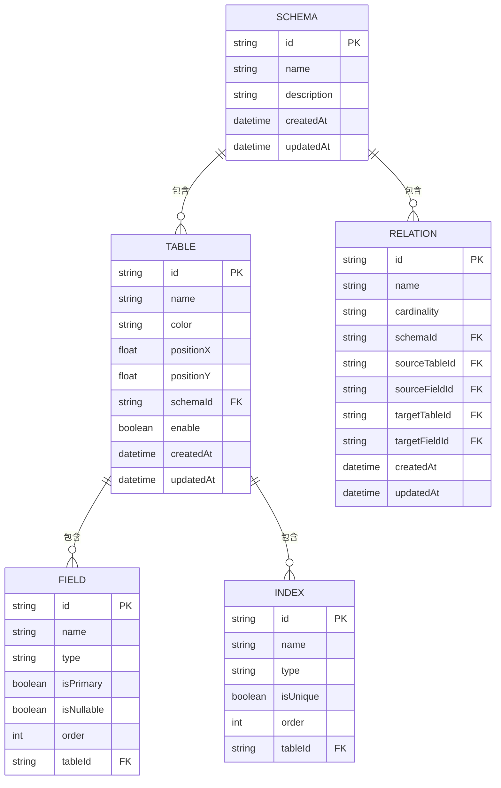

# 模式管理 API

<cite>
**本文引用的文件**
- [src/app/api/schemas/route.js](file://src/app/api/schemas/route.js)
- [src/server/services/schema.service.js](file://src/server/services/schema.service.js)
- [src/server/mappers/schema.mapper.js](file://src/server/mappers/schema.mapper.js)
- [src/server/schemas/schema.schema.js](file://src/server/schemas/schema.schema.js)
- [prisma/schema.prisma](file://prisma/schema.prisma)
- [src/app/api/table/query/route.js](file://src/app/api/table/query/route.js)
- [src/app/api/table/create/route.js](file://src/app/api/table/create/route.js)
- [src/app/api/table/update/route.js](file://src/app/api/table/update/route.js)
- [src/app/api/table/delete/route.js](file://src/app/api/table/delete/route.js)
- [src/server/services/table.service.js](file://src/server/services/table.service.js)
- [src/server/mappers/table.mapper.js](file://src/server/mappers/table.mapper.js)
- [src/server/schemas/table.schema.js](file://src/server/schemas/table.schema.js)
- [src/app/api/relation/create/route.js](file://src/app/api/relation/create/route.js)
- [src/app/api/relation/update/route.js](file://src/app/api/relation/update/route.js)
- [src/server/services/relation.service.js](file://src/server/services/relation.service.js)
- [src/server/mappers/relation.mapper.js](file://src/server/mappers/relation.mapper.js)
- [src/server/schemas/relation.schema.js](file://src/server/schemas/relation.schema.js)
- [src/server/lib/response.js](file://src/server/lib/response.js)
- [src/server/lib/withLogger.js](file://src/server/lib/withLogger.js)
</cite>

## 目录
1. [简介](#简介)
2. [项目结构](#项目结构)
3. [核心组件](#核心组件)
4. [架构总览](#架构总览)
5. [详细组件分析](#详细组件分析)
6. [依赖分析](#依赖分析)
7. [性能考量](#性能考量)
8. [故障排查指南](#故障排查指南)
9. [结论](#结论)
10. [附录](#附录)

## 简介
本文件为“模式管理 API”的综合性接口文档，覆盖模式（Schema）的创建、查询等核心能力，并结合表（Table）、关系（Relation）在模式下的层次关系进行说明。文档从系统架构、数据模型、服务层逻辑、数据映射器转换过程、验证规则与业务约束、安全与日志、并发处理、以及导入导出与版本管理建议等方面进行全面阐述，帮助开发者与使用者快速理解并正确使用模式管理相关接口。

## 项目结构
该系统采用分层架构：应用层（Next.js App Router 路由处理器）、服务层（业务逻辑封装）、映射层（数据访问与事务）、数据模型（Prisma 定义）。模式管理 API 的入口位于应用层路由，通过服务层调用映射层访问数据库；同时，表与关系均属于模式的容器内容，围绕模式进行查询与维护。

图表来源
- [src/app/api/schemas/route.js:1-23](file://src/app/api/schemas/route.js#L1-L23)
- [src/server/services/schema.service.js:1-26](file://src/server/services/schema.service.js#L1-L26)
- [src/server/mappers/schema.mapper.js:1-35](file://src/server/mappers/schema.mapper.js#L1-L35)
- [prisma/schema.prisma:10-18](file://prisma/schema.prisma#L10-L18)
- [src/app/api/table/query/route.js:1-20](file://src/app/api/table/query/route.js#L1-L20)
- [src/server/services/table.service.js:1-38](file://src/server/services/table.service.js#L1-L38)
- [src/server/mappers/table.mapper.js:1-110](file://src/server/mappers/table.mapper.js#L1-L110)
- [src/app/api/relation/create/route.js:1-14](file://src/app/api/relation/create/route.js#L1-L14)
- [src/server/services/relation.service.js:1-26](file://src/server/services/relation.service.js#L1-L26)
- [src/server/mappers/relation.mapper.js:1-28](file://src/server/mappers/relation.mapper.js#L1-L28)

章节来源
- [src/app/api/schemas/route.js:1-23](file://src/app/api/schemas/route.js#L1-L23)
- [src/server/services/schema.service.js:1-26](file://src/server/services/schema.service.js#L1-L26)
- [src/server/mappers/schema.mapper.js:1-35](file://src/server/mappers/schema.mapper.js#L1-L35)
- [prisma/schema.prisma:10-18](file://prisma/schema.prisma#L10-L18)

## 核心组件
- 模式（Schema）
  - 数据模型：包含标识符、名称、描述、创建/更新时间等字段，并与表、关系形成一对多关系。
  - API：提供查询全部模式列表与创建模式的能力。
  - 验证：名称长度限制与可选描述长度限制。
  - 默认行为：当未指定名称时，后端会设置默认值。
- 表（Table）
  - 属于模式的子实体，包含名称、颜色、位置坐标、启用状态、字段与索引集合。
  - 服务层支持按模式查询表、创建表（自动绑定或创建默认模式）、更新表（全量替换字段与索引）、软删除。
  - 映射层通过事务保证表信息、字段与索引的一致性更新。
- 关系（Relation）
  - 属于模式的子实体，包含名称、基数类型、源/目标表与字段等。
  - 支持按模式查询、创建、更新、删除。

章节来源
- [prisma/schema.prisma:10-18](file://prisma/schema.prisma#L10-L18)
- [src/server/services/schema.service.js:1-26](file://src/server/services/schema.service.js#L1-L26)
- [src/server/schemas/schema.schema.js:1-7](file://src/server/schemas/schema.schema.js#L1-L7)
- [src/server/services/table.service.js:1-38](file://src/server/services/table.service.js#L1-L38)
- [src/server/mappers/table.mapper.js:1-110](file://src/server/mappers/table.mapper.js#L1-L110)
- [src/server/services/relation.service.js:1-26](file://src/server/services/relation.service.js#L1-L26)
- [src/server/mappers/relation.mapper.js:1-28](file://src/server/mappers/relation.mapper.js#L1-L28)

## 架构总览
下图展示了模式管理 API 的端到端调用链路，从 Next.js 路由到服务层、映射层再到 Prisma 数据模型。

图表来源
- [src/app/api/schemas/route.js:1-23](file://src/app/api/schemas/route.js#L1-L23)
- [src/server/services/schema.service.js:1-26](file://src/server/services/schema.service.js#L1-L26)
- [src/server/mappers/schema.mapper.js:1-35](file://src/server/mappers/schema.mapper.js#L1-L35)
- [prisma/schema.prisma:10-18](file://prisma/schema.prisma#L10-L18)

## 详细组件分析

### 模式 API 组件分析
- 路由处理器
  - GET：列出所有模式，返回模式基础信息及表数量统计。
  - POST：接收请求体，创建新模式。
- 服务层
  - 查询：委托映射层获取模式列表。
  - 创建：使用 Zod 模式校验输入，规范化名称并创建。
  - 获取或创建默认模式：用于表创建时确保存在有效模式 ID。
- 映射层
  - 查询：按更新时间倒序返回模式列表，包含表计数。
  - 创建：根据输入创建模式，默认名称处理。
- 数据模型
  - Schema 模型定义了与 Table、Relation 的一对多关系，以及时间戳字段。

图表来源
- [src/server/services/schema.service.js:1-26](file://src/server/services/schema.service.js#L1-L26)
- [src/server/mappers/schema.mapper.js:1-35](file://src/server/mappers/schema.mapper.js#L1-L35)
- [prisma/schema.prisma:10-18](file://prisma/schema.prisma#L10-L18)

章节来源
- [src/app/api/schemas/route.js:1-23](file://src/app/api/schemas/route.js#L1-L23)
- [src/server/services/schema.service.js:1-26](file://src/server/services/schema.service.js#L1-L26)
- [src/server/mappers/schema.mapper.js:1-35](file://src/server/mappers/schema.mapper.js#L1-L35)
- [src/server/schemas/schema.schema.js:1-7](file://src/server/schemas/schema.schema.js#L1-L7)
- [prisma/schema.prisma:10-18](file://prisma/schema.prisma#L10-L18)

### 表 API 组件分析
- 路由处理器
  - 查询：要求提供模式 ID，返回该模式下的启用表及其字段、索引。
  - 创建：解析请求体，调用服务层创建表。
  - 更新：解析请求体，调用服务层更新表。
  - 删除：接收表 ID，调用服务层软删除。
- 服务层
  - 查询：校验参数并委托映射层按模式 ID 查询。
  - 创建：先确保存在有效模式 ID（获取或创建），再创建表。
  - 更新：使用 Zod 校验输入，进入映射层事务更新。
  - 删除：软删除表（标记禁用）。
- 映射层
  - 查询：按模式 ID 且启用状态查询，包含字段与索引，按创建时间升序。
  - 创建：默认创建主键字段与唯一索引，包含字段与索引。
  - 更新：事务内分别删除并重建字段与索引，确保一致性。
  - 软删除：更新启用状态为禁用。

图表来源
- [src/app/api/table/query/route.js:1-20](file://src/app/api/table/query/route.js#L1-L20)
- [src/app/api/table/update/route.js:1-16](file://src/app/api/table/update/route.js#L1-L16)
- [src/server/services/table.service.js:1-38](file://src/server/services/table.service.js#L1-L38)
- [src/server/mappers/table.mapper.js:1-110](file://src/server/mappers/table.mapper.js#L1-L110)
- [prisma/schema.prisma:20-33](file://prisma/schema.prisma#L20-L33)

章节来源
- [src/app/api/table/query/route.js:1-20](file://src/app/api/table/query/route.js#L1-L20)
- [src/app/api/table/create/route.js:1-16](file://src/app/api/table/create/route.js#L1-L16)
- [src/app/api/table/update/route.js:1-16](file://src/app/api/table/update/route.js#L1-L16)
- [src/app/api/table/delete/route.js:1-16](file://src/app/api/table/delete/route.js#L1-L16)
- [src/server/services/table.service.js:1-38](file://src/server/services/table.service.js#L1-L38)
- [src/server/mappers/table.mapper.js:1-110](file://src/server/mappers/table.mapper.js#L1-L110)
- [src/server/schemas/table.schema.js](file://src/server/schemas/table.schema.js)

### 关系 API 组件分析
- 路由处理器
  - 创建：解析请求体，调用服务层创建关系。
  - 更新：解析请求体，调用服务层更新关系。
- 服务层
  - 查询：按模式 ID 查询关系集合。
  - 创建/更新/删除：使用 Zod 校验输入，委托映射层执行。
- 映射层
  - 查询：按模式 ID 查询关系集合，按创建时间升序。
  - 创建/更新/删除：直接执行对应数据库操作。

图表来源
- [src/app/api/relation/create/route.js:1-14](file://src/app/api/relation/create/route.js#L1-L14)
- [src/app/api/relation/update/route.js:1-14](file://src/app/api/relation/update/route.js#L1-L14)
- [src/server/services/relation.service.js:1-26](file://src/server/services/relation.service.js#L1-L26)
- [src/server/mappers/relation.mapper.js:1-28](file://src/server/mappers/relation.mapper.js#L1-L28)
- [prisma/schema.prisma:56-68](file://prisma/schema.prisma#L56-L68)

章节来源
- [src/app/api/relation/create/route.js:1-14](file://src/app/api/relation/create/route.js#L1-L14)
- [src/app/api/relation/update/route.js:1-14](file://src/app/api/relation/update/route.js#L1-L14)
- [src/server/services/relation.service.js:1-26](file://src/server/services/relation.service.js#L1-L26)
- [src/server/mappers/relation.mapper.js:1-28](file://src/server/mappers/relation.mapper.js#L1-L28)
- [src/server/schemas/relation.schema.js](file://src/server/schemas/relation.schema.js)

## 依赖分析
- 组件耦合
  - 应用层路由仅负责参数解析与错误包装，不包含业务逻辑。
  - 服务层聚合业务规则与输入校验，降低路由复杂度。
  - 映射层封装数据访问与事务，隔离 Prisma 细节。
- 外部依赖
  - Prisma 提供 ORM 能力与数据模型定义。
  - Zod 提供运行时输入校验。
  - Next.js App Router 提供路由与中间件能力（日志、响应包装）。

图表来源
- [src/app/api/schemas/route.js:1-23](file://src/app/api/schemas/route.js#L1-L23)
- [src/server/services/schema.service.js:1-26](file://src/server/services/schema.service.js#L1-L26)
- [src/server/mappers/schema.mapper.js:1-35](file://src/server/mappers/schema.mapper.js#L1-L35)
- [src/app/api/table/query/route.js:1-20](file://src/app/api/table/query/route.js#L1-L20)
- [src/server/services/table.service.js:1-38](file://src/server/services/table.service.js#L1-L38)
- [src/server/mappers/table.mapper.js:1-110](file://src/server/mappers/table.mapper.js#L1-L110)
- [src/app/api/relation/create/route.js:1-14](file://src/app/api/relation/create/route.js#L1-L14)
- [src/server/services/relation.service.js:1-26](file://src/server/services/relation.service.js#L1-L26)
- [src/server/mappers/relation.mapper.js:1-28](file://src/server/mappers/relation.mapper.js#L1-L28)
- [prisma/schema.prisma:10-18](file://prisma/schema.prisma#L10-L18)

章节来源
- [src/app/api/schemas/route.js:1-23](file://src/app/api/schemas/route.js#L1-L23)
- [src/server/services/schema.service.js:1-26](file://src/server/services/schema.service.js#L1-L26)
- [src/server/mappers/schema.mapper.js:1-35](file://src/server/mappers/schema.mapper.js#L1-L35)
- [src/app/api/table/query/route.js:1-20](file://src/app/api/table/query/route.js#L1-L20)
- [src/server/services/table.service.js:1-38](file://src/server/services/table.service.js#L1-L38)
- [src/server/mappers/table.mapper.js:1-110](file://src/server/mappers/table.mapper.js#L1-L110)
- [src/app/api/relation/create/route.js:1-14](file://src/app/api/relation/create/route.js#L1-L14)
- [src/server/services/relation.service.js:1-26](file://src/server/services/relation.service.js#L1-L26)
- [src/server/mappers/relation.mapper.js:1-28](file://src/server/mappers/relation.mapper.js#L1-L28)
- [prisma/schema.prisma:10-18](file://prisma/schema.prisma#L10-L18)

## 性能考量
- 查询优化
  - 模式列表按更新时间排序，适合展示最近变更。
  - 表查询默认只返回启用状态的表，减少无效数据传输。
- 写入优化
  - 表更新采用事务，一次性完成表信息、字段、索引的全量替换，避免部分更新导致的数据不一致。
  - 批量写入字段与索引，减少多次往返。
- 并发与一致性
  - 事务确保字段与索引更新的原子性。
  - Prisma 的关系级删除策略（如级联删除）保障子对象清理。
- 建议
  - 对高频查询增加索引（如按模式 ID 查询表）。
  - 控制单次批量更新的字段/索引数量，避免事务过长持有锁。

## 故障排查指南
- 输入校验失败
  - 检查请求体是否符合 Zod 规则（名称长度、描述长度等）。
  - 参考路径：[src/server/schemas/schema.schema.js:1-7](file://src/server/schemas/schema.schema.js#L1-L7)、[src/server/schemas/table.schema.js](file://src/server/schemas/table.schema.js)、[src/server/schemas/relation.schema.js](file://src/server/schemas/relation.schema.js)
- 参数缺失
  - 表查询必须提供模式 ID；删除需要提供表 ID。
  - 参考路径：[src/app/api/table/query/route.js:7-12](file://src/app/api/table/query/route.js#L7-L12)、[src/app/api/table/delete/route.js:7-9](file://src/app/api/table/delete/route.js#L7-L9)
- 服务层异常
  - 查看服务层抛出的错误消息，确认业务前置条件（如 schemaId 必填）。
  - 参考路径：[src/server/services/table.service.js:7-8](file://src/server/services/table.service.js#L7-L8)、[src/server/services/table.service.js:33-35](file://src/server/services/table.service.js#L33-L35)
- 日志与响应
  - 所有路由均包裹统一日志中间件与响应包装，便于定位问题。
  - 参考路径：[src/server/lib/withLogger.js](file://src/server/lib/withLogger.js)、[src/server/lib/response.js](file://src/server/lib/response.js)

章节来源
- [src/server/schemas/schema.schema.js:1-7](file://src/server/schemas/schema.schema.js#L1-L7)
- [src/server/schemas/table.schema.js](file://src/server/schemas/table.schema.js)
- [src/server/schemas/relation.schema.js](file://src/server/schemas/relation.schema.js)
- [src/app/api/table/query/route.js:7-12](file://src/app/api/table/query/route.js#L7-L12)
- [src/app/api/table/delete/route.js:7-9](file://src/app/api/table/delete/route.js#L7-L9)
- [src/server/services/table.service.js:7-8](file://src/server/services/table.service.js#L7-L8)
- [src/server/services/table.service.js:33-35](file://src/server/services/table.service.js#L33-L35)
- [src/server/lib/withLogger.js](file://src/server/lib/withLogger.js)
- [src/server/lib/response.js](file://src/server/lib/response.js)

## 结论
模式管理 API 将模式、表、关系三者以清晰的层次关系组织，配合严格的输入校验、事务化的数据更新与统一的日志/响应包装，提供了稳定可靠的数据库设计容器管理能力。通过本文档的接口说明、数据模型与流程图解，用户可以快速掌握从模式创建到表与关系维护的完整工作流。

## 附录

### 数据模型与层次关系
- 模式（Schema）
  - 一对多：包含多个表与关系。
  - 时间戳：创建与更新时间自动生成。
- 表（Table）
  - 属于某个模式，启用/禁用状态控制可见性。
  - 包含字段与索引集合，创建时默认生成主键字段与唯一索引。
- 关系（Relation）
  - 属于某个模式，指向源/目标表与字段，定义基数类型。

图表来源
- [prisma/schema.prisma:10-68](file://prisma/schema.prisma#L10-L68)

### 接口清单与示例流程

- 模式
  - GET /api/schemas
    - 功能：查询所有模式（带表计数与更新时间排序）。
    - 示例请求：无请求体。
    - 示例响应：模式数组（包含 id、name、description、createdAt、updatedAt、_count.tables）。
  - POST /api/schemas
    - 功能：创建模式。
    - 请求体字段：name（必填，1-64 字符）、description（可选，最多 255 字符）。
    - 示例响应：新建模式对象。

- 表
  - GET /api/table/query?schemaId=...
    - 功能：按模式 ID 查询启用的表，包含字段与索引。
    - 请求参数：schemaId（必填）。
    - 示例响应：表数组（包含 fields、indexes）。
  - POST /api/table/create
    - 功能：创建表（自动绑定或创建默认模式）。
    - 请求体字段：schemaId（可选）、name（必填）、color（可选）、positionX（可选）、positionY（可选）。
    - 示例响应：新建表对象（包含默认主键字段与唯一索引）。
  - POST /api/table/update
    - 功能：更新表（全量替换字段与索引）。
    - 请求体字段：id（必填）、name/color/positionX/positionY（可选）、fields（可选，数组）、indexes（可选，数组）。
    - 示例响应：更新后的表对象。
  - POST /api/table/delete
    - 功能：软删除表（禁用）。
    - 请求体字段：id（必填）。
    - 示例响应：空对象。

- 关系
  - POST /api/relation/create
    - 功能：创建关系。
    - 请求体字段：schemaId（必填）、name（可选）、cardinality（可选）、sourceTableId、sourceFieldId、targetTableId、targetFieldId（必填）。
    - 示例响应：新建关系对象。
  - POST /api/relation/update
    - 功能：更新关系。
    - 请求体字段：id（必填）、name/cardinality/source*/target*（可选）。
    - 示例响应：更新后的关系对象。

章节来源
- [src/app/api/schemas/route.js:1-23](file://src/app/api/schemas/route.js#L1-L23)
- [src/server/schemas/schema.schema.js:1-7](file://src/server/schemas/schema.schema.js#L1-L7)
- [src/app/api/table/query/route.js:1-20](file://src/app/api/table/query/route.js#L1-L20)
- [src/app/api/table/create/route.js:1-16](file://src/app/api/table/create/route.js#L1-L16)
- [src/app/api/table/update/route.js:1-16](file://src/app/api/table/update/route.js#L1-L16)
- [src/app/api/table/delete/route.js:1-16](file://src/app/api/table/delete/route.js#L1-L16)
- [src/server/schemas/table.schema.js](file://src/server/schemas/table.schema.js)
- [src/app/api/relation/create/route.js:1-14](file://src/app/api/relation/create/route.js#L1-L14)
- [src/app/api/relation/update/route.js:1-14](file://src/app/api/relation/update/route.js#L1-L14)
- [src/server/schemas/relation.schema.js](file://src/server/schemas/relation.schema.js)

### 安全与并发
- 安全与权限
  - 当前路由未内置鉴权/授权逻辑，建议在生产环境接入认证与基于角色的访问控制（RBAC），并对敏感操作（如删除）进行权限校验。
- 并发处理
  - 表更新使用事务，确保字段与索引的原子性；删除采用软删除，避免物理删除带来的不可逆风险。
- 日志与可观测性
  - 使用统一日志中间件记录请求上下文与错误堆栈，便于审计与排障。

章节来源
- [src/server/lib/withLogger.js](file://src/server/lib/withLogger.js)
- [src/server/lib/response.js](file://src/server/lib/response.js)
- [src/server/mappers/table.mapper.js:49-100](file://src/server/mappers/table.mapper.js#L49-L100)

### 导入导出、版本管理与备份恢复（实践建议）
- 导入导出
  - 建议通过 Prisma 的迁移与种子数据机制实现结构化导入导出；或在业务层提供 JSON/DBML 导出格式，再通过工具转换回 Prisma 定义。
- 版本管理
  - 使用 Prisma 迁移目录管理数据库演进；每次结构变更提交新的迁移文件，保持可追溯性。
- 备份恢复
  - 建议定期对数据库进行快照备份，并在迁移前保留回滚脚本；恢复时先在测试环境验证迁移后再上线。

[本节为通用实践建议，不涉及具体代码文件]