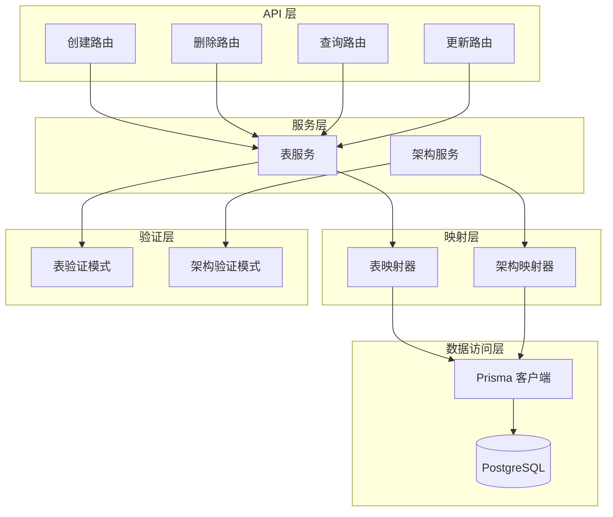
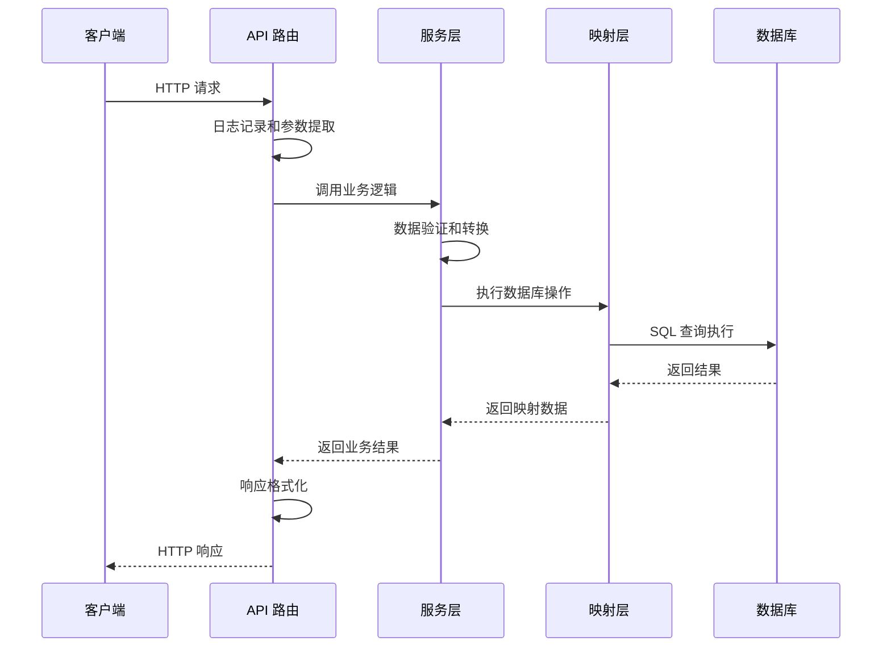
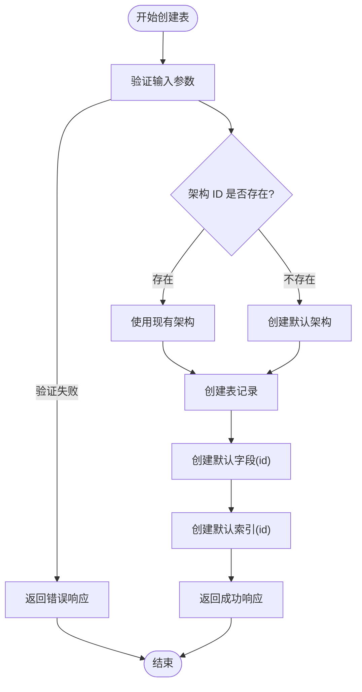
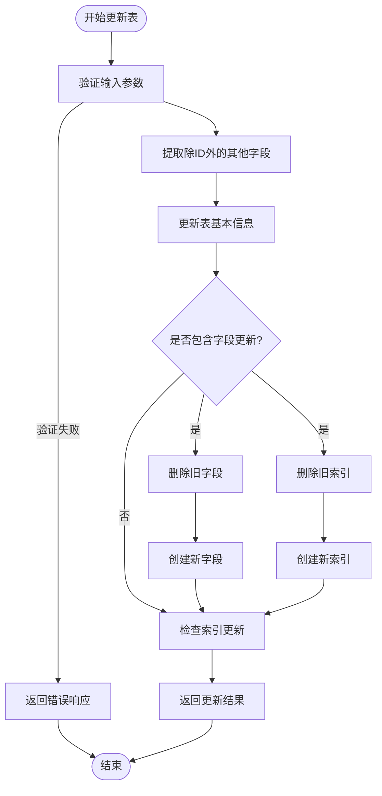
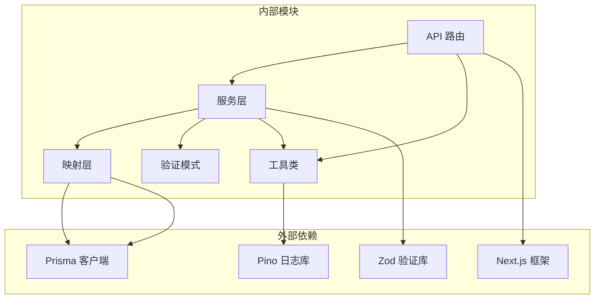
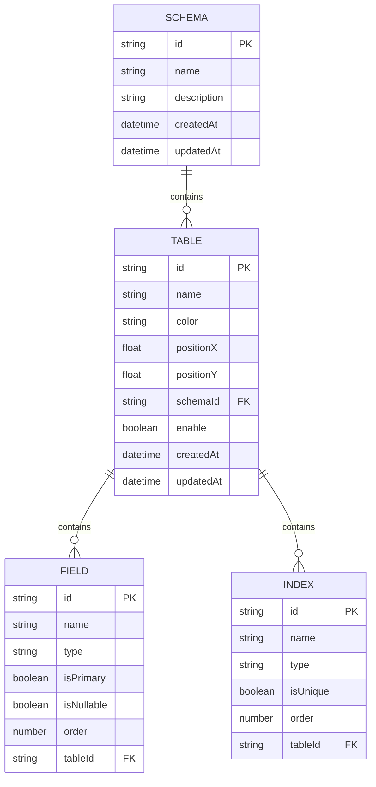

# 表管理 API

<cite>
**本文档引用的文件**
- [src/app/api/table/create/route.js](file://src/app/api/table/create/route.js)
- [src/app/api/table/delete/route.js](file://src/app/api/table/delete/route.js)
- [src/app/api/table/query/route.js](file://src/app/api/table/query/route.js)
- [src/app/api/table/update/route.js](file://src/app/api/table/update/route.js)
- [src/server/services/table.service.js](file://src/server/services/table.service.js)
- [src/server/mappers/table.mapper.js](file://src/server/mappers/table.mapper.js)
- [src/server/schemas/table.schema.js](file://src/server/schemas/table.schema.js)
- [src/server/lib/response.js](file://src/server/lib/response.js)
- [src/server/lib/withLogger.js](file://src/server/lib/withLogger.js)
- [src/server/services/schema.service.js](file://src/server/services/schema.service.js)
- [src/server/mappers/schema.mapper.js](file://src/server/mappers/schema.mapper.js)
- [src/lib/prisma.js](file://src/lib/prisma.js)
- [src/generated/prisma/models/Table.ts](file://src/generated/prisma/models/Table.ts)
- [package.json](file://package.json)
</cite>

## 目录
1. [简介](#简介)
2. [项目结构](#项目结构)
3. [核心组件](#核心组件)
4. [架构概览](#架构概览)
5. [详细组件分析](#详细组件分析)
6. [依赖关系分析](#依赖关系分析)
7. [性能考虑](#性能考虑)
8. [故障排除指南](#故障排除指南)
9. [结论](#结论)

## 简介

表管理 API 是一个基于 Next.js 和 Prisma 的数据库表管理服务，提供了完整的 CRUD 操作能力。该系统支持通过 RESTful API 对数据库中的表进行创建、查询、更新和删除操作，同时具备完善的表结构验证、数据映射和错误处理机制。

## 项目结构

表管理 API 采用分层架构设计，主要分为以下层次：



**图表来源**
- [src/app/api/table/create/route.js:1-16](file://src/app/api/table/create/route.js#L1-L16)
- [src/server/services/table.service.js:1-38](file://src/server/services/table.service.js#L1-L38)
- [src/server/mappers/table.mapper.js:1-110](file://src/server/mappers/table.mapper.js#L1-L110)

**章节来源**
- [src/app/api/table/create/route.js:1-16](file://src/app/api/table/create/route.js#L1-L16)
- [src/app/api/table/delete/route.js:1-16](file://src/app/api/table/delete/route.js#L1-L16)
- [src/app/api/table/query/route.js:1-20](file://src/app/api/table/query/route.js#L1-L20)
- [src/app/api/table/update/route.js:1-16](file://src/app/api/table/update/route.js#L1-L16)

## 核心组件

### API 路由层

四个核心 API 路由分别处理不同的表操作：

1. **创建表**: POST `/api/table/create`
2. **删除表**: POST `/api/table/delete`
3. **查询表**: GET `/api/table/query?schemaId={id}`
4. **更新表**: POST `/api/table/update`

每个路由都使用了统一的日志包装器和响应格式化工具。

**章节来源**
- [src/app/api/table/create/route.js:1-16](file://src/app/api/table/create/route.js#L1-L16)
- [src/app/api/table/delete/route.js:1-16](file://src/app/api/table/delete/route.js#L1-L16)
- [src/app/api/table/query/route.js:1-20](file://src/app/api/table/query/route.js#L1-L20)
- [src/app/api/table/update/route.js:1-16](file://src/app/api/table/update/route.js#L1-L16)

### 服务层

表服务层实现了业务逻辑的核心处理，包括：
- 数据验证和转换
- 架构 ID 处理
- 错误处理和事务管理

**章节来源**
- [src/server/services/table.service.js:1-38](file://src/server/services/table.service.js#L1-L38)

### 映射层

数据映射器负责与数据库的交互，提供：
- 原子性查询操作
- 复杂的数据关联处理
- 事务支持的批量操作

**章节来源**
- [src/server/mappers/table.mapper.js:1-110](file://src/server/mappers/table.mapper.js#L1-L110)

## 架构概览

表管理 API 采用经典的三层架构模式，确保了关注点分离和代码的可维护性：



**图表来源**
- [src/server/lib/withLogger.js:37-75](file://src/server/lib/withLogger.js#L37-L75)
- [src/server/lib/response.js:1-14](file://src/server/lib/response.js#L1-L14)

## 详细组件分析

### 创建表 API

#### 接口定义
- **HTTP 方法**: POST
- **URL 路径**: `/api/table/create`
- **请求体**: JSON 格式，包含表的基本信息

#### 请求参数格式
```javascript
{
  "schemaId": "string",      // 架构 ID (必填)
  "name": "string",          // 表名 (必填，1-64字符)
  "color": "string",         // 颜色值 (可选)
  "positionX": number,       // X坐标 (可选)
  "positionY": number        // Y坐标 (可选)
}
```

#### 响应数据结构
```javascript
{
  "id": "string",
  "name": "string",
  "color": "string",
  "positionX": number,
  "positionY": number,
  "schemaId": "string",
  "createdAt": "datetime",
  "updatedAt": "datetime",
  "enable": boolean,
  "fields": [
    {
      "id": "string",
      "name": "string",
      "type": "string",
      "isPrimary": boolean,
      "isNullable": boolean,
      "order": number,
      "tableId": "string"
    }
  ],
  "indexes": [
    {
      "id": "string",
      "name": "string",
      "type": "string",
      "isUnique": boolean,
      "order": number,
      "tableId": "string"
    }
  ]
}
```

#### 业务逻辑流程


**图表来源**
- [src/server/services/table.service.js:11-24](file://src/server/services/table.service.js#L11-L24)
- [src/server/mappers/table.mapper.js:17-47](file://src/server/mappers/table.mapper.js#L17-L47)

**章节来源**
- [src/app/api/table/create/route.js:1-16](file://src/app/api/table/create/route.js#L1-L16)
- [src/server/services/table.service.js:11-24](file://src/server/services/table.service.js#L11-L24)
- [src/server/schemas/table.schema.js:3-9](file://src/server/schemas/table.schema.js#L3-L9)

### 删除表 API

#### 接口定义
- **HTTP 方法**: POST
- **URL 路径**: `/api/table/delete`
- **请求体**: JSON 格式，包含表 ID

#### 请求参数格式
```javascript
{
  "id": "string"  // 表 ID (必填)
}
```

#### 响应数据结构
```javascript
null  // 软删除成功返回空值
```

#### 业务逻辑说明
删除操作采用软删除策略，通过设置 `enable` 字段为 `false` 来标记表的删除状态，而不是物理删除数据库记录。

**章节来源**
- [src/app/api/table/delete/route.js:1-16](file://src/app/api/table/delete/route.js#L1-L16)
- [src/server/services/table.service.js:33-36](file://src/server/services/table.service.js#L33-L36)
- [src/server/mappers/table.mapper.js:103-108](file://src/server/mappers/table.mapper.js#L103-L108)

### 查询表 API

#### 接口定义
- **HTTP 方法**: GET
- **URL 路径**: `/api/table/query?schemaId={id}`
- **查询参数**: `schemaId` (必填)

#### 响应数据结构
数组格式，包含多个表对象：
```javascript
[
  {
    "id": "string",
    "name": "string",
    "color": "string",
    "positionX": number,
    "positionY": number,
    "schemaId": "string",
    "createdAt": "datetime",
    "updatedAt": "datetime",
    "enable": boolean,
    "fields": [...],
    "indexes": [...]
  }
]
```

#### 业务逻辑说明
查询时会自动过滤掉被软删除的表（`enable: false`），并按创建时间升序排列。

**章节来源**
- [src/app/api/table/query/route.js:1-20](file://src/app/api/table/query/route.js#L1-L20)
- [src/server/services/table.service.js:6-9](file://src/server/services/table.service.js#L6-L9)
- [src/server/mappers/table.mapper.js:9-15](file://src/server/mappers/table.mapper.js#L9-L15)

### 更新表 API

#### 接口定义
- **HTTP 方法**: POST
- **URL 路径**: `/api/table/update`
- **请求体**: JSON 格式，包含表的更新信息

#### 请求参数格式
```javascript
{
  "id": "string",                    // 表 ID (必填)
  "name": "string",                  // 表名 (可选)
  "color": "string",                 // 颜色值 (可选)
  "positionX": number,               // X坐标 (可选)
  "positionY": number,               // Y坐标 (可选)
  "fields": [                        // 字段数组 (可选)
    {
      "id": "string",                // 字段ID (可选)
      "name": "string",              // 字段名 (必填)
      "type": "string",              // 字段类型 (必填)
      "isPrimary": boolean,          // 是否主键 (可选)
      "isNullable": boolean,         // 是否可为空 (可选)
      "order": number                // 排序 (可选)
    }
  ],
  "indexes": [                       // 索引数组 (可选)
    {
      "id": "string",                // 索引ID (可选)
      "name": "string",              // 索引名 (必填)
      "type": "string",              // 索引类型 (可选，默认BTREE)
      "isUnique": boolean,           // 是否唯一 (可选)
      "order": number                // 排序 (可选)
    }
  ]
}
```

#### 响应数据结构
完整的表对象，包含更新后的所有信息。

#### 业务逻辑流程


**图表来源**
- [src/server/services/table.service.js:26-31](file://src/server/services/table.service.js#L26-L31)
- [src/server/mappers/table.mapper.js:49-101](file://src/server/mappers/table.mapper.js#L49-L101)

**章节来源**
- [src/app/api/table/update/route.js:1-16](file://src/app/api/table/update/route.js#L1-L16)
- [src/server/services/table.service.js:26-31](file://src/server/services/table.service.js#L26-L31)
- [src/server/schemas/table.schema.js:11-40](file://src/server/schemas/table.schema.js#L11-L40)

## 依赖关系分析

### 组件依赖图



**图表来源**
- [package.json:16-38](file://package.json#L16-L38)
- [src/server/lib/response.js:1-14](file://src/server/lib/response.js#L1-L14)
- [src/server/lib/withLogger.js:1-76](file://src/server/lib/withLogger.js#L1-L76)

### 数据流图



**图表来源**
- [src/generated/prisma/models/Table.ts:325-351](file://src/generated/prisma/models/Table.ts#L325-L351)
- [src/generated/prisma/models/Table.ts:353-379](file://src/generated/prisma/models/Table.ts#L353-L379)

**章节来源**
- [package.json:16-38](file://package.json#L16-L38)

## 性能考虑

### 数据库优化建议

1. **索引策略**
   - 为 `schemaId` 字段建立索引以加速查询
   - 为 `enable` 字段建立复合索引以支持软删除过滤

2. **查询优化**
   - 使用 `select` 限定查询字段，避免不必要的数据传输
   - 实现分页查询以处理大量数据

3. **连接池配置**
   - 合理配置数据库连接池大小
   - 使用连接复用减少连接开销

### 缓存策略

1. **架构缓存**
   - 缓存常用的架构信息
   - 实现架构变更的缓存失效机制

2. **查询结果缓存**
   - 缓存热门表的查询结果
   - 设置合理的缓存过期时间

### 异步处理

1. **批量操作**
   - 支持批量创建和更新操作
   - 使用事务保证数据一致性

2. **后台任务**
   - 实现异步的表结构同步
   - 处理耗时的统计计算任务

## 故障排除指南

### 常见错误及解决方案

#### 1. 参数验证错误
**错误类型**: 400 Bad Request
**可能原因**:
- 缺少必填字段
- 字段长度超出限制
- 数据类型不匹配

**解决方案**:
- 检查请求体格式
- 验证字段约束条件
- 查看具体的错误消息

#### 2. 架构不存在
**错误类型**: 400 Bad Request
**可能原因**:
- 提供的 `schemaId` 不存在
- 架构 ID 格式不正确

**解决方案**:
- 先创建或获取有效的架构 ID
- 验证架构 ID 的存在性

#### 3. 数据库连接问题
**错误类型**: 500 Internal Server Error
**可能原因**:
- 数据库连接超时
- 连接池耗尽
- 数据库服务不可用

**解决方案**:
- 检查数据库连接配置
- 监控连接池使用情况
- 验证数据库服务状态

#### 4. 事务冲突
**错误类型**: 500 Internal Server Error
**可能原因**:
- 并发更新导致的锁冲突
- 事务超时

**解决方案**:
- 实现重试机制
- 优化事务粒度
- 检查死锁情况

### 调试技巧

1. **启用详细日志**
   ```javascript
   // 在开发环境查看请求体
   const requestBody = isDev ? await extractRequestBody(request) : null;
   ```

2. **监控数据库查询**
   - 使用 Prisma 日志功能
   - 分析慢查询语句
   - 监控查询执行计划

3. **性能分析**
   - 监控 API 响应时间
   - 分析内存使用情况
   - 检查并发处理能力

**章节来源**
- [src/server/lib/response.js:1-14](file://src/server/lib/response.js#L1-L14)
- [src/server/lib/withLogger.js:66-73](file://src/server/lib/withLogger.js#L66-L73)

## 结论

表管理 API 提供了一个完整、健壮的数据库表管理解决方案。通过清晰的分层架构、完善的验证机制和错误处理策略，该系统能够满足大多数数据库表管理需求。

### 主要优势

1. **架构清晰**: 采用分层设计，职责明确
2. **验证完善**: 使用 Zod 进行严格的参数验证
3. **错误处理**: 统一的错误响应格式和日志记录
4. **扩展性强**: 支持软删除、事务处理等高级特性
5. **性能优化**: 合理的数据库查询和缓存策略

### 改进建议

1. **添加分页支持**: 为大量数据的查询添加分页功能
2. **实现缓存层**: 添加 Redis 缓存以提高查询性能
3. **增强监控**: 添加更详细的性能指标和监控告警
4. **文档完善**: 生成 OpenAPI 规范文档
5. **测试覆盖**: 增加单元测试和集成测试覆盖率

该 API 为数据库表管理提供了一个坚实的基础，可以根据具体需求进一步扩展和优化。