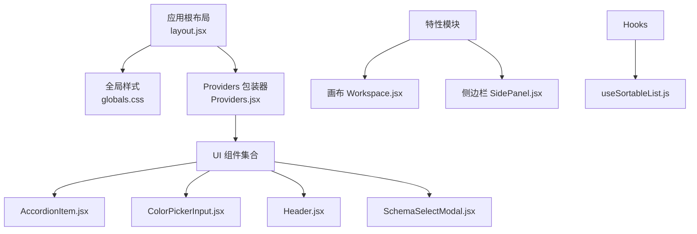
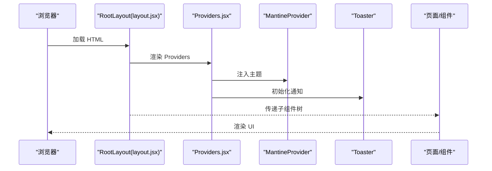
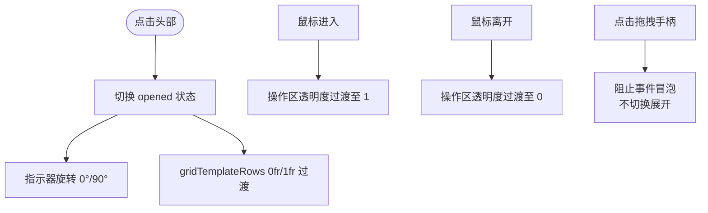
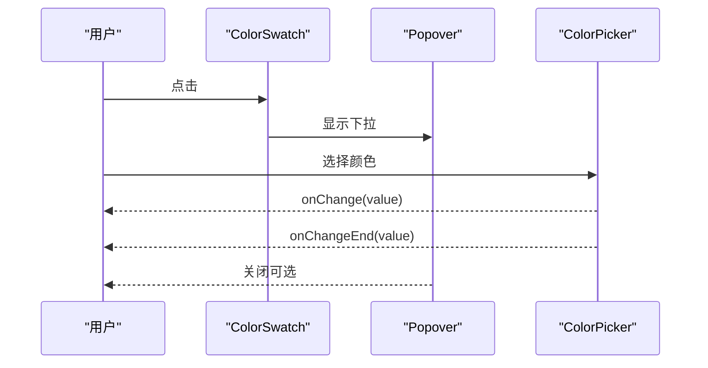
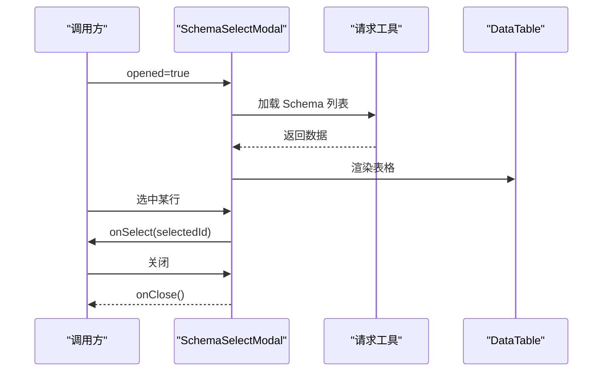
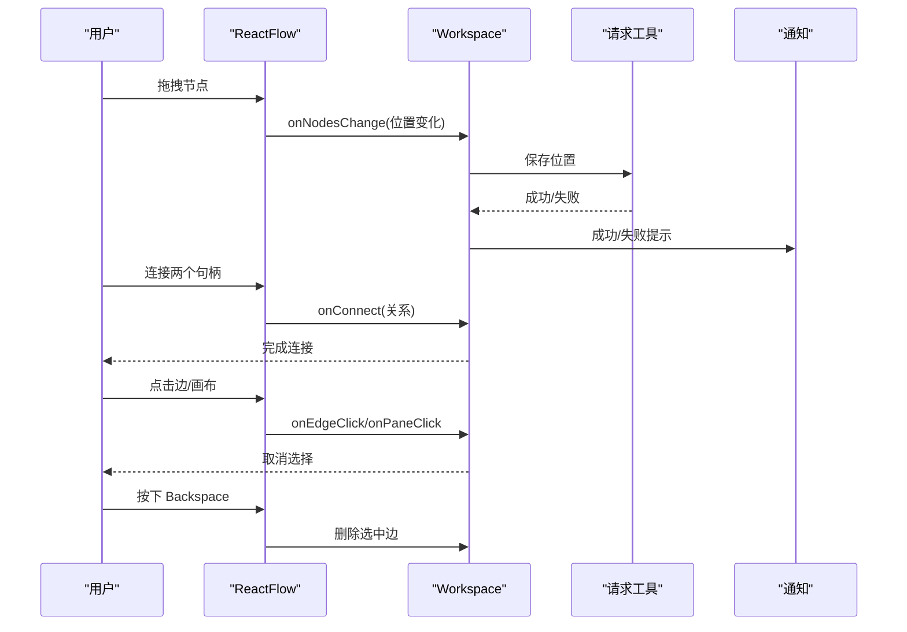
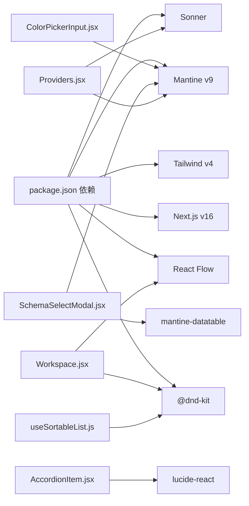

# UI 组件库

<cite>
**本文引用的文件**
- [src/components/AccordionItem.jsx](file://src/components/AccordionItem.jsx)
- [src/components/ColorPickerInput.jsx](file://src/components/ColorPickerInput.jsx)
- [src/components/Header.jsx](file://src/components/Header.jsx)
- [src/components/Providers.jsx](file://src/components/Providers.jsx)
- [src/components/SchemaSelectModal.jsx](file://src/components/SchemaSelectModal.jsx)
- [src/app/layout.jsx](file://src/app/layout.jsx)
- [src/app/globals.css](file://src/app/globals.css)
- [src/features/canvas/Workspace.jsx](file://src/features/canvas/Workspace.jsx)
- [src/features/schema/SidePanel.jsx](file://src/features/schema/SidePanel.jsx)
- [src/hooks/useSortableList.js](file://src/hooks/useSortableList.js)
- [package.json](file://package.json)
</cite>

## 目录
1. [简介](#简介)
2. [项目结构](#项目结构)
3. [核心组件](#核心组件)
4. [架构总览](#架构总览)
5. [详细组件分析](#详细组件分析)
6. [依赖分析](#依赖分析)
7. [性能考虑](#性能考虑)
8. [故障排查指南](#故障排查指南)
9. [结论](#结论)
10. [附录](#附录)

## 简介
本文件为 Vibe DB 的 UI 组件库使用与定制指南，覆盖可复用组件的视觉外观、行为与交互模式；详细记录组件属性、事件、插槽与自定义选项；提供使用示例、代码片段路径与实时演示思路；给出响应式设计与无障碍访问建议；说明组件状态、动画与过渡效果；记录样式自定义与主题支持；解释组件组合模式与与其它 UI 元素的集成方式。目标是帮助前端开发者快速理解并高效使用现有组件，同时安全地进行扩展与定制。

## 项目结构
Vibe DB 使用 Next.js 16 与 Mantine 生态构建，全局样式通过 Tailwind v4 主题变量与自定义 CSS 定义；应用根布局统一注入 Mantine Provider 与通知组件；核心 UI 组件位于 src/components；画布与面板功能位于 src/features；拖拽排序能力封装于 hooks。

图表来源
- [src/app/layout.jsx:10-18](file://src/app/layout.jsx#L10-L18)
- [src/app/globals.css:1-31](file://src/app/globals.css#L1-L31)
- [src/components/Providers.jsx:9-35](file://src/components/Providers.jsx#L9-L35)
- [src/components/AccordionItem.jsx:1-78](file://src/components/AccordionItem.jsx#L1-L78)
- [src/components/ColorPickerInput.jsx:1-52](file://src/components/ColorPickerInput.jsx#L1-L52)
- [src/components/Header.jsx:1-10](file://src/components/Header.jsx#L1-L10)
- [src/components/SchemaSelectModal.jsx:1-181](file://src/components/SchemaSelectModal.jsx#L1-L181)
- [src/features/canvas/Workspace.jsx:1-219](file://src/features/canvas/Workspace.jsx#L1-L219)
- [src/features/schema/SidePanel.jsx:1-39](file://src/features/schema/SidePanel.jsx#L1-L39)
- [src/hooks/useSortableList.js:1-26](file://src/hooks/useSortableList.js#L1-L26)

章节来源
- [src/app/layout.jsx:1-19](file://src/app/layout.jsx#L1-L19)
- [src/app/globals.css:1-31](file://src/app/globals.css#L1-L31)
- [src/components/Providers.jsx:1-36](file://src/components/Providers.jsx#L1-L36)

## 核心组件
本节概述可复用 UI 组件的能力边界与使用要点，便于快速检索与集成。

- AccordionItem：折叠面板项，支持默认展开、收起键、打开键、拖拽手柄、左侧元素、阴影与可拖拽开关等。
- ColorPickerInput：基于 Mantine 的颜色选择器，支持实时与结束回调、色板预设、箭头与阴影等。
- Header：顶部标题栏，简洁展示品牌名。
- SchemaSelectModal：Schema 选择与创建弹窗，内置表格展示、选中高亮、创建流程与确认回调。
- Providers：全局主题与通知包装器，统一注入 Mantine 主题与 Toast 样式。
- Workspace：画布容器，承载节点与连线，处理拖拽保存、连接、删除、键盘快捷键等。
- SidePanel：侧边栏面板容器，按激活面板渲染对应内容。
- useSortableList：基于 DnD Kit 的拖拽排序 Hook，提供传感器与重排回调。

章节来源
- [src/components/AccordionItem.jsx:6-78](file://src/components/AccordionItem.jsx#L6-L78)
- [src/components/ColorPickerInput.jsx:13-52](file://src/components/ColorPickerInput.jsx#L13-L52)
- [src/components/Header.jsx:1-10](file://src/components/Header.jsx#L1-L10)
- [src/components/SchemaSelectModal.jsx:13-181](file://src/components/SchemaSelectModal.jsx#L13-L181)
- [src/components/Providers.jsx:9-35](file://src/components/Providers.jsx#L9-L35)
- [src/features/canvas/Workspace.jsx:45-219](file://src/features/canvas/Workspace.jsx#L45-L219)
- [src/features/schema/SidePanel.jsx:22-39](file://src/features/schema/SidePanel.jsx#L22-L39)
- [src/hooks/useSortableList.js:10-26](file://src/hooks/useSortableList.js#L10-L26)

## 架构总览
下图展示了应用启动到组件渲染的关键路径：根布局注入 Providers，随后各页面与组件在 Mantine 主题与通知体系内运行；画布与面板作为特性模块与组件协同工作。

图表来源
- [src/app/layout.jsx:10-18](file://src/app/layout.jsx#L10-L18)
- [src/components/Providers.jsx:9-35](file://src/components/Providers.jsx#L9-L35)

## 详细组件分析

### AccordionItem 折叠面板项
- 视觉外观
  - 顶部行：左侧可放置颜色条或图标；中间为标题；右侧为操作区；右侧折叠指示器为旋转角度切换。
  - 展开区域：网格高度从 0 自动过渡到 1fr，配合溢出隐藏实现平滑展开。
  - 可选阴影与悬停背景色。
- 行为与交互
  - 点击头部切换展开/收起。
  - 悬停显示操作区，点击不冒泡以避免误触头部切换。
  - 支持拖拽手柄，点击手柄不触发头部切换。
  - 支持通过外部键控制默认展开/收起。
- 属性
  - title: 标题文本
  - actions: 操作区插槽（React 节点）
  - children: 折叠内容
  - defaultOpen: 初始展开状态
  - collapseKey: 收起键（变更后强制收起）
  - openKey: 打开键（变更后强制展开）
  - dragHandleProps: 拖拽手柄透传属性
  - shadow: 是否显示卡片阴影
  - draggable: 是否显示拖拽手柄
  - leftElement: 左侧元素（如颜色条）
- 事件与状态
  - 内部维护 opened 与 hovered 状态。
  - 通过 useEffect 监听 collapseKey/openKey 实现外部控制。
- 动画与过渡
  - 折叠指示器旋转角度 0/90 度，持续 200ms。
  - 展开区域 gridTemplateRows 过渡 0.2s。
- 插槽与组合
  - leftElement 与 actions 作为插槽，便于组合不同左侧装饰与右侧操作。
- 使用示例（代码片段路径）
  - [示例：基础折叠项:29-74](file://src/components/AccordionItem.jsx#L29-L74)
  - [示例：带拖拽手柄与动作区:39-62](file://src/components/AccordionItem.jsx#L39-L62)
- 响应式与无障碍
  - 使用 group 与 hover 效果提升可感知性；建议在父级提供明确的标题语义。
- 样式自定义与主题
  - 可通过 shadow 控制阴影；内部类名可被主题覆盖；建议通过 CSS 变量统一调整尺寸与颜色。

图表来源
- [src/components/AccordionItem.jsx:31-62](file://src/components/AccordionItem.jsx#L31-L62)

章节来源
- [src/components/AccordionItem.jsx:6-78](file://src/components/AccordionItem.jsx#L6-L78)

### ColorPickerInput 颜色选择器
- 视觉外观
  - 弹出层触发器为色块，支持箭头与阴影。
  - 弹出下拉包含颜色选择器与预设色板。
- 行为与交互
  - 点击色块弹出下拉；实时选择触发 onChange，结束选择触发 onChangeEnd。
  - 提供 swatchSize 与 withArrow 控制外观。
- 属性
  - value: 当前颜色值（默认值见源码）
  - onChange: 实时回调
  - onChangeEnd: 结束回调
  - swatchSize: 色块尺寸
  - withArrow: 是否显示箭头
- 事件与状态
  - 内部由 Mantine Popover 管理可见性与定位。
- 动画与过渡
  - Popover 带阴影与定位动画，颜色选择器切换平滑。
- 插槽与组合
  - 作为独立控件使用；可嵌入表单或设置面板。
- 使用示例（代码片段路径）
  - [示例：基础颜色选择器:20-48](file://src/components/ColorPickerInput.jsx#L20-L48)
- 响应式与无障碍
  - Popover 默认支持键盘访问；建议为色块提供 aria-label。
- 样式自定义与主题
  - 可通过 Mantine 主题变量与 CSS 覆盖下拉与色板样式。

图表来源
- [src/components/ColorPickerInput.jsx:20-48](file://src/components/ColorPickerInput.jsx#L20-L48)

章节来源
- [src/components/ColorPickerInput.jsx:13-52](file://src/components/ColorPickerInput.jsx#L13-L52)

### Header 顶部标题栏
- 视觉外观
  - 简洁的白色背景与浅灰边框，左侧品牌名。
- 行为与交互
  - 无交互逻辑，作为静态头部展示。
- 属性
  - 无
- 使用示例（代码片段路径）
  - [示例：顶部标题栏:1-10](file://src/components/Header.jsx#L1-L10)

章节来源
- [src/components/Header.jsx:1-10](file://src/components/Header.jsx#L1-L10)

### SchemaSelectModal Schema 选择与创建弹窗
- 视觉外观
  - 模态框居中，支持创建表单区域与数据表格；表格高亮选中行；底部操作按钮。
- 行为与交互
  - 打开时加载 Schema 列表；支持新建 Schema；点击行选中；点击打开触发回调。
  - 支持取消创建、禁用状态与加载状态。
- 属性
  - opened: 是否打开
  - onClose: 关闭回调
  - onSelect: 选中回调（传入选中 Schema ID）
- 事件与状态
  - 内部维护 schemas、selectedId、showCreateForm、newSchemaName、creating。
  - 使用请求工具与格式化工具处理 API 与时间显示。
- 动画与过渡
  - 模态框与表格高亮具备基础过渡；建议在业务层增加确认/取消的过渡提示。
- 插槽与组合
  - 作为独立弹窗组件使用；可与路由或状态管理结合。
- 使用示例（代码片段路径）
  - [示例：模态框主体与表格:64-178](file://src/components/SchemaSelectModal.jsx#L64-L178)
  - [示例：创建流程:37-55](file://src/components/SchemaSelectModal.jsx#L37-L55)
- 响应式与无障碍
  - 模态框尺寸较大（80%），建议在窄屏下评估滚动与可读性；为按钮与输入提供标签。
- 样式自定义与主题
  - 可通过 Mantine 主题与 CSS 覆盖弹窗、表格与按钮样式。

图表来源
- [src/components/SchemaSelectModal.jsx:20-62](file://src/components/SchemaSelectModal.jsx#L20-L62)

章节来源
- [src/components/SchemaSelectModal.jsx:13-181](file://src/components/SchemaSelectModal.jsx#L13-L181)

### Providers 全局主题与通知包装器
- 视觉外观
  - 注入 Mantine 主题；配置 Toaster 的位置、时长、渐变背景与边框模糊等。
- 行为与交互
  - 作为应用根组件包裹子树，确保所有组件在统一主题与通知上下文中运行。
- 属性
  - children: 子组件树
- 使用示例（代码片段路径）
  - [示例：根 Provider 注入:9-35](file://src/components/Providers.jsx#L9-L35)

章节来源
- [src/components/Providers.jsx:1-36](file://src/components/Providers.jsx#L1-L36)

### Workspace 画布容器
- 视觉外观
  - ReactFlow 画布，背景网格与控制控件；节点为表格节点，边为自定义连线。
- 行为与交互
  - 节点拖拽结束后保存位置；连接两端句柄建立关系；点击边或画布取消选择；Backspace 删除选中边。
- 属性
  - 无（通过上下文与外部状态驱动）
- 事件与状态
  - 内部维护 nodes、edges、selectedEdge；监听拖拽结束保存位置并反馈 Toast。
- 动画与过渡
  - 边选中时具有“流动”动画；节点与边的过渡由 ReactFlow 管理。
- 插槽与组合
  - 作为特性模块使用；与 SchemaContext 协同。
- 使用示例（代码片段路径）
  - [示例：画布初始化与事件绑定:45-219](file://src/features/canvas/Workspace.jsx#L45-L219)

图表来源
- [src/features/canvas/Workspace.jsx:130-187](file://src/features/canvas/Workspace.jsx#L130-L187)

章节来源
- [src/features/canvas/Workspace.jsx:1-219](file://src/features/canvas/Workspace.jsx#L1-L219)

### SidePanel 侧边栏面板
- 视觉外观
  - 顶部带彩色指示条与标题；内容区占满剩余空间。
- 行为与交互
  - 根据 activePanel 渲染对应面板内容。
- 属性
  - activePanel: 激活面板键（dbml、tables、relations）
- 使用示例（代码片段路径）
  - [示例：侧边栏渲染:22-39](file://src/features/schema/SidePanel.jsx#L22-L39)

章节来源
- [src/features/schema/SidePanel.jsx:1-39](file://src/features/schema/SidePanel.jsx#L1-L39)

### useSortableList 拖拽排序 Hook
- 行为与交互
  - 基于 DnD Kit 的指针传感器与拖拽结束回调；计算旧索引与新索引并调用 onReorder。
- 属性
  - items: 当前列表数据
  - onReorder: 排序完成后回调（传入新顺序数组）
  - idKey: 用作 DnD ID 的字段名（默认 'id'）
- 使用示例（代码片段路径）
  - [示例：Hook 使用:10-26](file://src/hooks/useSortableList.js#L10-L26)

章节来源
- [src/hooks/useSortableList.js:1-26](file://src/hooks/useSortableList.js#L1-L26)

## 依赖分析
- 组件依赖
  - AccordionItem 依赖 lucide-react 图标；ColorPickerInput 依赖 @mantine/core 与 @mantine/hooks；SchemaSelectModal 依赖 @mantine/core、mantine-datatable 与自定义请求工具。
  - Header 为纯静态组件；Providers 注入 MantineProvider 与 Toaster。
  - Workspace 依赖 @xyflow/react、自定义节点与边组件、SchemaContext 与请求工具。
  - SidePanel 依赖特性模块的面板组件。
  - useSortableList 依赖 @dnd-kit/core 与 @dnd-kit/sortable。
- 外部依赖版本
  - Mantine v9、Next.js v16、Tailwind v4、Sonner、@xyflow/react 等。

图表来源
- [package.json:16-38](file://package.json#L16-L38)
- [src/components/AccordionItem.jsx:4-4](file://src/components/AccordionItem.jsx#L4-L4)
- [src/components/ColorPickerInput.jsx:3-3](file://src/components/ColorPickerInput.jsx#L3-L3)
- [src/components/SchemaSelectModal.jsx:5-11](file://src/components/SchemaSelectModal.jsx#L5-L11)
- [src/components/Providers.jsx:3-5](file://src/components/Providers.jsx#L3-L5)
- [src/features/canvas/Workspace.jsx:3-8](file://src/features/canvas/Workspace.jsx#L3-L8)
- [src/hooks/useSortableList.js:1-2](file://src/hooks/useSortableList.js#L1-L2)

章节来源
- [package.json:16-38](file://package.json#L16-L38)

## 性能考虑
- 持久化保存
  - Workspace 在节点拖拽结束时即时保存位置，避免频繁写入；通过防抖标记减少重复保存。
- 渲染优化
  - Workspace 对组件进行 memo 包装；AccordionItem 使用 useState 与 useEffect 控制展开状态；SidePanel 条件渲染当前面板。
- 资源加载
  - 模态框与数据表按需加载；颜色选择器与弹层懒加载。
- 建议
  - 对于大量节点/边的场景，考虑虚拟化与分页；对颜色选择器可做缓存与懒加载；对请求接口增加错误边界与重试策略。

章节来源
- [src/features/canvas/Workspace.jsx:130-162](file://src/features/canvas/Workspace.jsx#L130-L162)
- [src/components/AccordionItem.jsx:18-27](file://src/components/AccordionItem.jsx#L18-L27)
- [src/features/schema/SidePanel.jsx:22-39](file://src/features/schema/SidePanel.jsx#L22-L39)

## 故障排查指南
- 颜色选择器无响应
  - 确认 MantineProvider 已正确注入；检查 onChange 与 onChangeEnd 回调是否传入。
- 模态框无法关闭或选中无效
  - 确认 opened、onClose、onSelect 的调用链路；检查数据表格的 idAccessor 与 rowStyle。
- 画布无法保存位置
  - 检查拖拽结束事件与保存标记；确认 API 请求返回与 Toast 提示。
- 通知样式异常
  - 检查 Providers 中 Toaster 的样式配置与主题变量覆盖。

章节来源
- [src/components/ColorPickerInput.jsx:13-52](file://src/components/ColorPickerInput.jsx#L13-L52)
- [src/components/SchemaSelectModal.jsx:13-181](file://src/components/SchemaSelectModal.jsx#L13-L181)
- [src/features/canvas/Workspace.jsx:130-162](file://src/features/canvas/Workspace.jsx#L130-L162)
- [src/components/Providers.jsx:11-31](file://src/components/Providers.jsx#L11-L31)

## 结论
Vibe DB 的 UI 组件库以 Mantine 为核心，结合 React Flow 与 DnD Kit，提供了可复用、可组合且具备良好交互体验的组件集。通过 Providers 统一主题与通知，组件在视觉一致性与可用性上得到保障。建议在扩展时遵循现有属性命名与事件模型，保持一致的交互与状态管理方式，并充分利用主题变量与 CSS 自定义能力实现风格统一与差异化定制。

## 附录
- 响应式设计指南
  - 使用 Tailwind v4 主题变量与自定义断点；在窄屏下优先保证头部与侧栏的可读性与可点击区域。
- 无障碍访问建议
  - 为可交互元素提供语义化标签与键盘可达性；为颜色选择器提供颜色对比度与替代文本。
- 样式自定义与主题支持
  - 通过 Mantine 主题变量与 CSS 变量统一管理颜色、字体与间距；在 globals.css 中集中定义主题变量与动画。
- 组件组合模式
  - 使用 Providers 包裹页面；将 SchemaSelectModal 作为顶层弹窗；在 Workspace 中组合节点与边；在 SidePanel 中按需渲染面板。

章节来源
- [src/app/globals.css:4-20](file://src/app/globals.css#L4-L20)
- [src/components/Providers.jsx:7-35](file://src/components/Providers.jsx#L7-L35)