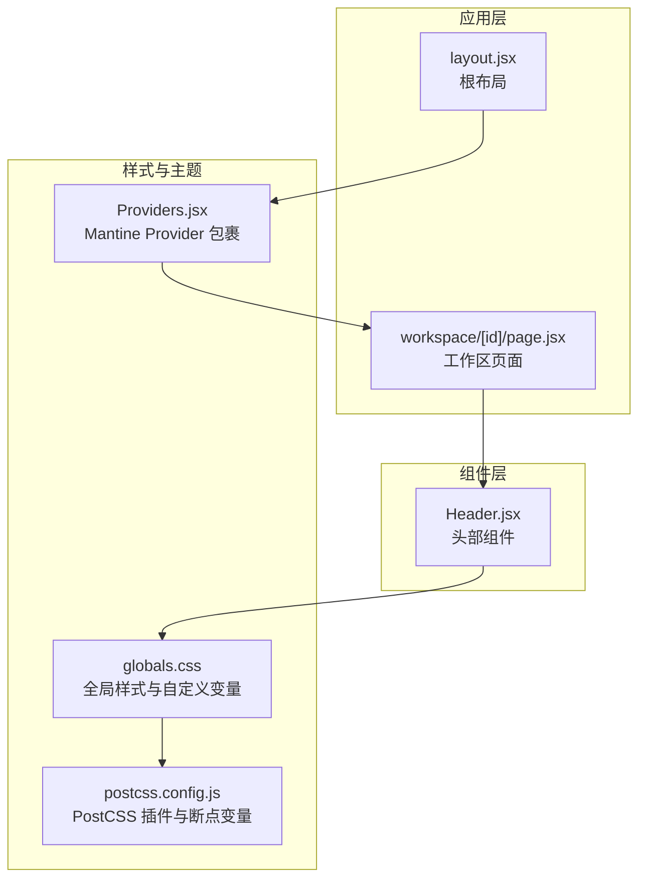
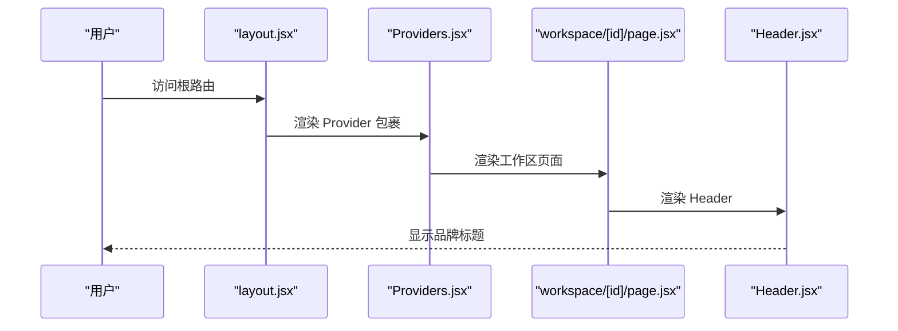
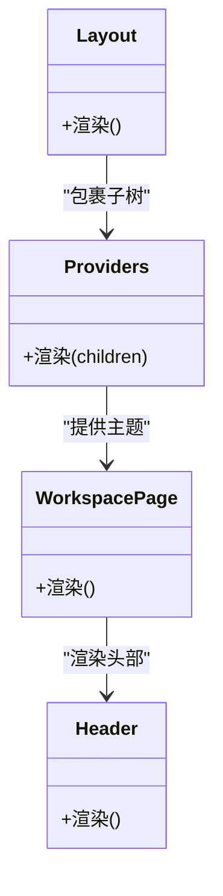

# 基础组件

<cite>
**本文引用的文件**
- [src/components/Header.jsx](file://src/components/Header.jsx)
- [src/app/workspace/[id]/page.jsx](file://src/app/workspace/[id]/page.jsx)
- [src/app/layout.jsx](file://src/app/layout.jsx)
- [src/app/globals.css](file://src/app/globals.css)
- [src/components/Providers.jsx](file://src/components/Providers.jsx)
- [package.json](file://package.json)
- [postcss.config.js](file://postcss.config.js)
</cite>

## 目录
1. [简介](#简介)
2. [项目结构](#项目结构)
3. [核心组件](#核心组件)
4. [架构总览](#架构总览)
5. [详细组件分析](#详细组件分析)
6. [依赖分析](#依赖分析)
7. [性能考虑](#性能考虑)
8. [可访问性与无障碍](#可访问性与无障碍)
9. [使用示例与定制化](#使用示例与定制化)
10. [故障排查指南](#故障排查指南)
11. [结论](#结论)

## 简介
本章节面向 Vibe DB 的基础组件“Header”，聚焦其视觉外观、行为与用户交互模式，系统梳理样式类名、布局属性与响应式行为，并结合实际使用场景给出可操作的使用指南与定制化建议。同时说明该组件与整体设计系统的集成方式（Tailwind CSS、Mantine 主题与全局变量），并提供可访问性与无障碍支持说明。

## 项目结构
Header 组件位于组件层，作为工作区页面的顶部横幅使用；其样式与主题由全局样式与构建配置共同决定。

图示来源
- [src/app/layout.jsx:10-18](file://src/app/layout.jsx#L10-L18)
- [src/components/Providers.jsx:9-34](file://src/components/Providers.jsx#L9-L34)
- [src/app/workspace/[id]/page.jsx:90-92](file://src/app/workspace/[id]/page.jsx#L90-L92)
- [src/components/Header.jsx:1-9](file://src/components/Header.jsx#L1-L9)
- [src/app/globals.css:4-20](file://src/app/globals.css#L4-L20)
- [postcss.config.js:1-15](file://postcss.config.js#L1-L15)

章节来源
- [src/app/layout.jsx:10-18](file://src/app/layout.jsx#L10-L18)
- [src/app/workspace/[id]/page.jsx:90-92](file://src/app/workspace/[id]/page.jsx#L90-L92)
- [src/components/Header.jsx:1-9](file://src/components/Header.jsx#L1-L9)
- [src/app/globals.css:4-20](file://src/app/globals.css#L4-L20)
- [postcss.config.js:1-15](file://postcss.config.js#L1-L15)

## 核心组件
- 组件名称：Header
- 文件路径：[src/components/Header.jsx](file://src/components/Header.jsx)
- 组件职责：渲染应用顶部横幅，承载品牌标识与基础标题信息。
- 当前能力：静态文本展示，无交互逻辑。

章节来源
- [src/components/Header.jsx:1-9](file://src/components/Header.jsx#L1-L9)

## 架构总览
Header 在工作区页面中被直接引入，作为页面主结构的一部分，配合工具栏与画布区域形成完整的编辑界面。

图示来源
- [src/app/layout.jsx:10-18](file://src/app/layout.jsx#L10-L18)
- [src/components/Providers.jsx:9-34](file://src/components/Providers.jsx#L9-L34)
- [src/app/workspace/[id]/page.jsx:90-92](file://src/app/workspace/[id]/page.jsx#L90-L92)
- [src/components/Header.jsx:1-9](file://src/components/Header.jsx#L1-L9)

## 详细组件分析

### 视觉外观与样式类名
- 容器尺寸与定位
  - 高度固定：通过容器类名设置高度为 12 个单位长度（通常对应 Tailwind 的 h-12）。
  - 宽度：占满父容器宽度（w-full）。
- 背景与边框
  - 背景色：白色背景。
  - 底边框：浅色边框，用于与下方内容分隔。
- 内边距与对齐
  - 水平内边距：容器类名包含水平内边距，确保内容不贴边。
  - 垂直居中：通过容器类名实现垂直方向的居中对齐。
- 文本样式
  - 字体族：使用自定义的无衬线字体变量。
  - 字号与字重：较大字号与加粗，突出品牌识别。

章节来源
- [src/components/Header.jsx:3-4](file://src/components/Header.jsx#L3-L4)
- [src/app/globals.css:9-11](file://src/app/globals.css#L9-L11)

### 行为与交互模式
- 当前行为：静态展示，无点击、悬停或键盘交互。
- 可扩展方向：可增加菜单按钮、下拉列表、通知徽标等交互元素；当前文件未包含交互逻辑。

章节来源
- [src/components/Header.jsx:1-9](file://src/components/Header.jsx#L1-L9)

### 布局属性与响应式行为
- 响应式策略
  - 宽度：使用全宽类名，适配不同屏幕尺寸。
  - 断点：项目通过 PostCSS 插件与变量定义了断点，Header 本身未显式绑定断点类名，但会随父容器布局变化而自适应。
- 全局断点变量
  - 项目在 PostCSS 中定义了多个断点变量，便于在全局范围内统一控制响应式行为。
- 设计系统集成
  - 字体、颜色与间距通过全局 CSS 变量进行集中管理，Header 使用这些变量以保持一致的视觉语言。

章节来源
- [src/components/Header.jsx:3](file://src/components/Header.jsx#L3)
- [postcss.config.js:5-12](file://postcss.config.js#L5-L12)
- [src/app/globals.css:4-20](file://src/app/globals.css#L4-L20)

### 与整体设计系统的集成
- 主题与组件库
  - 应用通过 Provider 包裹，启用 Mantine 的主题与样式体系，为其他组件提供一致的风格基线。
- 样式注入
  - Provider 内部引入 Mantine 核心样式，保证跨组件的一致性。
- 全局变量
  - 自定义颜色、字体与断点变量在全局样式中定义，Header 通过类名与变量间接使用这些值。

章节来源
- [src/components/Providers.jsx:3-5](file://src/components/Providers.jsx#L3-L5)
- [src/components/Providers.jsx:9-34](file://src/components/Providers.jsx#L9-L34)
- [src/app/globals.css:4-20](file://src/app/globals.css#L4-L20)

### 代码级关系图

图示来源
- [src/app/layout.jsx:10-18](file://src/app/layout.jsx#L10-L18)
- [src/components/Providers.jsx:9-34](file://src/components/Providers.jsx#L9-L34)
- [src/app/workspace/[id]/page.jsx:90-92](file://src/app/workspace/[id]/page.jsx#L90-L92)
- [src/components/Header.jsx:1-9](file://src/components/Header.jsx#L1-L9)

## 依赖分析
- 外部依赖
  - React 与 Next.js：运行时框架。
  - Mantine：UI 主题与样式基础。
  - Tailwind CSS：原子化样式与响应式工具类。
- 内部依赖
  - Header 仅依赖全局样式与变量，不依赖外部组件或服务。
- 版本与插件
  - 项目在构建配置中启用了 Tailwind 与 Mantine 的 PostCSS 插件，确保样式按预期生成。

章节来源
- [package.json:16-38](file://package.json#L16-L38)
- [postcss.config.js:1-15](file://postcss.config.js#L1-L15)

## 性能考虑
- 渲染开销：Header 为纯静态组件，渲染成本极低，几乎不影响性能。
- 样式体积：使用原子化类名与全局变量，避免额外的组件级样式计算。
- 建议：若未来扩展交互（如下拉菜单、徽标等），优先采用轻量级状态管理与条件渲染，避免不必要的重绘。

## 可访问性与无障碍
- 当前状态
  - Header 为静态文本展示，未包含交互控件，因此无需 ARIA 属性或键盘事件处理。
- 建议
  - 若后续加入交互元素（例如下拉菜单、按钮），请遵循以下原则：
    - 为交互元素添加语义化标签与 ARIA 属性（如 role、aria-expanded、aria-controls）。
    - 支持键盘导航（Tab 切换、Enter/Space 触发、Esc 关闭）。
    - 确保焦点可见且可追踪。
    - 提供足够的对比度与可读性（结合全局颜色变量）。

## 使用示例与定制化

### 基本使用
- 在工作区页面中直接引入 Header，即可在页面顶部显示品牌标题。
- 示例路径参考：
  - [src/app/workspace/[id]/page.jsx#L90-L92](file://src/app/workspace/[id]/page.jsx#L90-L92)

### 场景化用法
- 单页应用顶部横幅：Header 作为页面骨架的一部分，贯穿主要页面。
- 多工作区切换：Header 与工作区选择流程配合，保持一致的品牌呈现。

### 定制化方案
- 文本内容
  - 修改品牌名称：在组件内部调整文本节点。
  - 参考路径：[src/components/Header.jsx#L4](file://src/components/Header.jsx#L4)
- 样式扩展
  - 背景色、边框色、内边距：通过容器类名进行微调。
  - 字体与字号：通过全局变量统一修改。
  - 参考路径：
    - [src/components/Header.jsx#L3](file://src/components/Header.jsx#L3)
    - [src/app/globals.css#L9-L11:9-11](file://src/app/globals.css#L9-L11)
- 响应式适配
  - 通过全局断点变量与容器类名组合，实现不同屏幕下的布局优化。
  - 参考路径：
    - [postcss.config.js#L5-12:5-12](file://postcss.config.js#L5-L12)
    - [src/components/Header.jsx#L3](file://src/components/Header.jsx#L3)

## 故障排查指南
- 样式未生效
  - 检查全局样式是否正确加载（字体、颜色变量、断点变量）。
  - 确认 PostCSS 插件已启用并正确解析变量。
  - 参考路径：
    - [src/app/globals.css:4-20](file://src/app/globals.css#L4-L20)
    - [postcss.config.js:1-15](file://postcss.config.js#L1-L15)
- 组件未渲染
  - 确认页面中已引入 Header 并处于有效渲染树中。
  - 参考路径：[src/app/workspace/[id]/page.jsx#L90-L92](file://src/app/workspace/[id]/page.jsx#L90-L92)
- 主题不一致
  - 确认 Provider 已包裹应用根布局，且 Mantine 样式已导入。
  - 参考路径：
    - [src/app/layout.jsx:10-18](file://src/app/layout.jsx#L10-L18)
    - [src/components/Providers.jsx:3-5](file://src/components/Providers.jsx#L3-L5)

## 结论
Header 组件以最小实现提供清晰的品牌标识与稳定的顶部横幅体验。其样式与行为完全依赖于全局变量与原子化类名，易于维护与扩展。未来若引入交互元素，建议遵循可访问性最佳实践，并充分利用现有设计系统与断点变量，确保一致的用户体验与开发效率。