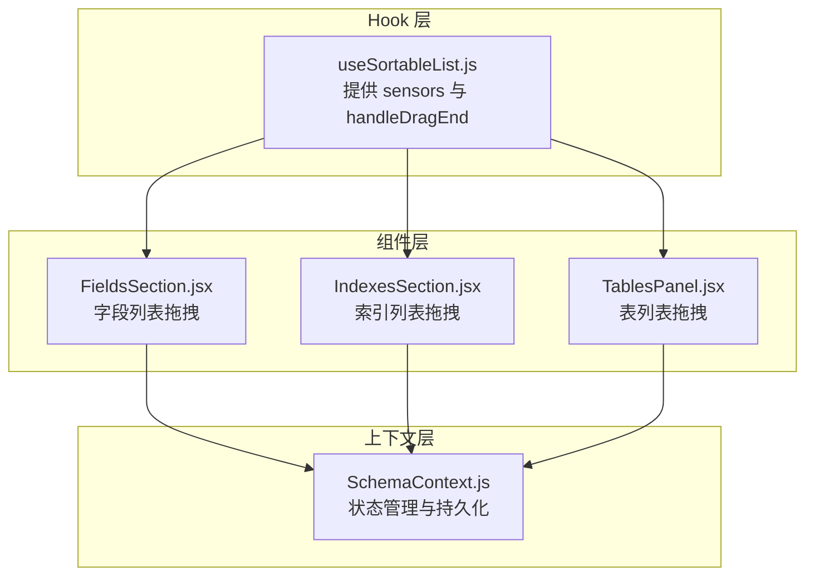
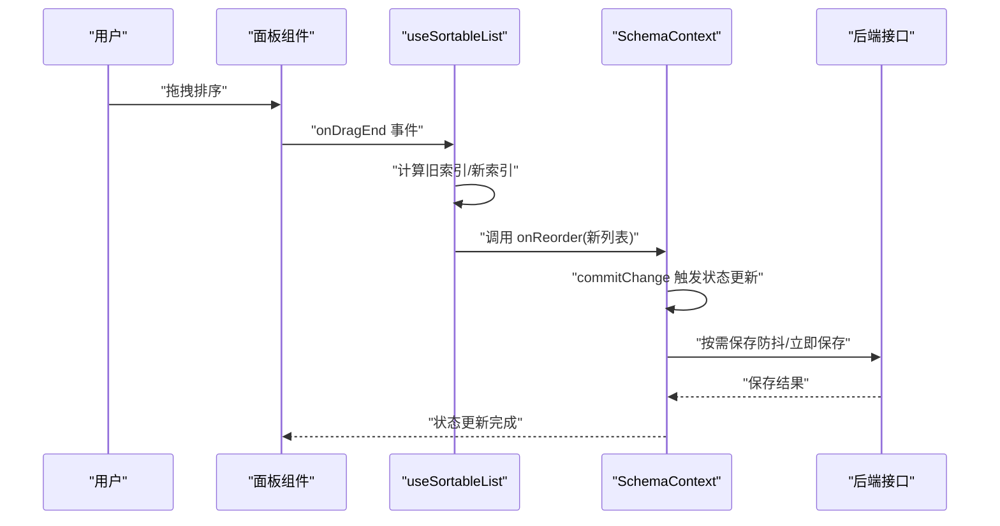
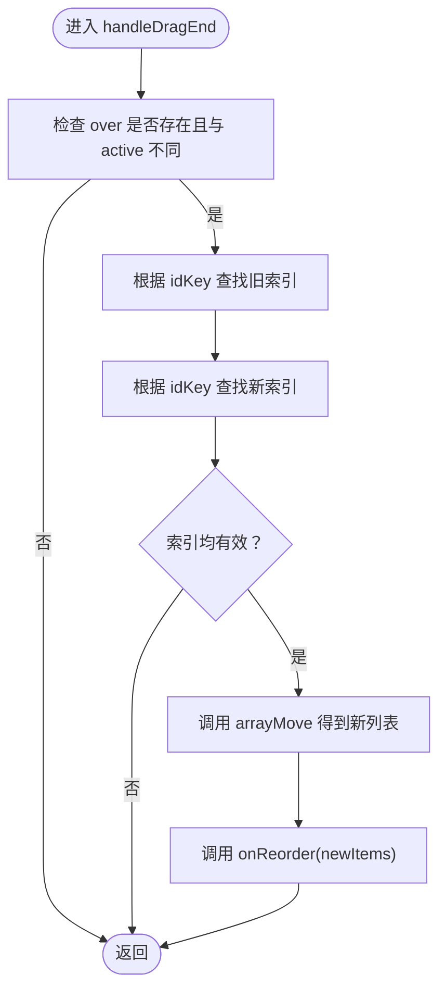
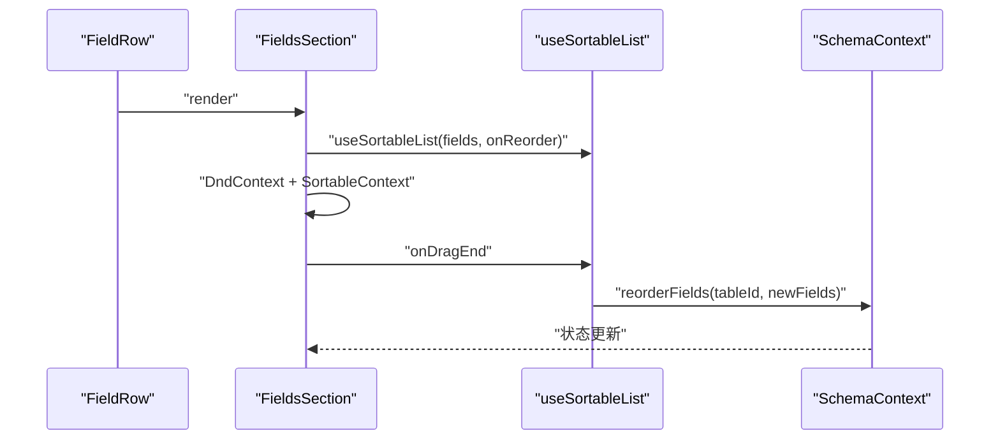
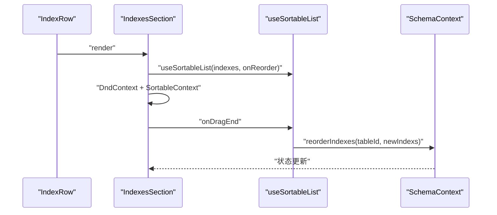
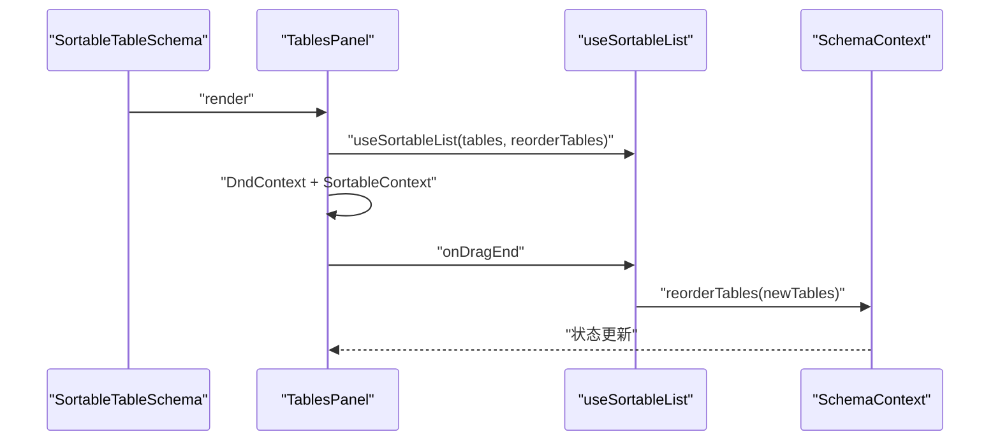
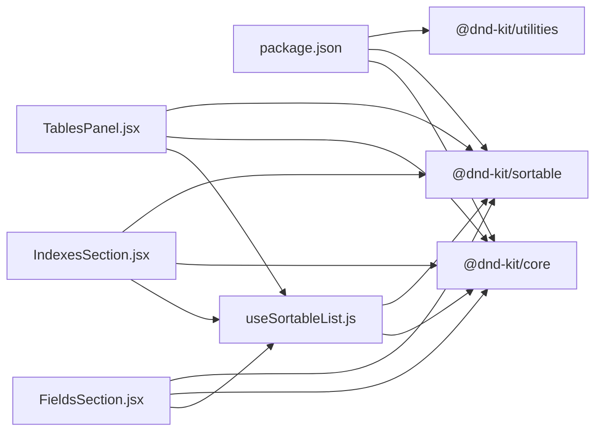

# 拖拽组件

<cite>
**本文引用的文件**
- [useSortableList.js](file://src/hooks/useSortableList.js)
- [FieldsSection.jsx](file://src/features/schema/FieldsSection.jsx)
- [IndexesSection.jsx](file://src/features/schema/IndexesSection.jsx)
- [TablesPanel.jsx](file://src/features/schema/TablesPanel.jsx)
- [SchemaContext.js](file://src/features/schema/SchemaContext.js)
- [enums.js](file://src/lib/enums.js)
- [package.json](file://package.json)
</cite>

## 目录
1. [简介](#简介)
2. [项目结构](#项目结构)
3. [核心组件](#核心组件)
4. [架构总览](#架构总览)
5. [详细组件分析](#详细组件分析)
6. [依赖分析](#依赖分析)
7. [性能考虑](#性能考虑)
8. [故障排查指南](#故障排查指南)
9. [结论](#结论)
10. [附录](#附录)

## 简介
本文件聚焦于 Vibe DB 的拖拽组件系统，特别是 useSortableList Hook 的功能、实现原理与使用场景。该系统基于 @dnd-kit 提供的拖拽能力，封装了列表级拖拽排序的通用逻辑，并在多个 Schema 子面板中复用，包括“字段”、“索引”和“表”三个维度。文档将从架构、数据流、处理逻辑、性能优化、错误处理与最佳实践等方面进行深入说明，并提供可视化图示帮助理解。

## 项目结构
拖拽系统由三部分组成：
- Hook 层：useSortableList 封装拖拽传感器与排序回调，输出 sensors 与 handleDragEnd。
- 组件层：各 Schema 面板通过 DndContext、SortableContext 与 useSortable 将具体节点接入拖拽体系。
- 上下文层：SchemaContext 负责状态管理与持久化策略，确保排序结果能正确落库。

图表来源
- [useSortableList.js:10-25](file://src/hooks/useSortableList.js#L10-L25)
- [FieldsSection.jsx:152-155](file://src/features/schema/FieldsSection.jsx#L152-L155)
- [IndexesSection.jsx:127-130](file://src/features/schema/IndexesSection.jsx#L127-L130)
- [TablesPanel.jsx:44-45](file://src/features/schema/TablesPanel.jsx#L44-L45)
- [SchemaContext.js:204-283](file://src/features/schema/SchemaContext.js#L204-L283)

章节来源
- [useSortableList.js:1-26](file://src/hooks/useSortableList.js#L1-L26)
- [FieldsSection.jsx:148-199](file://src/features/schema/FieldsSection.jsx#L148-L199)
- [IndexesSection.jsx:123-184](file://src/features/schema/IndexesSection.jsx#L123-L184)
- [TablesPanel.jsx:43-108](file://src/features/schema/TablesPanel.jsx#L43-L108)
- [SchemaContext.js:43-392](file://src/features/schema/SchemaContext.js#L43-L392)

## 核心组件
- useSortableList Hook
  - 功能：封装 DnD Kit 的拖拽排序逻辑，对外暴露 sensors 与 handleDragEnd。
  - 参数：
    - items：当前列表数据（受外部控制）
    - onReorder：排序完成后的回调，传入新列表
    - idKey：用作 DnD ID 的字段名，默认 'id'
  - 返回：{ sensors, handleDragEnd }

- 组件集成
  - 各面板通过 DndContext 与 SortableContext 将节点接入拖拽体系；每个可拖拽项使用 useSortable 获取拖拽句柄与动画样式。
  - onDragEnd 事件交由 useSortableList 计算新顺序并调用 onReorder。

- 上下文协作
  - SchemaContext 提供 reorderTables/reorderFields/reorderIndexes 等方法，负责将新顺序写回本地状态，并按需触发持久化流程。

章节来源
- [useSortableList.js:4-25](file://src/hooks/useSortableList.js#L4-L25)
- [FieldsSection.jsx:152-155](file://src/features/schema/FieldsSection.jsx#L152-L155)
- [IndexesSection.jsx:127-130](file://src/features/schema/IndexesSection.jsx#L127-L130)
- [TablesPanel.jsx:44-45](file://src/features/schema/TablesPanel.jsx#L44-L45)
- [SchemaContext.js:204-283](file://src/features/schema/SchemaContext.js#L204-L283)

## 架构总览
下图展示了从用户拖拽到状态更新的完整链路，以及与后端持久化的衔接。

图表来源
- [useSortableList.js:15-22](file://src/hooks/useSortableList.js#L15-L22)
- [FieldsSection.jsx:188-194](file://src/features/schema/FieldsSection.jsx#L188-L194)
- [IndexesSection.jsx:166-179](file://src/features/schema/IndexesSection.jsx#L166-L179)
- [TablesPanel.jsx:86-103](file://src/features/schema/TablesPanel.jsx#L86-L103)
- [SchemaContext.js:147-173](file://src/features/schema/SchemaContext.js#L147-L173)

## 详细组件分析

### useSortableList Hook 分析
- 设计要点
  - 使用 PointerSensor 并设置激活约束距离，降低误触概率。
  - 在 handleDragEnd 中定位 active 与 over 的索引，确保两者存在且不相等才进行重排。
  - 通过 arrayMove 对 items 进行原地移动，然后调用 onReorder 返回新列表。
- 错误处理
  - 若 over 不存在或 active.id === over.id，则直接返回，避免无效操作。
  - 若旧索引或新索引查找失败（理论上不会发生），则不触发回调。
- 性能特性
  - 仅在拖拽结束时计算一次新顺序，避免频繁重排。
  - arrayMove 为 O(n) 的数组重排，适用于中等规模列表。

图表来源
- [useSortableList.js:15-22](file://src/hooks/useSortableList.js#L15-L22)

章节来源
- [useSortableList.js:10-25](file://src/hooks/useSortableList.js#L10-L25)

### 字段面板（FieldsSection）分析
- 组件职责
  - 展示字段列表，支持拖拽排序与编辑。
  - 每个字段行使用 useSortable 获取拖拽句柄与动画样式，结合 CSS Transform 实现平滑过渡。
- 拖拽集成
  - DndContext 传入 sensors 与 collisionDetection，onDragEnd 交由 useSortableList 处理。
  - SortableContext 以字段 id 列表作为 items，策略为 verticalListSortingStrategy。
- 状态与持久化
  - useSortableList 的 onReorder 回调调用 SchemaContext.reorderFields，将新顺序写入本地状态。
  - 字段名称编辑采用组件内防抖 + 立即保存策略，减少后端压力。

图表来源
- [FieldsSection.jsx:40-42](file://src/features/schema/FieldsSection.jsx#L40-L42)
- [FieldsSection.jsx:152-155](file://src/features/schema/FieldsSection.jsx#L152-L155)
- [FieldsSection.jsx:188-194](file://src/features/schema/FieldsSection.jsx#L188-L194)
- [SchemaContext.js:232-236](file://src/features/schema/SchemaContext.js#L232-L236)

章节来源
- [FieldsSection.jsx:19-144](file://src/features/schema/FieldsSection.jsx#L19-L144)
- [FieldsSection.jsx:148-199](file://src/features/schema/FieldsSection.jsx#L148-L199)
- [SchemaContext.js:219-258](file://src/features/schema/SchemaContext.js#L219-L258)

### 索引面板（IndexesSection）分析
- 组件职责
  - 展示索引列表，支持拖拽排序与编辑。
  - 每个索引行同样使用 useSortable 获取拖拽句柄与动画样式。
- 拖拽集成
  - 与字段面板一致，通过 DndContext 与 SortableContext 接入拖拽体系。
- 状态与持久化
  - onReorder 回调调用 SchemaContext.reorderIndexes，将新顺序写入本地状态。

图表来源
- [IndexesSection.jsx:36-38](file://src/features/schema/IndexesSection.jsx#L36-L38)
- [IndexesSection.jsx:127-130](file://src/features/schema/IndexesSection.jsx#L127-L130)
- [IndexesSection.jsx:166-179](file://src/features/schema/IndexesSection.jsx#L166-L179)
- [SchemaContext.js:279-283](file://src/features/schema/SchemaContext.js#L279-L283)

章节来源
- [IndexesSection.jsx:19-119](file://src/features/schema/IndexesSection.jsx#L19-L119)
- [IndexesSection.jsx:123-184](file://src/features/schema/IndexesSection.jsx#L123-L184)
- [SchemaContext.js:262-305](file://src/features/schema/SchemaContext.js#L262-L305)

### 表面板（TablesPanel）分析
- 组件职责
  - 展示表列表，支持拖拽排序与展开/折叠。
  - 每个表项使用 useSortable 获取拖拽句柄与动画样式，同时将拖拽句柄 props 透传给子组件。
- 拖拽集成
  - DndContext 与 SortableContext 的配置与字段/索引面板一致。
- 状态与持久化
  - onReorder 回调直接调用 SchemaContext.reorderTables，将新顺序写入本地状态。

图表来源
- [TablesPanel.jsx:17-19](file://src/features/schema/TablesPanel.jsx#L17-L19)
- [TablesPanel.jsx:44-45](file://src/features/schema/TablesPanel.jsx#L44-L45)
- [TablesPanel.jsx:86-103](file://src/features/schema/TablesPanel.jsx#L86-L103)
- [SchemaContext.js:204-206](file://src/features/schema/SchemaContext.js#L204-L206)

章节来源
- [TablesPanel.jsx:16-39](file://src/features/schema/TablesPanel.jsx#L16-L39)
- [TablesPanel.jsx:43-108](file://src/features/schema/TablesPanel.jsx#L43-L108)
- [SchemaContext.js:204-206](file://src/features/schema/SchemaContext.js#L204-L206)

### 数据模型与类型
- 字段类型与索引类型来源于枚举模块，用于 Select 下拉与显示。
- 字段类型分组与索引类型选项在组件中被消费，确保 UI 一致性。

章节来源
- [enums.js:106-141](file://src/lib/enums.js#L106-L141)

## 依赖分析
- 外部依赖
  - @dnd-kit/core：提供拖拽核心能力与传感器。
  - @dnd-kit/sortable：提供排序上下文与排序策略。
  - @dnd-kit/utilities：提供 CSS 工具与辅助函数。
- 内部依赖
  - useSortableList 依赖 @dnd-kit/core 与 @dnd-kit/sortable。
  - 面板组件依赖 useSortableList 与 @dnd-kit/sortable 的 useSortable、DndContext、SortableContext。
  - SchemaContext 提供状态管理与持久化策略。

图表来源
- [package.json:20-22](file://package.json#L20-L22)
- [useSortableList.js:1-2](file://src/hooks/useSortableList.js#L1-L2)
- [FieldsSection.jsx:6-12](file://src/features/schema/FieldsSection.jsx#L6-L12)
- [IndexesSection.jsx:6-12](file://src/features/schema/IndexesSection.jsx#L6-L12)
- [TablesPanel.jsx:7-12](file://src/features/schema/TablesPanel.jsx#L7-L12)

章节来源
- [package.json:16-38](file://package.json#L16-L38)
- [useSortableList.js:1-2](file://src/hooks/useSortableList.js#L1-L2)

## 性能考虑
- 拖拽激活约束
  - useSortableList 使用 PointerSensor 并设置激活约束距离，降低误触概率，提升交互体验。
- 重排算法
  - 使用 arrayMove 进行原地重排，时间复杂度 O(n)，适用于中等规模列表。
- 视觉反馈
  - 通过 useSortable 的 transform 与 transition 实现平滑动画；isDragging 控制透明度，增强拖拽感知。
- 状态更新与持久化
  - SchemaContext.commitChange 将副作用（API 调用、定时器）与状态更新分离，避免 React 严格模式下 updater 重复执行导致的多次请求。
  - 防抖保存与立即保存策略平衡响应速度与网络开销。

章节来源
- [useSortableList.js:11-13](file://src/hooks/useSortableList.js#L11-L13)
- [FieldsSection.jsx:67-71](file://src/features/schema/FieldsSection.jsx#L67-L71)
- [IndexesSection.jsx:59-65](file://src/features/schema/IndexesSection.jsx#L59-L65)
- [TablesPanel.jsx:24-29](file://src/features/schema/TablesPanel.jsx#L24-L29)
- [SchemaContext.js:147-173](file://src/features/schema/SchemaContext.js#L147-L173)

## 故障排查指南
- 拖拽无效
  - 检查 DndContext 的 sensors 与 onDragEnd 是否正确传入。
  - 确认 SortableContext 的 items 与 strategy 设置正确。
- 顺序未更新
  - 确认 onReorder 回调是否被调用，以及是否正确调用 SchemaContext 的对应 reorder 方法。
- 误触问题
  - 调整 PointerSensor 的激活约束距离，避免轻微移动触发拖拽。
- 动画异常
  - 确保 useSortable 的 setNodeRef、transform、transition、isDragging 正确应用到节点上。

章节来源
- [FieldsSection.jsx:188-194](file://src/features/schema/FieldsSection.jsx#L188-L194)
- [IndexesSection.jsx:166-179](file://src/features/schema/IndexesSection.jsx#L166-L179)
- [TablesPanel.jsx:86-103](file://src/features/schema/TablesPanel.jsx#L86-L103)
- [useSortableList.js:15-22](file://src/hooks/useSortableList.js#L15-L22)

## 结论
useSortableList Hook 将 @dnd-kit 的拖拽能力抽象为统一的列表排序接口，配合各 Schema 面板与 SchemaContext 的状态管理，实现了稳定、可复用的拖拽排序系统。通过合理的传感器配置、动画反馈与持久化策略，系统在交互体验与性能之间取得了良好平衡。开发者可在任何需要列表排序的场景中复用该 Hook，并结合自身业务调整回调与持久化策略。

## 附录
- 使用示例路径
  - 字段面板拖拽排序：[FieldsSection.jsx:152-155](file://src/features/schema/FieldsSection.jsx#L152-L155)
  - 索引面板拖拽排序：[IndexesSection.jsx:127-130](file://src/features/schema/IndexesSection.jsx#L127-L130)
  - 表面板拖拽排序：[TablesPanel.jsx:44-45](file://src/features/schema/TablesPanel.jsx#L44-L45)
- 可配置参数
  - useSortableList(items, onReorder, idKey='id')
  - DndContext 的 sensors、collisionDetection
  - SortableContext 的 items、strategy
- 回调函数
  - onReorder：接收新列表，通常调用 SchemaContext 的对应 reorder 方法
- 错误处理机制
  - 无效拖拽（over 不存在或相同 id）直接返回
  - 索引查找失败时不触发回调
  - SchemaContext.commitChange 将副作用与状态更新解耦，避免重复请求