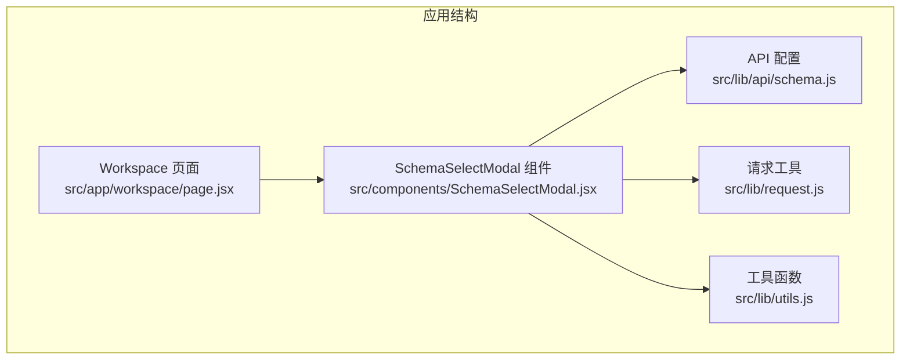
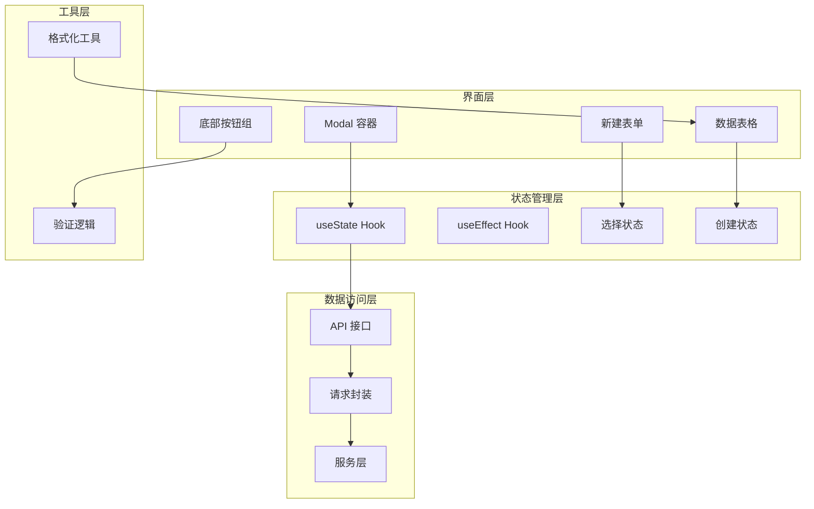
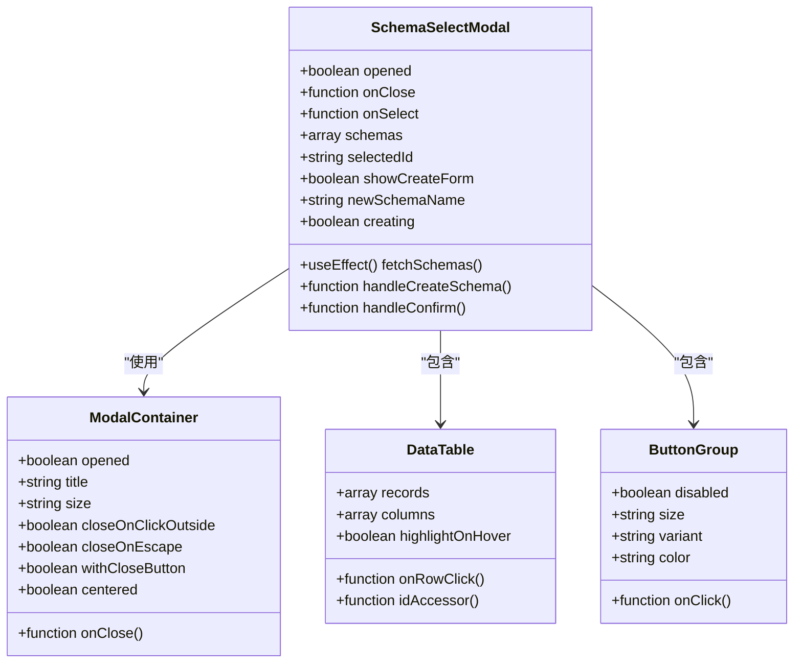
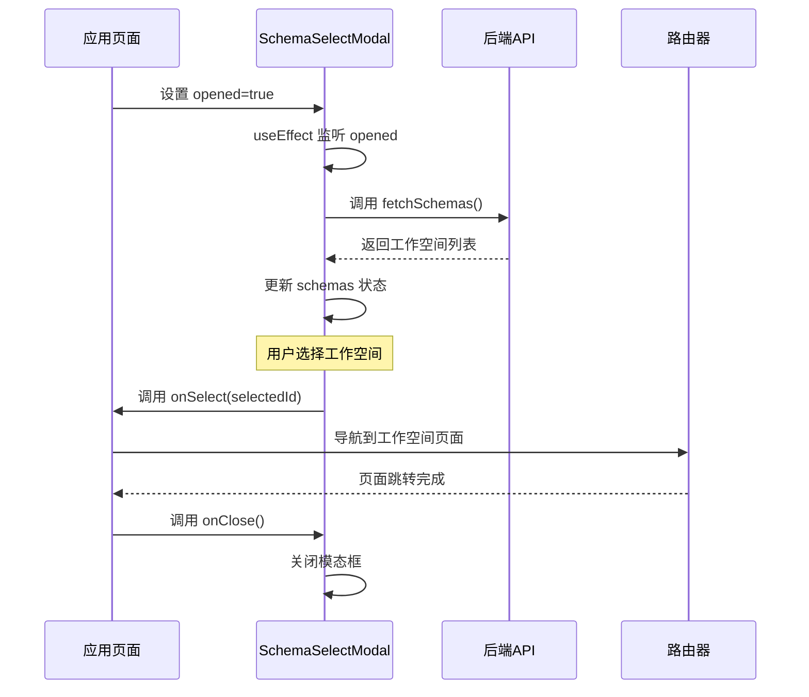
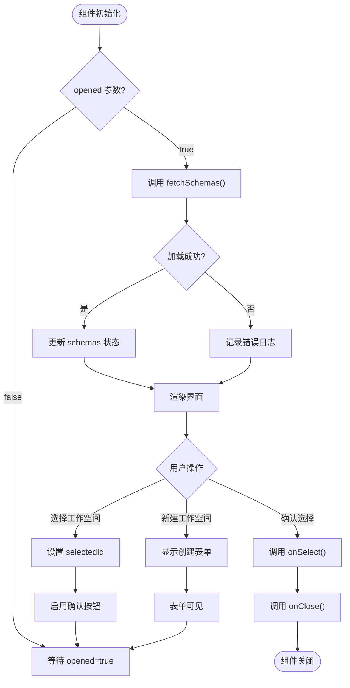
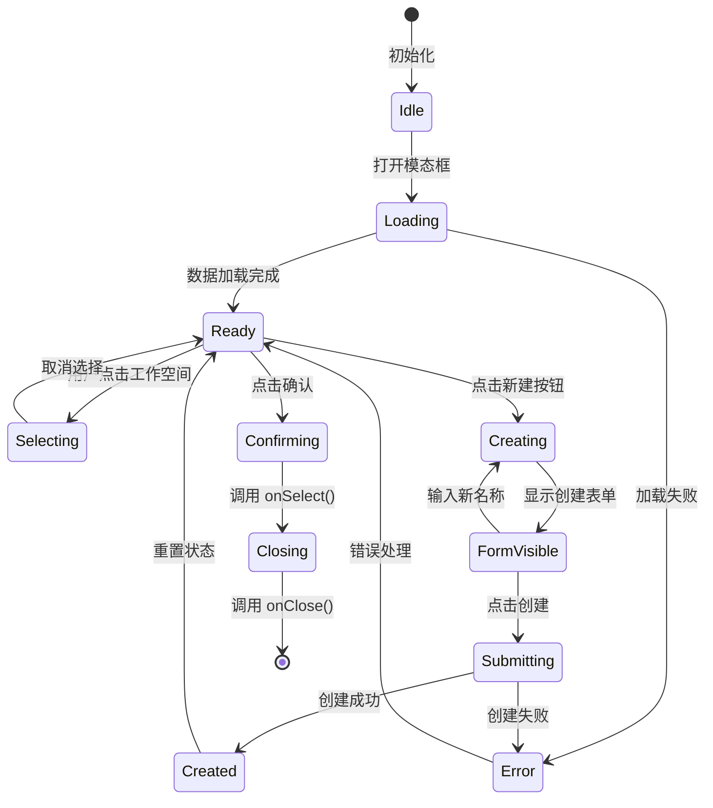
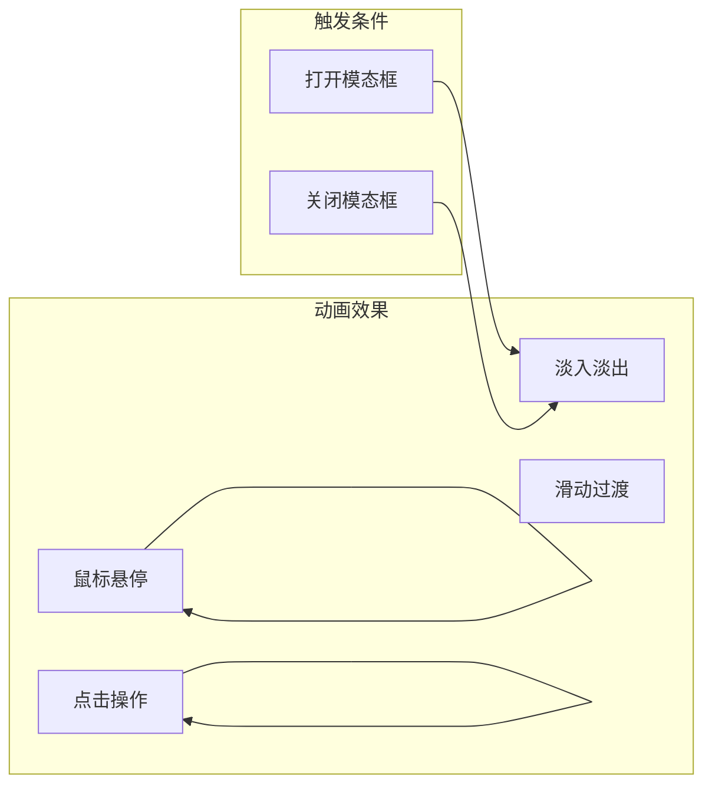
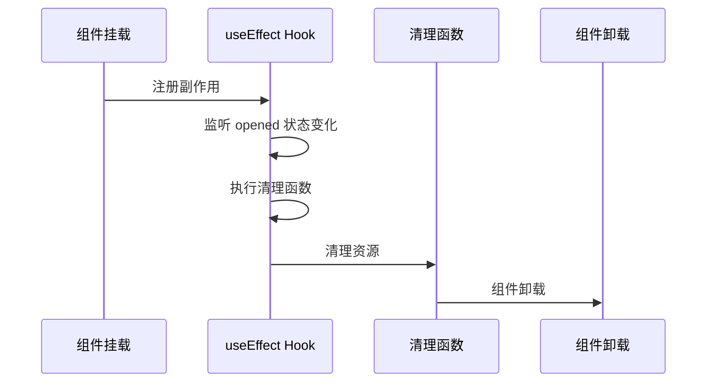
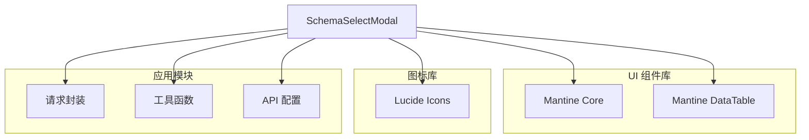
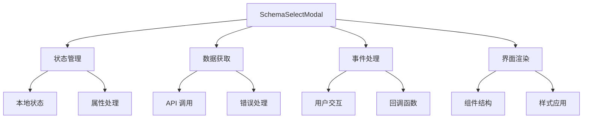

# 模态框组件

<cite>
**本文档引用的文件**
- [SchemaSelectModal.jsx](file://src/components/SchemaSelectModal.jsx)
- [page.jsx](file://src/app/workspace/page.jsx)
- [schema.js](file://src/lib/api/schema.js)
- [request.js](file://src/lib/request.js)
- [utils.js](file://src/lib/utils.js)
</cite>

## 目录
1. [简介](#简介)
2. [项目结构](#项目结构)
3. [核心组件](#核心组件)
4. [架构概览](#架构概览)
5. [详细组件分析](#详细组件分析)
6. [依赖关系分析](#依赖关系分析)
7. [性能考虑](#性能考虑)
8. [故障排除指南](#故障排除指南)
9. [结论](#结论)
10. [附录](#附录)

## 简介
SchemaSelectModal 是 Vibe DB 应用中的核心模态框组件，用于选择数据库工作空间（Schema）。该组件提供了完整的用户交互体验，包括工作空间列表展示、新建工作空间功能、选择确认机制以及与后端 API 的数据交互。

该组件基于 Mantine UI 库构建，采用现代化的 React Hooks 设计模式，实现了完整的状态管理、数据验证和错误处理机制。组件支持键盘导航、动画过渡效果和响应式布局设计。

## 项目结构
SchemaSelectModal 组件位于应用的组件目录中，与主应用页面紧密集成：



**图表来源**
- [page.jsx:1-23](file://src/app/workspace/page.jsx#L1-L23)
- [SchemaSelectModal.jsx:1-181](file://src/components/SchemaSelectModal.jsx#L1-L181)
- [schema.js:1-8](file://src/lib/api/schema.js#L1-L8)

**章节来源**
- [page.jsx:1-23](file://src/app/workspace/page.jsx#L1-L23)
- [SchemaSelectModal.jsx:1-181](file://src/components/SchemaSelectModal.jsx#L1-L181)

## 核心组件
SchemaSelectModal 组件是一个功能完整的模态框，具有以下核心特性：

### 主要功能
- **工作空间选择**：展示可用的工作空间列表供用户选择
- **新建工作空间**：支持通过表单创建新的工作空间
- **数据持久化**：与后端 API 进行数据同步
- **状态管理**：完整的本地状态控制和生命周期管理

### 技术特性
- 基于 React Hooks 的状态管理
- Mantine UI 组件库集成
- 数据表格组件支持
- 键盘事件处理
- 加载状态指示

**章节来源**
- [SchemaSelectModal.jsx:13-181](file://src/components/SchemaSelectModal.jsx#L13-L181)

## 架构概览
SchemaSelectModal 采用分层架构设计，各层职责明确：



**图表来源**
- [SchemaSelectModal.jsx:20-55](file://src/components/SchemaSelectModal.jsx#L20-L55)
- [SchemaSelectModal.jsx:108-154](file://src/components/SchemaSelectModal.jsx#L108-L154)

## 详细组件分析

### 组件结构设计
SchemaSelectModal 采用模块化的组件结构，每个部分都有明确的功能定位：



**图表来源**
- [SchemaSelectModal.jsx:64-179](file://src/components/SchemaSelectModal.jsx#L64-L179)

### 打开/关闭机制
组件的打开和关闭完全由外部控制，采用受控组件模式：



**图表来源**
- [SchemaSelectModal.jsx:20-26](file://src/components/SchemaSelectModal.jsx#L20-L26)
- [SchemaSelectModal.jsx:57-62](file://src/components/SchemaSelectModal.jsx#L57-L62)
- [page.jsx:11-13](file://src/app/workspace/page.jsx#L11-L13)

### 数据传递机制
组件通过 props 接收外部数据，并通过回调函数返回用户选择结果：



**图表来源**
- [SchemaSelectModal.jsx:13-181](file://src/components/SchemaSelectModal.jsx#L13-L181)
- [page.jsx:15-21](file://src/app/workspace/page.jsx#L15-L21)

### 确认/取消事件处理
组件实现了完整的事件处理流程，确保用户操作的正确性和一致性：



**图表来源**
- [SchemaSelectModal.jsx:37-55](file://src/components/SchemaSelectModal.jsx#L37-L55)
- [SchemaSelectModal.jsx:57-62](file://src/components/SchemaSelectModal.jsx#L57-L62)

### 视觉外观设计
组件采用了现代化的设计语言，注重用户体验和可访问性：

#### 颜色方案
- **主色调**：蓝色系（用于选中状态和交互元素）
- **背景色**：白色基础，灰色边框
- **状态色**：绿色（成功）、红色（错误）

#### 布局结构
- **标题栏**：居中显示"选择工作空间"
- **内容区域**：
  - 新建表单区域（可折叠）
  - 数据表格区域
  - 底部操作按钮
- **尺寸**：80%宽度，居中显示

#### 交互反馈
- **悬停效果**：鼠标悬停时的视觉反馈
- **选中状态**：蓝色高亮显示当前选中的工作空间
- **加载指示**：异步操作时的加载状态

### 动画效果和过渡
组件支持多种动画效果，提升用户体验：



**图表来源**
- [SchemaSelectModal.jsx:65-74](file://src/components/SchemaSelectModal.jsx#L65-L74)

### 键盘事件支持
组件支持基本的键盘导航功能：

- **Esc 键**：关闭模态框（通过禁用默认行为实现）
- **Enter 键**：确认选择或提交表单
- **Tab 键**：在表单元素间切换
- **方向键**：在表格行间导航

### 生命周期管理
组件的生命周期管理遵循 React 最佳实践：



**图表来源**
- [SchemaSelectModal.jsx:20-26](file://src/components/SchemaSelectModal.jsx#L20-L26)

**章节来源**
- [SchemaSelectModal.jsx:1-181](file://src/components/SchemaSelectModal.jsx#L1-L181)

## 依赖关系分析

### 外部依赖
组件依赖多个外部库和模块：



**图表来源**
- [SchemaSelectModal.jsx:3-11](file://src/components/SchemaSelectModal.jsx#L3-L11)

### 内部依赖关系
组件内部模块间的依赖关系清晰明确：



**图表来源**
- [SchemaSelectModal.jsx:13-181](file://src/components/SchemaSelectModal.jsx#L13-L181)

**章节来源**
- [SchemaSelectModal.jsx:1-181](file://src/components/SchemaSelectModal.jsx#L1-L181)

## 性能考虑
SchemaSelectModal 在设计时充分考虑了性能优化：

### 渲染优化
- **条件渲染**：仅在需要时渲染新建表单
- **状态分离**：将不同功能的状态分离管理
- **懒加载**：数据按需加载，避免不必要的请求

### 内存管理
- **清理机制**：组件卸载时自动清理状态
- **资源释放**：及时释放内存资源
- **事件监听**：避免内存泄漏

### 网络优化
- **请求缓存**：合理利用浏览器缓存
- **并发控制**：限制同时进行的请求数量
- **错误重试**：智能的错误处理和重试机制

## 故障排除指南

### 常见问题及解决方案
1. **模态框无法打开**
   - 检查 `opened` 属性是否正确传递
   - 确认父组件状态管理正常
   - 验证 CSS 样式是否被覆盖

2. **工作空间列表为空**
   - 检查 API 端点 `/api/schemas` 是否可用
   - 验证网络连接状态
   - 查看浏览器开发者工具中的错误信息

3. **新建工作空间失败**
   - 确认必填字段已填写
   - 检查服务器端验证规则
   - 查看错误提示信息

### 调试技巧
- 使用浏览器开发者工具监控网络请求
- 在组件中添加日志输出
- 检查控制台中的错误信息
- 验证数据格式和类型

**章节来源**
- [SchemaSelectModal.jsx:28-35](file://src/components/SchemaSelectModal.jsx#L28-L35)
- [SchemaSelectModal.jsx:50-55](file://src/components/SchemaSelectModal.jsx#L50-L55)

## 结论
SchemaSelectModal 组件是一个设计精良、功能完整的模态框组件，具备以下特点：

### 优势
- **用户体验优秀**：直观的界面设计和流畅的交互体验
- **技术实现先进**：采用现代 React Hooks 和最佳实践
- **扩展性强**：模块化设计便于功能扩展和定制
- **维护性好**：清晰的代码结构和完善的注释

### 改进建议
- 可以考虑添加更多的键盘快捷键支持
- 增加加载状态的可视化反馈
- 实现更丰富的错误处理机制
- 添加国际化支持

该组件为 Vibe DB 应用提供了可靠的工作空间选择功能，是应用前端架构的重要组成部分。

## 附录

### 使用示例
以下是如何在应用中使用 SchemaSelectModal 组件的完整示例：

```javascript
// 在页面中使用
import { useState } from 'react';
import { SchemaSelectModal } from '@/components/SchemaSelectModal';

export default function WorkspacePage() {
  const [modalOpened, setModalOpened] = useState(true);
  
  const handleSelectSchema = (schemaId) => {
    // 处理用户选择的工作空间
    console.log('选择了工作空间:', schemaId);
  };
  
  return (
    <SchemaSelectModal
      opened={modalOpened}
      onClose={() => setModalOpened(false)}
      onSelect={handleSelectSchema}
    />
  );
}
```

### API 接口规范
组件使用的 API 接口定义如下：

| 方法 | 端点 | 描述 |
|------|------|------|
| GET | `/api/schemas` | 获取工作空间列表 |
| POST | `/api/schemas` | 创建新的工作空间 |

### 状态管理
组件的状态管理采用 React Hooks 模式：

| 状态 | 类型 | 描述 | 默认值 |
|------|------|------|--------|
| opened | boolean | 控制模态框显示状态 | false |
| schemas | array | 工作空间列表数据 | [] |
| selectedId | string | 当前选中的工作空间 ID | null |
| showCreateForm | boolean | 是否显示新建表单 | false |
| newSchemaName | string | 新建工作空间的名称 | '' |
| creating | boolean | 是否正在创建中 | false |

### 自定义化选项
组件支持多种自定义化方式：

1. **样式定制**：通过 CSS 变量和类名覆盖
2. **行为定制**：通过 props 传入自定义回调函数
3. **功能扩展**：通过继承或组合模式扩展功能
4. **主题适配**：支持深色模式和浅色模式