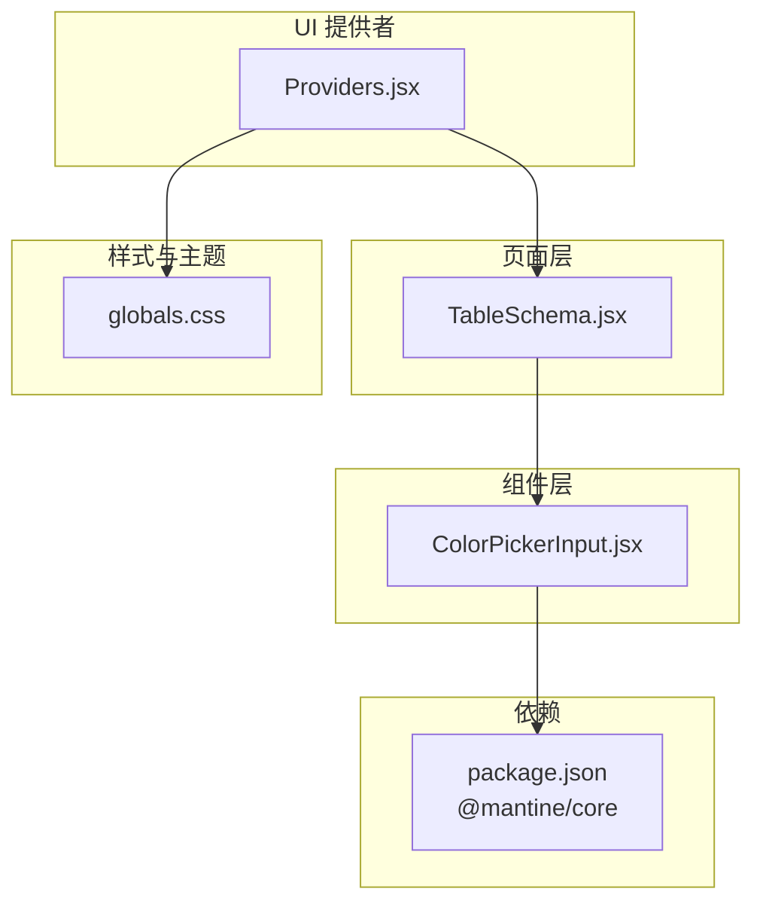
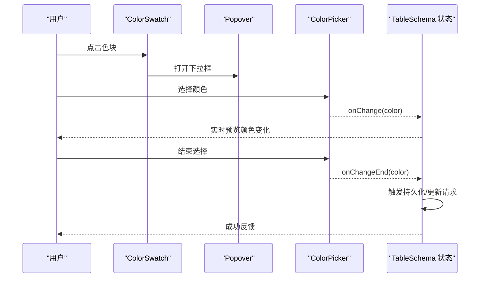
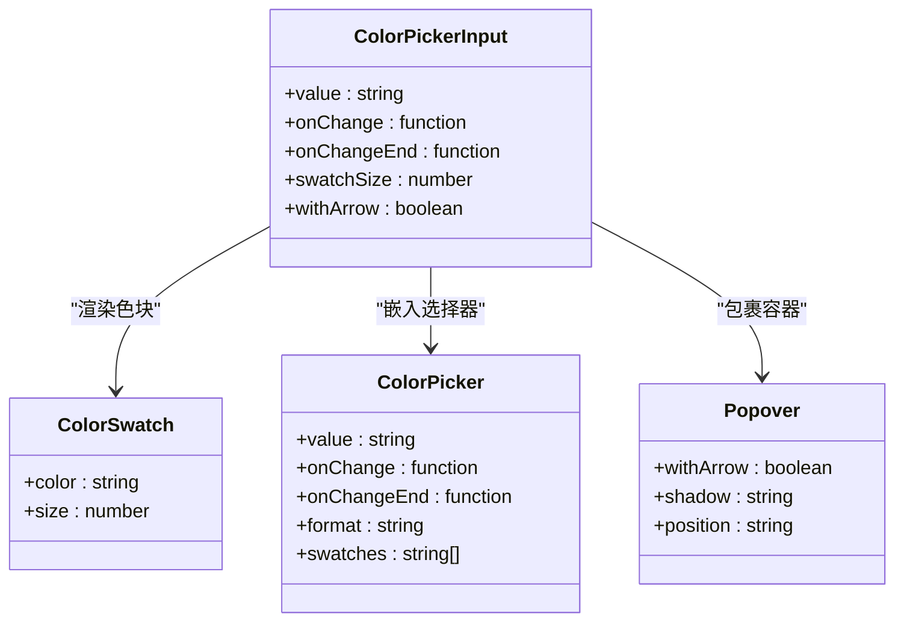
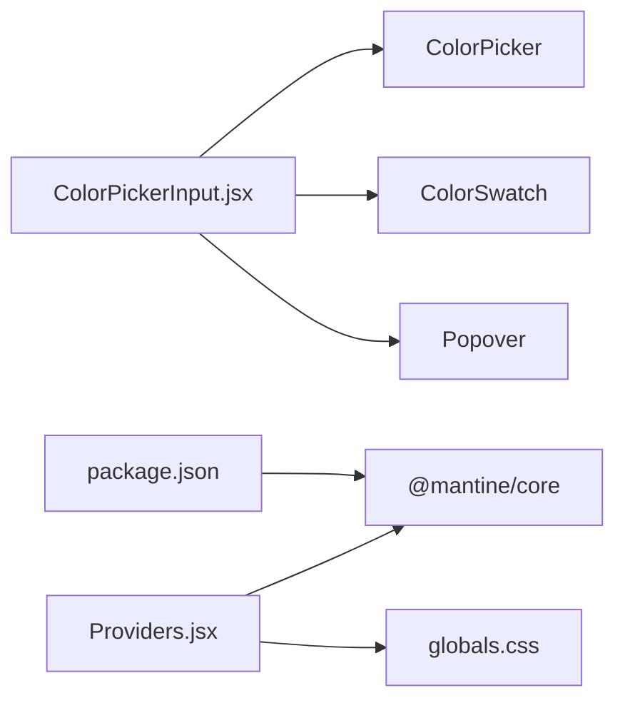

# 表单组件

<cite>
**本文引用的文件列表**
- [ColorPickerInput.jsx](file://src/components/ColorPickerInput.jsx)
- [TableSchema.jsx](file://src/features/schema/TableSchema.jsx)
- [Providers.jsx](file://src/components/Providers.jsx)
- [globals.css](file://src/app/globals.css)
- [package.json](file://package.json)
</cite>

## 目录
1. [简介](#简介)
2. [项目结构](#项目结构)
3. [核心组件](#核心组件)
4. [架构总览](#架构总览)
5. [详细组件分析](#详细组件分析)
6. [依赖关系分析](#依赖关系分析)
7. [性能考量](#性能考量)
8. [故障排查指南](#故障排查指南)
9. [结论](#结论)
10. [附录：使用示例与最佳实践](#附录使用示例与最佳实践)

## 简介
本文件聚焦于 Vibe DB 中的 ColorPickerInput 表单组件，系统性阐述其视觉外观、行为与交互模式，详细说明组件属性、事件处理、颜色值传递与验证机制，并给出在表单中集成颜色选择器的使用示例与扩展方案。同时解释组件与表单验证系统的集成方式，以及状态管理、错误处理与用户反馈机制。

## 项目结构
ColorPickerInput 是一个基于 Mantine UI 的轻量级表单组件，封装了弹出式颜色选择器与色块预览，用于在表单场景中提供直观的颜色选择体验。该组件在 Schema 模块的 TableSchema 页面中被复用，作为表格颜色配置入口。

图表来源
- [ColorPickerInput.jsx:1-52](file://src/components/ColorPickerInput.jsx#L1-L52)
- [TableSchema.jsx:1-115](file://src/features/schema/TableSchema.jsx#L1-L115)
- [Providers.jsx:1-36](file://src/components/Providers.jsx#L1-L36)
- [globals.css:1-31](file://src/app/globals.css#L1-L31)
- [package.json:16-38](file://package.json#L16-L38)

章节来源
- [ColorPickerInput.jsx:1-52](file://src/components/ColorPickerInput.jsx#L1-L52)
- [TableSchema.jsx:1-115](file://src/features/schema/TableSchema.jsx#L1-L115)
- [Providers.jsx:1-36](file://src/components/Providers.jsx#L1-L36)
- [globals.css:1-31](file://src/app/globals.css#L1-L31)
- [package.json:16-38](file://package.json#L16-L38)

## 核心组件
ColorPickerInput 是一个受控组件，负责：
- 展示当前颜色的色块（ColorSwatch）
- 弹出颜色选择器（ColorPicker），支持十六进制格式与预设色板
- 在颜色变化时分发两个事件：
  - onChange：实时回调，适合本地预览
  - onChangeEnd：选择结束时回调，适合触发持久化或 API 调用

组件默认值与行为：
- 默认颜色：#6366f1
- 预设色板：一组常用颜色，便于快速选择
- 弹出位置：底部左侧，带阴影与箭头
- 色块尺寸：默认 20，可通过 swatchSize 调整
- 箭头显示：默认开启 withArrow

章节来源
- [ColorPickerInput.jsx:5-51](file://src/components/ColorPickerInput.jsx#L5-L51)

## 架构总览
ColorPickerInput 通过 Mantine 的 Popover 包裹 ColorSwatch 与 ColorPicker，形成“点击色块打开选择器”的交互闭环。在 TableSchema 页面中，组件与本地状态联动，实现“实时预览 + 保存提交”的双阶段流程。

图表来源
- [ColorPickerInput.jsx:20-48](file://src/components/ColorPickerInput.jsx#L20-L48)
- [TableSchema.jsx:37-45](file://src/features/schema/TableSchema.jsx#L37-L45)

章节来源
- [ColorPickerInput.jsx:13-49](file://src/components/ColorPickerInput.jsx#L13-L49)
- [TableSchema.jsx:37-45](file://src/features/schema/TableSchema.jsx#L37-L45)

## 详细组件分析

### 组件类图
ColorPickerInput 本身是一个函数式组件，内部组合了 Mantine 的 ColorSwatch、ColorPicker 与 Popover。其对外暴露的属性与事件即为组件的公共接口。

图表来源
- [ColorPickerInput.jsx:13-49](file://src/components/ColorPickerInput.jsx#L13-L49)

章节来源
- [ColorPickerInput.jsx:13-49](file://src/components/ColorPickerInput.jsx#L13-L49)

### 属性与事件
- 属性
  - value: 当前颜色值（十六进制字符串）
  - onChange: 颜色变化时回调（实时）
  - onChangeEnd: 颜色选择完成时回调（适合持久化）
  - swatchSize: 色块尺寸
  - withArrow: 是否显示箭头
- 事件
  - onChange(color): 实时预览，适合更新本地状态
  - onChangeEnd(color): 完成选择后触发，适合调用 API 或持久化

章节来源
- [ColorPickerInput.jsx:5-19](file://src/components/ColorPickerInput.jsx#L5-L19)

### 颜色值传递与验证机制
- 值类型：十六进制字符串（如 #6366f1）
- 传递链路：组件接收 value；ColorPicker 接收 value 并在 onChange/onChangeEnd 回传给父组件；父组件决定是否更新本地状态或发起持久化
- 验证建议（通用实践）
  - 使用正则校验十六进制颜色格式
  - 对空值进行兜底处理（例如回退到默认值）
  - 在 onChangeEnd 时进行业务规则校验（如颜色可用性、权限等）

章节来源
- [ColorPickerInput.jsx:26-30](file://src/components/ColorPickerInput.jsx#L26-L30)

### 用户交互模式
- 点击色块：打开颜色选择器
- 实时拖动：onChange 连续触发，实现预览
- 确认选择：松开鼠标或确认操作，触发 onChangeEnd
- 预设色板：内置一组常用颜色，便于快速选择

章节来源
- [ColorPickerInput.jsx:21-48](file://src/components/ColorPickerInput.jsx#L21-L48)

### 与表单验证系统的集成
- ColorPickerInput 本身不包含表单验证逻辑，但可与外部验证库（如 Zod）配合使用
- 建议在表单提交时对颜色字段执行格式校验与业务规则校验
- 若需要错误状态反馈，可在父组件中根据验证结果控制组件的样式或提示

章节来源
- [package.json:38](file://package.json#L38)

### 状态管理与用户反馈
- 状态管理
  - TableSchema 中维护 colorValue 本地状态，onChange 实时更新
  - onChangeEnd 时调用 updateTable 触发持久化
- 用户反馈
  - Providers.jsx 提供全局通知（sonner），可在成功/失败时展示反馈
  - 全局样式与主题由 MantineProvider 管理，确保一致的视觉体验

章节来源
- [TableSchema.jsx:16-45](file://src/features/schema/TableSchema.jsx#L16-L45)
- [Providers.jsx:9-35](file://src/components/Providers.jsx#L9-L35)

## 依赖关系分析
ColorPickerInput 依赖 Mantine 的 ColorSwatch、ColorPicker 与 Popover，这些组件共同构成弹出式颜色选择器的 UI 基础。全局样式与主题由 MantineProvider 与自定义 CSS 提供。

图表来源
- [ColorPickerInput.jsx:3](file://src/components/ColorPickerInput.jsx#L3)
- [Providers.jsx:3](file://src/components/Providers.jsx#L3)
- [package.json:23](file://package.json#L23)

章节来源
- [ColorPickerInput.jsx:3](file://src/components/ColorPickerInput.jsx#L3)
- [Providers.jsx:3](file://src/components/Providers.jsx#L3)
- [package.json:23](file://package.json#L23)

## 性能考量
- 渲染优化：ColorPickerInput 仅包含少量子组件，渲染开销低
- 事件节流：onChange 为高频回调，若父组件在 onChange 中执行昂贵操作，建议在父组件侧进行节流/防抖
- 预设色板：内置固定数量的预设色，避免动态加载带来的额外开销
- 主题与样式：全局样式由 MantineProvider 管理，避免重复注入样式标签

## 故障排查指南
- 颜色值无效
  - 现象：颜色无法正确显示或选择
  - 排查：确认传入的 value 为合法的十六进制颜色字符串
  - 处理：在父组件中对 value 进行格式校验与兜底
- 事件未触发
  - 现象：onChange 或 onChangeEnd 未被调用
  - 排查：检查父组件是否正确传递 onChange 与 onChangeEnd
  - 处理：确保回调函数引用稳定且在组件生命周期内有效
- 弹出层位置异常
  - 现象：颜色选择器位置不符合预期
  - 排查：检查 Popover 的 position 与 withArrow 设置
  - 处理：根据布局调整 position 或关闭 withArrow
- 样式不生效
  - 现象：组件样式缺失或主题不一致
  - 排查：确认 Providers.jsx 正确包裹应用并引入 @mantine/core 样式
  - 处理：确保 MantineProvider 与全局样式加载顺序正确

章节来源
- [ColorPickerInput.jsx:20-48](file://src/components/ColorPickerInput.jsx#L20-L48)
- [Providers.jsx:9-35](file://src/components/Providers.jsx#L9-L35)

## 结论
ColorPickerInput 以简洁的 API 与清晰的交互模式，为表单场景提供了即插即用的颜色选择能力。通过与 TableSchema 的结合，实现了“实时预览 + 保存提交”的完整工作流。开发者可在此基础上扩展验证、错误处理与用户反馈机制，进一步提升表单的可用性与可靠性。

## 附录：使用示例与最佳实践
- 基本用法
  - 在表单中直接引入 ColorPickerInput，并传入 value、onChange、onChangeEnd
  - 示例路径参考：[TableSchema.jsx:102-109](file://src/features/schema/TableSchema.jsx#L102-L109)
- 与验证库集成
  - 在表单提交时对颜色字段进行格式与业务规则校验
  - 可参考依赖声明：[package.json:38](file://package.json#L38)
- 错误处理与用户反馈
  - 使用 Providers.jsx 提供的通知组件进行成功/失败提示
  - 参考路径：[Providers.jsx:12-31](file://src/components/Providers.jsx#L12-L31)
- 主题与样式
  - 确保 MantineProvider 正常加载，全局样式按需定制
  - 参考路径：[Providers.jsx:9-35](file://src/components/Providers.jsx#L9-L35)，[globals.css:1-31](file://src/app/globals.css#L1-L31)