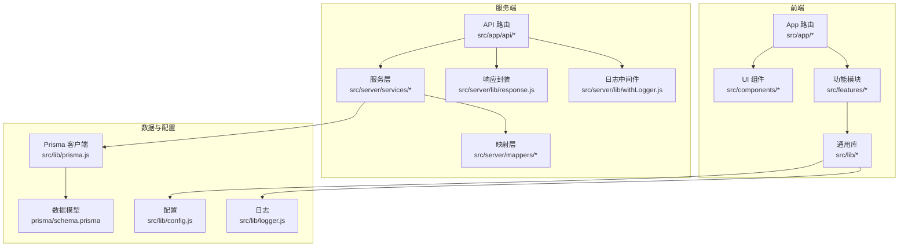
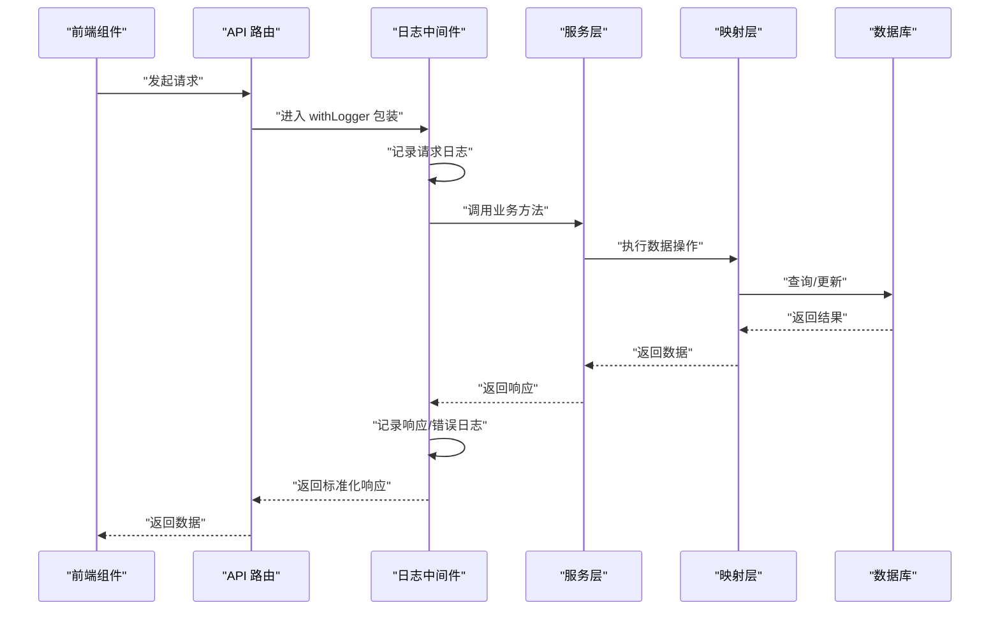
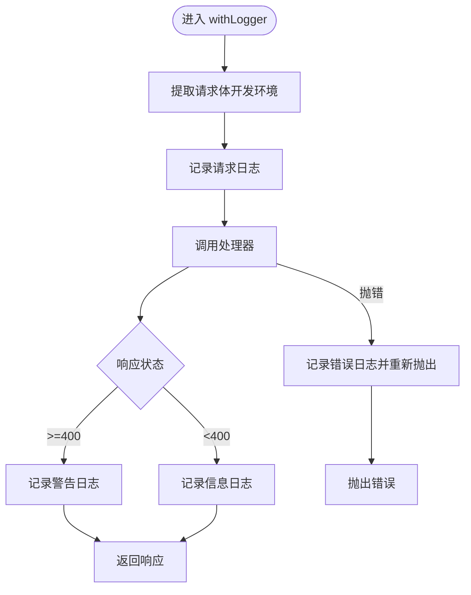
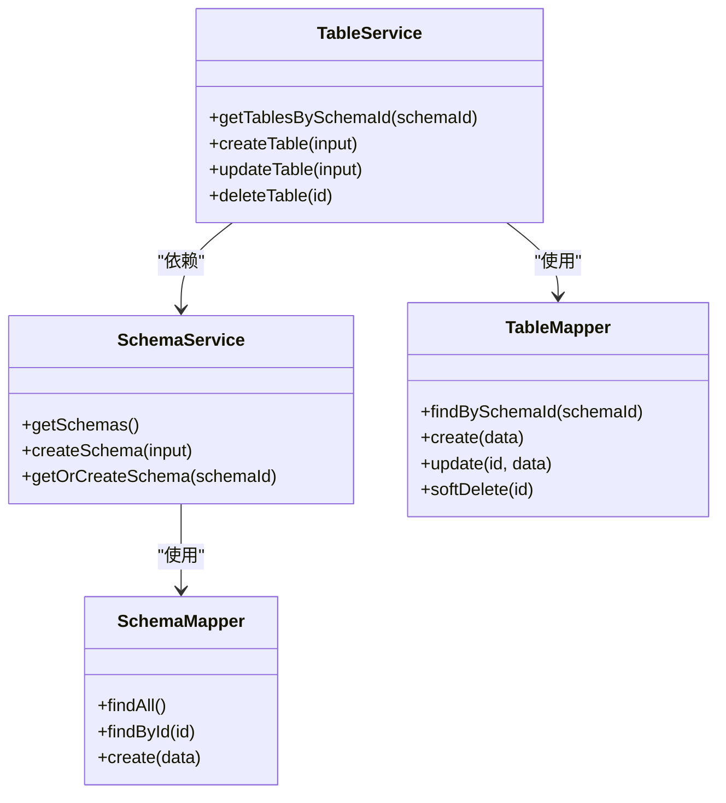
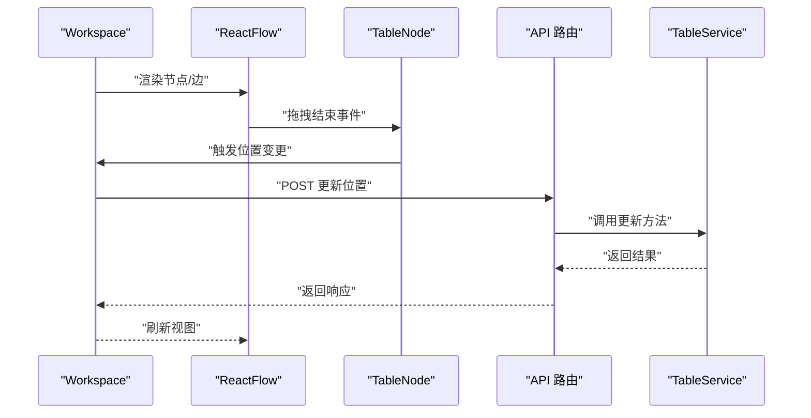
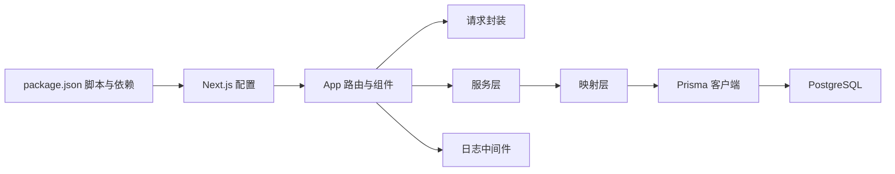

# 开发者指南

<cite>
**本文引用的文件**
- [package.json](file://package.json)
- [next.config.js](file://next.config.js)
- [prisma/schema.prisma](file://prisma/schema.prisma)
- [src/lib/config.js](file://src/lib/config.js)
- [src/lib/logger.js](file://src/lib/logger.js)
- [src/lib/prisma.js](file://src/lib/prisma.js)
- [src/lib/request.js](file://src/lib/request.js)
- [src/server/lib/response.js](file://src/server/lib/response.js)
- [src/server/lib/withLogger.js](file://src/server/lib/withLogger.js)
- [src/app/layout.jsx](file://src/app/layout.jsx)
- [src/components/Providers.jsx](file://src/components/Providers.jsx)
- [src/features/canvas/Workspace.jsx](file://src/features/canvas/Workspace.jsx)
- [src/features/schema/TableSchema.jsx](file://src/features/schema/TableSchema.jsx)
- [src/server/services/schema.service.js](file://src/server/services/schema.service.js)
- [src/server/services/table.service.js](file://src/server/services/table.service.js)
- [src/app/api/table/create/route.js](file://src/app/api/table/create/route.js)
- [src/hooks/useSortableList.js](file://src/hooks/useSortableList.js)
</cite>

## 目录
1. [简介](#简介)
2. [项目结构](#项目结构)
3. [核心组件](#核心组件)
4. [架构总览](#架构总览)
5. [详细组件分析](#详细组件分析)
6. [依赖关系分析](#依赖关系分析)
7. [性能考量](#性能考量)
8. [故障排查指南](#故障排查指南)
9. [结论](#结论)
10. [附录](#附录)

## 简介
本指南面向新加入的开发者，帮助快速理解并参与 Vibe DB 的开发工作。内容涵盖项目结构与目录组织原则、文件命名规范、开发最佳实践、代码组织模式与设计原则、工具函数库使用、配置管理策略、日志记录机制、错误处理、性能优化、安全考虑、调试与测试策略、代码质量保障、贡献流程与发布流程等。

## 项目结构
项目采用基于功能分层的组织方式：
- 前端（Next.js App）位于 src/app 与 src/components、src/features 等目录，负责页面、UI 组件与业务面板。
- 服务端 API 路由位于 src/app/api 下，按领域划分（如 table、relation、schemas）。
- 服务层位于 src/server/services，封装业务逻辑。
- 映射层位于 src/server/mappers，负责与数据库交互的适配。
- 通用库位于 src/lib，包含配置、日志、请求封装、Prisma 客户端等。
- 数据模型定义位于 prisma/schema.prisma，迁移文件位于 prisma/migrations。

图表来源
- [src/app/layout.jsx:1-19](file://src/app/layout.jsx#L1-L19)
- [src/components/Providers.jsx:1-36](file://src/components/Providers.jsx#L1-L36)
- [src/lib/prisma.js:1-16](file://src/lib/prisma.js#L1-L16)
- [prisma/schema.prisma:1-69](file://prisma/schema.prisma#L1-L69)
- [src/lib/config.js:1-33](file://src/lib/config.js#L1-L33)
- [src/lib/logger.js:1-65](file://src/lib/logger.js#L1-L65)
- [src/server/lib/response.js:1-14](file://src/server/lib/response.js#L1-L14)
- [src/server/lib/withLogger.js:1-76](file://src/server/lib/withLogger.js#L1-L76)

章节来源
- [package.json:1-55](file://package.json#L1-L55)
- [next.config.js:1-7](file://next.config.js#L1-L7)
- [prisma/schema.prisma:1-69](file://prisma/schema.prisma#L1-L69)

## 核心组件
- 配置模块：根据 NODE_ENV 自动加载开发/生产配置，提供数据库、应用 URL、日志级别等。
- 日志模块：基于 Pino，开发环境同时输出控制台与文件，生产环境仅文件输出；按日期切割日志文件。
- 请求封装：统一的 request 工具，支持请求/响应拦截器、超时控制、静默模式与错误提示。
- Prisma 客户端：通过适配器连接 PostgreSQL，全局单例避免重复初始化。
- API 路由与中间件：统一使用 withLogger 记录请求/响应日志与错误，使用响应封装返回标准化结构。
- 前端主题与通知：Mantine 提供主题与组件，Sonner 提供轻量通知。

章节来源
- [src/lib/config.js:1-33](file://src/lib/config.js#L1-L33)
- [src/lib/logger.js:1-65](file://src/lib/logger.js#L1-L65)
- [src/lib/request.js:1-142](file://src/lib/request.js#L1-L142)
- [src/lib/prisma.js:1-16](file://src/lib/prisma.js#L1-L16)
- [src/server/lib/response.js:1-14](file://src/server/lib/response.js#L1-L14)
- [src/server/lib/withLogger.js:1-76](file://src/server/lib/withLogger.js#L1-L76)
- [src/app/layout.jsx:1-19](file://src/app/layout.jsx#L1-L19)
- [src/components/Providers.jsx:1-36](file://src/components/Providers.jsx#L1-L36)

## 架构总览
系统采用“前端 + 服务端 API + 数据库”的三层架构。前端通过统一请求工具与 API 路由交互，服务层进行业务校验与编排，映射层对接 Prisma 客户端访问数据库。日志中间件贯穿 API 层，确保可观测性。

图表来源
- [src/app/api/table/create/route.js:1-16](file://src/app/api/table/create/route.js#L1-L16)
- [src/server/lib/withLogger.js:1-76](file://src/server/lib/withLogger.js#L1-L76)
- [src/server/lib/response.js:1-14](file://src/server/lib/response.js#L1-L14)
- [src/server/services/table.service.js:1-38](file://src/server/services/table.service.js#L1-L38)
- [src/lib/prisma.js:1-16](file://src/lib/prisma.js#L1-L16)

## 详细组件分析

### 配置管理策略
- 环境区分：根据 NODE_ENV 设置日志级别与输出行为。
- 数据库连接：从 DATABASE_URL 读取连接字符串。
- 应用地址：NEXT_PUBLIC_APP_URL 或默认本地地址。
- 日志级别：开发环境默认 debug，生产环境 info；可通过 LOG_LEVEL 覆盖。

章节来源
- [src/lib/config.js:1-33](file://src/lib/config.js#L1-L33)

### 日志记录机制
- 开发环境：控制台（彩色美化）+ 文件（JSON），便于本地调试。
- 生产环境：仅文件输出，按日期切割日志文件。
- 中间件：统一记录请求方法、路径、状态码、耗时；错误时记录堆栈信息。

图表来源
- [src/server/lib/withLogger.js:1-76](file://src/server/lib/withLogger.js#L1-L76)
- [src/lib/logger.js:1-65](file://src/lib/logger.js#L1-L65)

章节来源
- [src/lib/logger.js:1-65](file://src/lib/logger.js#L1-L65)
- [src/server/lib/withLogger.js:1-76](file://src/server/lib/withLogger.js#L1-L76)

### 请求封装与拦截器
- 支持请求/响应拦截器链式处理。
- 统一超时控制与静默模式，非静默场景自动弹出错误提示。
- 标准化错误对象包含 code、msg、data 字段，便于前端展示。

章节来源
- [src/lib/request.js:1-142](file://src/lib/request.js#L1-L142)

### 数据访问与服务层
- 服务层对输入进行 Zod 校验，再调用映射层执行数据库操作。
- 软删除与级联删除在模型层面定义，服务层仅负责业务语义。
- Schema 服务支持“获取或创建”默认 Schema，保证数据一致性。

图表来源
- [src/server/services/schema.service.js:1-26](file://src/server/services/schema.service.js#L1-L26)
- [src/server/services/table.service.js:1-38](file://src/server/services/table.service.js#L1-L38)

章节来源
- [src/server/services/schema.service.js:1-26](file://src/server/services/schema.service.js#L1-L26)
- [src/server/services/table.service.js:1-38](file://src/server/services/table.service.js#L1-L38)

### 前端画布与拖拽排序
- 使用 ReactFlow 渲染表与关系连线，TableNode 与自定义 Edge 渲染。
- 拖拽结束后立即保存节点位置，防止重复保存。
- 使用 DnD Kit 实现列表排序，支持数组重排回调。

图表来源
- [src/features/canvas/Workspace.jsx:1-219](file://src/features/canvas/Workspace.jsx#L1-L219)
- [src/app/api/table/create/route.js:1-16](file://src/app/api/table/create/route.js#L1-L16)
- [src/server/services/table.service.js:1-38](file://src/server/services/table.service.js#L1-L38)

章节来源
- [src/features/canvas/Workspace.jsx:1-219](file://src/features/canvas/Workspace.jsx#L1-L219)
- [src/hooks/useSortableList.js:1-26](file://src/hooks/useSortableList.js#L1-L26)

### 数据模型与迁移
- 使用 Prisma 定义 Schema、Table、Field、Index、Relation 模型。
- 迁移文件记录数据库演进历史，支持开发与生产环境迁移命令。
- 通过 Prisma Client 生成类型安全的查询接口。

章节来源
- [prisma/schema.prisma:1-69](file://prisma/schema.prisma#L1-L69)
- [src/lib/prisma.js:1-16](file://src/lib/prisma.js#L1-L16)

## 依赖关系分析
- Next.js 配置启用严格模式与外部包声明，减少打包体积。
- 前端 UI 使用 Mantine 与 Sonner，提供一致的主题与通知体验。
- 数据库访问通过 Prisma 适配器连接 PostgreSQL，全局单例避免重复初始化。
- API 路由统一使用 withLogger 中间件，响应封装统一返回格式。

图表来源
- [package.json:1-55](file://package.json#L1-L55)
- [next.config.js:1-7](file://next.config.js#L1-L7)
- [src/lib/request.js:1-142](file://src/lib/request.js#L1-L142)
- [src/lib/prisma.js:1-16](file://src/lib/prisma.js#L1-L16)
- [src/server/lib/withLogger.js:1-76](file://src/server/lib/withLogger.js#L1-L76)

章节来源
- [package.json:1-55](file://package.json#L1-L55)
- [next.config.js:1-7](file://next.config.js#L1-L7)

## 性能考量
- 前端渲染：React.memo 用于画布组件，减少不必要的重渲染；useMemo 用于稳定关系边集。
- 拖拽保存：拖拽结束即刻保存，避免频繁防抖导致的延迟与重复保存。
- 数据库访问：Prisma 客户端全局单例，避免重复初始化带来的开销。
- 日志输出：开发环境双写，生产环境仅文件输出，降低 I/O 压力。
- 超时控制：请求封装内置超时，避免长时间挂起影响用户体验。

章节来源
- [src/features/canvas/Workspace.jsx:1-219](file://src/features/canvas/Workspace.jsx#L1-L219)
- [src/lib/request.js:1-142](file://src/lib/request.js#L1-L142)
- [src/lib/prisma.js:1-16](file://src/lib/prisma.js#L1-L16)
- [src/lib/logger.js:1-65](file://src/lib/logger.js#L1-L65)

## 故障排查指南
- 日志定位：查看 logs 目录下按日期分割的日志文件，结合 API 路由日志快速定位问题。
- 请求异常：检查请求封装中的拦截器链、超时与静默模式配置，确认错误对象是否包含 code/msg/data。
- 数据库问题：确认 DATABASE_URL 是否正确，迁移是否已执行，必要时使用 Prisma Studio 查看数据。
- 前端交互：确认拖拽保存逻辑是否触发，API 返回是否正常，Toast 是否显示错误信息。

章节来源
- [src/lib/logger.js:1-65](file://src/lib/logger.js#L1-L65)
- [src/lib/request.js:1-142](file://src/lib/request.js#L1-L142)
- [src/server/lib/withLogger.js:1-76](file://src/server/lib/withLogger.js#L1-L76)

## 结论
本指南提供了从项目结构到核心组件、从开发最佳实践到故障排查的完整视角。建议新开发者先从配置与日志模块入手，再深入前端画布与服务层，最后掌握数据库模型与迁移流程，以循序渐进的方式融入团队开发。

## 附录

### 目录组织原则与文件命名规范
- 目录组织：按“功能/层次”划分，前端页面与组件分离，服务端 API 与服务层分离，通用库集中管理。
- 文件命名：采用小驼峰或模块名，API 路由按动作命名（create、update、delete、query），服务层以 .service.js 结尾，映射层以 .mapper.js 结尾，通用库以 .js 结尾。

### 开发最佳实践
- 输入校验：服务层统一使用 Zod schema 校验输入，保证数据一致性。
- 错误处理：API 路由捕获异常并返回标准化响应，前端统一处理错误提示。
- 日志记录：使用 withLogger 中间件记录请求/响应与错误，便于追踪问题。
- 前端性能：合理使用 memo 与 useMemo，避免不必要的重渲染。

### 设计原则
- 分层清晰：UI、服务、映射、数据层职责明确，耦合度低。
- 可观测性：统一日志与错误处理，便于监控与排障。
- 可扩展性：模块化设计，新增功能尽量复用现有工具与中间件。

### 工具函数库使用指南
- 请求封装：通过 request/post/get/put/del 发起请求，支持拦截器与超时控制。
- 拖拽排序：useSortableList 封装 DnD Kit，提供数组重排能力。
- 主题与通知：Providers 提供 Mantine 主题与 Sonner 通知，统一 UI 体验。

章节来源
- [src/lib/request.js:1-142](file://src/lib/request.js#L1-L142)
- [src/hooks/useSortableList.js:1-26](file://src/hooks/useSortableList.js#L1-L26)
- [src/components/Providers.jsx:1-36](file://src/components/Providers.jsx#L1-L36)

### 配置管理策略
- 环境变量：DATABASE_URL、NODE_ENV、LOG_LEVEL、NEXT_PUBLIC_APP_URL 等。
- 动态配置：根据 NODE_ENV 自动切换日志级别与输出行为。
- 应用地址：前端 NEXT_PUBLIC_APP_URL 优先，否则回退至本地地址。

章节来源
- [src/lib/config.js:1-33](file://src/lib/config.js#L1-L33)

### 日志记录机制
- 输出目标：开发环境控制台 + 文件，生产环境仅文件。
- 切割策略：按日期生成日志文件，避免单文件过大。
- 中间件：withLogger 自动记录请求/响应与错误，包含耗时与状态码。

章节来源
- [src/lib/logger.js:1-65](file://src/lib/logger.js#L1-L65)
- [src/server/lib/withLogger.js:1-76](file://src/server/lib/withLogger.js#L1-L76)

### 错误处理机制
- API 层：withLogger 捕获异常并记录错误日志，随后抛出。
- 响应层：Ok/BadRequest/NotFound/ServerError 统一返回结构。
- 前端层：请求封装在非静默模式下自动弹出错误提示。

章节来源
- [src/server/lib/withLogger.js:1-76](file://src/server/lib/withLogger.js#L1-L76)
- [src/server/lib/response.js:1-14](file://src/server/lib/response.js#L1-L14)
- [src/lib/request.js:1-142](file://src/lib/request.js#L1-L142)

### 性能优化技巧
- 前端：memo 化组件、useMemo 缓存计算结果、及时取消请求。
- 后端：中间件日志异步写入、避免重复初始化、合理使用事务。
- 数据库：使用 Prisma 生成的类型与索引，减少无效查询。

章节来源
- [src/features/canvas/Workspace.jsx:1-219](file://src/features/canvas/Workspace.jsx#L1-L219)
- [src/lib/request.js:1-142](file://src/lib/request.js#L1-L142)
- [src/lib/prisma.js:1-16](file://src/lib/prisma.js#L1-L16)

### 安全考虑
- 环境变量：敏感信息通过环境变量注入，避免硬编码。
- 输入校验：Zod schema 校验所有输入，防止非法数据进入数据库。
- 日志脱敏：中间件仅在开发环境打印请求体，生产环境避免泄露敏感信息。

章节来源
- [src/lib/config.js:1-33](file://src/lib/config.js#L1-L33)
- [src/server/services/schema.service.js:1-26](file://src/server/services/schema.service.js#L1-L26)
- [src/server/lib/withLogger.js:1-76](file://src/server/lib/withLogger.js#L1-L76)

### 调试工具使用方法
- 日志：查看 logs 目录下的按日期日志文件，结合 API 路由日志定位问题。
- 数据库：使用 Prisma Studio 查看与编辑数据，确保模型与数据一致。
- 前端：利用浏览器开发者工具检查网络请求与响应，确认拖拽保存是否触发。

章节来源
- [src/lib/logger.js:1-65](file://src/lib/logger.js#L1-L65)
- [package.json:10-14](file://package.json#L10-L14)

### 测试策略与代码质量保证
- 单元测试：针对服务层与工具函数编写单元测试，覆盖边界条件与错误分支。
- 集成测试：模拟 API 路由与数据库交互，验证端到端流程。
- 代码规范：使用 Prettier 与 ESLint，保持代码风格一致。
- 提交规范：遵循 Conventional Commits，配合自动化检查与 CI 流水线。

### 贡献指南、代码审查标准与发布流程
- 贡献指南：提交前请阅读仓库内的贡献文档，遵守分支策略与提交规范。
- 代码审查：至少一名维护者审查，关注可读性、性能与安全性。
- 发布流程：通过 CI 进行构建与测试，确认无误后合并主分支并打标签发布。