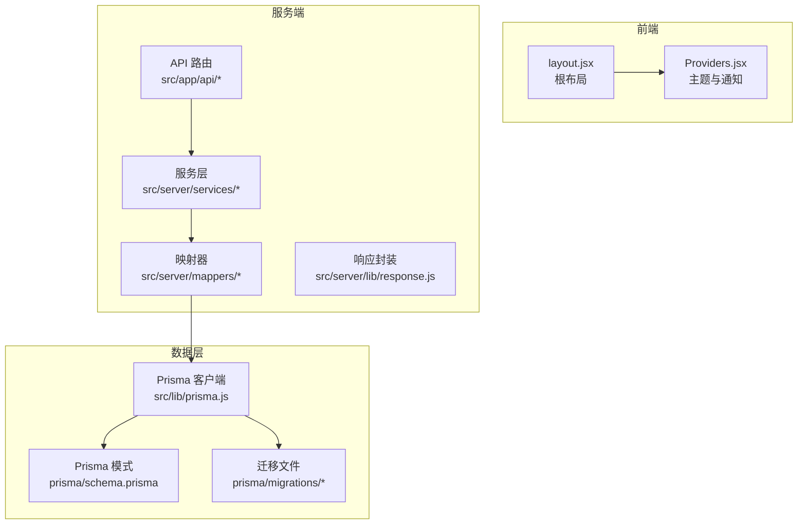
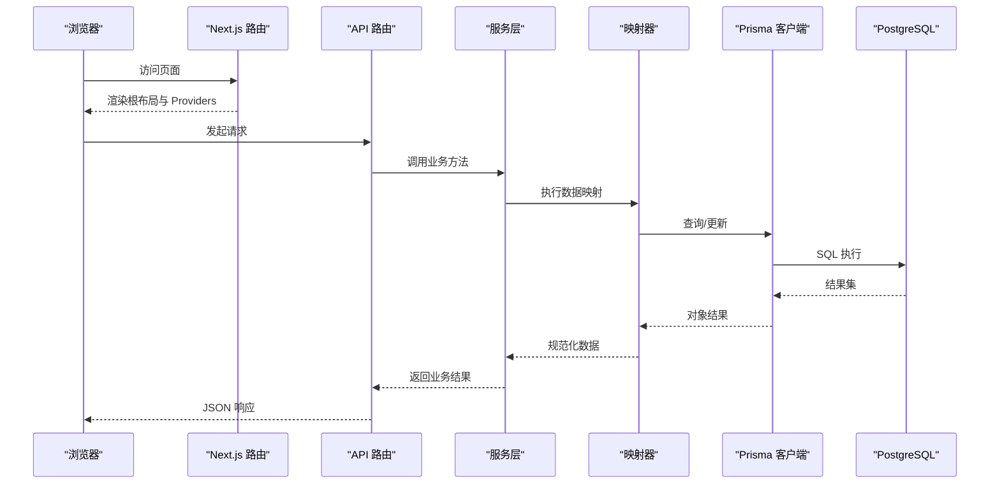
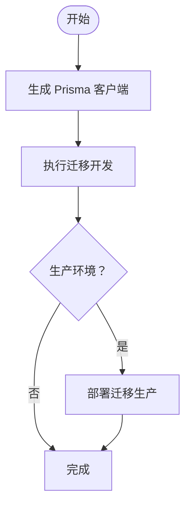
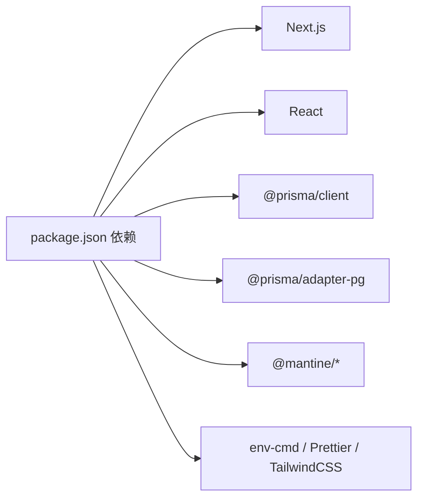

# 快速开始

<cite>
**本文引用的文件**
- [package.json](file://package.json)
- [prisma/schema.prisma](file://prisma/schema.prisma)
- [prisma.config.ts](file://prisma.config.ts)
- [src/lib/config.js](file://src/lib/config.js)
- [src/lib/prisma.js](file://src/lib/prisma.js)
- [next.config.js](file://next.config.js)
- [src/app/layout.jsx](file://src/app/layout.jsx)
- [src/components/Providers.jsx](file://src/components/Providers.jsx)
- [prisma/migrations/20260403040400_init/migration.sql](file://prisma/migrations/20260403040400_init/migration.sql)
- [prisma/migrations/20260403040547_add_schema_model/migration.sql](file://prisma/migrations/20260403040547_add_schema_model/migration.sql)
- [src/app/api/table/query/route.js](file://src/app/api/table/query/route.js)
- [src/server/services/schema.service.js](file://src/server/services/schema.service.js)
- [src/server/lib/response.js](file://src/server/lib/response.js)
- [src/lib/logger.js](file://src/lib/logger.js)
- [src/lib/utils.js](file://src/lib/utils.js)
</cite>

## 目录
1. [简介](#简介)
2. [项目结构](#项目结构)
3. [核心组件](#核心组件)
4. [架构总览](#架构总览)
5. [详细组件分析](#详细组件分析)
6. [依赖分析](#依赖分析)
7. [性能考虑](#性能考虑)
8. [故障排除指南](#故障排除指南)
9. [结论](#结论)
10. [附录](#附录)

## 简介
本指南面向新手开发者，帮助你在本地快速搭建 Vibe DB 的开发环境并成功运行项目。内容涵盖环境要求（Node.js 版本、PostgreSQL 配置）、依赖安装、数据库初始化、开发服务器启动、环境变量配置、Prisma 迁移与初始数据设置、首次运行验证以及常见问题排查。

## 项目结构
Vibe DB 是一个基于 Next.js 16 的前端应用，使用 Prisma 作为 ORM，PostgreSQL 作为数据库。项目采用分层结构：
- 前端页面与布局：src/app
- 组件与主题：src/components、src/features
- 服务层与映射器：src/server/services、src/server/mappers
- 工具与配置：src/lib
- 数据库模式与迁移：prisma/schema.prisma、prisma/migrations
- 构建与脚本：package.json、next.config.js

图表来源
- [src/app/layout.jsx:10-18](file://src/app/layout.jsx#L10-L18)
- [src/components/Providers.jsx:9-34](file://src/components/Providers.jsx#L9-L34)
- [src/app/api/table/query/route.js:1-20](file://src/app/api/table/query/route.js#L1-L20)
- [src/server/services/schema.service.js:1-26](file://src/server/services/schema.service.js#L1-L26)
- [src/server/lib/response.js:1-14](file://src/server/lib/response.js#L1-L14)
- [src/lib/prisma.js:1-16](file://src/lib/prisma.js#L1-L16)
- [prisma/schema.prisma:1-69](file://prisma/schema.prisma#L1-L69)
- [prisma/migrations/20260403040400_init/migration.sql:1-44](file://prisma/migrations/20260403040400_init/migration.sql#L1-L44)

章节来源
- [package.json:1-55](file://package.json#L1-L55)
- [next.config.js:1-7](file://next.config.js#L1-L7)

## 核心组件
- 环境配置与数据库连接
  - 环境变量通过配置模块读取，数据库 URL 来自 DATABASE_URL。
  - Prisma 使用 PostgreSQL 适配器进行连接。
- API 层
  - Next.js App Router API 路由，统一返回格式由响应封装提供。
- 服务层
  - 业务逻辑封装，如 Schema 的查询与创建。
- 数据模型
  - Schema、Table、Field、Index、Relation 等核心模型定义于 Prisma 模式文件中。

章节来源
- [src/lib/config.js:9-30](file://src/lib/config.js#L9-L30)
- [src/lib/prisma.js:6-9](file://src/lib/prisma.js#L6-L9)
- [prisma/schema.prisma:10-68](file://prisma/schema.prisma#L10-L68)
- [src/server/lib/response.js:3-7](file://src/server/lib/response.js#L3-L7)
- [src/server/services/schema.service.js:4-25](file://src/server/services/schema.service.js#L4-L25)

## 架构总览
下图展示了从浏览器到数据库的数据流与职责划分：

图表来源
- [src/app/layout.jsx:10-18](file://src/app/layout.jsx#L10-L18)
- [src/components/Providers.jsx:9-34](file://src/components/Providers.jsx#L9-L34)
- [src/app/api/table/query/route.js:5-19](file://src/app/api/table/query/route.js#L5-L19)
- [src/server/services/schema.service.js:5-7](file://src/server/services/schema.service.js#L5-L7)
- [src/server/lib/response.js:3-7](file://src/server/lib/response.js#L3-L7)
- [src/lib/prisma.js:6-9](file://src/lib/prisma.js#L6-L9)

## 详细组件分析

### 环境与依赖准备
- Node.js 版本
  - 项目使用 Next.js 16，建议使用长期支持版本的 Node.js（如 18.x 或 20.x），以确保兼容性与稳定性。
- PostgreSQL
  - 数据库提供商为 PostgreSQL，需提前安装并运行数据库实例，准备好连接字符串 DATABASE_URL。
- 包管理器
  - 推荐使用 Yarn（仓库包含 yarn.lock）。若使用 npm，请在安装后生成 package-lock.json 并保持一致。

章节来源
- [package.json:16-39](file://package.json#L16-L39)
- [prisma/schema.prisma:6-8](file://prisma/schema.prisma#L6-L8)

### 克隆与安装依赖
- 步骤
  1) 克隆仓库到本地
  2) 进入项目目录
  3) 安装依赖（推荐使用 Yarn）
- 预期输出
  - 安装完成后生成 lock 文件，且 node_modules 下出现依赖包。

章节来源
- [package.json:5-14](file://package.json#L5-L14)

### 环境变量配置
- 关键变量
  - DATABASE_URL：PostgreSQL 连接字符串（必填）
  - NODE_ENV：开发/生产环境标识（可选，默认 development）
  - NEXT_PUBLIC_APP_URL：前端访问地址（可选，默认 http://localhost:3000）
  - LOG_LEVEL：日志级别（可选）
- 配置位置
  - 开发环境使用 .env.dev，生产环境使用 .env.prod；脚本通过 env-cmd 加载对应文件。
- 验证方式
  - 在配置模块中读取 DATABASE_URL，并在 Prisma 客户端中生效。

章节来源
- [src/lib/config.js:16-23](file://src/lib/config.js#L16-L23)
- [src/lib/prisma.js:7](file://src/lib/prisma.js#L7)
- [prisma.config.ts:8](file://prisma.config.ts#L8)
- [package.json:6-14](file://package.json#L6-L14)

### 数据库初始化与迁移
- Prisma 模式与适配器
  - 模式文件定义了 Schema、Table、Field、Index、Relation 等模型。
  - 使用 @prisma/adapter-pg 连接 PostgreSQL。
- 迁移策略
  - 开发环境：使用 migrate dev 创建迁移并同步数据库。
  - 生产环境：使用 migrate deploy 部署迁移。
- 初始迁移示例
  - 初始化迁移创建了 Table、Field、Index 表及外键关系。
  - 后续迁移添加了 Schema 模型并建立表与 Schema 的关联。
- 执行顺序
  1) 生成 Prisma 客户端
  2) 执行数据库迁移
  3) 可选：启动 Prisma Studio 查看数据

图表来源
- [package.json:10-14](file://package.json#L10-L14)
- [prisma/schema.prisma:10-68](file://prisma/schema.prisma#L10-L68)
- [prisma/migrations/20260403040400_init/migration.sql:1-44](file://prisma/migrations/20260403040400_init/migration.sql#L1-L44)
- [prisma/migrations/20260403040547_add_schema_model/migration.sql:1-23](file://prisma/migrations/20260403040547_add_schema_model/migration.sql#L1-L23)

章节来源
- [package.json:10-14](file://package.json#L10-L14)
- [prisma/schema.prisma:1-69](file://prisma/schema.prisma#L1-L69)
- [prisma/migrations/20260403040400_init/migration.sql:1-44](file://prisma/migrations/20260403040400_init/migration.sql#L1-L44)
- [prisma/migrations/20260403040547_add_schema_model/migration.sql:1-23](file://prisma/migrations/20260403040547_add_schema_model/migration.sql#L1-L23)

### 启动开发服务器
- 启动命令
  - 使用开发脚本启动 Next.js 开发服务器，自动加载 .env.dev。
- 预期输出
  - 控制台显示构建完成与热重载信息，浏览器打开默认地址（或指定的前端地址）。

章节来源
- [package.json:6](file://package.json#L6)
- [src/lib/config.js:22](file://src/lib/config.js#L22)

### 首次运行验证
- 页面访问
  - 访问根页面，确认已渲染根布局与 Providers。
- API 请求示例
  - 调用表格查询接口，传入 schemaId 参数，验证返回格式是否符合响应封装规范。
- 日志验证
  - 开发环境下同时输出到控制台与日志文件，检查日志目录是否存在。

章节来源
- [src/app/layout.jsx:10-18](file://src/app/layout.jsx#L10-L18)
- [src/components/Providers.jsx:9-34](file://src/components/Providers.jsx#L9-L34)
- [src/app/api/table/query/route.js:5-19](file://src/app/api/table/query/route.js#L5-L19)
- [src/server/lib/response.js:3-7](file://src/server/lib/response.js#L3-L7)
- [src/lib/logger.js:26-62](file://src/lib/logger.js#L26-L62)

## 依赖分析
- 前端框架与 UI
  - Next.js 16、React 19、Mantine UI、Sonner 通知等。
- 数据库与 ORM
  - Prisma Client、@prisma/adapter-pg、PostgreSQL。
- 工具与开发
  - env-cmd、Prettier、TailwindCSS、Prisma CLI。
- 服务端集成
  - Next.js App Router API 路由、响应封装、日志记录。

图表来源
- [package.json:16-52](file://package.json#L16-L52)

章节来源
- [package.json:16-52](file://package.json#L16-L52)

## 性能考虑
- 开发与生产日志级别
  - 开发环境默认 debug，生产环境默认 info；可通过 LOG_LEVEL 调整。
- 日志输出策略
  - 开发环境同时输出到控制台与文件，便于调试；生产环境仅输出到文件。
- Prisma 客户端复用
  - 使用全局缓存避免重复创建客户端，减少初始化开销。

章节来源
- [src/lib/config.js:26-29](file://src/lib/config.js#L26-L29)
- [src/lib/logger.js:26-62](file://src/lib/logger.js#L26-L62)
- [src/lib/prisma.js:11](file://src/lib/prisma.js#L11)

## 故障排除指南
- 数据库连接失败
  - 检查 DATABASE_URL 是否正确，确认 PostgreSQL 实例可访问。
  - 确认 Prisma 模式中的 provider 为 postgresql。
- 迁移执行异常
  - 开发环境使用 migrate dev，生产环境使用 migrate deploy。
  - 若提示未找到迁移，先执行生成客户端后再执行迁移。
- 端口占用
  - 默认开发端口为 3000，如被占用请调整环境变量或系统端口。
- API 返回格式不一致
  - 确保使用响应封装提供的 Ok/BadRequest 等方法，避免手动构造响应。
- 日志无输出
  - 开发环境会同时输出到控制台与文件，确认日志目录存在且有写权限。

章节来源
- [src/lib/config.js:16-23](file://src/lib/config.js#L16-L23)
- [prisma/schema.prisma:6-8](file://prisma/schema.prisma#L6-L8)
- [package.json:10-14](file://package.json#L10-L14)
- [src/server/lib/response.js:3-13](file://src/server/lib/response.js#L3-L13)
- [src/lib/logger.js:10-12](file://src/lib/logger.js#L10-L12)

## 结论
按照本指南，你可以完成 Vibe DB 的环境准备、依赖安装、数据库初始化与开发服务器启动。建议在开发阶段充分利用 Prisma Studio 与日志输出，结合 API 响应封装快速定位问题。完成上述步骤后，即可进入功能开发与调试。

## 附录
- 常用命令清单
  - 安装依赖：yarn install
  - 生成 Prisma 客户端：yarn db:generate
  - 开发环境迁移：yarn db:migrate
  - 生产环境迁移：yarn db:migrate:prod
  - 启动开发服务器：yarn dev
  - 启动 Prisma Studio：yarn db:studio
- 数据模型概览（简化）
  - Schema：拥有多个 Table 与 Relation
  - Table：拥有多个 Field 与 Index，属于某个 Schema
  - Field：属于某个 Table
  - Index：属于某个 Table
  - Relation：属于某个 Schema，关联两个 Table 的字段

章节来源
- [package.json:5-14](file://package.json#L5-L14)
- [prisma/schema.prisma:10-68](file://prisma/schema.prisma#L10-L68)