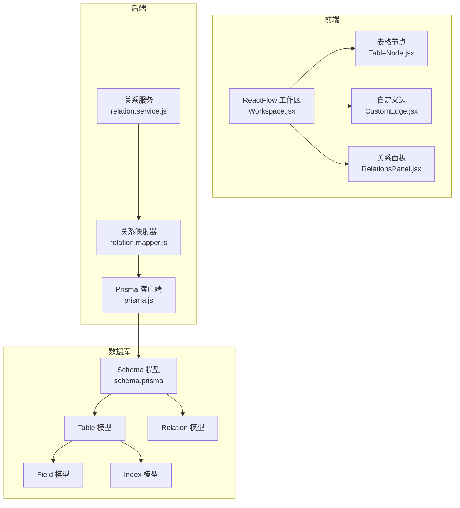
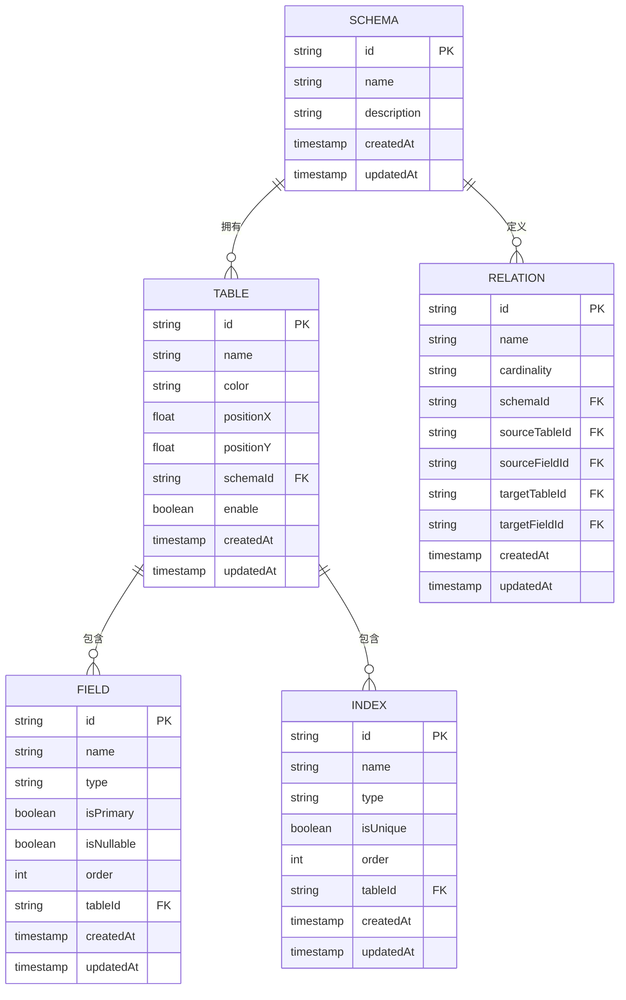
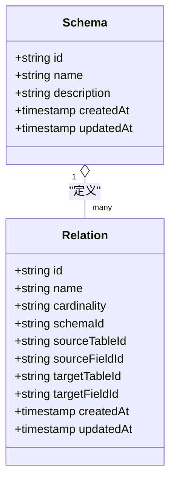
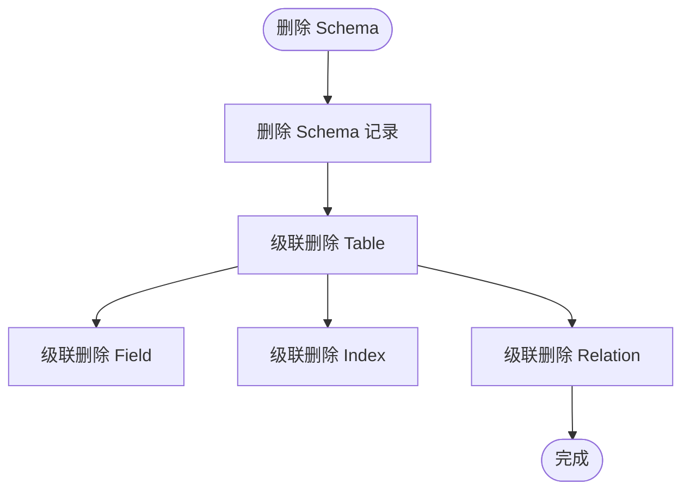
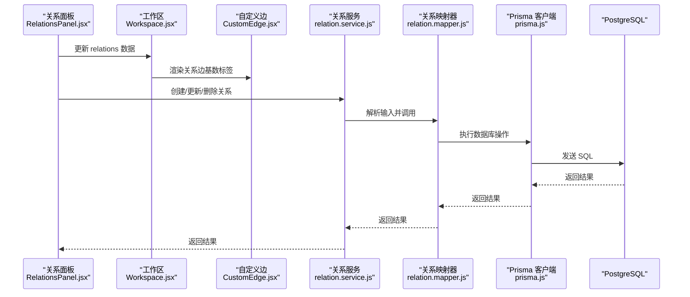
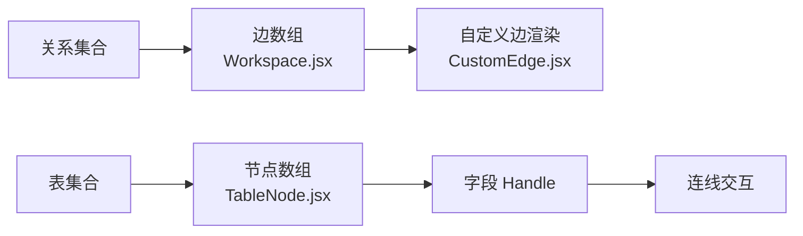
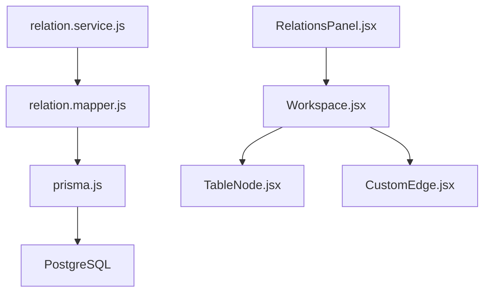

# 实体关系设计

<cite>
**本文档引用的文件**
- [schema.prisma](file://prisma/schema.prisma)
- [migration_init](file://prisma/migrations/20260403040400_init/migration.sql)
- [migration_add_schema_model](file://prisma/migrations/20260403040547_add_schema_model/migration.sql)
- [migration_add_table_deleted_at](file://prisma/migrations/20260409093753_add_table_deleted_at/migration.sql)
- [migration_replace_deleted_at_with_enable](file://prisma/migrations/20260409093937_replace_deleted_at_with_enable/migration.sql)
- [migration_add_relation_model](file://prisma/migrations/20260410113613_add_relation_model/migration.sql)
- [prisma_client](file://src/lib/prisma.js)
- [relation_service](file://src/server/services/relation.service.js)
- [relation_mapper](file://src/server/mappers/relation.mapper.js)
- [workspace_component](file://src/features/canvas/Workspace.jsx)
- [custom_edge](file://src/features/canvas/CustomEdge.jsx)
- [table_node](file://src/features/canvas/TableNode.jsx)
- [relations_panel](file://src/features/schema/RelationsPanel.jsx)
- [dbml_generator](file://src/features/schema/dbml.js)
</cite>

## 目录
1. [简介](#简介)
2. [项目结构](#项目结构)
3. [核心组件](#核心组件)
4. [架构总览](#架构总览)
5. [详细组件分析](#详细组件分析)
6. [依赖分析](#依赖分析)
7. [性能考虑](#性能考虑)
8. [故障排查指南](#故障排查指南)
9. [结论](#结论)
10. [附录](#附录)

## 简介
本文件面向 Vibe DB 的实体关系设计，系统性阐述 Schema、Table、Relation 三层模型的层次关系与关联模式，解释一对一、一对多、多对多关系的建模方式与约束条件；给出实体关系图（ERD）与数据流图，说明外键约束设计原则、级联操作策略与数据一致性保障机制；提供关系查询最佳实践与性能优化建议，并结合实际数据库迁移脚本与前端可视化组件，给出设计决策说明。

## 项目结构
Vibe DB 使用 Prisma 定义数据模型并通过迁移脚本落地到 PostgreSQL。前端通过 ReactFlow 可视化表与关系，服务层负责关系的增删改查，Prisma 客户端封装数据库访问。

**图表来源**
- [workspace_component:45-219](file://src/features/canvas/Workspace.jsx#L45-L219)
- [custom_edge:35-87](file://src/features/canvas/CustomEdge.jsx#L35-L87)
- [table_node:42-153](file://src/features/canvas/TableNode.jsx#L42-L153)
- [relations_panel:9-89](file://src/features/schema/RelationsPanel.jsx#L9-L89)
- [relation_service:4-26](file://src/server/services/relation.service.js#L4-L26)
- [relation_mapper:3-28](file://src/server/mappers/relation.mapper.js#L3-L28)
- [prisma_client:1-16](file://src/lib/prisma.js#L1-L16)
- [schema.prisma:10-69](file://prisma/schema.prisma#L10-L69)

**章节来源**
- [schema.prisma:10-69](file://prisma/schema.prisma#L10-L69)
- [prisma_client:1-16](file://src/lib/prisma.js#L1-L16)
- [relation_service:4-26](file://src/server/services/relation.service.js#L4-L26)
- [relation_mapper:3-28](file://src/server/mappers/relation.mapper.js#L3-L28)
- [workspace_component:45-219](file://src/features/canvas/Workspace.jsx#L45-L219)

## 核心组件
- Schema：数据库模式容器，聚合 Table 与 Relation，支持软删除替代字段 enable 控制表启用状态。
- Table：数据库表对象，包含坐标、颜色等布局信息，属于某个 Schema。
- Field：表字段，属于某个 Table，支持主键、可空、类型等属性。
- Index：表索引，属于某个 Table，支持唯一性与类型。
- Relation：关系定义，描述跨表的关联，包含基数（一对一/一对多/多对多）、源目标表与字段。

上述模型在 Prisma schema 中以关系字段与外键约束形式表达，迁移脚本确保数据库层面的一致性。

**章节来源**
- [schema.prisma:10-69](file://prisma/schema.prisma#L10-L69)
- [migration_init:1-44](file://prisma/migrations/20260403040400_init/migration.sql#L1-L44)
- [migration_add_schema_model:1-23](file://prisma/migrations/20260403040547_add_schema_model/migration.sql#L1-L23)
- [migration_replace_deleted_at_with_enable:1-10](file://prisma/migrations/20260409093937_replace_deleted_at_with_enable/migration.sql#L1-L10)
- [migration_add_relation_model:1-19](file://prisma/migrations/20260410113613_add_relation_model/migration.sql#L1-L19)

## 架构总览
下图展示 Schema、Table、Relation 的层次关系与外键约束，以及前端工作区如何基于关系数据渲染连线与节点。

**图表来源**
- [schema.prisma:10-69](file://prisma/schema.prisma#L10-L69)
- [migration_init:1-44](file://prisma/migrations/20260403040400_init/migration.sql#L1-L44)
- [migration_add_relation_model:1-19](file://prisma/migrations/20260410113613_add_relation_model/migration.sql#L1-L19)

**章节来源**
- [schema.prisma:10-69](file://prisma/schema.prisma#L10-L69)

## 详细组件分析

### 关系模型与基数定义
- 基数枚举：ONE_TO_ONE、ONE_TO_MANY、MANY_TO_MANY。
- 关系由 Relation 模型承载，包含 schemaId、sourceTableId、sourceFieldId、targetTableId、targetFieldId 等字段，用于定位跨表字段连接点。
- Relation 与 Schema 之间存在外键约束，删除 Schema 会级联删除其下所有 Relation。

**图表来源**
- [schema.prisma:56-68](file://prisma/schema.prisma#L56-L68)
- [migration_add_relation_model:1-19](file://prisma/migrations/20260410113613_add_relation_model/migration.sql#L1-L19)

**章节来源**
- [schema.prisma:56-68](file://prisma/schema.prisma#L56-L68)
- [migration_add_relation_model:1-19](file://prisma/migrations/20260410113613_add_relation_model/migration.sql#L1-L19)

### 外键约束与级联策略
- Table.schemaId 引用 Schema.id，删除 Schema 时级联删除 Table。
- Field.tableId 与 Index.tableId 引用 Table.id，删除 Table 时级联删除其下的 Field 与 Index。
- Relation.schemaId 引用 Schema.id，删除 Schema 时级联删除 Relation。
- Relation.sourceTableId/targetTableId 引用 Table.id，但未在迁移中显式添加外键约束；建议在生产环境补充以保证参照完整性。

**图表来源**
- [schema.prisma:20-33](file://prisma/schema.prisma#L20-L33)
- [schema.prisma:35-54](file://prisma/schema.prisma#L35-L54)
- [schema.prisma:56-68](file://prisma/schema.prisma#L56-L68)
- [migration_add_relation_model:17-18](file://prisma/migrations/20260410113613_add_relation_model/migration.sql#L17-L18)

**章节来源**
- [schema.prisma:20-33](file://prisma/schema.prisma#L20-L33)
- [schema.prisma:35-54](file://prisma/schema.prisma#L35-L54)
- [schema.prisma:56-68](file://prisma/schema.prisma#L56-L68)
- [migration_add_relation_model:17-18](file://prisma/migrations/20260410113613_add_relation_model/migration.sql#L17-L18)

### 关系查询与数据流
- 前端通过 Workspace.jsx 将 relations 映射为 ReactFlow 边，CustomEdge.jsx 渲染带基数标签的连线。
- 服务层 relation.service.js 调用 relation.mapper.js，后者使用 Prisma 客户端执行 CRUD。
- Prisma 客户端通过 @prisma/adapter-pg 连接 PostgreSQL。

**图表来源**
- [relations_panel:9-89](file://src/features/schema/RelationsPanel.jsx#L9-L89)
- [workspace_component:45-219](file://src/features/canvas/Workspace.jsx#L45-L219)
- [custom_edge:35-87](file://src/features/canvas/CustomEdge.jsx#L35-L87)
- [relation_service:4-26](file://src/server/services/relation.service.js#L4-L26)
- [relation_mapper:3-28](file://src/server/mappers/relation.mapper.js#L3-L28)
- [prisma_client:1-16](file://src/lib/prisma.js#L1-L16)

**章节来源**
- [relations_panel:9-89](file://src/features/schema/RelationsPanel.jsx#L9-L89)
- [workspace_component:45-219](file://src/features/canvas/Workspace.jsx#L45-L219)
- [custom_edge:35-87](file://src/features/canvas/CustomEdge.jsx#L35-L87)
- [relation_service:4-26](file://src/server/services/relation.service.js#L4-L26)
- [relation_mapper:3-28](file://src/server/mappers/relation.mapper.js#L3-L28)
- [prisma_client:1-16](file://src/lib/prisma.js#L1-L16)

### 关系可视化与交互
- TableNode.jsx 为每个字段渲染左右 Handle，支持连线起点/终点选择。
- Workspace.jsx 将 relations 转换为 edges，CustomEdge.jsx 根据 Relation.cardinality 渲染基数标签。
- RelationsPanel.jsx 展示关系详情并允许修改基数。

**图表来源**
- [table_node:42-153](file://src/features/canvas/TableNode.jsx#L42-L153)
- [workspace_component:45-219](file://src/features/canvas/Workspace.jsx#L45-L219)
- [custom_edge:35-87](file://src/features/canvas/CustomEdge.jsx#L35-L87)
- [relations_panel:9-89](file://src/features/schema/RelationsPanel.jsx#L9-L89)

**章节来源**
- [table_node:42-153](file://src/features/canvas/TableNode.jsx#L42-L153)
- [workspace_component:45-219](file://src/features/canvas/Workspace.jsx#L45-L219)
- [custom_edge:35-87](file://src/features/canvas/CustomEdge.jsx#L35-L87)
- [relations_panel:9-89](file://src/features/schema/RelationsPanel.jsx#L9-L89)

### DBML 导出与兼容性
- dbml.js 将当前 Schema 的 tables 与 relations 转换为 DBML 文本，用于导出或与工具链集成。
- 对于 Relation，采用手动追加 Ref 行的方式，映射基数到 DBML 运算符。

**章节来源**
- [dbml_generator:1-115](file://src/features/schema/dbml.js#L1-L115)

## 依赖分析
- 模型依赖：Relation 依赖 Schema、Table；Table 依赖 Schema；Field/Index 依赖 Table。
- 运行时依赖：relation.service.js 依赖 relation.mapper.js；relation.mapper.js 依赖 prisma.js；prisma.js 依赖 @prisma/adapter-pg 与 PostgreSQL。
- 前端依赖：Workspace.jsx 依赖 TableNode.jsx、CustomEdge.jsx；RelationsPanel.jsx 依赖枚举与 Schema 上下文。

**图表来源**
- [relation_service:4-26](file://src/server/services/relation.service.js#L4-L26)
- [relation_mapper:3-28](file://src/server/mappers/relation.mapper.js#L3-L28)
- [prisma_client:1-16](file://src/lib/prisma.js#L1-L16)
- [workspace_component:45-219](file://src/features/canvas/Workspace.jsx#L45-L219)
- [table_node:42-153](file://src/features/canvas/TableNode.jsx#L42-L153)
- [custom_edge:35-87](file://src/features/canvas/CustomEdge.jsx#L35-L87)
- [relations_panel:9-89](file://src/features/schema/RelationsPanel.jsx#L9-L89)

**章节来源**
- [relation_service:4-26](file://src/server/services/relation.service.js#L4-L26)
- [relation_mapper:3-28](file://src/server/mappers/relation.mapper.js#L3-L28)
- [prisma_client:1-16](file://src/lib/prisma.js#L1-L16)
- [workspace_component:45-219](file://src/features/canvas/Workspace.jsx#L45-L219)

## 性能考虑
- 查询路径优化
  - 通过 Relation.schemaId 快速筛选某 Schema 下的关系集合，避免全表扫描。
  - 在 Workspace.jsx 中，relations 与 nodes 同步时尽量减少不必要的重渲染，利用 useMemo/useCallback。
- 存储与索引
  - Field 与 Index 均按 tableId 聚合，删除表时级联清理，避免碎片与悬挂引用。
  - 建议在 Relation.sourceFieldId/targetFieldId 上建立复合索引以提升关系查询效率（需结合业务查询模式评估）。
- 连接与渲染
  - 自定义边渲染使用平滑曲线路径，复杂连线较多时可考虑分页或延迟渲染策略。
- 事务与一致性
  - 删除 Schema 时的级联删除应放在单事务中执行，确保一致性与原子性。

[本节为通用性能建议，无需特定文件引用]

## 故障排查指南
- 关系无法保存或删除
  - 检查 relation.service.js 输入校验与错误抛出逻辑。
  - 确认 relation.mapper.js 的 Prisma 调用是否返回预期结果。
- 前端连线异常
  - 确认 relations 数据结构完整（sourceTableId/sourceFieldId/targetTableId/targetFieldId）。
  - 检查 Workspace.jsx 的 edges 生成逻辑与 CustomEdge.jsx 的基数标签渲染。
- 数据库一致性问题
  - Relation.schemaId 外键存在；若出现参照失败，检查 Schema 是否被提前删除。
  - Relation.sourceTableId/targetTableId 缺少外键约束，可能导致脏数据；建议在迁移中补充。

**章节来源**
- [relation_service:4-26](file://src/server/services/relation.service.js#L4-L26)
- [relation_mapper:3-28](file://src/server/mappers/relation.mapper.js#L3-L28)
- [workspace_component:45-219](file://src/features/canvas/Workspace.jsx#L45-L219)
- [custom_edge:35-87](file://src/features/canvas/CustomEdge.jsx#L35-L87)
- [migration_add_relation_model:17-18](file://prisma/migrations/20260410113613_add_relation_model/migration.sql#L17-L18)

## 结论
Vibe DB 的实体关系设计以 Schema 为中心，通过 Relation 描述跨表关系，配合 Field/Index 提供表内结构与索引能力。Prisma 与迁移脚本确保了模型与数据库的一致性，前端通过 ReactFlow 提供直观的关系可视化与交互。建议在生产环境中补充 Relation.sourceTableId/targetTableId 的外键约束，以进一步强化参照完整性与查询性能。

## 附录

### 关系类型与实现要点
- 一对一（ONE_TO_ONE）
  - 通常通过唯一索引或主键约束实现；Relation 的基数设置为 ONE_TO_ONE。
- 一对多（ONE_TO_MANY）
  - Relation 的基数设置为 ONE_TO_MANY；常用于外键指向“多”的一方。
- 多对多（MANY_TO_MANY）
  - 通过中间表或 Relation 的基数设置为 MANY_TO_MANY 表达；需要两个方向的字段映射。

**章节来源**
- [schema.prisma:59-59](file://prisma/schema.prisma#L59-L59)
- [custom_edge:4-8](file://src/features/canvas/CustomEdge.jsx#L4-L8)

### 设计决策说明
- 使用 enable 替代 deletedAt
  - 通过布尔字段控制表启用状态，简化软删除逻辑，避免额外列与索引开销。
- 关系存储在 Relation 模型
  - 将关系抽象为独立实体，便于导出 DBML、前端渲染与规则校验。
- 级联删除策略
  - Schema 级联删除 Table、Field、Index、Relation，确保模式变更时的完整性。

**章节来源**
- [migration_replace_deleted_at_with_enable:1-10](file://prisma/migrations/20260409093937_replace_deleted_at_with_enable/migration.sql#L1-L10)
- [schema.prisma:14-15](file://prisma/schema.prisma#L14-L15)
- [schema.prisma:27-27](file://prisma/schema.prisma#L27-L27)
- [schema.prisma:43-43](file://prisma/schema.prisma#L43-L43)
- [schema.prisma:61-61](file://prisma/schema.prisma#L61-L61)