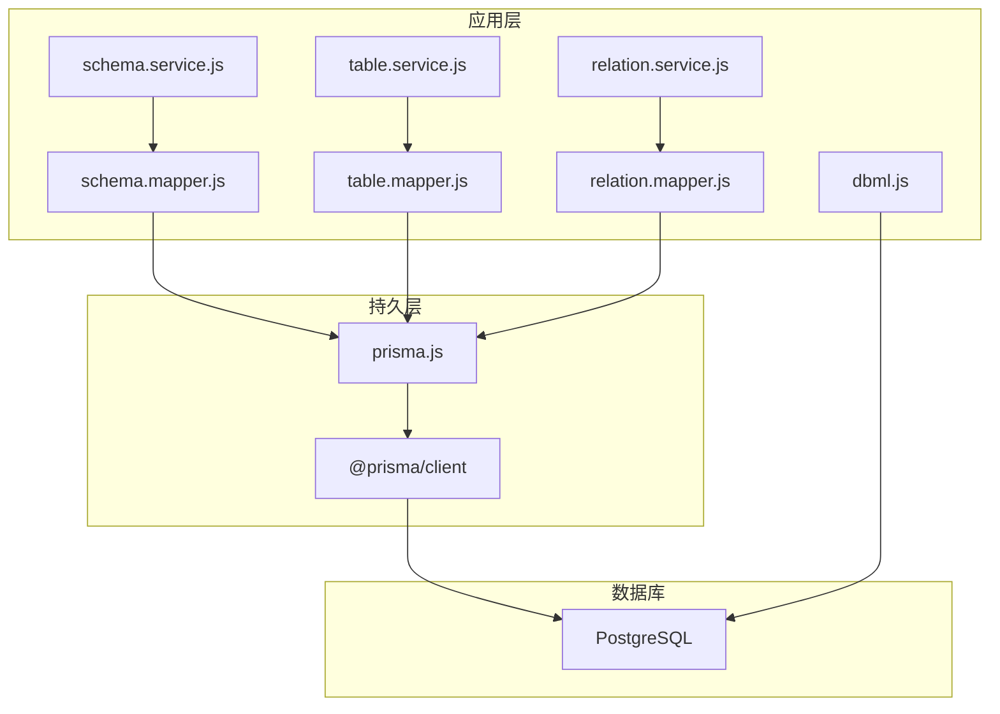
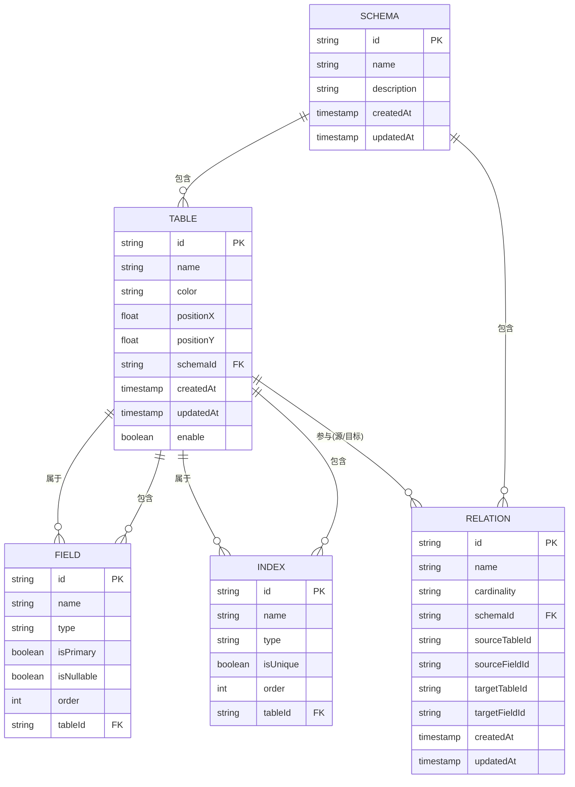
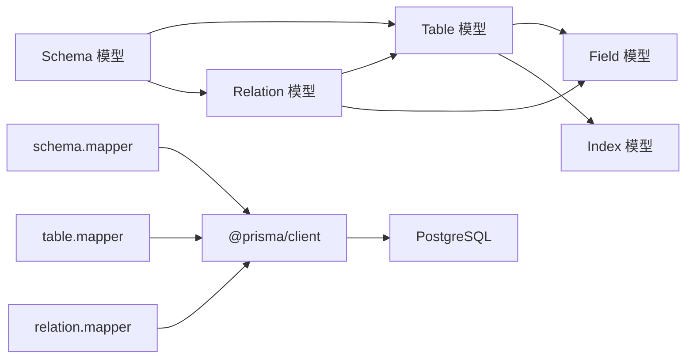
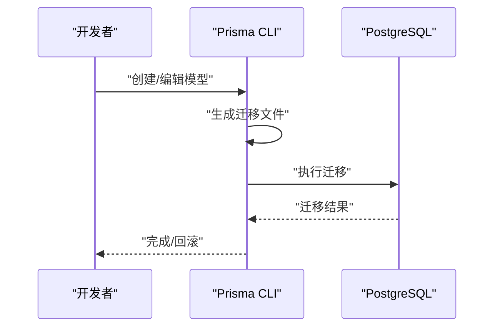

# 数据库设计

<cite>
**本文引用的文件**
- [prisma/schema.prisma](file://prisma/schema.prisma)
- [prisma/migrations/20260403040400_init/migration.sql](file://prisma/migrations/20260403040400_init/migration.sql)
- [prisma/migrations/20260403040547_add_schema_model/migration.sql](file://prisma/migrations/20260403040547_add_schema_model/migration.sql)
- [prisma/migrations/20260409093753_add_table_deleted_at/migration.sql](file://prisma/migrations/20260409093753_add_table_deleted_at/migration.sql)
- [prisma/migrations/20260409093937_replace_deleted_at_with_enable/migration.sql](file://prisma/migrations/20260409093937_replace_deleted_at_with_enable/migration.sql)
- [prisma/migrations/20260410113613_add_relation_model/migration.sql](file://prisma/migrations/20260410113613_add_relation_model/migration.sql)
- [prisma/migrations/migration_lock.toml](file://prisma/migrations/migration_lock.toml)
- [src/lib/prisma.js](file://src/lib/prisma.js)
- [src/generated/prisma/models.ts](file://src/generated/prisma/models.ts)
- [src/features/schema/dbml.js](file://src/features/schema/dbml.js)
- [src/server/services/schema.service.js](file://src/server/services/schema.service.js)
- [src/server/services/table.service.js](file://src/server/services/table.service.js)
- [src/server/services/relation.service.js](file://src/server/services/relation.service.js)
- [src/server/schemas/schema.schema.js](file://src/server/schemas/schema.schema.js)
- [src/server/schemas/table.schema.js](file://src/server/schemas/table.schema.js)
</cite>

## 目录
1. [简介](#简介)
2. [项目结构](#项目结构)
3. [核心组件](#核心组件)
4. [架构总览](#架构总览)
5. [详细组件分析](#详细组件分析)
6. [依赖分析](#依赖分析)
7. [性能考虑](#性能考虑)
8. [故障排查指南](#故障排查指南)
9. [结论](#结论)
10. [附录](#附录)

## 简介
本文件面向数据库管理员与后端开发者，系统性梳理 Vibe DB 的数据库设计与实现，覆盖数据模型（Schema、Table、Field、Index、Relation）、实体关系、字段定义与数据类型、主键/外键约束、索引设计、数据完整性规则、数据库模式图、ER 图、数据字典、数据验证与业务规则、数据生命周期管理、迁移策略与版本管理、备份恢复机制、性能优化与查询技巧等。文中所有技术细节均以仓库中的 Prisma 模型、迁移脚本与服务层代码为依据。

## 项目结构
Vibe DB 使用 Prisma 作为 ORM，数据库为 PostgreSQL。核心结构包括：
- 数据模型定义：位于 prisma/schema.prisma
- 迁移脚本：位于 prisma/migrations 下，按时间顺序命名
- 客户端连接：通过 src/lib/prisma.js 初始化 PrismaClient 并使用 Postgres 适配器
- 代码生成：Prisma 在 src/generated/prisma 下生成类型与客户端
- DBML 导出：src/features/schema/dbml.js 将内存中的 Schema 结构导出为 DBML 文本
- 服务层：src/server/services/* 提供 CRUD 与业务规则校验
- 校验层：src/server/schemas/* 使用 Zod 对输入进行严格校验

图表来源
- [src/lib/prisma.js:1-16](file://src/lib/prisma.js#L1-L16)
- [src/generated/prisma/models.ts:1-16](file://src/generated/prisma/models.ts#L1-L16)
- [src/features/schema/dbml.js:1-115](file://src/features/schema/dbml.js#L1-L115)

章节来源
- [prisma/schema.prisma:1-69](file://prisma/schema.prisma#L1-L69)
- [prisma/migrations/20260403040400_init/migration.sql:1-44](file://prisma/migrations/20260403040400_init/migration.sql#L1-L44)
- [src/lib/prisma.js:1-16](file://src/lib/prisma.js#L1-L16)
- [src/generated/prisma/models.ts:1-16](file://src/generated/prisma/models.ts#L1-L16)
- [src/features/schema/dbml.js:1-115](file://src/features/schema/dbml.js#L1-L115)

## 核心组件
- Schema：数据库模式容器，可包含多个 Table 与 Relation，并记录创建/更新时间。
- Table：表定义，包含名称、颜色、位置坐标、所属 Schema、启用状态以及字段与索引集合。
- Field：字段定义，包含名称、类型、是否主键、是否可空、排序序号及所属 Table。
- Index：索引定义，包含名称、类型（默认 BTREE）、是否唯一、排序序号及所属 Table。
- Relation：关系定义，包含名称、基数（默认 ONE_TO_MANY）、所属 Schema，以及源/目标表与字段 ID。

章节来源
- [prisma/schema.prisma:10-68](file://prisma/schema.prisma#L10-L68)

## 架构总览
下图展示数据库模型之间的关系与约束，映射到实际的 Prisma 模型与迁移脚本。

图表来源
- [prisma/schema.prisma:10-68](file://prisma/schema.prisma#L10-L68)
- [prisma/migrations/20260403040400_init/migration.sql:1-44](file://prisma/migrations/20260403040400_init/migration.sql#L1-L44)
- [prisma/migrations/20260403040547_add_schema_model/migration.sql:1-23](file://prisma/migrations/20260403040547_add_schema_model/migration.sql#L1-L23)
- [prisma/migrations/20260410113613_add_relation_model/migration.sql:1-19](file://prisma/migrations/20260410113613_add_relation_model/migration.sql#L1-L19)

## 详细组件分析

### Schema 模型
- 字段与类型
  - id: 主键，字符串类型，使用 Prisma 指令生成唯一标识。
  - name: 非空字符串，最大长度限制由服务层校验保证。
  - description: 可空字符串，最大长度限制由服务层校验保证。
  - createdAt/updatedAt: 时间戳，自动维护。
- 关系
  - 一对多：Schema 包含多个 Table 与 Relation。
- 约束与完整性
  - 唯一性：name 在业务层面具有唯一性需求（建议在数据库层增加唯一约束以保障）。
  - 完整性：软删除/启用状态不在 Schema 层体现，如需逻辑删除可扩展字段。
- 业务规则
  - 创建时对 name 与 description 进行长度校验；默认 Schema 名称可在未指定时自动生成。

章节来源
- [prisma/schema.prisma:10-18](file://prisma/schema.prisma#L10-L18)
- [src/server/schemas/schema.schema.js:1-7](file://src/server/schemas/schema.schema.js#L1-L7)
- [src/server/services/schema.service.js:1-26](file://src/server/services/schema.service.js#L1-L26)

### Table 模型
- 字段与类型
  - id: 主键，字符串类型。
  - name: 非空字符串，最大长度限制由服务层校验保证。
  - color: 字符串，默认值用于前端渲染。
  - positionX/positionY: 浮点数，默认值用于画布定位。
  - schemaId: 外键，指向 Schema.id，删除行为为级联。
  - createdAt/updatedAt: 时间戳，自动维护。
  - enable: 布尔值，默认启用。
- 关系
  - 多对一：Table 属于 Schema。
  - 一对多：Table 包含多个 Field 与 Index。
- 约束与完整性
  - 主键：id。
  - 外键：schemaId 引用 Schema.id，删除级联。
  - 默认值：color、positionX、positionY、enable。
- 生命周期
  - 启用/禁用：通过 enable 字段控制可见性与可用性。
  - 删除：服务层提供软删除逻辑（见服务层分析）。

章节来源
- [prisma/schema.prisma:20-33](file://prisma/schema.prisma#L20-L33)
- [prisma/migrations/20260403040547_add_schema_model/migration.sql:1-23](file://prisma/migrations/20260403040547_add_schema_model/migration.sql#L1-L23)
- [prisma/migrations/20260409093937_replace_deleted_at_with_enable/migration.sql:1-10](file://prisma/migrations/20260409093937_replace_deleted_at_with_enable/migration.sql#L1-L10)
- [src/server/schemas/table.schema.js:1-41](file://src/server/schemas/table.schema.js#L1-L41)
- [src/server/services/table.service.js:1-38](file://src/server/services/table.service.js#L1-L38)

### Field 模型
- 字段与类型
  - id: 主键，字符串类型。
  - name: 非空字符串，字段名。
  - type: 字符串，字段类型（由上层定义，Prisma 层不强制类型枚举）。
  - isPrimary: 布尔值，是否为主键。
  - isNullable: 布尔值，是否可空。
  - order: 整数，字段排序序号。
  - tableId: 外键，指向 Table.id，删除行为为级联。
- 关系
  - 多对一：Field 属于 Table。
- 约束与完整性
  - 主键：id。
  - 外键：tableId 引用 Table.id，删除级联。
  - 默认值：isPrimary、isNullable、order。
- 业务规则
  - 主键与可空性由 isPrimary 与 isNullable 控制，需与 Index/约束保持一致。

章节来源
- [prisma/schema.prisma:35-44](file://prisma/schema.prisma#L35-L44)
- [prisma/migrations/20260403040400_init/migration.sql:1-44](file://prisma/migrations/20260403040400_init/migration.sql#L1-L44)

### Index 模型
- 字段与类型
  - id: 主键，字符串类型。
  - name: 非空字符串，索引名。
  - type: 字符串，默认 BTREE。
  - isUnique: 布尔值，默认非唯一。
  - order: 整数，索引排序序号。
  - tableId: 外键，指向 Table.id，删除行为为级联。
- 关系
  - 多对一：Index 属于 Table。
- 约束与完整性
  - 主键：id。
  - 外键：tableId 引用 Table.id，删除级联。
  - 默认值：type、isUnique、order。
- 业务规则
  - 唯一性：isUnique 为 true 时应确保对应字段组合的唯一性。

章节来源
- [prisma/schema.prisma:46-54](file://prisma/schema.prisma#L46-L54)
- [prisma/migrations/20260403040400_init/migration.sql:27-43](file://prisma/migrations/20260403040400_init/migration.sql#L27-L43)

### Relation 模型
- 字段与类型
  - id: 主键，字符串类型。
  - name: 非空字符串，关系名。
  - cardinality: 字符串，默认 ONE_TO_MANY。
  - schemaId: 外键，指向 Schema.id，删除行为为级联。
  - sourceTableId/sourceFieldId: 源表与源字段 ID。
  - targetTableId/targetFieldId: 目标表与目标字段 ID。
  - createdAt/updatedAt: 时间戳，自动维护。
- 关系
  - 多对一：Relation 属于 Schema。
  - 与 Table/Field 的关系通过 ID 映射实现。
- 约束与完整性
  - 主键：id。
  - 外键：schemaId 引用 Schema.id，删除级联。
  - 默认值：cardinality。
- 业务规则
  - cardinality 支持 ONE_TO_ONE、ONE_TO_MANY、MANY_TO_MANY（映射至 DBML 运算符）。

章节来源
- [prisma/schema.prisma:56-68](file://prisma/schema.prisma#L56-L68)
- [prisma/migrations/20260410113613_add_relation_model/migration.sql:1-19](file://prisma/migrations/20260410113613_add_relation_model/migration.sql#L1-L19)
- [src/features/schema/dbml.js:10-14](file://src/features/schema/dbml.js#L10-L14)

### 数据字典
- Schema
  - 字段: id, name, description, createdAt, updatedAt
  - 类型: id(String), name(String), description(String?), createdAt(DateTime), updatedAt(DateTime)
  - 约束: PK(id), FK(schemaId in Table), 默认值: 无
- Table
  - 字段: id, name, color, positionX, positionY, schemaId, createdAt, updatedAt, enable
  - 类型: id(String), name(String), color(String), positionX/positionY(Float), schemaId(String), createdAt/updatedAt(DateTime), enable(Boolean)
  - 约束: PK(id), FK(schemaId→Schema.id), 默认值: color, positionX, positionY, enable
- Field
  - 字段: id, name, type, isPrimary, isNullable, order, tableId
  - 类型: id(String), name(String), type(String), isPrimary/nullable(Boolean), order(Int), tableId(String)
  - 约束: PK(id), FK(tableId→Table.id), 默认值: isPrimary, isNullable, order
- Index
  - 字段: id, name, type, isUnique, order, tableId
  - 类型: id(String), name(String), type(String), isUnique(Boolean), order(Int), tableId(String)
  - 约束: PK(id), FK(tableId→Table.id), 默认值: type, isUnique, order
- Relation
  - 字段: id, name, cardinality, schemaId, sourceTableId, sourceFieldId, targetTableId, targetFieldId, createdAt, updatedAt
  - 类型: id(String), name(String), cardinality(String), schemaId(String), source/targetTable/FieldId(String)
  - 约束: PK(id), FK(schemaId→Schema.id), 默认值: cardinality

章节来源
- [prisma/schema.prisma:10-68](file://prisma/schema.prisma#L10-L68)

### 数据验证规则与业务规则
- 输入校验（Zod）
  - Schema：name 非空且长度 ≤ 64；description ≤ 255（可选）。
  - Table：schemaId 非空；name 非空且长度 ≤ 64；color/positionX/positionY 可选。
  - Relation：id 非空（更新时），其余字段按需校验。
- 业务规则
  - 自动去除表名前后空白（trim）。
  - 若未提供 schemaId，则自动创建默认 Schema 并返回其 ID。
  - 删除表采用软删除（enable=false），避免物理删除造成的数据丢失风险。

章节来源
- [src/server/schemas/schema.schema.js:1-7](file://src/server/schemas/schema.schema.js#L1-L7)
- [src/server/schemas/table.schema.js:1-41](file://src/server/schemas/table.schema.js#L1-L41)
- [src/server/services/schema.service.js:17-24](file://src/server/services/schema.service.js#L17-L24)
- [src/server/services/table.service.js:11-36](file://src/server/services/table.service.js#L11-L36)

### 数据生命周期管理
- 创建：通过服务层解析输入并写入数据库。
- 更新：支持部分字段更新，同时维护 createdAt/updatedAt。
- 删除：提供软删除（enable=false），保留历史与审计线索。
- 查询：按 Schema 维度聚合查询，支持批量读取与分页（由 Prisma 客户端能力决定）。

章节来源
- [src/server/services/schema.service.js:1-26](file://src/server/services/schema.service.js#L1-L26)
- [src/server/services/table.service.js:1-38](file://src/server/services/table.service.js#L1-L38)
- [src/server/services/relation.service.js:1-26](file://src/server/services/relation.service.js#L1-L26)

### 数据库迁移策略与版本管理
- 迁移文件组织
  - 每次变更生成独立迁移文件，按时间戳命名，便于追踪与回滚。
  - 迁移锁文件确保并发安全与一致性。
- 迁移内容
  - 初始建模：创建 Table、Field、Index 表并建立外键关系。
  - 新增 Schema 模型：为 Table 增加 schemaId 字段并建立外键。
  - 表生命周期字段演进：从 deletedAt → enable，体现软删除策略调整。
  - 新增 Relation 模型：引入关系定义与外键。
- 版本管理
  - 通过 Git 管理迁移文件，配合迁移锁文件确保团队协作安全。
  - 生产环境执行迁移前需进行预检查与备份。

章节来源
- [prisma/migrations/20260403040400_init/migration.sql:1-44](file://prisma/migrations/20260403040400_init/migration.sql#L1-L44)
- [prisma/migrations/20260403040547_add_schema_model/migration.sql:1-23](file://prisma/migrations/20260403040547_add_schema_model/migration.sql#L1-L23)
- [prisma/migrations/20260409093753_add_table_deleted_at/migration.sql:1-3](file://prisma/migrations/20260409093753_add_table_deleted_at/migration.sql#L1-L3)
- [prisma/migrations/20260409093937_replace_deleted_at_with_enable/migration.sql:1-10](file://prisma/migrations/20260409093937_replace_deleted_at_with_enable/migration.sql#L1-L10)
- [prisma/migrations/20260410113613_add_relation_model/migration.sql:1-19](file://prisma/migrations/20260410113613_add_relation_model/migration.sql#L1-L19)
- [prisma/migrations/migration_lock.toml:1-4](file://prisma/migrations/migration_lock.toml#L1-L4)

### 备份与恢复机制
- 备份策略
  - 定期导出数据库快照（逻辑/物理均可），结合迁移文件进行版本化管理。
  - 对生产库执行备份前，先执行只读迁移与一致性检查。
- 恢复流程
  - 从最近一次完整备份开始恢复，随后按迁移文件顺序回放。
  - 回放过程中验证每一步的完整性与依赖关系。
- 迁移与备份联动
  - 迁移前先备份，迁移后验证数据一致性。

[本节为通用实践建议，无需特定文件引用]

### DBML 与可视化导出
- DBML 生成
  - 将内存中的 tables 与 relations 转换为 PostgreSQL DDL，再导入为标准 DBML。
  - 手动补充关系 Ref 行，映射基数到 DBML 运算符。
- 使用场景
  - 设计评审、文档生成、团队协作与外部工具集成。

章节来源
- [src/features/schema/dbml.js:1-115](file://src/features/schema/dbml.js#L1-L115)

## 依赖分析
- 模型依赖
  - Table 依赖 Schema（外键级联删除）。
  - Field 与 Index 依赖 Table（外键级联删除）。
  - Relation 依赖 Schema（外键级联删除），并通过 ID 关联 Table/Field。
- 应用层依赖
  - 服务层依赖映射层（mapper），映射层依赖 Prisma 客户端。
  - Prisma 客户端通过适配器连接 PostgreSQL。

图表来源
- [prisma/schema.prisma:10-68](file://prisma/schema.prisma#L10-L68)
- [src/lib/prisma.js:1-16](file://src/lib/prisma.js#L1-L16)

章节来源
- [prisma/schema.prisma:10-68](file://prisma/schema.prisma#L10-L68)
- [src/lib/prisma.js:1-16](file://src/lib/prisma.js#L1-L16)

## 性能考虑
- 索引策略
  - 为常用查询条件字段建立合适索引（如 Table.name、Field.tableId、Relation.schemaId）。
  - 唯一性字段优先考虑唯一索引（Index.isUnique=true）。
- 查询优化
  - 使用分页与投影（仅选择必要字段）减少网络与计算开销。
  - 避免 N+1 查询：在服务层合并批量查询或使用 include/@@select 优化。
- 写入优化
  - 批量插入/更新，减少事务次数。
  - 合理使用软删除（enable 字段）替代物理删除，降低维护成本。
- 存储与归档
  - 对历史数据进行定期归档，清理过期数据以维持查询性能。

[本节提供通用指导，无需特定文件引用]

## 故障排查指南
- 常见错误与定位
  - 外键约束失败：检查 Relation 的 source/target 表/字段 ID 是否存在且有效。
  - 字段类型不匹配：确认 Field.type 与下游使用约定一致。
  - 输入校验失败：根据服务层抛出的错误信息修正请求体字段。
- 排查步骤
  - 查看迁移日志与迁移锁文件，确认迁移状态。
  - 使用 Prisma 客户端执行最小化查询定位问题。
  - 对比 DBML 与实际表结构，确认关系映射正确。

章节来源
- [prisma/migrations/migration_lock.toml:1-4](file://prisma/migrations/migration_lock.toml#L1-L4)
- [src/server/services/schema.service.js:1-26](file://src/server/services/schema.service.js#L1-L26)
- [src/server/services/table.service.js:1-38](file://src/server/services/table.service.js#L1-L38)
- [src/server/services/relation.service.js:1-26](file://src/server/services/relation.service.js#L1-L26)

## 结论
Vibe DB 的数据库设计围绕 Schema-Table-Field-Index-Relation 的层次化模型展开，通过 Prisma 实现强类型的 ORM 访问，并以迁移文件与 DBML 工具链支撑设计与演进。服务层与校验层共同保障数据完整性与业务规则落地。建议在后续迭代中完善唯一性约束、细化索引策略与监控指标，持续提升系统的稳定性与可维护性。

## 附录

### 迁移流程时序图（概念示意）

[本图为概念示意，无需图表来源]