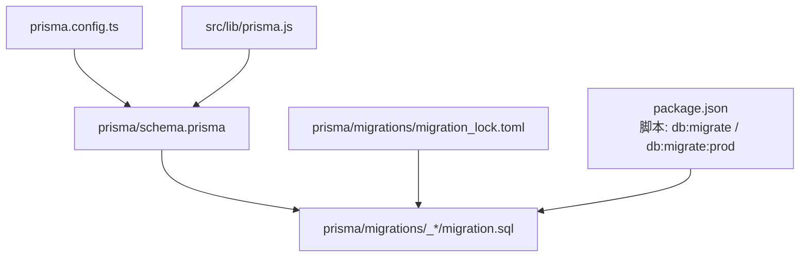
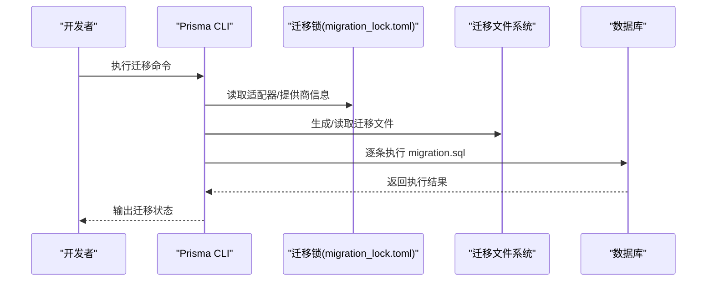
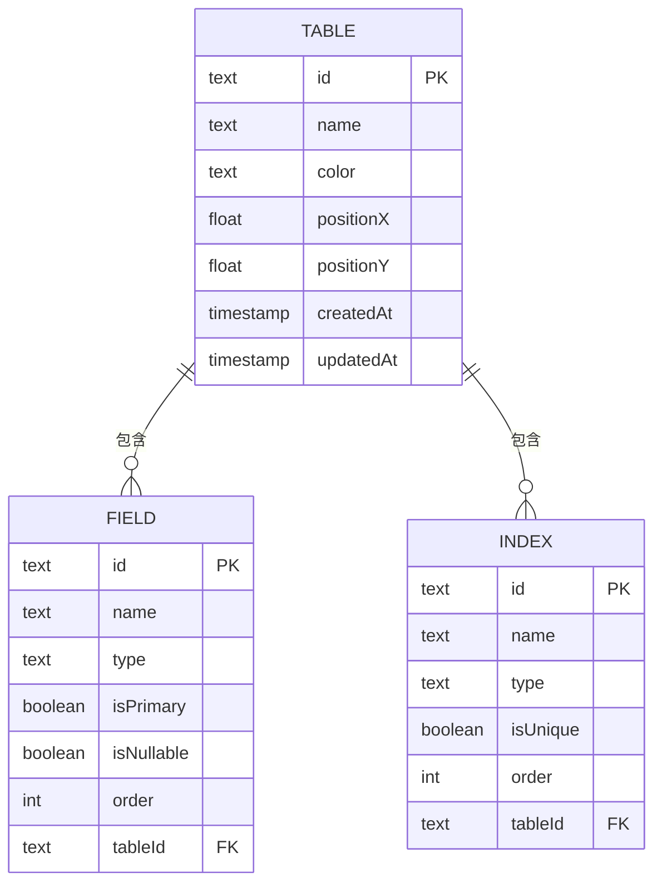
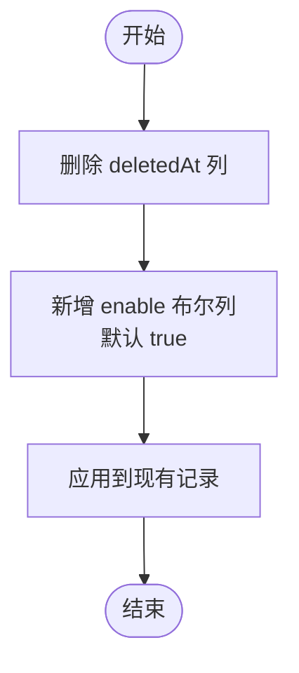
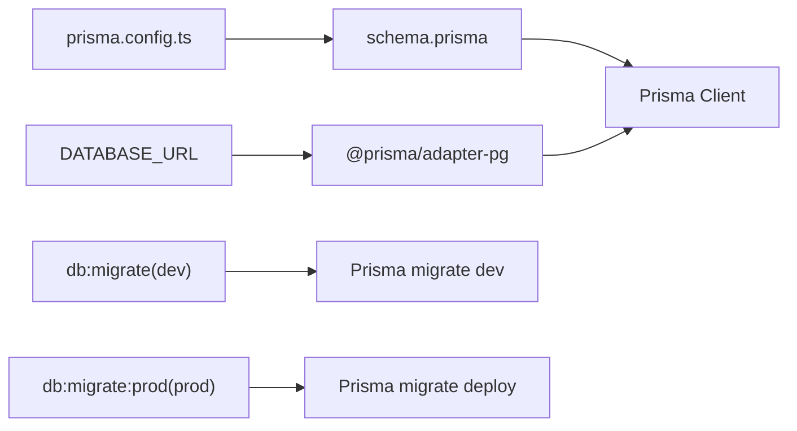

# 数据库迁移

<cite>
**本文引用的文件**
- [prisma/schema.prisma](file://prisma/schema.prisma)
- [prisma/migrations/20260403040400_init/migration.sql](file://prisma/migrations/20260403040400_init/migration.sql)
- [prisma/migrations/20260403040547_add_schema_model/migration.sql](file://prisma/migrations/20260403040547_add_schema_model/migration.sql)
- [prisma/migrations/20260409093753_add_table_deleted_at/migration.sql](file://prisma/migrations/20260409093753_add_table_deleted_at/migration.sql)
- [prisma/migrations/20260409093937_replace_deleted_at_with_enable/migration.sql](file://prisma/migrations/20260409093937_replace_deleted_at_with_enable/migration.sql)
- [prisma/migrations/20260410113613_add_relation_model/migration.sql](file://prisma/migrations/20260410113613_add_relation_model/migration.sql)
- [prisma/migrations/migration_lock.toml](file://prisma/migrations/migration_lock.toml)
- [package.json](file://package.json)
- [prisma.config.ts](file://prisma.config.ts)
- [src/lib/prisma.js](file://src/lib/prisma.js)
- [src/server/mappers/table.mapper.js](file://src/server/mappers/table.mapper.js)
- [src/server/mappers/relation.mapper.js](file://src/server/mappers/relation.mapper.js)
- [src/server/mappers/schema.mapper.js](file://src/server/mappers/schema.mapper.js)
- [src/lib/config.js](file://src/lib/config.js)
</cite>

## 目录
1. [简介](#简介)
2. [项目结构](#项目结构)
3. [核心组件](#核心组件)
4. [架构总览](#架构总览)
5. [详细组件分析](#详细组件分析)
6. [依赖分析](#依赖分析)
7. [性能考虑](#性能考虑)
8. [故障排除指南](#故障排除指南)
9. [结论](#结论)
10. [附录](#附录)

## 简介
本文件系统性梳理 Vibe DB 的数据库迁移体系，覆盖迁移文件结构与命名规范、执行顺序、各步迁移的目的与影响范围，并结合现有迁移脚本解析“初始化迁移”“模型添加迁移”“字段更新迁移”的实现方式。同时阐述迁移锁定机制、版本控制策略、回滚方案与最佳实践，以及生产环境迁移与自动化部署建议。

## 项目结构
- 迁移目录采用 Prisma 官方约定的按时间戳命名的迁移子目录，每个迁移包含一个 migration.sql 文件，记录该步的数据库变更。
- 迁移锁文件用于防止并发迁移冲突。
- 通过 package.json 中的脚本分别驱动开发与生产环境的迁移流程。
- Prisma 配置文件指向 schema.prisma 并从环境变量读取数据库连接字符串。

**图示来源**
- [prisma/schema.prisma:1-69](file://prisma/schema.prisma#L1-L69)
- [prisma/migrations/20260403040400_init/migration.sql:1-44](file://prisma/migrations/20260403040400_init/migration.sql#L1-L44)
- [prisma/migrations/migration_lock.toml:1-4](file://prisma/migrations/migration_lock.toml#L1-L4)
- [package.json:5-14](file://package.json#L5-L14)
- [prisma.config.ts:1-11](file://prisma.config.ts#L1-L11)
- [src/lib/prisma.js:1-16](file://src/lib/prisma.js#L1-L16)

**章节来源**
- [prisma/schema.prisma:1-69](file://prisma/schema.prisma#L1-L69)
- [prisma/migrations/20260403040400_init/migration.sql:1-44](file://prisma/migrations/20260403040400_init/migration.sql#L1-L44)
- [prisma/migrations/migration_lock.toml:1-4](file://prisma/migrations/migration_lock.toml#L1-L4)
- [package.json:5-14](file://package.json#L5-L14)
- [prisma.config.ts:1-11](file://prisma.config.ts#L1-L11)
- [src/lib/prisma.js:1-16](file://src/lib/prisma.js#L1-L16)

## 核心组件
- 迁移文件与命名规范
  - 每个迁移以时间戳前缀命名的目录表示，如 20260403040400_init，确保自然排序即执行顺序。
  - 目录内包含 migration.sql，记录该步的数据库变更。
- 迁移锁
  - migration_lock.toml 记录当前迁移使用的 provider，避免跨不同适配器的误用。
- 迁移脚本
  - 开发环境：使用 prisma migrate dev，自动检测 schema 变更并生成迁移。
  - 生产环境：使用 prisma migrate deploy，直接应用已审阅的迁移，不生成新迁移。
- Prisma 客户端与适配器
  - 使用 @prisma/adapter-pg 与 PrismaClient，连接 DATABASE_URL 指定的数据库。

**章节来源**
- [prisma/migrations/20260403040400_init/migration.sql:1-44](file://prisma/migrations/20260403040400_init/migration.sql#L1-L44)
- [prisma/migrations/migration_lock.toml:1-4](file://prisma/migrations/migration_lock.toml#L1-L4)
- [package.json:10-14](file://package.json#L10-L14)
- [src/lib/prisma.js:1-16](file://src/lib/prisma.js#L1-L16)

## 架构总览
下图展示迁移生命周期：从 schema.prisma 的变更到迁移生成与执行，再到应用层通过 Prisma 客户端访问数据库。

**图示来源**
- [prisma/migrations/migration_lock.toml:1-4](file://prisma/migrations/migration_lock.toml#L1-L4)
- [prisma/migrations/20260403040400_init/migration.sql:1-44](file://prisma/migrations/20260403040400_init/migration.sql#L1-L44)
- [package.json:10-14](file://package.json#L10-L14)

## 详细组件分析

### 迁移文件结构与命名规范
- 命名规则
  - 采用时间戳前缀的目录名，保证按时间顺序执行。
  - 目录内仅包含 migration.sql，记录该步的数据库变更。
- 结构要点
  - 注释中包含“警告”或“说明”，提示可能的数据丢失或约束变更风险。
  - 显式使用双引号包裹标识符，避免关键字冲突。
  - 外键约束在被引用表创建后再添加，确保引用完整性。

**章节来源**
- [prisma/migrations/20260403040547_add_schema_model/migration.sql:1-23](file://prisma/migrations/20260403040547_add_schema_model/migration.sql#L1-L23)
- [prisma/migrations/20260409093753_add_table_deleted_at/migration.sql:1-3](file://prisma/migrations/20260409093753_add_table_deleted_at/migration.sql#L1-L3)
- [prisma/migrations/20260409093937_replace_deleted_at_with_enable/migration.sql:1-10](file://prisma/migrations/20260409093937_replace_deleted_at_with_enable/migration.sql#L1-L10)
- [prisma/migrations/20260410113613_add_relation_model/migration.sql:1-19](file://prisma/migrations/20260410113613_add_relation_model/migration.sql#L1-L19)

### 初始化迁移（20260403040400_init）
- 目的
  - 建立初始表结构：Table、Field、Index。
  - 建立外键关系，使 Field 与 Index 均关联至 Table。
- 变更内容
  - 创建三张表并定义主键。
  - 添加外键约束，删除级联更新/删除。
- 影响范围
  - 作为后续迁移的基础，所有依赖 Table 的迁移必须在其后执行。
  - 外键约束确保数据一致性。

**图示来源**
- [prisma/migrations/20260403040400_init/migration.sql:1-44](file://prisma/migrations/20260403040400_init/migration.sql#L1-L44)

**章节来源**
- [prisma/migrations/20260403040400_init/migration.sql:1-44](file://prisma/migrations/20260403040400_init/migration.sql#L1-L44)

### 模型添加迁移（20260403040547_add_schema_model）
- 目的
  - 引入 Schema 概念，为 Table 增加 schemaId 外键，支持多模式组织。
- 变更内容
  - 为 Table 增加 schemaId 字段。
  - 新建 Schema 表。
  - 为 Table.schemaId 添加外键约束。
- 影响范围
  - 需要为既有 Table 数据填充 schemaId 或进行数据迁移。
  - 外键约束确保 Schema 与 Table 的强关联。

**章节来源**
- [prisma/migrations/20260403040547_add_schema_model/migration.sql:1-23](file://prisma/migrations/20260403040547_add_schema_model/migration.sql#L1-L23)

### 字段更新迁移（20260409093753_add_table_deleted_at）
- 目的
  - 支持软删除，为 Table 增加 deletedAt 字段。
- 变更内容
  - 在 Table 上新增 deletedAt 时间戳列。
- 影响范围
  - 应用层查询需过滤 deletedAt 为空的记录。
  - 与后续启用 enable 字段的迁移互斥。

**章节来源**
- [prisma/migrations/20260409093753_add_table_deleted_at/migration.sql:1-3](file://prisma/migrations/20260409093753_add_table_deleted_at/migration.sql#L1-L3)

### 字段更新迁移（20260409093937_replace_deleted_at_with_enable）
- 目的
  - 用 enable 字段替代 deletedAt，统一布尔开关语义。
- 变更内容
  - 删除 deletedAt 列。
  - 新增 enable 布尔列，默认值为 true。
- 影响范围
  - 原有软删除逻辑需迁移到 enable 字段。
  - 应用层查询条件需从 deletedAt 迁移至 enable。

**图示来源**
- [prisma/migrations/20260409093937_replace_deleted_at_with_enable/migration.sql:1-10](file://prisma/migrations/20260409093937_replace_deleted_at_with_enable/migration.sql#L1-L10)

**章节来源**
- [prisma/migrations/20260409093937_replace_deleted_at_with_enable/migration.sql:1-10](file://prisma/migrations/20260409093937_replace_deleted_at_with_enable/migration.sql#L1-L10)

### 关系模型迁移（20260410113613_add_relation_model）
- 目的
  - 引入 Relation 模型，支持表间关系建模。
- 变更内容
  - 创建 Relation 表，包含源/目标表与字段 ID、关系基数等。
  - 为 Relation.schemaId 添加外键约束。
- 影响范围
  - 需要与 Schema、Table、Field 的 ID 对齐。
  - 应用层通过 Relation 查询表间关系。

**章节来源**
- [prisma/migrations/20260410113613_add_relation_model/migration.sql:1-19](file://prisma/migrations/20260410113613_add_relation_model/migration.sql#L1-L19)

### 迁移执行顺序与依赖
- 顺序依据
  - 按目录名时间戳升序执行，先 init，再 add_schema_model，随后是字段更新与关系模型。
- 依赖关系
  - 后续迁移均依赖 Table 已存在；Relation 迁移依赖 Schema 与 Table。
- 外键顺序
  - 先创建被引用表，再添加外键约束，确保引用完整性。

**章节来源**
- [prisma/migrations/20260403040400_init/migration.sql:1-44](file://prisma/migrations/20260403040400_init/migration.sql#L1-L44)
- [prisma/migrations/20260403040547_add_schema_model/migration.sql:1-23](file://prisma/migrations/20260403040547_add_schema_model/migration.sql#L1-L23)
- [prisma/migrations/20260410113613_add_relation_model/migration.sql:1-19](file://prisma/migrations/20260410113613_add_relation_model/migration.sql#L1-L19)

### 迁移锁定机制与版本控制
- 锁定机制
  - migration_lock.toml 记录 provider 信息，防止跨适配器误用。
- 版本控制
  - 迁移目录与文件纳入版本控制，确保团队一致。
  - 生产环境使用 migrate deploy，避免自动生成迁移。
- 并发控制
  - 通过锁文件与 CI/CD 流水线串行化迁移，避免并发冲突。

**章节来源**
- [prisma/migrations/migration_lock.toml:1-4](file://prisma/migrations/migration_lock.toml#L1-L4)
- [package.json:13-14](file://package.json#L13-L14)

### 回滚方案
- 原则
  - 生产环境优先采用“向前修复”的思路，新增幂等迁移以修正错误状态。
- 可逆操作
  - 对于可逆的 DDL（如新增列），可在新迁移中回退。
  - 对于不可逆操作（如删除列），需通过数据迁移与新列配合实现。
- 审计与备份
  - 迁移前后进行快照备份，保留回滚所需的数据与结构。

[本节为通用策略说明，无需特定文件引用]

### 实际应用中的数据访问映射
- 表模型映射
  - 通过 table.mapper 在创建表时默认注入 id 字段与唯一索引，并按 enable 过滤可见表。
- 关系模型映射
  - relation.mapper 提供基于 schemaId 的查询、创建、更新与删除能力。
- Schema 模型映射
  - schema.mapper 提供 Schema 的查询与创建接口。

**章节来源**
- [src/server/mappers/table.mapper.js:1-47](file://src/server/mappers/table.mapper.js#L1-L47)
- [src/server/mappers/relation.mapper.js:1-27](file://src/server/mappers/relation.mapper.js#L1-L27)
- [src/server/mappers/schema.mapper.js:1-34](file://src/server/mappers/schema.mapper.js#L1-L34)

## 依赖分析
- 迁移对 Prisma 的依赖
  - schema.prisma 定义数据模型，Prisma Client 用于运行时访问。
  - prisma.config.ts 指定 schema 位置与 datasource.url。
- 运行时客户端
  - src/lib/prisma.js 使用 @prisma/adapter-pg 连接 DATABASE_URL。
- 脚本依赖
  - package.json 中的 db:migrate 与 db:migrate:prod 分别对应开发与生产迁移流程。

**图示来源**
- [prisma/schema.prisma:1-69](file://prisma/schema.prisma#L1-L69)
- [prisma.config.ts:1-11](file://prisma.config.ts#L1-L11)
- [src/lib/prisma.js:1-16](file://src/lib/prisma.js#L1-L16)
- [package.json:10-14](file://package.json#L10-L14)

**章节来源**
- [prisma/schema.prisma:1-69](file://prisma/schema.prisma#L1-L69)
- [prisma.config.ts:1-11](file://prisma.config.ts#L1-L11)
- [src/lib/prisma.js:1-16](file://src/lib/prisma.js#L1-L16)
- [package.json:10-14](file://package.json#L10-L14)

## 性能考虑
- 迁移性能
  - 避免在大表上执行高成本 DDL（如重建索引）。
  - 将长耗时迁移拆分为多个小步迁移，降低锁持有时间。
- 查询性能
  - 通过 indexes 与字段顺序优化查询路径。
  - 使用 enable 字段替代软删除，减少过滤开销。
- 连接与适配器
  - 使用连接池与合适的超时设置，避免迁移过程中的阻塞。

[本节提供通用指导，无需特定文件引用]

## 故障排除指南
- 常见问题
  - 迁移失败：检查 migration.sql 是否符合数据库语法，确认外键顺序与依赖。
  - 并发冲突：检查 migration_lock.toml 是否被正确提交，确保流水线串行执行。
  - 连接失败：核对 DATABASE_URL 与网络连通性，确认环境变量加载顺序。
- 排查步骤
  - 在本地复现：使用 db:migrate 执行到失败点，定位具体 SQL。
  - 数据一致性：核对外键约束与索引是否按预期创建。
  - 回滚策略：对可逆操作进行幂等修复，对不可逆操作准备数据迁移。
- 监控与日志
  - 记录迁移开始/结束时间与结果，便于审计与回溯。

**章节来源**
- [prisma/migrations/migration_lock.toml:1-4](file://prisma/migrations/migration_lock.toml#L1-L4)
- [src/lib/config.js:15-30](file://src/lib/config.js#L15-L30)

## 结论
本项目采用 Prisma 迁移体系，通过时间戳命名的迁移目录与明确的执行顺序，确保数据库演进的可控性与可追溯性。结合迁移锁、版本控制与生产专用的 deploy 流程，形成从开发到生产的完整迁移闭环。建议在生产环境坚持“不可逆即修复”的原则，配合幂等迁移与数据迁移策略，保障稳定性与安全性。

## 附录

### 迁移最佳实践
- 命名与组织
  - 使用时间戳前缀，保持目录整洁，每步只做最小必要变更。
- 安全操作
  - 对大表 DDL 进行分批与灰度，预留回滚路径。
  - 在迁移注释中标注潜在风险与数据损失。
- 版本与协作
  - 迁移文件纳入版本控制，多人协作时避免并行修改同一迁移。
- 生产策略
  - 使用 migrate deploy，禁止在生产自动生成迁移。
  - 在 CI/CD 中串行化迁移，确保单实例执行。

[本节为通用实践总结，无需特定文件引用]

### 生产环境迁移注意事项
- 连接与权限
  - 使用只读账号进行预检查，使用写账号执行迁移。
- 时间窗口
  - 选择业务低峰期执行，缩短锁持有时间。
- 回滚预案
  - 准备幂等修复迁移与数据回滚脚本，演练恢复流程。
- 监控告警
  - 监听迁移失败事件，及时通知与处置。

[本节为通用策略说明，无需特定文件引用]