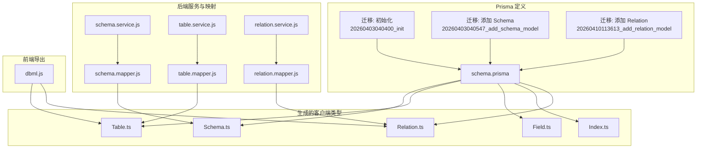
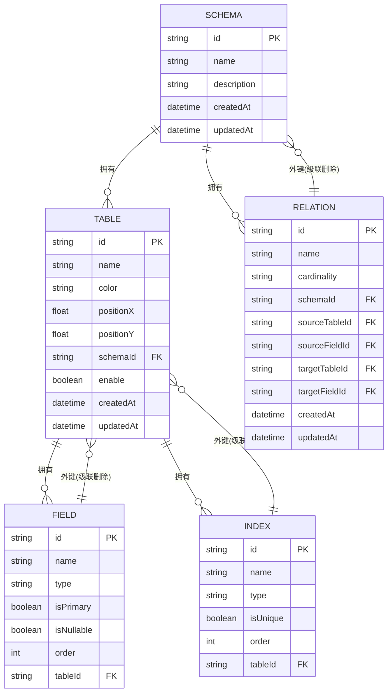
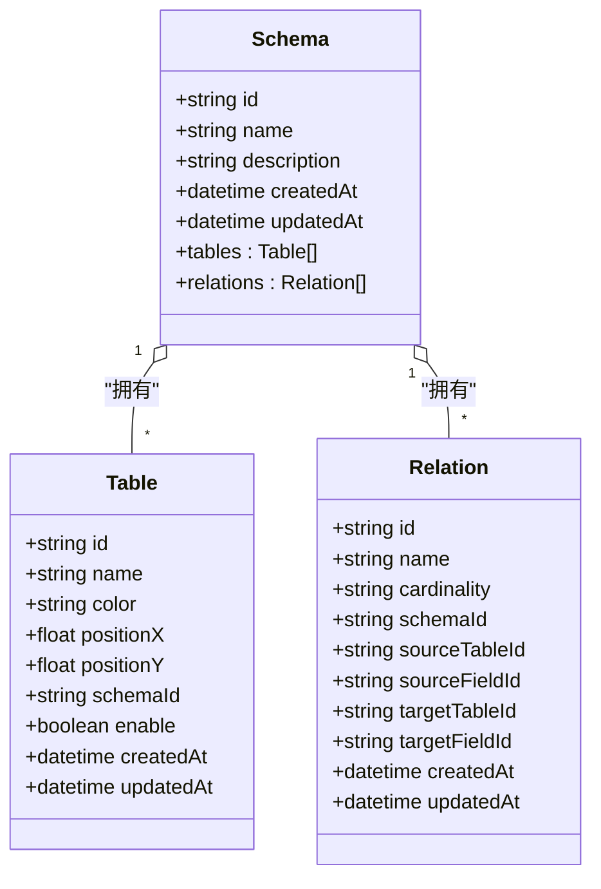
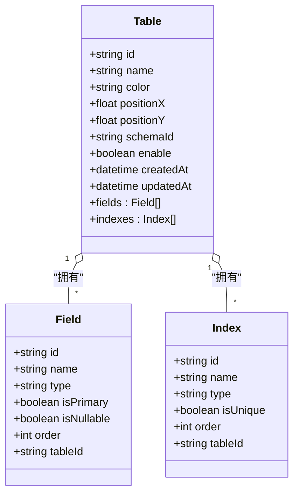
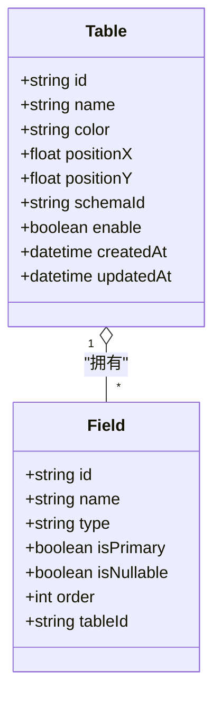
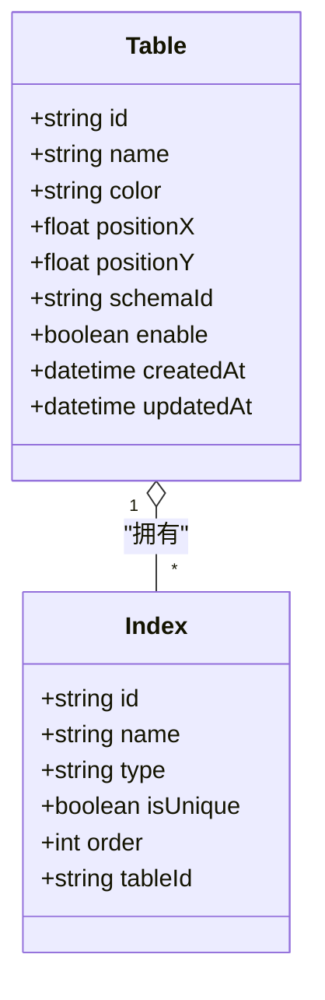
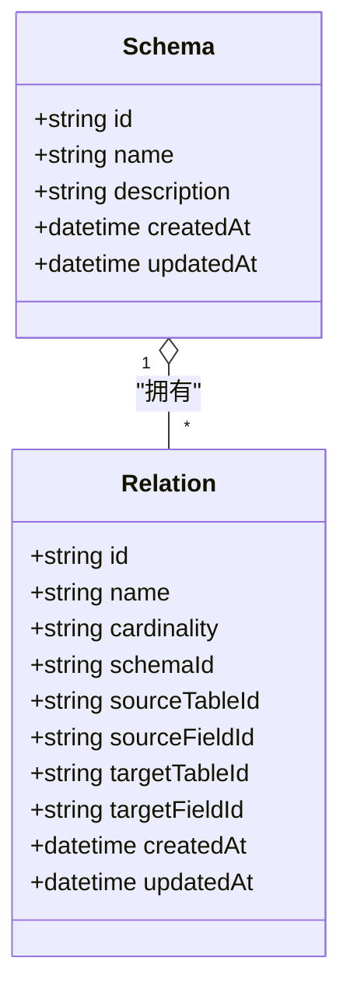
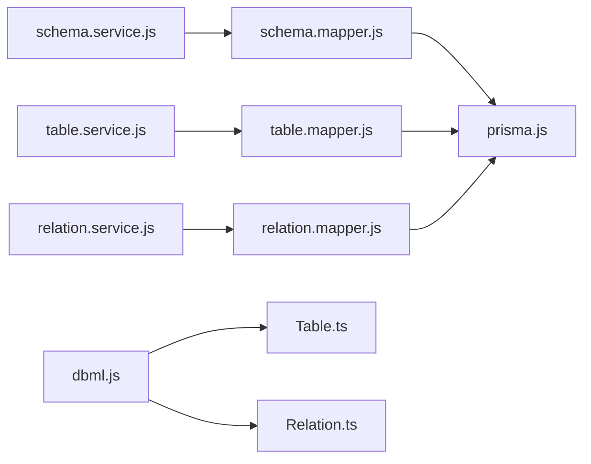

# 数据模型定义

<cite>
**本文档引用的文件**
- [schema.prisma](file://prisma/schema.prisma)
- [migration.sql (初始化)](file://prisma/migrations/20260403040400_init/migration.sql)
- [migration.sql (添加 Schema 模型)](file://prisma/migrations/20260403040547_add_schema_model/migration.sql)
- [migration.sql (添加 Relation 模型)](file://prisma/migrations/20260410113613_add_relation_model/migration.sql)
- [Schema.ts](file://src/generated/prisma/models/Schema.ts)
- [Table.ts](file://src/generated/prisma/models/Table.ts)
- [Field.ts](file://src/generated/prisma/models/Field.ts)
- [Index.ts](file://src/generated/prisma/models/Index.ts)
- [Relation.ts](file://src/generated/prisma/models/Relation.ts)
- [prisma.js](file://src/lib/prisma.js)
- [schema.service.js](file://src/server/services/schema.service.js)
- [table.service.js](file://src/server/services/table.service.js)
- [relation.service.js](file://src/server/services/relation.service.js)
- [schema.mapper.js](file://src/server/mappers/schema.mapper.js)
- [table.mapper.js](file://src/server/mappers/table.mapper.js)
- [relation.mapper.js](file://src/server/mappers/relation.mapper.js)
- [dbml.js](file://src/features/schema/dbml.js)
</cite>

## 目录
1. [简介](#简介)
2. [项目结构](#项目结构)
3. [核心组件](#核心组件)
4. [架构总览](#架构总览)
5. [详细组件分析](#详细组件分析)
6. [依赖分析](#依赖分析)
7. [性能考虑](#性能考虑)
8. [故障排除指南](#故障排除指南)
9. [结论](#结论)
10. [附录](#附录)

## 简介
本文件系统性梳理 Vibe DB 的数据模型定义，覆盖 Schema（模式）、Table（表）、Field（字段）、Index（索引）、Relation（关系）五大核心实体。文档从字段定义、数据类型与约束、主键/外键关系与级联策略、业务含义与使用场景、到 TypeScript 类型与 Prisma 模型语法进行逐项说明，并通过图表展示模型间关系，帮助开发者快速理解与正确使用数据结构。

## 项目结构
Vibe DB 的数据模型由 Prisma Schema 定义与迁移脚本共同构成，配合服务层与映射层实现对数据库的读写操作；前端通过 DBML 导出工具将内存中的表结构转换为可读的 DBML 文本。

**图表来源**
- [schema.prisma:1-69](file://prisma/schema.prisma#L1-L69)
- [migration.sql (初始化):1-44](file://prisma/migrations/20260403040400_init/migration.sql#L1-L44)
- [migration.sql (添加 Schema 模型):1-23](file://prisma/migrations/20260403040547_add_schema_model/migration.sql#L1-L23)
- [migration.sql (添加 Relation 模型):1-19](file://prisma/migrations/20260410113613_add_relation_model/migration.sql#L1-L19)
- [Schema.ts:1-800](file://src/generated/prisma/models/Schema.ts#L1-L800)
- [Table.ts:1-800](file://src/generated/prisma/models/Table.ts#L1-L800)
- [Field.ts:1-800](file://src/generated/prisma/models/Field.ts#L1-L800)
- [Index.ts:1-800](file://src/generated/prisma/models/Index.ts#L1-L800)
- [Relation.ts:1-800](file://src/generated/prisma/models/Relation.ts#L1-L800)
- [schema.service.js:1-26](file://src/server/services/schema.service.js#L1-L26)
- [table.service.js:1-38](file://src/server/services/table.service.js#L1-L38)
- [relation.service.js:1-26](file://src/server/services/relation.service.js#L1-L26)
- [schema.mapper.js:1-35](file://src/server/mappers/schema.mapper.js#L1-L35)
- [table.mapper.js:1-110](file://src/server/mappers/table.mapper.js#L1-L110)
- [relation.mapper.js:1-28](file://src/server/mappers/relation.mapper.js#L1-L28)
- [dbml.js:1-115](file://src/features/schema/dbml.js#L1-L115)

**章节来源**
- [schema.prisma:1-69](file://prisma/schema.prisma#L1-L69)
- [prisma.js:1-16](file://src/lib/prisma.js#L1-L16)

## 核心组件
本节概述五个数据模型的职责边界与关键字段。

- Schema（模式）
  - 作用：组织与分组 Table、Relation，支持多模式并存。
  - 关键字段：id、name、description、createdAt、updatedAt。
  - 关系：一对多拥有 Table、Relation。
- Table（表）
  - 作用：数据库表的抽象，承载 Field 与 Index。
  - 关键字段：id、name、color、positionX、positionY、schemaId、enable、createdAt、updatedAt。
  - 关系：属于一个 Schema；一对多拥有 Field、Index。
  - 约束：enable 控制软删除；默认启用。
- Field（字段）
  - 作用：表的列定义，支持主键、可空等属性。
  - 关键字段：id、name、type、isPrimary、isNullable、order、tableId。
  - 关系：属于一个 Table。
- Index（索引）
  - 作用：表上的索引定义，支持唯一性与排序。
  - 关键字段：id、name、type、isUnique、order、tableId。
  - 关系：属于一个 Table。
- Relation（关系）
  - 作用：表之间的关系，描述源表/字段与目标表/字段及基数。
  - 关键字段：id、name、cardinality、schemaId、sourceTableId、sourceFieldId、targetTableId、targetFieldId、createdAt、updatedAt。
  - 关系：属于一个 Schema。

**章节来源**
- [schema.prisma:10-68](file://prisma/schema.prisma#L10-L68)
- [Table.ts:19-797](file://src/generated/prisma/models/Table.ts#L19-L797)
- [Field.ts:15-549](file://src/generated/prisma/models/Field.ts#L15-L549)
- [Index.ts:15-512](file://src/generated/prisma/models/Index.ts#L15-L512)
- [Relation.ts:15-584](file://src/generated/prisma/models/Relation.ts#L15-L584)

## 架构总览
下图展示模型间的依赖与关系，包括主键、外键与级联策略。

**图表来源**
- [schema.prisma:10-68](file://prisma/schema.prisma#L10-L68)
- [migration.sql (初始化):1-44](file://prisma/migrations/20260403040400_init/migration.sql#L1-L44)
- [migration.sql (添加 Schema 模型):1-23](file://prisma/migrations/20260403040547_add_schema_model/migration.sql#L1-L23)
- [migration.sql (添加 Relation 模型):1-19](file://prisma/migrations/20260410113613_add_relation_model/migration.sql#L1-L19)

## 详细组件分析

### Schema（模式）
- 字段定义与约束
  - id：主键，字符串，自动生成。
  - name：非空字符串，作为模式名称。
  - description：可空字符串，描述信息。
  - createdAt/updatedAt：时间戳，默认值与自动更新。
- 关系
  - 一对多：Schema → Table、Schema → Relation。
- 业务含义
  - 用于隔离不同业务域或环境下的数据库结构，便于权限与版本管理。
- 使用场景
  - 多租户隔离、开发/测试/生产环境区分、团队协作时的模式划分。
- TypeScript 类型要点
  - 支持聚合查询、分组统计、选择器与包含关系。
- Prisma 模型语法要点
  - 使用 @id、@default、@updatedAt 等修饰符。
- 默认值与验证
  - Prisma 层默认值在 schema.prisma 中定义；服务层可进一步校验输入。
- 实际示例
  - 创建时可传入 name、description；查询时可按 _count.tables 计数。
- 关系图

**图表来源**
- [schema.prisma:10-68](file://prisma/schema.prisma#L10-L68)
- [Schema.ts:1-800](file://src/generated/prisma/models/Schema.ts#L1-L800)
- [Table.ts:1-800](file://src/generated/prisma/models/Table.ts#L1-L800)
- [Relation.ts:1-800](file://src/generated/prisma/models/Relation.ts#L1-L800)

**章节来源**
- [schema.prisma:10-18](file://prisma/schema.prisma#L10-L18)
- [Schema.ts:1-800](file://src/generated/prisma/models/Schema.ts#L1-L800)
- [schema.mapper.js:1-35](file://src/server/mappers/schema.mapper.js#L1-L35)
- [schema.service.js:1-26](file://src/server/services/schema.service.js#L1-L26)

### Table（表）
- 字段定义与约束
  - id：主键，字符串。
  - name：非空字符串，表名。
  - color：默认值 "#2b80ff"，用于可视化。
  - positionX/positionY：默认 0，用于画布定位。
  - schemaId：外键，指向 Schema。
  - enable：布尔默认 true，软删除控制。
  - createdAt/updatedAt：时间戳。
- 关系
  - 属于 Schema；一对多拥有 Field、Index。
- 业务含义
  - 抽象数据库中的表，承载字段与索引元数据。
- 使用场景
  - 可视化建模、DBML 导出、字段与索引管理。
- TypeScript 类型要点
  - 支持聚合、分组、选择器与包含关系。
- Prisma 模型语法要点
  - @id、@default、@updatedAt、@relation(onDelete=Cascade)。
- 默认值与验证
  - Prisma 层默认值；服务层在创建时会注入默认 id 字段与唯一索引。
- 实际示例
  - 创建表时自动创建 id 字段与唯一索引。
- 关系图

**图表来源**
- [schema.prisma:20-33](file://prisma/schema.prisma#L20-L33)
- [Table.ts:1-800](file://src/generated/prisma/models/Table.ts#L1-L800)
- [Field.ts:1-800](file://src/generated/prisma/models/Field.ts#L1-L800)
- [Index.ts:1-800](file://src/generated/prisma/models/Index.ts#L1-L800)

**章节来源**
- [schema.prisma:20-33](file://prisma/schema.prisma#L20-L33)
- [Table.ts:1-800](file://src/generated/prisma/models/Table.ts#L1-L800)
- [table.mapper.js:1-110](file://src/server/mappers/table.mapper.js#L1-L110)
- [table.service.js:1-38](file://src/server/services/table.service.js#L1-L38)

### Field（字段）
- 字段定义与约束
  - id：主键，字符串。
  - name：非空字符串，字段名。
  - type：非空字符串，字段类型。
  - isPrimary：布尔，默认 false。
  - isNullable：布尔，默认 true。
  - order：整数，默认 0，用于排序。
  - tableId：外键，指向 Table。
- 关系
  - 属于 Table。
- 业务含义
  - 描述表的列，支持主键、可空、顺序等属性。
- 使用场景
  - 字段增删改、主键识别、导入导出。
- TypeScript 类型要点
  - 支持聚合、分组、选择器与包含关系。
- Prisma 模型语法要点
  - @id、@default、@relation(onDelete=Cascade)。
- 默认值与验证
  - Prisma 层默认值；服务层在批量更新时全量替换。
- 实际示例
  - 主键 isPrimary=true 且 isNullable=false。
- 关系图

**图表来源**
- [schema.prisma:35-44](file://prisma/schema.prisma#L35-L44)
- [Field.ts:1-800](file://src/generated/prisma/models/Field.ts#L1-L800)
- [Table.ts:1-800](file://src/generated/prisma/models/Table.ts#L1-L800)

**章节来源**
- [schema.prisma:35-44](file://prisma/schema.prisma#L35-L44)
- [Field.ts:1-800](file://src/generated/prisma/models/Field.ts#L1-L800)
- [table.mapper.js:49-101](file://src/server/mappers/table.mapper.js#L49-L101)

### Index（索引）
- 字段定义与约束
  - id：主键，字符串。
  - name：非空字符串，索引名。
  - type：字符串，默认 "BTREE"。
  - isUnique：布尔，默认 false。
  - order：整数，默认 0。
  - tableId：外键，指向 Table。
- 关系
  - 属于 Table。
- 业务含义
  - 描述表上的索引，支持唯一性与排序。
- 使用场景
  - 索引增删改、唯一性约束、性能优化。
- TypeScript 类型要点
  - 支持聚合、分组、选择器与包含关系。
- Prisma 模型语法要点
  - @id、@default、@relation(onDelete=Cascade)。
- 默认值与验证
  - Prisma 层默认值；服务层在批量更新时全量替换。
- 实际示例
  - 唯一索引 isUnique=true。
- 关系图

**图表来源**
- [schema.prisma:46-54](file://prisma/schema.prisma#L46-L54)
- [Index.ts:1-800](file://src/generated/prisma/models/Index.ts#L1-L800)
- [Table.ts:1-800](file://src/generated/prisma/models/Table.ts#L1-L800)

**章节来源**
- [schema.prisma:46-54](file://prisma/schema.prisma#L46-L54)
- [Index.ts:1-800](file://src/generated/prisma/models/Index.ts#L1-L800)
- [table.mapper.js:79-93](file://src/server/mappers/table.mapper.js#L79-L93)

### Relation（关系）
- 字段定义与约束
  - id：主键，字符串。
  - name：非空字符串，关系名。
  - cardinality：字符串，默认 "ONE_TO_MANY"，取值见前端映射。
  - schemaId：外键，指向 Schema。
  - sourceTableId/sourceFieldId/targetTableId/targetFieldId：外键，指向 Table/Field。
  - createdAt/updatedAt：时间戳。
- 关系
  - 属于 Schema。
- 业务含义
  - 描述表之间的关系，含基数与两端字段。
- 使用场景
  - 可视化连线、DBML 导出、关系校验。
- TypeScript 类型要点
  - 支持聚合、分组、选择器与包含关系。
- Prisma 模型语法要点
  - @id、@default、@relation(onDelete=Cascade)。
- 默认值与验证
  - Prisma 层默认值；服务层进行输入校验。
- 实际示例
  - cardinality 与 DBML 运算符映射。
- 关系图

**图表来源**
- [schema.prisma:56-68](file://prisma/schema.prisma#L56-L68)
- [Relation.ts:1-800](file://src/generated/prisma/models/Relation.ts#L1-L800)
- [Schema.ts:1-800](file://src/generated/prisma/models/Schema.ts#L1-L800)

**章节来源**
- [schema.prisma:56-68](file://prisma/schema.prisma#L56-L68)
- [Relation.ts:1-800](file://src/generated/prisma/models/Relation.ts#L1-L800)
- [relation.mapper.js:1-28](file://src/server/mappers/relation.mapper.js#L1-L28)
- [relation.service.js:1-26](file://src/server/services/relation.service.js#L1-L26)
- [dbml.js:10-14](file://src/features/schema/dbml.js#L10-L14)

## 依赖分析
- 外部依赖
  - Prisma Client：通过适配器连接 PostgreSQL。
  - @dbml/core：将 PostgreSQL DDL 转换为 DBML。
- 内部依赖
  - 服务层负责输入校验与业务流程编排。
  - 映射层封装 Prisma 查询与事务。
  - 生成类型提供强类型 API。

**图表来源**
- [prisma.js:1-16](file://src/lib/prisma.js#L1-L16)
- [schema.service.js:1-26](file://src/server/services/schema.service.js#L1-L26)
- [table.service.js:1-38](file://src/server/services/table.service.js#L1-L38)
- [relation.service.js:1-26](file://src/server/services/relation.service.js#L1-L26)
- [schema.mapper.js:1-35](file://src/server/mappers/schema.mapper.js#L1-L35)
- [table.mapper.js:1-110](file://src/server/mappers/table.mapper.js#L1-L110)
- [relation.mapper.js:1-28](file://src/server/mappers/relation.mapper.js#L1-L28)
- [dbml.js:1-115](file://src/features/schema/dbml.js#L1-L115)

**章节来源**
- [prisma.js:1-16](file://src/lib/prisma.js#L1-L16)
- [dbml.js:1-115](file://src/features/schema/dbml.js#L1-L115)

## 性能考虑
- 索引与查询
  - 为常用过滤字段建立合适索引，避免全表扫描。
  - 使用 select 精简查询字段，减少网络传输与序列化开销。
- 事务与批量
  - 批量写入使用 createMany/deleteMany，降低往返次数。
  - 复杂更新使用事务包裹，保证一致性。
- 软删除
  - 使用 enable 字段进行软删除，避免物理删除带来的连锁影响。
- 时间戳
  - 合理使用 createdAt/updatedAt，便于审计与增量同步。

## 故障排除指南
- 外键约束错误
  - 现象：插入/更新 Relation 时提示外键不存在。
  - 排查：确认 sourceTableId/sourceFieldId/targetTableId/targetFieldId 对应的 Table/Field 是否存在。
- 级联删除
  - 现象：删除 Schema/Table 后相关对象被级联清理。
  - 说明：Prisma 定义了 onDelete=Cascade，符合预期。
- 输入校验失败
  - 现象：服务层抛出参数错误。
  - 排查：检查 schema.service.js、table.service.js、relation.service.js 的输入校验逻辑。
- DBML 导出异常
  - 现象：DBML 导出失败回退到降级方案。
  - 排查：确认 tables 与 relations 数据是否完整，字段类型与主键标识是否正确。

**章节来源**
- [table.mapper.js:103-108](file://src/server/mappers/table.mapper.js#L103-L108)
- [relation.service.js:21-24](file://src/server/services/relation.service.js#L21-L24)
- [dbml.js:85-88](file://src/features/schema/dbml.js#L85-L88)

## 结论
Vibe DB 的数据模型以 Schema 为中心，围绕 Table、Field、Index、Relation 构建完整的数据库建模能力。通过 Prisma 的强类型与迁移机制，结合服务层与映射层的职责分离，既保证了数据结构的清晰与一致，也为前端 DBML 导出提供了稳定的数据基础。建议在实际使用中遵循默认值与约束约定，合理设计索引与查询路径，并利用事务与批量操作提升性能与可靠性。

## 附录

### 字段验证规则与默认值
- Schema
  - 非空：name。
  - 默认：createdAt/updatedAt 自动维护。
- Table
  - 非空：name。
  - 默认：color="#2b80ff"，positionX/Y=0，enable=true。
- Field
  - 非空：name、type。
  - 默认：isPrimary=false，isNullable=true，order=0。
- Index
  - 非空：name。
  - 默认：type="BTREE"，isUnique=false，order=0。
- Relation
  - 非空：name。
  - 默认：cardinality="ONE_TO_MANY"。

**章节来源**
- [schema.prisma:10-68](file://prisma/schema.prisma#L10-L68)
- [Table.ts:325-391](file://src/generated/prisma/models/Table.ts#L325-L391)
- [Field.ts:291-339](file://src/generated/prisma/models/Field.ts#L291-L339)
- [Index.ts:279-322](file://src/generated/prisma/models/Index.ts#L279-L322)
- [Relation.ts:291-315](file://src/generated/prisma/models/Relation.ts#L291-L315)

### 数据完整性约束
- 主键：所有模型均定义 @id。
- 外键：SchemaId、TableId、FieldId 等均定义 @relation(fields: ..., references: ...)。
- 级联策略：onDelete=Cascade，确保删除父对象时子对象同步清理。
- 约束声明：迁移脚本中显式声明主键与外键约束。

**章节来源**
- [schema.prisma:10-68](file://prisma/schema.prisma#L10-L68)
- [migration.sql (初始化):1-44](file://prisma/migrations/20260403040400_init/migration.sql#L1-L44)
- [migration.sql (添加 Schema 模型):1-23](file://prisma/migrations/20260403040547_add_schema_model/migration.sql#L1-L23)
- [migration.sql (添加 Relation 模型):1-19](file://prisma/migrations/20260410113613_add_relation_model/migration.sql#L1-L19)

### Prisma 模型语法要点
- @id：主键标识。
- @default：默认值（如 cuid()、now()、常量）。
- @updatedAt：自动更新时间戳。
- @relation：关系定义，含 onDelete 策略。
- 嵌套创建/更新：支持在创建/更新时直接嵌套写入关联对象。

**章节来源**
- [schema.prisma:1-69](file://prisma/schema.prisma#L1-L69)

### TypeScript 类型定义要点
- 选择器与包含：支持按需选择字段与关联对象。
- 聚合与分组：支持 _count、_min、_max 等聚合查询。
- 嵌套输入：Create/Update 输入支持嵌套创建/更新关联对象。
- 事务包裹：复杂更新使用事务保证一致性。

**章节来源**
- [Schema.ts:1-800](file://src/generated/prisma/models/Schema.ts#L1-L800)
- [Table.ts:1-800](file://src/generated/prisma/models/Table.ts#L1-L800)
- [Field.ts:1-800](file://src/generated/prisma/models/Field.ts#L1-L800)
- [Index.ts:1-800](file://src/generated/prisma/models/Index.ts#L1-L800)
- [Relation.ts:1-800](file://src/generated/prisma/models/Relation.ts#L1-L800)
- [table.mapper.js:49-101](file://src/server/mappers/table.mapper.js#L49-L101)

### 实际数据示例
- Schema
  - 字段：id、name、description、createdAt、updatedAt。
  - 示例用途：按 _count.tables 统计表数量。
- Table
  - 字段：id、name、color、positionX、positionY、schemaId、enable、createdAt、updatedAt。
  - 示例用途：创建时自动注入 id 字段与唯一索引。
- Field
  - 字段：id、name、type、isPrimary、isNullable、order、tableId。
  - 示例用途：主键 isPrimary=true 且 isNullable=false。
- Index
  - 字段：id、name、type、isUnique、order、tableId。
  - 示例用途：唯一索引 isUnique=true。
- Relation
  - 字段：id、name、cardinality、schemaId、sourceTableId、sourceFieldId、targetTableId、targetFieldId、createdAt、updatedAt。
  - 示例用途：cardinality 与 DBML 运算符映射。

**章节来源**
- [schema.mapper.js:1-35](file://src/server/mappers/schema.mapper.js#L1-L35)
- [table.mapper.js:17-47](file://src/server/mappers/table.mapper.js#L17-L47)
- [Field.ts:19-549](file://src/generated/prisma/models/Field.ts#L19-L549)
- [Index.ts:19-512](file://src/generated/prisma/models/Index.ts#L19-L512)
- [Relation.ts:19-584](file://src/generated/prisma/models/Relation.ts#L19-L584)
- [dbml.js:10-14](file://src/features/schema/dbml.js#L10-L14)