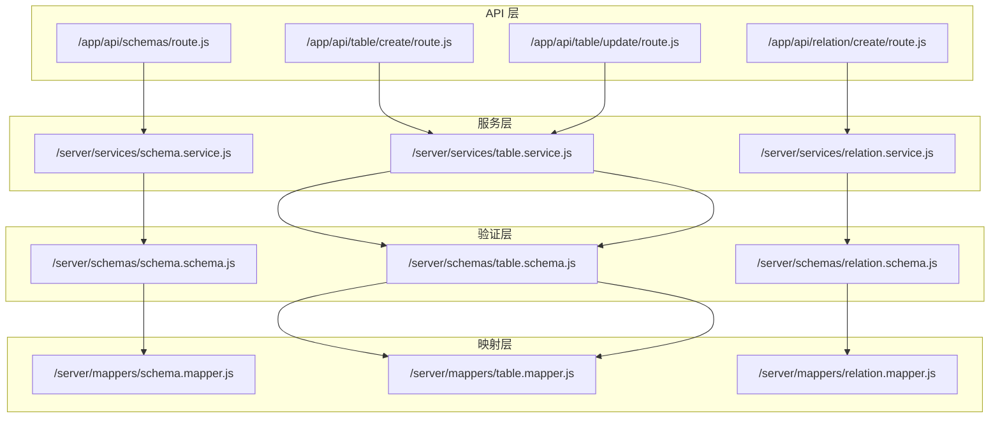
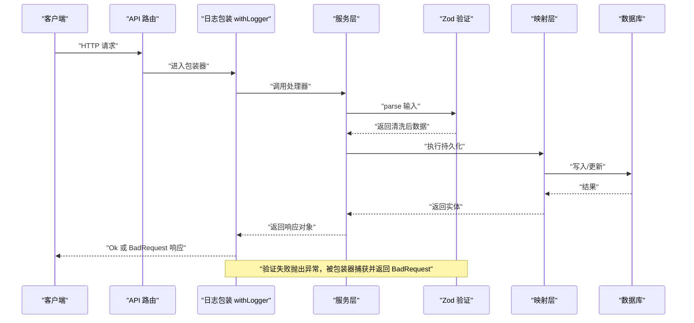
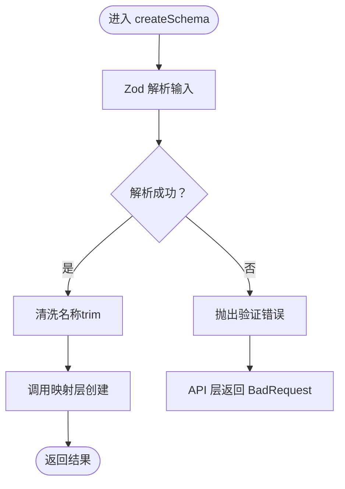
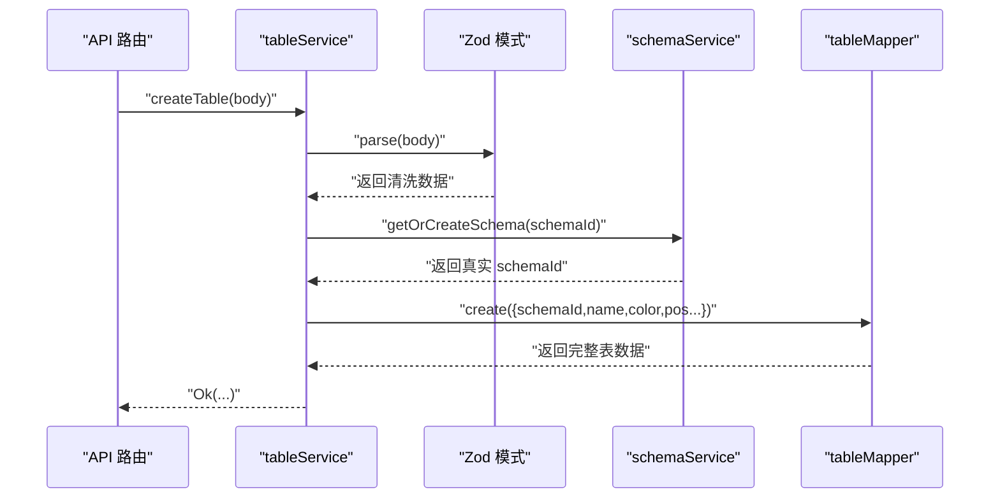
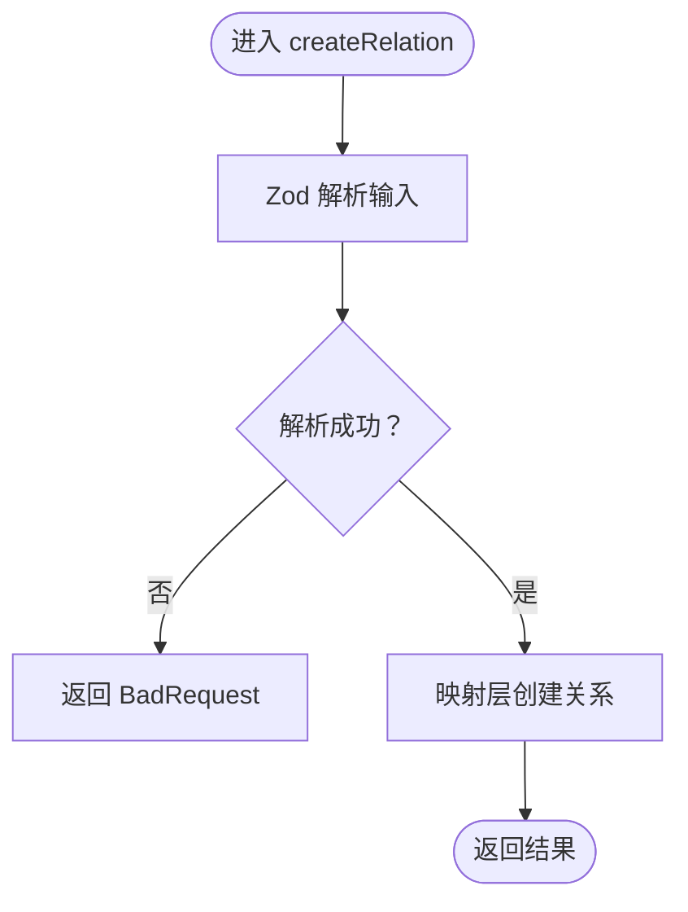
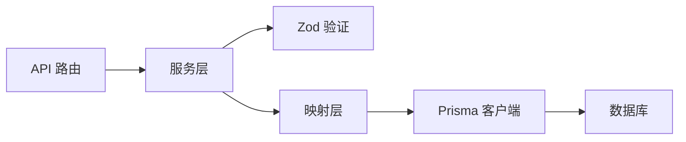

# 数据验证规则

<cite>
**本文引用的文件**
- [src/server/schemas/schema.schema.js](file://src/server/schemas/schema.schema.js)
- [src/server/schemas/table.schema.js](file://src/server/schemas/table.schema.js)
- [src/server/schemas/relation.schema.js](file://src/server/schemas/relation.schema.js)
- [src/server/services/schema.service.js](file://src/server/services/schema.service.js)
- [src/server/services/table.service.js](file://src/server/services/table.service.js)
- [src/server/services/relation.service.js](file://src/server/services/relation.service.js)
- [src/server/mappers/schema.mapper.js](file://src/server/mappers/schema.mapper.js)
- [src/server/mappers/table.mapper.js](file://src/server/mappers/table.mapper.js)
- [src/server/mappers/relation.mapper.js](file://src/server/mappers/relation.mapper.js)
- [src/app/api/schemas/route.js](file://src/app/api/schemas/route.js)
- [src/app/api/table/create/route.js](file://src/app/api/table/create/route.js)
- [src/app/api/table/update/route.js](file://src/app/api/table/update/route.js)
- [src/app/api/relation/create/route.js](file://src/app/api/relation/create/route.js)
- [src/server/lib/response.js](file://src/server/lib/response.js)
- [src/server/lib/withLogger.js](file://src/server/lib/withLogger.js)
</cite>

## 目录
1. [简介](#简介)
2. [项目结构](#项目结构)
3. [核心组件](#核心组件)
4. [架构总览](#架构总览)
5. [详细组件分析](#详细组件分析)
6. [依赖关系分析](#依赖关系分析)
7. [性能考量](#性能考量)
8. [故障排查指南](#故障排查指南)
9. [结论](#结论)
10. [附录](#附录)

## 简介
本文件系统性梳理 Vibe DB 中的数据验证规则与实现，重点围绕 Zod 验证模式在服务层的使用方式、字段类型与约束、错误处理机制以及与前端校验的协作策略。文档同时给出验证失败时的错误消息格式、可扩展的自定义验证器思路，以及与 Prisma 映射层的交互流程。

## 项目结构
Vibe DB 的数据验证主要分布在以下层次：
- API 层：接收请求体，统一日志与错误包装
- 服务层：对输入进行 Zod 解析与清洗，调用映射层持久化
- 映射层：通过 Prisma 执行数据库操作
- 验证层：Zod 模式集中定义于 server/schemas 下

图表来源
- [src/app/api/schemas/route.js:1-23](file://src/app/api/schemas/route.js#L1-L23)
- [src/app/api/table/create/route.js:1-16](file://src/app/api/table/create/route.js#L1-L16)
- [src/app/api/table/update/route.js:1-16](file://src/app/api/table/update/route.js#L1-L16)
- [src/app/api/relation/create/route.js:1-14](file://src/app/api/relation/create/route.js#L1-L14)
- [src/server/services/schema.service.js:1-26](file://src/server/services/schema.service.js#L1-L26)
- [src/server/services/table.service.js:1-38](file://src/server/services/table.service.js#L1-L38)
- [src/server/services/relation.service.js:1-26](file://src/server/services/relation.service.js#L1-L26)
- [src/server/schemas/schema.schema.js:1-7](file://src/server/schemas/schema.schema.js#L1-L7)
- [src/server/schemas/table.schema.js:1-41](file://src/server/schemas/table.schema.js#L1-L41)
- [src/server/schemas/relation.schema.js:1-18](file://src/server/schemas/relation.schema.js#L1-L18)
- [src/server/mappers/schema.mapper.js:1-35](file://src/server/mappers/schema.mapper.js#L1-L35)
- [src/server/mappers/table.mapper.js:1-110](file://src/server/mappers/table.mapper.js#L1-L110)
- [src/server/mappers/relation.mapper.js:1-28](file://src/server/mappers/relation.mapper.js#L1-L28)

章节来源
- [src/app/api/schemas/route.js:1-23](file://src/app/api/schemas/route.js#L1-L23)
- [src/app/api/table/create/route.js:1-16](file://src/app/api/table/create/route.js#L1-L16)
- [src/app/api/table/update/route.js:1-16](file://src/app/api/table/update/route.js#L1-L16)
- [src/app/api/relation/create/route.js:1-14](file://src/app/api/relation/create/route.js#L1-L14)

## 核心组件
- Zod 验证模式：集中定义于 server/schemas，覆盖 Schema、Table、Relation 三类实体的创建与更新规则
- 服务层解析与清洗：在服务层使用 z.parse 对输入进行严格校验，并进行必要的字符串清理与默认值设置
- 映射层持久化：将清洗后的数据写入数据库，部分场景使用事务保证一致性
- API 层统一包装：使用 Ok/BadRequest 统一响应格式；withLogger 记录请求/响应与异常

章节来源
- [src/server/schemas/schema.schema.js:1-7](file://src/server/schemas/schema.schema.js#L1-L7)
- [src/server/schemas/table.schema.js:1-41](file://src/server/schemas/table.schema.js#L1-L41)
- [src/server/schemas/relation.schema.js:1-18](file://src/server/schemas/relation.schema.js#L1-L18)
- [src/server/services/schema.service.js:1-26](file://src/server/services/schema.service.js#L1-L26)
- [src/server/services/table.service.js:1-38](file://src/server/services/table.service.js#L1-L38)
- [src/server/services/relation.service.js:1-26](file://src/server/services/relation.service.js#L1-L26)
- [src/server/mappers/schema.mapper.js:1-35](file://src/server/mappers/schema.mapper.js#L1-L35)
- [src/server/mappers/table.mapper.js:1-110](file://src/server/mappers/table.mapper.js#L1-L110)
- [src/server/mappers/relation.mapper.js:1-28](file://src/server/mappers/relation.mapper.js#L1-L28)
- [src/server/lib/response.js:1-14](file://src/server/lib/response.js#L1-L14)
- [src/server/lib/withLogger.js:1-76](file://src/server/lib/withLogger.js#L1-L76)

## 架构总览
下图展示从 API 到服务、验证与映射的整体流程，以及错误处理路径。

图表来源
- [src/app/api/schemas/route.js:1-23](file://src/app/api/schemas/route.js#L1-L23)
- [src/server/lib/withLogger.js:37-75](file://src/server/lib/withLogger.js#L37-L75)
- [src/server/services/schema.service.js:9-15](file://src/server/services/schema.service.js#L9-L15)
- [src/server/schemas/schema.schema.js:3-6](file://src/server/schemas/schema.schema.js#L3-L6)
- [src/server/mappers/schema.mapper.js:26-33](file://src/server/mappers/schema.mapper.js#L26-L33)

## 详细组件分析

### Schema 验证规则与流程
- 验证模式
  - 名称：必填字符串，最小长度 1，最大 64；描述：最多 255，可选
- 服务层行为
  - 使用 Zod 解析输入，对名称进行 trim 清理
  - 将清洗后的数据传给映射层创建
- 错误处理
  - 验证失败时抛出异常，API 层通过 BadRequest 返回错误消息

图表来源
- [src/server/services/schema.service.js:9-15](file://src/server/services/schema.service.js#L9-L15)
- [src/server/schemas/schema.schema.js:3-6](file://src/server/schemas/schema.schema.js#L3-L6)
- [src/server/mappers/schema.mapper.js:26-33](file://src/server/mappers/schema.mapper.js#L26-L33)
- [src/server/lib/response.js:6-7](file://src/server/lib/response.js#L6-L7)

章节来源
- [src/server/schemas/schema.schema.js:1-7](file://src/server/schemas/schema.schema.js#L1-L7)
- [src/server/services/schema.service.js:1-26](file://src/server/services/schema.service.js#L1-L26)
- [src/server/mappers/schema.mapper.js:1-35](file://src/server/mappers/schema.mapper.js#L1-L35)
- [src/app/api/schemas/route.js:1-23](file://src/app/api/schemas/route.js#L1-L23)
- [src/server/lib/response.js:1-14](file://src/server/lib/response.js#L1-L14)

### Table 验证规则与流程
- 验证模式
  - 创建：schemaId 必填；name 必填且 1-64；color 可选；位置坐标可选
  - 更新：id 必填；其余字段可选；fields 与 indexes 支持数组嵌套校验
- 服务层行为
  - 解析后调用 schemaService.getOrCreateSchema，确保 schemaId 存在
  - 清洗名称并写入映射层；更新时支持全量替换字段与索引
- 错误处理
  - 验证失败返回 BadRequest；删除前校验 id

图表来源
- [src/app/api/table/create/route.js:1-16](file://src/app/api/table/create/route.js#L1-L16)
- [src/server/services/table.service.js:11-24](file://src/server/services/table.service.js#L11-L24)
- [src/server/schemas/table.schema.js:3-9](file://src/server/schemas/table.schema.js#L3-L9)
- [src/server/services/schema.service.js:17-24](file://src/server/services/schema.service.js#L17-L24)
- [src/server/mappers/table.mapper.js:17-47](file://src/server/mappers/table.mapper.js#L17-L47)

章节来源
- [src/server/schemas/table.schema.js:1-41](file://src/server/schemas/table.schema.js#L1-L41)
- [src/server/services/table.service.js:1-38](file://src/server/services/table.service.js#L1-L38)
- [src/server/mappers/table.mapper.js:1-110](file://src/server/mappers/table.mapper.js#L1-L110)
- [src/app/api/table/create/route.js:1-16](file://src/app/api/table/create/route.js#L1-L16)
- [src/app/api/table/update/route.js:1-16](file://src/app/api/table/update/route.js#L1-L16)

### Relation 验证规则与流程
- 验证模式
  - 创建：schemaId、name、sourceTableId、sourceFieldId、targetTableId、targetFieldId 必填；name 最大 128；cardinality 枚举，默认 ONE_TO_MANY
  - 更新：id 必填；name 1-128 可选；cardinality 枚举可选
- 服务层行为
  - 解析后直接写入映射层；更新时剥离 id 后更新其余字段
- 错误处理
  - 验证失败返回 BadRequest；删除前校验 id

图表来源
- [src/server/services/relation.service.js:10-12](file://src/server/services/relation.service.js#L10-L12)
- [src/server/schemas/relation.schema.js:3-11](file://src/server/schemas/relation.schema.js#L3-L11)
- [src/server/mappers/relation.mapper.js:11-13](file://src/server/mappers/relation.mapper.js#L11-L13)

章节来源
- [src/server/schemas/relation.schema.js:1-18](file://src/server/schemas/relation.schema.js#L1-L18)
- [src/server/services/relation.service.js:1-26](file://src/server/services/relation.service.js#L1-L26)
- [src/server/mappers/relation.mapper.js:1-28](file://src/server/mappers/relation.mapper.js#L1-L28)
- [src/app/api/relation/create/route.js:1-14](file://src/app/api/relation/create/route.js#L1-L14)

### 错误消息格式与用户友好提示
- 统一响应结构
  - 成功：code=200，success=true，msg='ok'
  - 失败：code=400，success=false，msg=错误消息
- 错误来源
  - API 层捕获服务层抛出的验证错误，通过 BadRequest 返回
  - withLogger 在开发环境记录请求体，在生产环境记录状态与耗时
- 用户提示建议
  - 建议在前端根据 msg 字段展示简洁提示
  - 对于复杂表单，可将多条字段级错误聚合展示

章节来源
- [src/server/lib/response.js:1-14](file://src/server/lib/response.js#L1-L14)
- [src/server/lib/withLogger.js:37-75](file://src/server/lib/withLogger.js#L37-L75)
- [src/app/api/schemas/route.js:14-22](file://src/app/api/schemas/route.js#L14-L22)
- [src/app/api/table/create/route.js:14-15](file://src/app/api/table/create/route.js#L14-L15)
- [src/app/api/table/update/route.js:13-15](file://src/app/api/table/update/route.js#L13-L15)
- [src/app/api/relation/create/route.js:10-12](file://src/app/api/relation/create/route.js#L10-L12)

### 自定义验证器的实现与扩展
- 基于 Zod 的扩展点
  - 使用 refine 进行复合字段校验（如关联两端的表/字段存在性）
  - 使用 superRefine 实现更细粒度的错误收集
  - 使用 transform 在 parse 前后进行数据转换（如 trim、枚举标准化）
- 推荐实践
  - 将跨实体的业务规则放入服务层（如关联两端表必须属于同一 schema）
  - 将格式与范围等通用规则放入对应 schema 文件
  - 对于昂贵的外部校验（如唯一性），在服务层结合 Prisma 查询
- 示例思路（不直接粘贴代码）
  - 在 Relation 模式中增加 superRefine，校验 source/target 表/字段是否属于 schemaId
  - 在 Table 模式中增加 transform，统一字段类型大小写
  - 在 Schema 模式中增加 refine，校验描述长度与字符集

## 依赖关系分析
- 低耦合高内聚
  - API 层仅负责包装与转发，不包含业务逻辑
  - 服务层专注解析、清洗与业务规则，职责单一
  - 验证层独立于业务，便于复用与测试
- 关键依赖链
  - API → 服务 → 验证 → 映射 → 数据库
  - 服务层之间通过 schemaService 协作，避免重复解析

图表来源
- [src/app/api/schemas/route.js:1-23](file://src/app/api/schemas/route.js#L1-L23)
- [src/server/services/schema.service.js:1-26](file://src/server/services/schema.service.js#L1-L26)
- [src/server/schemas/schema.schema.js:1-7](file://src/server/schemas/schema.schema.js#L1-L7)
- [src/server/mappers/schema.mapper.js:1-35](file://src/server/mappers/schema.mapper.js#L1-L35)
- [src/lib/prisma.js](file://src/lib/prisma.js)

章节来源
- [src/server/services/schema.service.js:1-26](file://src/server/services/schema.service.js#L1-L26)
- [src/server/services/table.service.js:1-38](file://src/server/services/table.service.js#L1-L38)
- [src/server/services/relation.service.js:1-26](file://src/server/services/relation.service.js#L1-L26)
- [src/server/mappers/schema.mapper.js:1-35](file://src/server/mappers/schema.mapper.js#L1-L35)
- [src/server/mappers/table.mapper.js:1-110](file://src/server/mappers/table.mapper.js#L1-L110)
- [src/server/mappers/relation.mapper.js:1-28](file://src/server/mappers/relation.mapper.js#L1-L28)

## 性能考量
- 解析成本
  - Zod 解析为 O(n) 与 n（字段数），通常可忽略
- 数据库写入
  - Table 更新采用事务批量写入字段与索引，减少往返
- 日志开销
  - 开发环境记录请求体，生产环境仅记录元信息，避免 IO 抖动
- 建议
  - 对高频接口可考虑缓存只读查询结果
  - 对批量导入场景，分批提交并控制事务大小

## 故障排查指南
- 常见问题
  - 字段为空或超长：检查对应 schema 的 min/max 与 optional 设置
  - 枚举值非法：确认客户端传值与服务端枚举一致
  - 关联字段缺失：核对 source/target 表/字段与 schemaId 的一致性
- 定位步骤
  - 查看 API 层返回的 msg 是否来自服务层抛出的验证错误
  - 开启 withLogger 的开发日志，确认请求体与响应状态
  - 在服务层断点或打印 data，确认 transform/默认值是否生效
- 修复建议
  - 在前端对必填字段与长度进行即时提示
  - 对枚举字段使用受控组件，避免非法值进入后端
  - 对关联关系在 UI 上做联动校验（先选 schema，再选表，最后选字段）

章节来源
- [src/server/lib/response.js:6-7](file://src/server/lib/response.js#L6-L7)
- [src/server/lib/withLogger.js:44-52](file://src/server/lib/withLogger.js#L44-L52)
- [src/server/services/table.service.js:11-24](file://src/server/services/table.service.js#L11-L24)
- [src/server/services/relation.service.js:10-19](file://src/server/services/relation.service.js#L10-L19)

## 结论
Vibe DB 的数据验证以 Zod 为核心，贯穿 API、服务与映射三层，形成“强约束 + 清洗 + 统一响应”的稳健体系。通过明确的字段约束、可扩展的自定义验证器与完善的错误消息格式，既保障了数据质量，也为前端提供了清晰的反馈。建议后续在 Relation 等复杂实体上引入更多业务规则校验，并在前端强化实时校验，提升整体用户体验与系统稳定性。

## 附录
- 字段类型与约束速查
  - Schema：name(必填, 1-64), description(可选, ≤255)
  - Table：schemaId(必填), name(必填, 1-64), color(可选), positionX/Y(可选)
  - Relation：schemaId(必填), name(必填, 1-128), cardinality(枚举, 默认 ONE_TO_MANY), source/target 表/字段(必填)
- 错误消息格式
  - 成功：code=200, success=true, msg='ok'
  - 失败：code=400, success=false, msg=具体错误信息