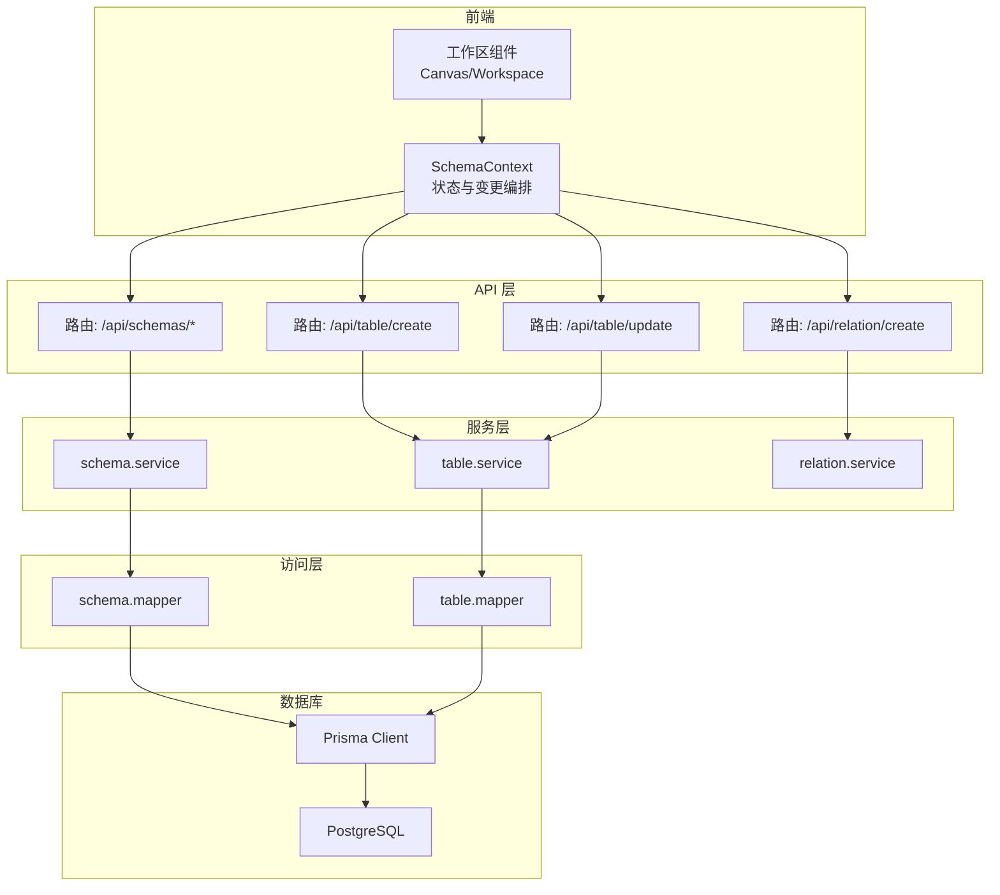
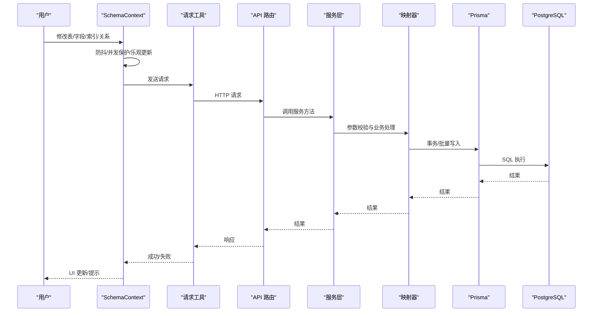
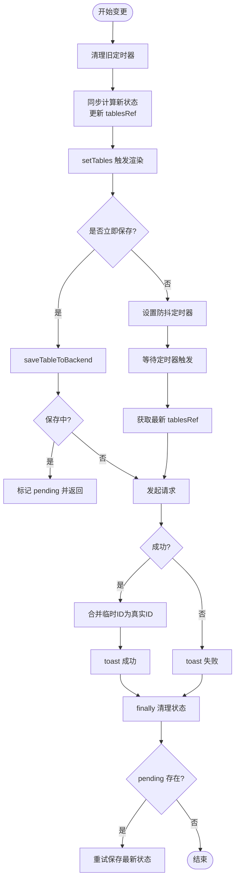
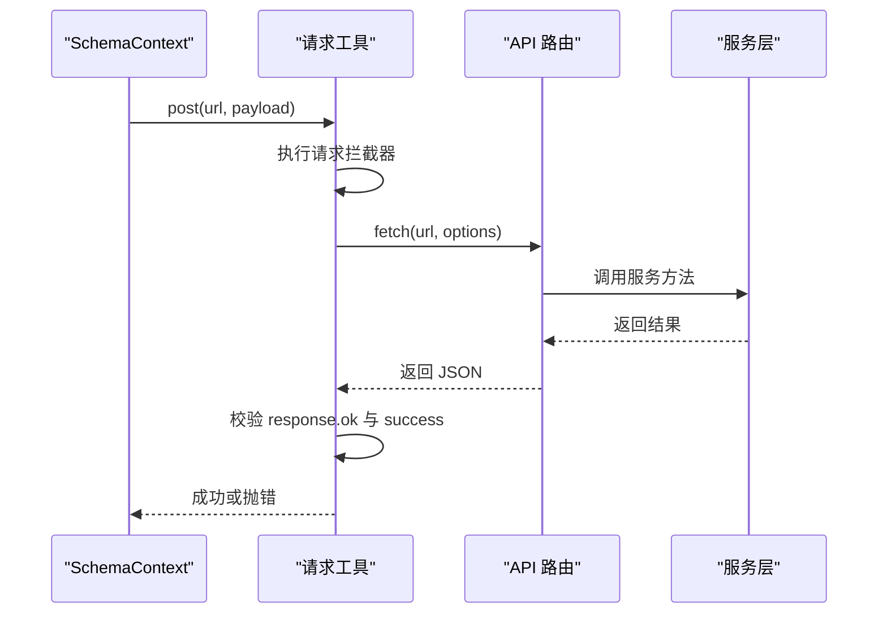
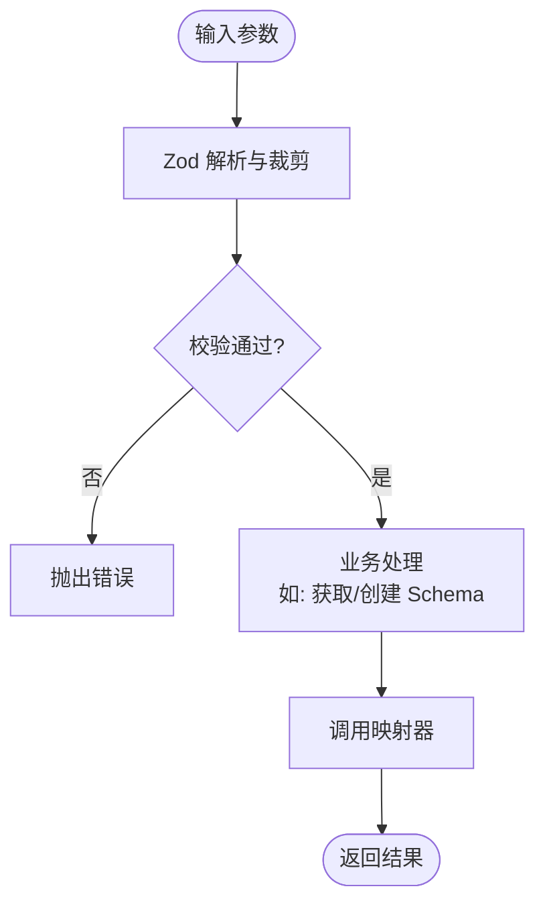
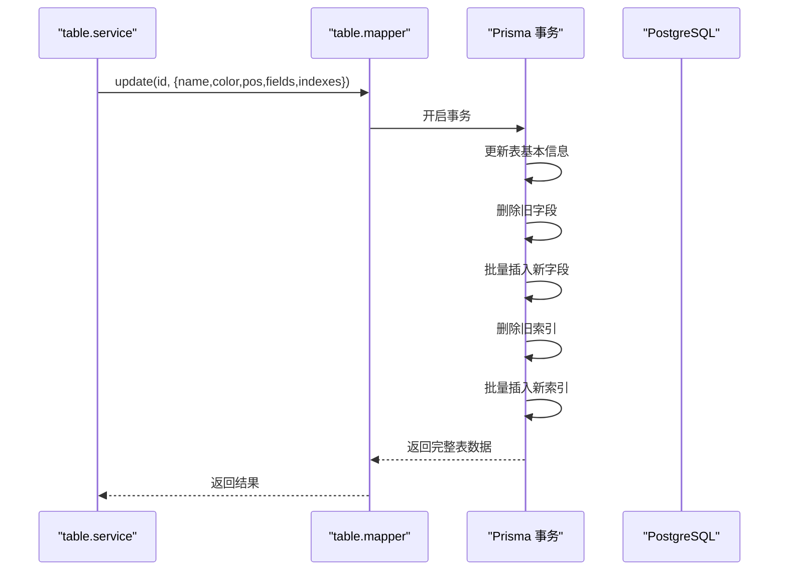
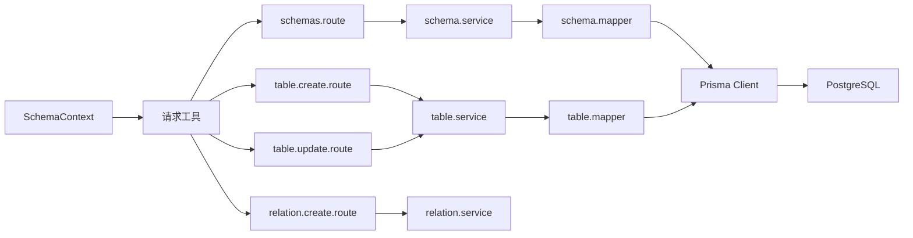

# 数据流设计

<cite>
**本文引用的文件**
- [SchemaContext.js](file://src/features/schema/SchemaContext.js)
- [request.js](file://src/lib/request.js)
- [prisma.js](file://src/lib/prisma.js)
- [schema.service.js](file://src/server/services/schema.service.js)
- [table.service.js](file://src/server/services/table.service.js)
- [relation.service.js](file://src/server/services/relation.service.js)
- [schema.mapper.js](file://src/server/mappers/schema.mapper.js)
- [table.mapper.js](file://src/server/mappers/table.mapper.js)
- [schema.schema.js](file://src/server/schemas/schema.schema.js)
- [table.schema.js](file://src/server/schemas/table.schema.js)
- [relation.schema.js](file://src/server/schemas/relation.schema.js)
- [schemas.route.js](file://src/app/api/schemas/route.js)
- [table.create.route.js](file://src/app/api/table/create/route.js)
- [table.update.route.js](file://src/app/api/table/update/route.js)
- [relation.create.route.js](file://src/app/api/relation/create/route.js)
- [schema.prisma](file://prisma/schema.prisma)
</cite>

## 目录
1. [简介](#简介)
2. [项目结构](#项目结构)
3. [核心组件](#核心组件)
4. [架构总览](#架构总览)
5. [详细组件分析](#详细组件分析)
6. [依赖分析](#依赖分析)
7. [性能考虑](#性能考虑)
8. [故障排查指南](#故障排查指南)
9. [结论](#结论)
10. [附录](#附录)

## 简介
本文件面向开发者，系统化阐述 Vibe DB 的数据流设计与实现机制，覆盖从用户操作到数据库持久化的完整链路：SchemaContext（前端上下文）→ API 层（Next.js App Router 路由）→ 业务服务层（Server Services）→ 数据访问层（Mappers + Prisma）。文档重点说明：
- 实时数据同步与防抖策略
- 错误传播与统一拦截
- 数据验证与转换规则
- 缓存与一致性保障
- 异步处理与并发控制
- 事务管理与性能监控建议

## 项目结构
Vibe DB 采用前后端同构的 Next.js 应用，数据流分层清晰：
- 前端层：React 客户端组件 + SchemaContext 提供状态与变更编排
- API 层：Next.js App Router 路由，封装请求与响应
- 服务层：业务服务，负责参数校验、领域逻辑与跨模型协调
- 访问层：映射器封装 Prisma ORM，提供事务与复杂查询
- 数据库：PostgreSQL，通过 Prisma 管理 Schema/表/字段/索引/关系

图表来源
- [SchemaContext.js:43-392](file://src/features/schema/SchemaContext.js#L43-L392)
- [schemas.route.js:1-23](file://src/app/api/schemas/route.js#L1-L23)
- [table.create.route.js:1-16](file://src/app/api/table/create/route.js#L1-L16)
- [table.update.route.js:1-16](file://src/app/api/table/update/route.js#L1-L16)
- [relation.create.route.js:1-14](file://src/app/api/relation/create/route.js#L1-L14)
- [schema.service.js:1-26](file://src/server/services/schema.service.js#L1-L26)
- [table.service.js:1-38](file://src/server/services/table.service.js#L1-L38)
- [relation.service.js:1-26](file://src/server/services/relation.service.js#L1-L26)
- [schema.mapper.js:1-35](file://src/server/mappers/schema.mapper.js#L1-L35)
- [table.mapper.js:1-110](file://src/server/mappers/table.mapper.js#L1-L110)
- [prisma.js:1-16](file://src/lib/prisma.js#L1-L16)
- [schema.prisma:1-69](file://prisma/schema.prisma#L1-L69)

章节来源
- [SchemaContext.js:43-392](file://src/features/schema/SchemaContext.js#L43-L392)
- [prisma.js:1-16](file://src/lib/prisma.js#L1-L16)
- [schema.prisma:1-69](file://prisma/schema.prisma#L1-L69)

## 核心组件
- SchemaContext：前端状态与变更编排中心，负责序列化/反序列化、防抖、并发保护、乐观更新与错误提示。
- API 路由：统一入口，注入日志中间件与错误捕获，调用对应服务层。
- 服务层：参数校验（Zod）、领域逻辑与跨模型协调（如表创建时的 Schema 获取/创建）。
- 映射器：封装 Prisma 查询与事务，提供事务性批量更新字段/索引。
- Prisma：类型安全的 ORM，连接 PostgreSQL。

章节来源
- [SchemaContext.js:10-173](file://src/features/schema/SchemaContext.js#L10-L173)
- [request.js:36-142](file://src/lib/request.js#L36-L142)
- [table.service.js:11-31](file://src/server/services/table.service.js#L11-L31)
- [table.mapper.js:49-101](file://src/server/mappers/table.mapper.js#L49-L101)
- [prisma.js:6-16](file://src/lib/prisma.js#L6-L16)

## 架构总览
数据从用户交互开始，经 SchemaContext 编排，通过统一请求工具发送至 API 路由，再由服务层进行参数校验与业务处理，最终由映射器在事务内完成数据库写入。读取路径则相反，先从数据库读取，再经映射器与服务层转换，最后回到前端渲染。

图表来源
- [SchemaContext.js:86-173](file://src/features/schema/SchemaContext.js#L86-L173)
- [request.js:36-121](file://src/lib/request.js#L36-L121)
- [table.update.route.js:5-15](file://src/app/api/table/update/route.js#L5-L15)
- [table.service.js:26-31](file://src/server/services/table.service.js#L26-L31)
- [table.mapper.js:49-101](file://src/server/mappers/table.mapper.js#L49-L101)

## 详细组件分析

### SchemaContext：前端状态与变更编排
- 防抖与并发控制
  - 使用定时器与“正在保存”标记，避免同一表的并发保存；若保存期间有新变更，标记 pending 并在完成后重试，确保最终一致性。
  - 输入类变更使用防抖（默认 1500ms），开关/选择类变更立即保存，兼顾体验与性能。
- 序列化/反序列化
  - 表结构序列化时对字段/索引按顺序编号，便于全量替换；反序列化恢复位置与集合。
- 临时 ID 策略
  - 新增实体时生成临时 ID，提交成功后仅替换后端返回的真实 ID，避免输入框光标丢失与重复渲染。
- 乐观更新
  - 关联更新与删除先在本地变更，再异步提交，提升交互流畅度；失败时回滚本地状态。
- 错误传播
  - 统一 toast 提示，结合请求工具的拦截器与错误对象，向用户反馈具体信息。

图表来源
- [SchemaContext.js:147-173](file://src/features/schema/SchemaContext.js#L147-L173)
- [SchemaContext.js:86-135](file://src/features/schema/SchemaContext.js#L86-L135)

章节来源
- [SchemaContext.js:10-173](file://src/features/schema/SchemaContext.js#L10-L173)
- [SchemaContext.js:181-363](file://src/features/schema/SchemaContext.js#L181-L363)

### 请求工具与错误传播
- 统一请求函数支持拦截器注册、URL 构造、超时控制与错误归一化。
- 对 HTTP 非 OK 或业务失败场景抛出带 code/data 的错误对象，便于上层统一处理。
- 默认非静默模式自动 toast 提示，静默模式可避免干扰。

图表来源
- [request.js:36-121](file://src/lib/request.js#L36-L121)
- [table.update.route.js:5-15](file://src/app/api/table/update/route.js#L5-L15)

章节来源
- [request.js:36-142](file://src/lib/request.js#L36-L142)

### 服务层：参数校验与业务逻辑
- Zod 校验
  - 表创建/更新、关系创建/更新、Schema 创建均使用 Zod schema 校验，确保输入合法与裁剪（如表名 trim）。
- 业务协调
  - 表创建时可基于传入 schemaId 获取或创建真实 Schema ID，保证后续写入目标正确。
- 错误处理
  - 服务层捕获并向上抛出，由路由包装为统一响应。

图表来源
- [schema.service.js:9-24](file://src/server/services/schema.service.js#L9-L24)
- [table.service.js:11-31](file://src/server/services/table.service.js#L11-L31)
- [relation.service.js:10-19](file://src/server/services/relation.service.js#L10-L19)

章节来源
- [schema.service.js:1-26](file://src/server/services/schema.service.js#L1-L26)
- [table.service.js:1-38](file://src/server/services/table.service.js#L1-L38)
- [relation.service.js:1-26](file://src/server/services/relation.service.js#L1-L26)
- [schema.schema.js:1-20](file://src/server/schemas/schema.schema.js#L1-L20)
- [table.schema.js:1-41](file://src/server/schemas/table.schema.js#L1-L41)
- [relation.schema.js:1-20](file://src/server/schemas/relation.schema.js#L1-L20)

### 映射器与事务：批量更新与一致性
- 事务包裹
  - 表更新在单事务内完成：先更新表基本信息，再全量删除并重建字段/索引，确保原子性与一致性。
- 包含关系
  - 查询时包含字段与索引并按序排序，保证前后端一致展示。
- 软删除
  - 表删除采用软删除（enable=false），避免级联破坏。

图表来源
- [table.mapper.js:49-101](file://src/server/mappers/table.mapper.js#L49-L101)
- [table.service.js:26-31](file://src/server/services/table.service.js#L26-L31)

章节来源
- [table.mapper.js:1-110](file://src/server/mappers/table.mapper.js#L1-L110)

### API 路由：统一入口与日志
- 日志中间件
  - withLogger 包裹路由，记录请求与响应，便于问题定位。
- 错误包装
  - 捕获异常并返回 BadRequest，保持接口一致性。

章节来源
- [schemas.route.js:1-23](file://src/app/api/schemas/route.js#L1-L23)
- [table.create.route.js:1-16](file://src/app/api/table/create/route.js#L1-L16)
- [table.update.route.js:1-16](file://src/app/api/table/update/route.js#L1-L16)
- [relation.create.route.js:1-14](file://src/app/api/relation/create/route.js#L1-L14)

### 数据库模型与约束
- 模型关系
  - Schema 包含多个 Table；Table 包含多个 Field/Index，并通过外键级联删除。
- 默认值与启用标志
  - 表与字段提供默认值；表支持 enable 控制软删除。
- 时间戳
  - 自动维护 createdAt/updatedAt。

章节来源
- [schema.prisma:10-69](file://prisma/schema.prisma#L10-L69)

## 依赖分析
- 前端到后端
  - SchemaContext 通过统一请求工具调用各 API 路由，路由再委派给对应服务层。
- 服务到访问层
  - 服务层依赖映射器；映射器依赖 Prisma Client。
- 数据库
  - Prisma Client 连接 PostgreSQL，遵循 schema.prisma 的模型定义。

图表来源
- [SchemaContext.js:43-392](file://src/features/schema/SchemaContext.js#L43-L392)
- [request.js:36-142](file://src/lib/request.js#L36-L142)
- [schemas.route.js:1-23](file://src/app/api/schemas/route.js#L1-L23)
- [table.create.route.js:1-16](file://src/app/api/table/create/route.js#L1-L16)
- [table.update.route.js:1-16](file://src/app/api/table/update/route.js#L1-L16)
- [relation.create.route.js:1-14](file://src/app/api/relation/create/route.js#L1-L14)
- [schema.service.js:1-26](file://src/server/services/schema.service.js#L1-L26)
- [table.service.js:1-38](file://src/server/services/table.service.js#L1-L38)
- [relation.service.js:1-26](file://src/server/services/relation.service.js#L1-L26)
- [schema.mapper.js:1-35](file://src/server/mappers/schema.mapper.js#L1-L35)
- [table.mapper.js:1-110](file://src/server/mappers/table.mapper.js#L1-L110)
- [prisma.js:1-16](file://src/lib/prisma.js#L1-L16)

## 性能考虑
- 防抖与批处理
  - 输入类变更使用 1500ms 防抖，减少网络请求与数据库写入频率。
- 乐观更新
  - 关联更新/删除先本地生效，降低感知延迟。
- 事务批量更新
  - 字段/索引全量替换在事务内完成，避免中间态与重复往返。
- 查询优化
  - 映射器按序包含字段/索引，避免额外排序开销。
- 监控建议
  - 在 withLogger 中记录请求耗时、SQL 执行时间与错误次数，结合 APM 工具定位瓶颈。

## 故障排查指南
- 常见问题
  - 请求超时：检查网络与数据库连接，确认超时拦截器与 toast 是否触发。
  - 保存失败：查看服务层校验错误与映射器事务异常；关注字段/索引顺序与唯一性。
  - 临时 ID 未替换：确认后端返回的真实 ID 与前端合并逻辑。
- 排查步骤
  - 前端：确认防抖定时器与 pending 标记状态。
  - API：检查 withLogger 输出与 BadRequest 消息。
  - 服务：核对 Zod 校验与 getOrCreateSchema 流程。
  - 访问层：确认事务边界与批量写入顺序。
  - 数据库：检查 enable 字段与外键约束。

章节来源
- [request.js:109-120](file://src/lib/request.js#L109-L120)
- [SchemaContext.js:86-135](file://src/features/schema/SchemaContext.js#L86-L135)
- [table.service.js:17-24](file://src/server/services/table.service.js#L17-L24)
- [table.mapper.js:49-101](file://src/server/mappers/table.mapper.js#L49-L101)

## 结论
Vibe DB 的数据流设计以 SchemaContext 为核心，结合防抖、并发保护与乐观更新，实现了高可用的实时协作体验；服务层通过 Zod 校验与跨模型协调，确保输入质量与业务一致性；映射器在事务内完成批量更新，保障原子性与可恢复性。配合统一请求工具与日志中间件，整体具备良好的可观测性与可维护性。

## 附录
- 数据验证清单
  - 表名长度与必填、字段类型与主键/可空、索引类型与唯一性、关系基数与两端字段存在性。
- 缓存与一致性
  - 前端：tablesRef 作为最新状态快照，避免渲染抖动。
  - 后端：事务内批量写入，确保字段/索引与表信息一致。
- 并发控制
  - 单表保存排队、pending 标记与重试，防止竞态与重复请求。