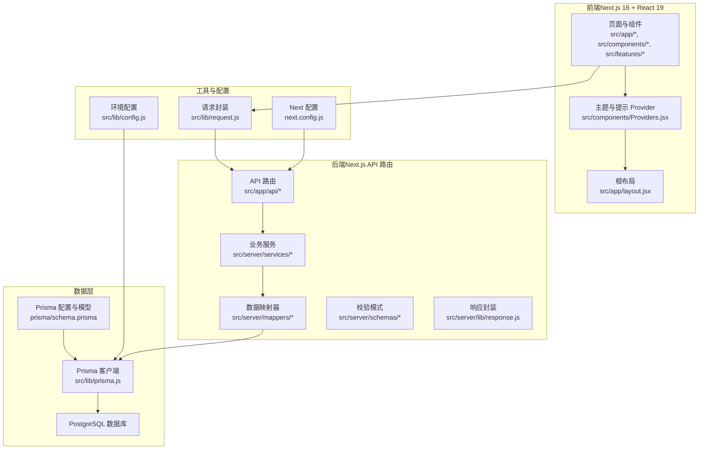
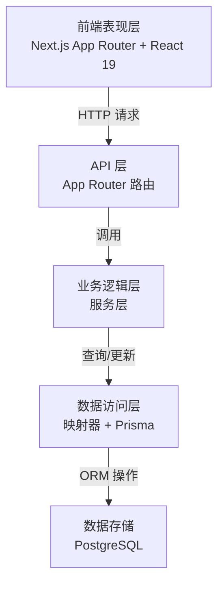
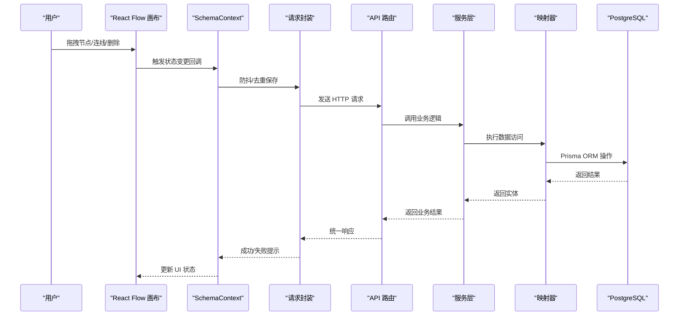
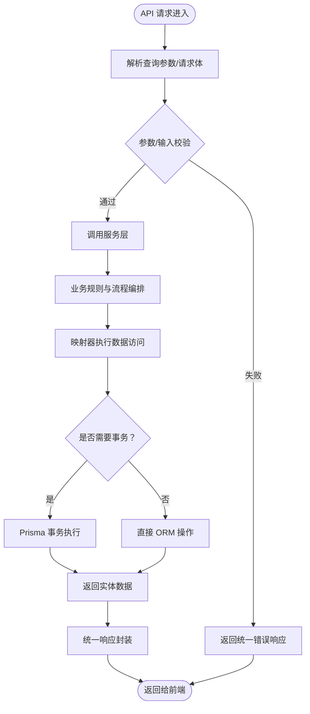
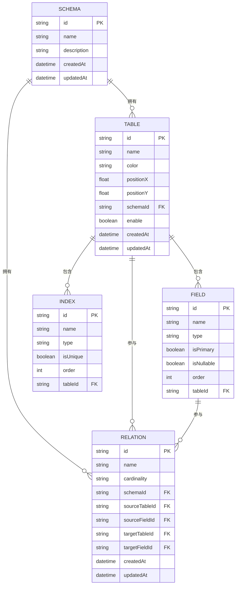
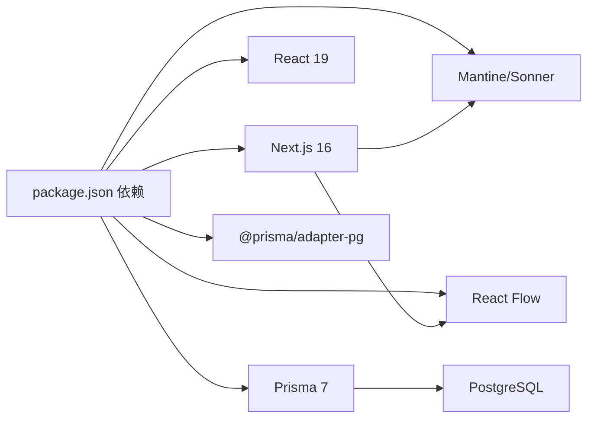

# 整体架构概览

<cite>
**本文档引用的文件**
- [package.json](file://package.json)
- [next.config.js](file://next.config.js)
- [prisma/schema.prisma](file://prisma/schema.prisma)
- [src/lib/config.js](file://src/lib/config.js)
- [src/lib/prisma.js](file://src/lib/prisma.js)
- [src/lib/request.js](file://src/lib/request.js)
- [src/app/layout.jsx](file://src/app/layout.jsx)
- [src/components/Providers.jsx](file://src/components/Providers.jsx)
- [src/features/canvas/Workspace.jsx](file://src/features/canvas/Workspace.jsx)
- [src/features/schema/SchemaContext.js](file://src/features/schema/SchemaContext.js)
- [src/server/lib/response.js](file://src/server/lib/response.js)
- [src/app/api/table/query/route.js](file://src/app/api/table/query/route.js)
- [src/server/services/table.service.js](file://src/server/services/table.service.js)
- [src/server/mappers/table.mapper.js](file://src/server/mappers/table.mapper.js)
</cite>

## 目录
1. [简介](#简介)
2. [项目结构](#项目结构)
3. [核心组件](#核心组件)
4. [架构总览](#架构总览)
5. [详细组件分析](#详细组件分析)
6. [依赖关系分析](#依赖关系分析)
7. [性能考虑](#性能考虑)
8. [故障排查指南](#故障排查指南)
9. [结论](#结论)
10. [附录](#附录)

## 简介
本项目是一个基于 Next.js 16 的全栈数据库设计与管理工具（Vibe DB）。前端采用 React 19 + Next.js 16，使用 Mantine UI、Sonner 提示与 React Flow 进行可视化画布交互；后端通过 Next.js App Router 的 API 路由提供 REST 风格接口，业务逻辑与数据访问分离，使用 Prisma ORM 访问 PostgreSQL 数据库。系统遵循分层架构（表现层、API 层、业务逻辑层、数据访问层），强调组件化与可维护性，并通过统一的请求封装与响应格式实现前后端解耦。

## 项目结构
项目采用按功能域划分的目录组织方式：
- 前端层：src/app、src/components、src/features
- 后端层：src/server（服务、映射器、校验、响应封装）
- 数据层：prisma/schema.prisma 定义模型，src/lib/prisma.js 提供客户端连接
- 工具与配置：src/lib/*、next.config.js、src/app/layout.jsx、src/components/Providers.jsx

**图示来源**
- [src/app/layout.jsx:1-19](file://src/app/layout.jsx#L1-L19)
- [src/components/Providers.jsx:1-36](file://src/components/Providers.jsx#L1-L36)
- [src/lib/request.js:1-142](file://src/lib/request.js#L1-L142)
- [src/server/lib/response.js:1-14](file://src/server/lib/response.js#L1-L14)
- [src/server/services/table.service.js:1-38](file://src/server/services/table.service.js#L1-L38)
- [src/server/mappers/table.mapper.js:1-110](file://src/server/mappers/table.mapper.js#L1-L110)
- [src/lib/prisma.js:1-16](file://src/lib/prisma.js#L1-L16)
- [prisma/schema.prisma:1-69](file://prisma/schema.prisma#L1-L69)
- [next.config.js:1-7](file://next.config.js#L1-L7)

**章节来源**
- [package.json:1-55](file://package.json#L1-L55)
- [next.config.js:1-7](file://next.config.js#L1-L7)
- [prisma/schema.prisma:1-69](file://prisma/schema.prisma#L1-L69)
- [src/lib/config.js:1-33](file://src/lib/config.js#L1-L33)
- [src/lib/prisma.js:1-16](file://src/lib/prisma.js#L1-L16)
- [src/lib/request.js:1-142](file://src/lib/request.js#L1-L142)
- [src/app/layout.jsx:1-19](file://src/app/layout.jsx#L1-L19)
- [src/components/Providers.jsx:1-36](file://src/components/Providers.jsx#L1-L36)

## 核心组件
- 前端提供者与主题：MantineProvider 与全局提示（Sonner）在根布局中注入，确保 UI 一致性与用户反馈。
- 画布与工作区：Workspace 使用 React Flow 渲染表节点与关系边，支持拖拽、连线、删除等交互，并通过请求封装调用后端 API。
- 状态与持久化：SchemaContext 实现“去重 + 排队 + 防抖”的保存策略，避免重复请求与输入框光标问题。
- API 路由与响应：App Router API 路由负责接收请求、参数校验、调用服务层并返回统一响应格式。
- 服务层与映射器：服务层进行业务规则与流程编排，映射器封装数据访问细节，Prisma 客户端负责与数据库交互。
- 配置与连接：环境配置读取 DATABASE_URL，Prisma 客户端通过适配器连接 PostgreSQL。

**章节来源**
- [src/components/Providers.jsx:1-36](file://src/components/Providers.jsx#L1-L36)
- [src/features/canvas/Workspace.jsx:1-219](file://src/features/canvas/Workspace.jsx#L1-L219)
- [src/features/schema/SchemaContext.js:1-392](file://src/features/schema/SchemaContext.js#L1-L392)
- [src/app/api/table/query/route.js:1-20](file://src/app/api/table/query/route.js#L1-L20)
- [src/server/services/table.service.js:1-38](file://src/server/services/table.service.js#L1-L38)
- [src/server/mappers/table.mapper.js:1-110](file://src/server/mappers/table.mapper.js#L1-L110)
- [src/lib/config.js:1-33](file://src/lib/config.js#L1-L33)
- [src/lib/prisma.js:1-16](file://src/lib/prisma.js#L1-L16)

## 架构总览
系统采用前后端分离的分层架构：
- 表现层：Next.js App Router 页面与组件，使用 Mantine UI 与 React Flow 构建交互界面。
- API 层：App Router API 路由，负责路由匹配、参数解析与响应封装。
- 业务逻辑层：服务层对输入进行校验与流程编排，协调映射器与外部依赖。
- 数据访问层：映射器通过 Prisma 客户端访问数据库，支持事务与复杂查询。
- 数据模型：Prisma schema 定义 Schema、Table、Field、Index、Relation 模型及其关系。

**图示来源**
- [src/app/api/table/query/route.js:1-20](file://src/app/api/table/query/route.js#L1-L20)
- [src/server/services/table.service.js:1-38](file://src/server/services/table.service.js#L1-L38)
- [src/server/mappers/table.mapper.js:1-110](file://src/server/mappers/table.mapper.js#L1-L110)
- [src/lib/prisma.js:1-16](file://src/lib/prisma.js#L1-L16)
- [prisma/schema.prisma:1-69](file://prisma/schema.prisma#L1-L69)

## 详细组件分析

### 前端交互与状态管理
- 画布组件（Workspace）：基于 React Flow 的节点与边渲染，支持拖拽位置保存、连线创建、边点击删除等交互；通过请求封装调用后端接口。
- Schema 上下文（SchemaContext）：集中管理表、字段、索引与关系的状态，提供去重、排队与防抖的保存策略，优化用户体验与网络请求频率。

**图示来源**
- [src/features/canvas/Workspace.jsx:130-173](file://src/features/canvas/Workspace.jsx#L130-L173)
- [src/features/schema/SchemaContext.js:83-173](file://src/features/schema/SchemaContext.js#L83-L173)
- [src/lib/request.js:36-121](file://src/lib/request.js#L36-L121)
- [src/app/api/table/query/route.js:1-20](file://src/app/api/table/query/route.js#L1-L20)
- [src/server/services/table.service.js:1-38](file://src/server/services/table.service.js#L1-L38)
- [src/server/mappers/table.mapper.js:1-110](file://src/server/mappers/table.mapper.js#L1-L110)

**章节来源**
- [src/features/canvas/Workspace.jsx:1-219](file://src/features/canvas/Workspace.jsx#L1-L219)
- [src/features/schema/SchemaContext.js:1-392](file://src/features/schema/SchemaContext.js#L1-L392)
- [src/lib/request.js:1-142](file://src/lib/request.js#L1-L142)

### API 设计与数据流
- API 路由：以 App Router 的 route.js 文件作为入口，统一使用 withLogger 包装日志，Ok/BadRequest/NotFound/ServerError 统一响应格式。
- 业务服务：对输入进行 Zod 校验，协调外部依赖（如获取或创建 Schema），再委托映射器执行数据操作。
- 映射器：封装 Prisma 查询与事务，支持字段与索引的全量替换更新，确保数据一致性。

**图示来源**
- [src/app/api/table/query/route.js:1-20](file://src/app/api/table/query/route.js#L1-L20)
- [src/server/lib/response.js:1-14](file://src/server/lib/response.js#L1-L14)
- [src/server/services/table.service.js:1-38](file://src/server/services/table.service.js#L1-L38)
- [src/server/mappers/table.mapper.js:49-100](file://src/server/mappers/table.mapper.js#L49-L100)

**章节来源**
- [src/app/api/table/query/route.js:1-20](file://src/app/api/table/query/route.js#L1-L20)
- [src/server/lib/response.js:1-14](file://src/server/lib/response.js#L1-L14)
- [src/server/services/table.service.js:1-38](file://src/server/services/table.service.js#L1-L38)
- [src/server/mappers/table.mapper.js:1-110](file://src/server/mappers/table.mapper.js#L1-L110)

### 数据模型与关系
Prisma schema 定义了 Schema、Table、Field、Index、Relation 模型及外键关系，支持级联删除与默认值设置，确保数据完整性与一致性。

**图示来源**
- [prisma/schema.prisma:10-68](file://prisma/schema.prisma#L10-L68)

**章节来源**
- [prisma/schema.prisma:1-69](file://prisma/schema.prisma#L1-L69)

## 依赖关系分析
- 技术栈与版本：Next.js 16、React 19、Prisma 7、PostgreSQL、Mantine UI、Sonner、React Flow。
- 外部包与集成：Prisma 客户端与 @prisma/adapter-pg 适配器，PostgreSQL 连接字符串来自环境变量。
- 构建与运行：开发/生产脚本通过 env-cmd 加载 .env.* 文件，Next 配置将 @prisma/client 标记为外部包以优化打包。

**图示来源**
- [package.json:16-38](file://package.json#L16-L38)
- [next.config.js:1-7](file://next.config.js#L1-L7)

**章节来源**
- [package.json:1-55](file://package.json#L1-L55)
- [next.config.js:1-7](file://next.config.js#L1-L7)

## 性能考虑
- 前端保存策略：SchemaContext 对表、字段、索引与关系的保存采用“去重 + 排队 + 防抖”机制，减少网络请求次数并避免输入框光标跳动。
- 事务与批量更新：映射器在更新表的字段与索引时使用事务与批量写入，降低数据库往返次数与锁竞争。
- 请求超时与拦截器：请求封装支持超时控制与拦截器链路，便于统一错误处理与日志记录。
- 构建优化：Next 配置将 @prisma/client 标记为外部包，有助于减少服务端打包体积与启动时间。

**章节来源**
- [src/features/schema/SchemaContext.js:83-173](file://src/features/schema/SchemaContext.js#L83-L173)
- [src/server/mappers/table.mapper.js:49-100](file://src/server/mappers/table.mapper.js#L49-L100)
- [src/lib/request.js:36-121](file://src/lib/request.js#L36-L121)
- [next.config.js:1-7](file://next.config.js#L1-L7)

## 故障排查指南
- 统一响应格式：API 层返回包含 code、data、msg、success 的结构，便于前端统一处理与提示。
- 错误拦截与提示：请求封装在响应失败或业务失败时抛出错误并触发全局提示；超时场景返回特定错误类型。
- 日志中间件：API 路由通过 withLogger 包装，便于追踪请求生命周期与异常堆栈。
- 数据库连接：检查 DATABASE_URL 是否正确，确认 Prisma 客户端初始化与连接池配置。

**章节来源**
- [src/server/lib/response.js:1-14](file://src/server/lib/response.js#L1-L14)
- [src/lib/request.js:84-120](file://src/lib/request.js#L84-L120)
- [src/app/api/table/query/route.js:1-20](file://src/app/api/table/query/route.js#L1-L20)
- [src/lib/prisma.js:1-16](file://src/lib/prisma.js#L1-L16)

## 结论
本项目通过清晰的分层架构与组件化设计，实现了从前端交互到后端服务再到数据存储的完整闭环。Next.js 16 的 App Router 与 API 路由提供了稳定的后端扩展点，Prisma ORM 与 PostgreSQL 保障了数据一致性和可维护性。SchemaContext 的保存策略与请求封装进一步提升了用户体验与系统稳定性。该架构适合持续演进与团队协作，具备良好的可扩展性与可测试性。

## 附录
- 系统边界：前端仅负责展示与交互，后端仅暴露 API，数据访问通过 Prisma 客户端完成，边界清晰、职责明确。
- 技术选型理由：Next.js 16 提供现代 SSR/SSG 与 App Router；React 19 强化并发特性；Prisma 提供类型安全与迁移能力；PostgreSQL 支撑企业级数据需求；Mantine 与 Sonner 提升 UI 体验；React Flow 适配数据库建模场景。