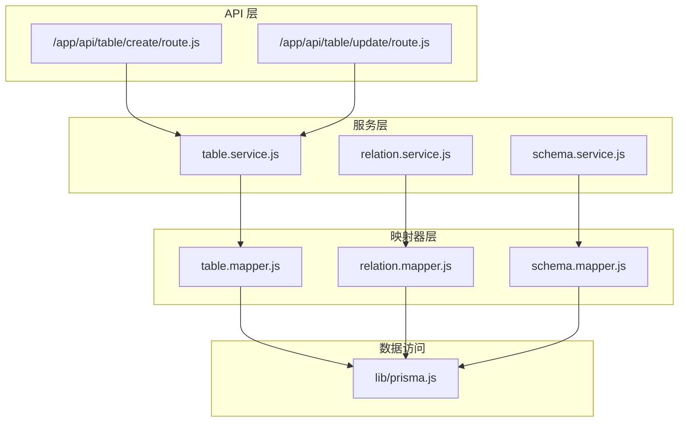
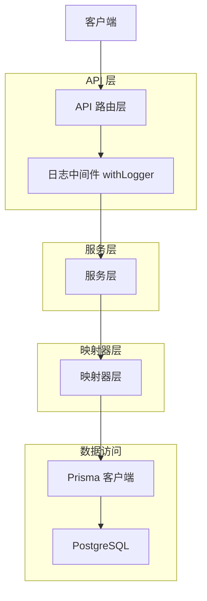
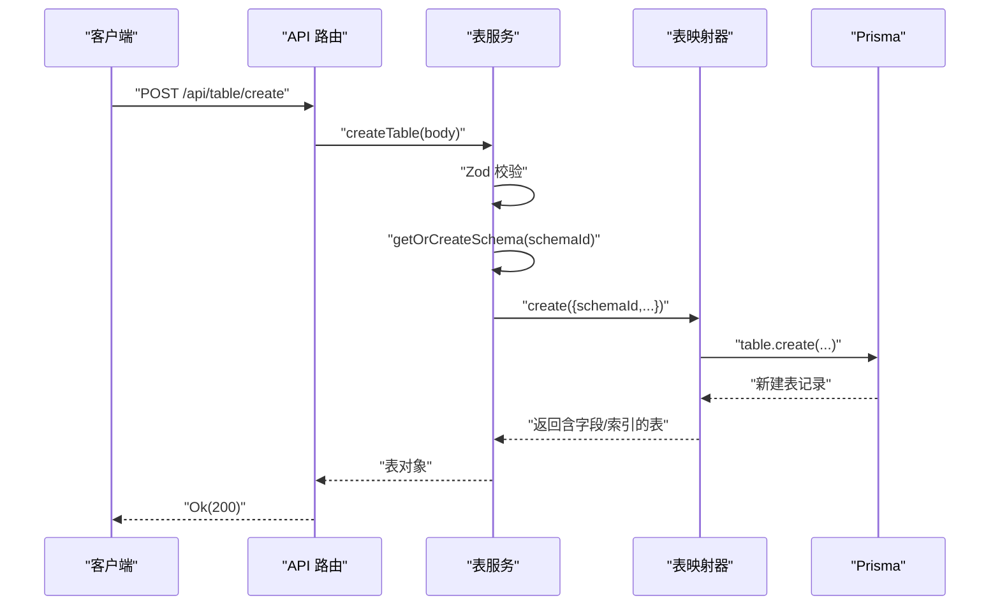
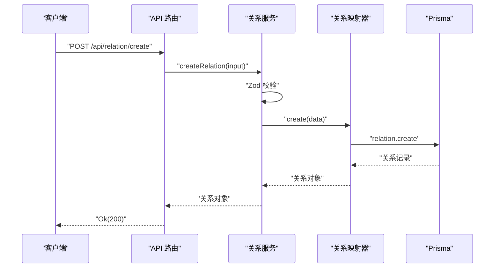
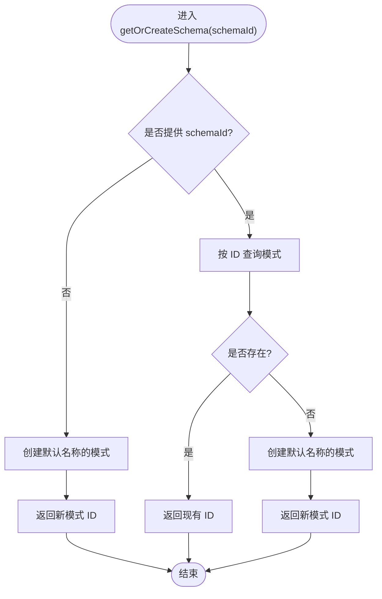
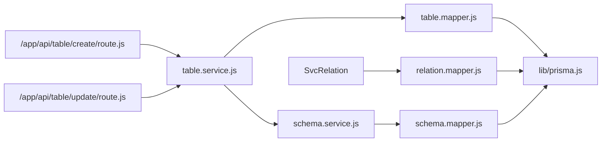

# 服务层架构

<cite>
**本文引用的文件**
- [src/server/services/table.service.js](file://src/server/services/table.service.js)
- [src/server/services/relation.service.js](file://src/server/services/relation.service.js)
- [src/server/services/schema.service.js](file://src/server/services/schema.service.js)
- [src/server/mappers/table.mapper.js](file://src/server/mappers/table.mapper.js)
- [src/server/mappers/relation.mapper.js](file://src/server/mappers/relation.mapper.js)
- [src/server/mappers/schema.mapper.js](file://src/server/mappers/schema.mapper.js)
- [src/server/schemas/table.schema.js](file://src/server/schemas/table.schema.js)
- [src/server/schemas/relation.schema.js](file://src/server/schemas/relation.schema.js)
- [src/server/schemas/schema.schema.js](file://src/server/schemas/schema.schema.js)
- [src/lib/prisma.js](file://src/lib/prisma.js)
- [src/server/lib/response.js](file://src/server/lib/response.js)
- [src/server/lib/withLogger.js](file://src/server/lib/withLogger.js)
- [src/app/api/table/create/route.js](file://src/app/api/table/create/route.js)
- [src/app/api/table/update/route.js](file://src/app/api/table/update/route.js)
- [package.json](file://package.json)
</cite>

## 目录
1. [简介](#简介)
2. [项目结构](#项目结构)
3. [核心组件](#核心组件)
4. [架构总览](#架构总览)
5. [详细组件分析](#详细组件分析)
6. [依赖分析](#依赖分析)
7. [性能考虑](#性能考虑)
8. [故障排查指南](#故障排查指南)
9. [结论](#结论)
10. [附录](#附录)

## 简介
本文件系统化梳理 Vibe DB 的服务层架构，聚焦业务逻辑层的设计与实现，明确表服务、关系服务与模式服务的职责边界与交互关系；解释服务层的依赖注入方式、错误处理与事务管理机制；阐述服务方法的调用流程、参数校验与返回值处理；给出服务层与数据访问层的接口设计、缓存策略与性能优化建议，并提供扩展指南、测试策略与监控方案，为业务逻辑开发提供可操作的架构参考。

## 项目结构
服务层位于 src/server/services，围绕“表”“关系”“模式”三大领域模型构建，每个服务通过对应的映射器（mapper）访问数据库，使用 Zod 模式进行输入校验，并在 API 层通过统一的响应封装与日志中间件对外暴露。

图表来源
- [src/app/api/table/create/route.js:1-16](file://src/app/api/table/create/route.js#L1-L16)
- [src/app/api/table/update/route.js:1-16](file://src/app/api/table/update/route.js#L1-L16)
- [src/server/services/table.service.js:1-38](file://src/server/services/table.service.js#L1-L38)
- [src/server/services/relation.service.js:1-26](file://src/server/services/relation.service.js#L1-L26)
- [src/server/services/schema.service.js:1-26](file://src/server/services/schema.service.js#L1-L26)
- [src/server/mappers/table.mapper.js:1-110](file://src/server/mappers/table.mapper.js#L1-L110)
- [src/server/mappers/relation.mapper.js:1-28](file://src/server/mappers/relation.mapper.js#L1-L28)
- [src/server/mappers/schema.mapper.js:1-35](file://src/server/mappers/schema.mapper.js#L1-L35)
- [src/lib/prisma.js:1-16](file://src/lib/prisma.js#L1-L16)

章节来源
- [src/server/services/table.service.js:1-38](file://src/server/services/table.service.js#L1-L38)
- [src/server/services/relation.service.js:1-26](file://src/server/services/relation.service.js#L1-L26)
- [src/server/services/schema.service.js:1-26](file://src/server/services/schema.service.js#L1-L26)
- [src/server/mappers/table.mapper.js:1-110](file://src/server/mappers/table.mapper.js#L1-L110)
- [src/server/mappers/relation.mapper.js:1-28](file://src/server/mappers/relation.mapper.js#L1-L28)
- [src/server/mappers/schema.mapper.js:1-35](file://src/server/mappers/schema.mapper.js#L1-L35)
- [src/lib/prisma.js:1-16](file://src/lib/prisma.js#L1-L16)

## 核心组件
- 表服务（table.service.js）
  - 职责：查询、创建、更新、软删除表；在创建时委派模式服务确保存在有效模式 ID。
  - 关键点：参数校验使用 Zod；调用映射器执行数据库操作；对字段与索引采用全量替换策略。
- 关系服务（relation.service.js）
  - 职责：查询、创建、更新、删除关系；参数校验严格限制枚举与必填项。
  - 关键点：无跨模型事务需求，直接委托映射器。
- 模式服务（schema.service.js）
  - 职责：列出所有模式；创建新模式；提供“获取或创建”能力以保证后续写入可用。
  - 关键点：在创建表时被表服务调用，保障 schemaId 有效性。
- 映射器（mapper）
  - 职责：封装具体的数据访问细节，屏蔽 Prisma 使用差异；提供事务、聚合查询与默认值处理。
  - 关键点：表映射器在更新时使用事务包裹字段与索引的全量替换；提供包含字段与索引的查询视图。
- 数据库客户端（lib/prisma.js）
  - 职责：集中初始化 Prisma 客户端与适配器，支持全局缓存避免重复实例化。
  - 关键点：生产环境禁用全局缓存以避免内存泄漏风险。
- API 路由与响应封装（/app/api/*）
  - 职责：接收请求体、调用服务层、返回标准化响应；统一日志与错误处理。
  - 关键点：withLogger 中间件记录请求/响应与异常；Ok/BadRequest 统一返回格式。

章节来源
- [src/server/services/table.service.js:1-38](file://src/server/services/table.service.js#L1-L38)
- [src/server/services/relation.service.js:1-26](file://src/server/services/relation.service.js#L1-L26)
- [src/server/services/schema.service.js:1-26](file://src/server/services/schema.service.js#L1-L26)
- [src/server/mappers/table.mapper.js:1-110](file://src/server/mappers/table.mapper.js#L1-L110)
- [src/server/mappers/relation.mapper.js:1-28](file://src/server/mappers/relation.mapper.js#L1-L28)
- [src/server/mappers/schema.mapper.js:1-35](file://src/server/mappers/schema.mapper.js#L1-L35)
- [src/lib/prisma.js:1-16](file://src/lib/prisma.js#L1-L16)
- [src/server/lib/response.js:1-14](file://src/server/lib/response.js#L1-L14)
- [src/server/lib/withLogger.js:1-76](file://src/server/lib/withLogger.js#L1-L76)

## 架构总览
服务层采用“领域服务 + 映射器 + 数据访问”的分层设计，API 层仅负责编排与输出，服务层承担业务规则与跨模型协调，映射器封装数据访问细节，Prisma 提供 ORM 能力。

图表来源
- [src/server/lib/withLogger.js:37-75](file://src/server/lib/withLogger.js#L37-L75)
- [src/server/services/table.service.js:1-38](file://src/server/services/table.service.js#L1-L38)
- [src/server/mappers/table.mapper.js:1-110](file://src/server/mappers/table.mapper.js#L1-L110)
- [src/lib/prisma.js:1-16](file://src/lib/prisma.js#L1-L16)

## 详细组件分析

### 表服务（table.service.js）
- 职责与边界
  - 查询：按模式 ID 获取表列表。
  - 创建：解析输入、委派模式服务获取有效模式 ID、创建表并返回包含字段与索引的完整视图。
  - 更新：解析输入、更新表基础信息；对字段与索引执行全量替换（删除旧项、批量插入新项），并在事务中保证一致性。
  - 删除：软删除（enable=false）。
- 参数校验
  - 使用 Zod 模式定义创建与更新的输入约束，如字符串长度、必填性、字段与索引数组结构等。
- 事务与一致性
  - 更新流程在单个事务内完成：更新表元信息、删除旧字段、批量插入新字段、删除旧索引、批量插入新索引，最后返回完整数据。
- 与模式服务协作
  - 创建表前调用“获取或创建”以确保 schemaId 有效，避免后续写入失败。
- 错误处理
  - 对空参数抛出错误；API 层捕获后返回标准化错误响应。

图表来源
- [src/app/api/table/create/route.js:1-16](file://src/app/api/table/create/route.js#L1-L16)
- [src/server/services/table.service.js:11-24](file://src/server/services/table.service.js#L11-L24)
- [src/server/mappers/table.mapper.js:17-47](file://src/server/mappers/table.mapper.js#L17-L47)
- [src/lib/prisma.js:1-16](file://src/lib/prisma.js#L1-L16)

章节来源
- [src/server/services/table.service.js:1-38](file://src/server/services/table.service.js#L1-L38)
- [src/server/schemas/table.schema.js:1-41](file://src/server/schemas/table.schema.js#L1-L41)
- [src/server/mappers/table.mapper.js:1-110](file://src/server/mappers/table.mapper.js#L1-L110)
- [src/server/services/schema.service.js:17-24](file://src/server/services/schema.service.js#L17-L24)

### 关系服务（relation.service.js）
- 职责与边界
  - 查询：按模式 ID 获取关系列表。
  - 创建/更新/删除：基于 Zod 输入校验后直接委托映射器。
- 参数校验
  - 严格限制关系名称长度、基数枚举、两端表与字段 ID 必填。
- 事务与一致性
  - 当前实现未涉及跨表事务，映射器层直接执行 CRUD。
- 错误处理
  - 对空 ID 抛错；API 层捕获并返回标准化错误响应。

图表来源
- [src/server/services/relation.service.js:10-12](file://src/server/services/relation.service.js#L10-L12)
- [src/server/mappers/relation.mapper.js:11-13](file://src/server/mappers/relation.mapper.js#L11-L13)
- [src/lib/prisma.js:1-16](file://src/lib/prisma.js#L1-L16)

章节来源
- [src/server/services/relation.service.js:1-26](file://src/server/services/relation.service.js#L1-L26)
- [src/server/schemas/relation.schema.js:1-18](file://src/server/schemas/relation.schema.js#L1-L18)
- [src/server/mappers/relation.mapper.js:1-28](file://src/server/mappers/relation.mapper.js#L1-L28)

### 模式服务（schema.service.js）
- 职责与边界
  - 列出所有模式（带统计与排序）。
  - 创建模式（名称与描述）。
  - “获取或创建”：若传入 schemaId 存在则返回其 ID；否则创建默认名称的模式并返回新 ID。
- 参数校验
  - 使用 Zod 校验名称长度与描述长度。
- 与表服务协作
  - 在创建表前调用“获取或创建”，确保 schemaId 有效且存在。

图表来源
- [src/server/services/schema.service.js:17-24](file://src/server/services/schema.service.js#L17-L24)

章节来源
- [src/server/services/schema.service.js:1-26](file://src/server/services/schema.service.js#L1-L26)
- [src/server/schemas/schema.schema.js:1-7](file://src/server/schemas/schema.schema.js#L1-L7)
- [src/server/mappers/schema.mapper.js:1-35](file://src/server/mappers/schema.mapper.js#L1-L35)

### 映射器层（mapper）
- 表映射器
  - 查询：按模式 ID 与启用状态查询，并包含字段与索引，按创建时间升序。
  - 创建：自动填充默认颜色与坐标；同时创建默认主键字段与唯一索引。
  - 更新：事务包裹，先更新表元信息，再全量删除并批量插入字段，再全量删除并批量插入索引，最后返回完整视图。
  - 软删除：更新启用标记。
- 关系映射器
  - 查询：按模式 ID 查询关系列表。
  - CRUD：直接委托 Prisma 执行。
- 模式映射器
  - 查询：选择必要字段并统计表数量，按更新时间倒序。
  - 查找：按 ID 查找。
  - 创建：创建模式记录。

章节来源
- [src/server/mappers/table.mapper.js:1-110](file://src/server/mappers/table.mapper.js#L1-L110)
- [src/server/mappers/relation.mapper.js:1-28](file://src/server/mappers/relation.mapper.js#L1-L28)
- [src/server/mappers/schema.mapper.js:1-35](file://src/server/mappers/schema.mapper.js#L1-L35)

### 数据访问层（lib/prisma.js）
- 初始化：使用适配器连接 PostgreSQL，导出全局单例客户端。
- 环境控制：非生产环境缓存客户端实例，便于开发调试；生产环境不缓存以避免潜在问题。

章节来源
- [src/lib/prisma.js:1-16](file://src/lib/prisma.js#L1-L16)

### API 层与响应封装
- 响应封装：统一返回 {code,data,msg,success} 结构，Ok/BadRequest/NotFound/ServerError 便于前端消费。
- 日志中间件：withLogger 记录请求路径、方法、耗时与状态码；开发环境可选记录请求体；异常时记录错误堆栈并重新抛出。

章节来源
- [src/server/lib/response.js:1-14](file://src/server/lib/response.js#L1-L14)
- [src/server/lib/withLogger.js:1-76](file://src/server/lib/withLogger.js#L1-L76)
- [src/app/api/table/create/route.js:1-16](file://src/app/api/table/create/route.js#L1-L16)
- [src/app/api/table/update/route.js:1-16](file://src/app/api/table/update/route.js#L1-L16)

## 依赖分析
- 服务到映射器：表/关系/模式服务均直接依赖对应映射器。
- 映射器到 Prisma：映射器统一通过 lib/prisma.js 导入 Prisma 客户端。
- API 到服务：API 路由导入服务层并调用；服务层不反向依赖 API。
- 参数校验：各服务依赖对应 schema 文件进行输入校验。
- 依赖注入方式：当前采用 ES Module 直接导入，未使用显式的 IoC 容器；可通过工厂或注入器在扩展阶段引入。

图表来源
- [src/app/api/table/create/route.js:1-16](file://src/app/api/table/create/route.js#L1-L16)
- [src/app/api/table/update/route.js:1-16](file://src/app/api/table/update/route.js#L1-L16)
- [src/server/services/table.service.js:1-38](file://src/server/services/table.service.js#L1-L38)
- [src/server/services/relation.service.js:1-26](file://src/server/services/relation.service.js#L1-L26)
- [src/server/services/schema.service.js:1-26](file://src/server/services/schema.service.js#L1-L26)
- [src/server/mappers/table.mapper.js:1-110](file://src/server/mappers/table.mapper.js#L1-L110)
- [src/server/mappers/relation.mapper.js:1-28](file://src/server/mappers/relation.mapper.js#L1-L28)
- [src/server/mappers/schema.mapper.js:1-35](file://src/server/mappers/schema.mapper.js#L1-L35)
- [src/lib/prisma.js:1-16](file://src/lib/prisma.js#L1-L16)

章节来源
- [src/server/services/table.service.js:1-38](file://src/server/services/table.service.js#L1-L38)
- [src/server/services/relation.service.js:1-26](file://src/server/services/relation.service.js#L1-L26)
- [src/server/services/schema.service.js:1-26](file://src/server/services/schema.service.js#L1-L26)
- [src/server/mappers/table.mapper.js:1-110](file://src/server/mappers/table.mapper.js#L1-L110)
- [src/server/mappers/relation.mapper.js:1-28](file://src/server/mappers/relation.mapper.js#L1-L28)
- [src/server/mappers/schema.mapper.js:1-35](file://src/server/mappers/schema.mapper.js#L1-L35)
- [src/lib/prisma.js:1-16](file://src/lib/prisma.js#L1-L16)

## 性能考虑
- 事务批处理
  - 表更新时对字段与索引采用“删除旧项 + 批量插入新项”的策略，减少多次往返；建议在字段/索引规模较大时评估分批插入与去重策略，避免单事务过大导致锁竞争。
- 查询优化
  - 表查询包含字段与索引并按创建时间排序，建议在字段/索引数量增长时增加索引覆盖查询或分页。
- 连接与实例
  - Prisma 客户端为全局单例，避免重复初始化带来的开销；生产环境禁用全局缓存以降低内存占用风险。
- 缓存策略
  - 当前未实现应用层缓存；可在高频只读场景（如模式列表）引入短期缓存（如内存缓存或 Redis），并设置失效策略与一致性刷新。
- 并发与锁
  - 软删除与全量替换可能引发行级锁；建议在高并发写入场景下拆分更新步骤或引入乐观锁版本号。

[本节为通用性能指导，无需特定文件来源]

## 故障排查指南
- 常见错误类型
  - 参数校验失败：Zod 校验会抛出错误消息，API 层捕获后返回 400。
  - 空 ID：服务层对空 ID 抛错；API 层返回 400。
  - 数据库异常：withLogger 记录错误堆栈；生产环境建议结合日志系统与告警。
- 排查步骤
  - 检查 API 路由是否正确解析请求体与调用服务层。
  - 检查服务层参数校验是否通过，必要时开启开发日志查看请求体。
  - 检查映射器事务是否成功提交，关注字段/索引全量替换逻辑。
  - 检查 Prisma 客户端连接配置与数据库连通性。
- 监控建议
  - 记录请求耗时、状态码分布与错误堆栈。
  - 对事务执行时间与失败率进行指标采集与告警。

章节来源
- [src/server/lib/response.js:1-14](file://src/server/lib/response.js#L1-L14)
- [src/server/lib/withLogger.js:66-73](file://src/server/lib/withLogger.js#L66-L73)
- [src/server/services/table.service.js:33-36](file://src/server/services/table.service.js#L33-L36)
- [src/server/services/relation.service.js:21-24](file://src/server/services/relation.service.js#L21-L24)

## 结论
服务层通过清晰的职责划分与严格的参数校验，实现了表、关系、模式三大领域的统一业务编排；映射器层将数据访问细节抽象化，配合 Prisma 实现了事务与批量操作；API 层通过日志中间件与响应封装提供了可观测与一致性的对外接口。整体架构具备良好的扩展性与可维护性，适合在保持一致性的同时逐步引入缓存、监控与更复杂的事务策略。

[本节为总结，无需特定文件来源]

## 附录

### 服务方法调用流程与参数校验清单
- 表服务
  - 查询：schemaId 必填。
  - 创建：schemaId、name、color、positionX、positionY（可选）。
  - 更新：id 必填，其余字段可选；fields 与 indexes 数组结构校验。
  - 删除：id 必填。
- 关系服务
  - 查询：schemaId 必填。
  - 创建：schemaId、name、cardinality、sourceTableId、sourceFieldId、targetTableId、targetFieldId。
  - 更新：id 必填，name 或 cardinality 可选。
  - 删除：id 必填。
- 模式服务
  - 查询：无参数。
  - 创建：name 必填，description 可选。
  - 获取或创建：schemaId 可选。

章节来源
- [src/server/schemas/table.schema.js:1-41](file://src/server/schemas/table.schema.js#L1-L41)
- [src/server/schemas/relation.schema.js:1-18](file://src/server/schemas/relation.schema.js#L1-L18)
- [src/server/schemas/schema.schema.js:1-7](file://src/server/schemas/schema.schema.js#L1-L7)
- [src/server/services/table.service.js:6-36](file://src/server/services/table.service.js#L6-L36)
- [src/server/services/relation.service.js:5-24](file://src/server/services/relation.service.js#L5-L24)
- [src/server/services/schema.service.js:5-24](file://src/server/services/schema.service.js#L5-L24)

### 服务层扩展指南
- 引入依赖注入
  - 将服务与映射器通过工厂或注入器解耦，便于替换实现与单元测试。
- 缓存策略
  - 针对只读查询（如模式列表）引入短期缓存；对写入后需立即可见的场景采用失效策略。
- 监控与告警
  - 采集请求耗时、成功率、错误分布与事务耗时；对异常进行分级告警。
- 测试策略
  - 单元测试：针对服务层方法与映射器事务进行隔离测试；模拟 Prisma 客户端。
  - 集成测试：通过 API 路由调用链路验证端到端行为；覆盖参数校验与错误分支。
  - 回归测试：在字段/索引全量替换与软删除场景建立快照回归。

章节来源
- [src/server/lib/withLogger.js:1-76](file://src/server/lib/withLogger.js#L1-L76)
- [src/lib/prisma.js:1-16](file://src/lib/prisma.js#L1-L16)