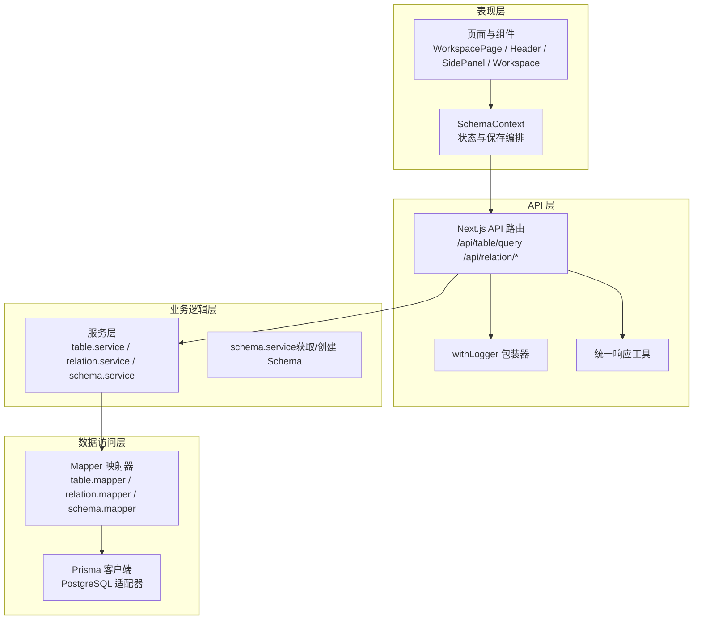
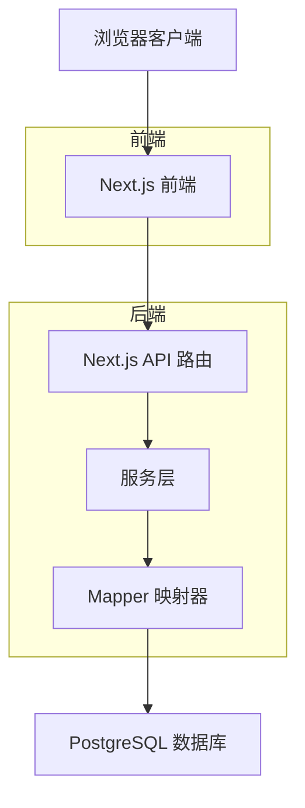
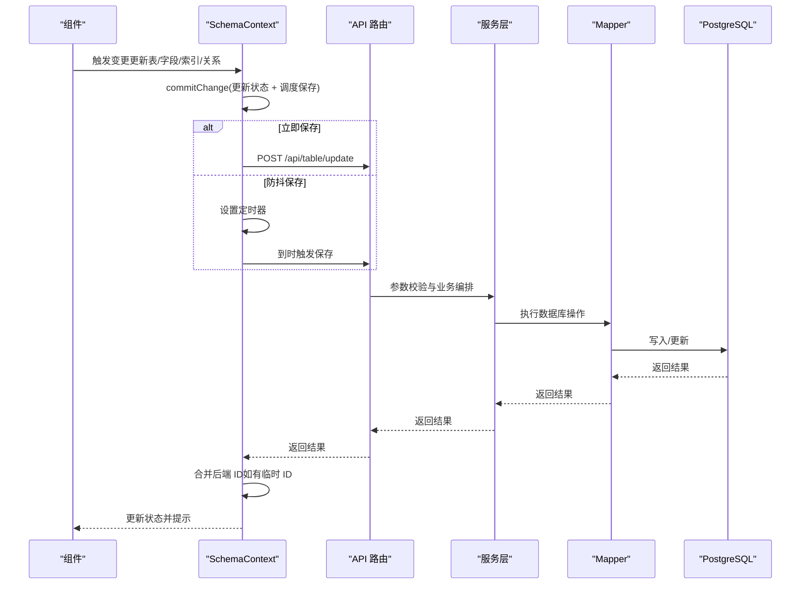
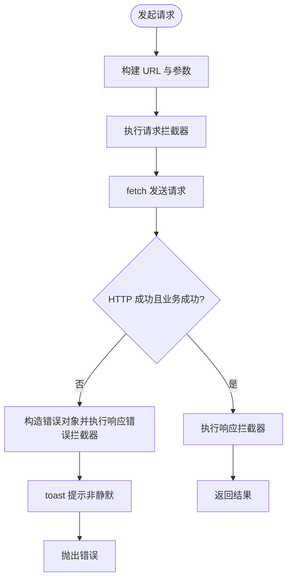
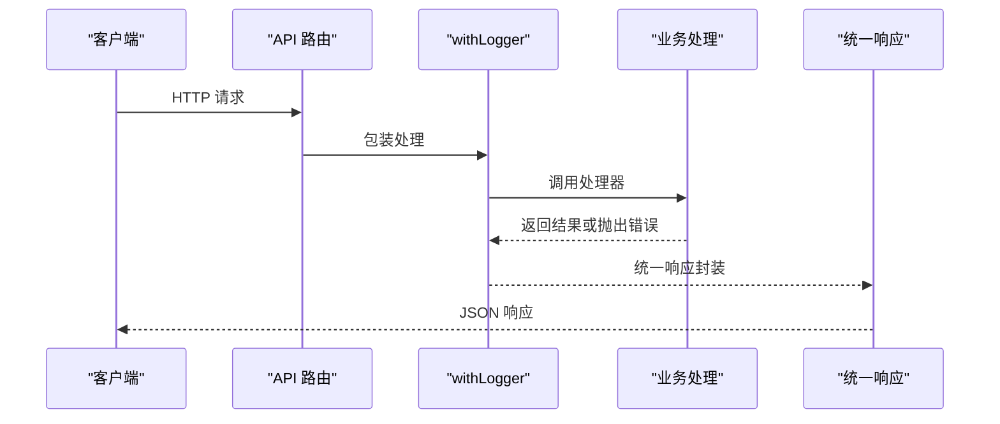
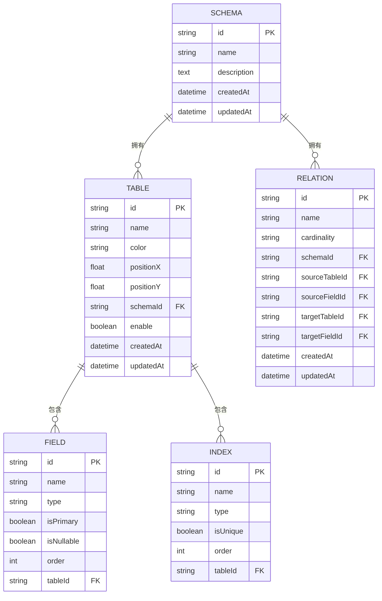
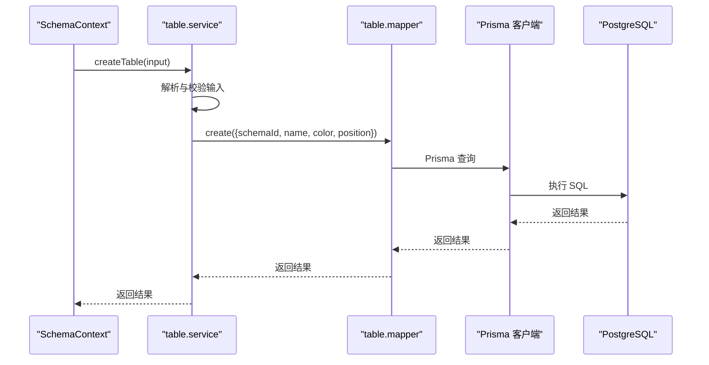
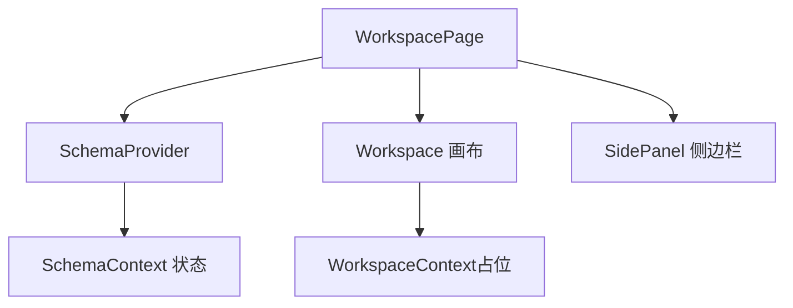
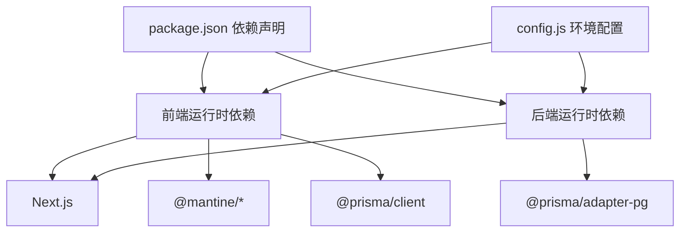
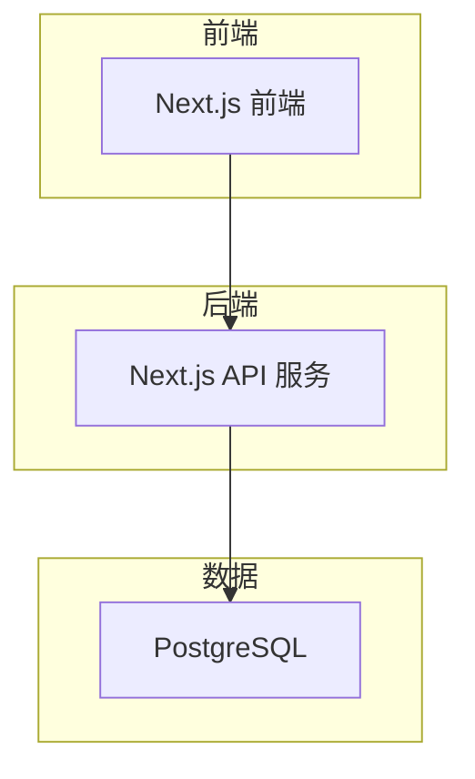

# 架构设计

<cite>
**本文引用的文件**
- [package.json](file://package.json)
- [layout.jsx](file://src/app/layout.jsx)
- [Providers.jsx](file://src/components/Providers.jsx)
- [config.js](file://src/lib/config.js)
- [schema.prisma](file://prisma/schema.prisma)
- [route.js（表查询）](file://src/app/api/table/query/route.js)
- [table.service.js](file://src/server/services/table.service.js)
- [response.js](file://src/server/lib/response.js)
- [withLogger.js](file://src/server/lib/withLogger.js)
- [prisma.js](file://src/lib/prisma.js)
- [SchemaContext.js](file://src/features/schema/SchemaContext.js)
- [request.js](file://src/lib/request.js)
- [page.jsx（工作区）](file://src/app/workspace/[id]/page.jsx)
- [WorkspaceContext.js](file://src/features/canvas/WorkspaceContext.js)
</cite>

## 目录
1. [简介](#简介)
2. [项目结构](#项目结构)
3. [核心组件](#核心组件)
4. [架构总览](#架构总览)
5. [详细组件分析](#详细组件分析)
6. [依赖分析](#依赖分析)
7. [性能考量](#性能考量)
8. [故障排查指南](#故障排查指南)
9. [结论](#结论)
10. [附录](#附录)

## 简介
本架构设计文档面向 Vibe DB 的前端与后端分层架构，围绕“表现层 → API 层 → 业务逻辑层 → 数据访问层”的分层组织，结合组件化设计模式（React Context）、服务层架构与数据流设计，给出系统边界、组件交互关系与数据流向图，并阐述技术决策、性能优化策略与可扩展性设计。文档同时覆盖前后端分离、API 设计原则与错误处理机制，为架构师与高级开发者提供深入的技术洞察。

## 项目结构
Vibe DB 采用 Next.js App Router 结构，按功能域划分目录，前端通过 React 组件与 Context 管理状态，后端以 Next.js API 路由承载服务层，使用 Prisma 作为 ORM 访问 PostgreSQL。

- 表现层（UI 层）
  - Next.js App Router 页面与组件，主题与通知由 Provider 提供。
- API 层（Next.js API 路由）
  - 路由处理器封装日志与统一响应。
- 业务逻辑层（服务层）
  - 服务层负责参数校验、业务编排与调用 Mapper。
- 数据访问层（Mapper + Prisma）
  - Mapper 负责数据映射与数据库操作；Prisma 通过适配器连接 PostgreSQL。

**图表来源**
- [page.jsx（工作区）:1-121](file://src/app/workspace/[id]/page.jsx#L1-L121)
- [SchemaContext.js:1-392](file://src/features/schema/SchemaContext.js#L1-L392)
- [route.js（表查询）:1-20](file://src/app/api/table/query/route.js#L1-L20)
- [withLogger.js:1-76](file://src/server/lib/withLogger.js#L1-L76)
- [response.js:1-14](file://src/server/lib/response.js#L1-L14)
- [table.service.js:1-38](file://src/server/services/table.service.js#L1-L38)
- [prisma.js:1-16](file://src/lib/prisma.js#L1-L16)
- [schema.prisma:1-69](file://prisma/schema.prisma#L1-L69)

**章节来源**
- [package.json:1-55](file://package.json#L1-L55)
- [layout.jsx:1-19](file://src/app/layout.jsx#L1-L19)
- [Providers.jsx:1-36](file://src/components/Providers.jsx#L1-L36)

## 核心组件
- 前端 Provider 与主题
  - 根布局通过 Providers 注入主题与全局通知，确保 UI 一致性与用户反馈。
- React Context 状态管理
  - SchemaContext 负责表、字段、索引与关系的增删改查与保存编排，包含防抖、去重与排队保存机制，避免频繁请求与输入框光标丢失。
- API 路由与服务层
  - Next.js API 路由通过 withLogger 包装统一记录请求/响应日志；服务层进行参数校验与业务编排；Mapper 负责数据映射。
- 数据访问层
  - Prisma 客户端通过 PostgreSQL 适配器连接数据库，模型定义于 schema.prisma。

**章节来源**
- [Providers.jsx:1-36](file://src/components/Providers.jsx#L1-L36)
- [SchemaContext.js:1-392](file://src/features/schema/SchemaContext.js#L1-L392)
- [route.js（表查询）:1-20](file://src/app/api/table/query/route.js#L1-L20)
- [withLogger.js:1-76](file://src/server/lib/withLogger.js#L1-L76)
- [table.service.js:1-38](file://src/server/services/table.service.js#L1-L38)
- [prisma.js:1-16](file://src/lib/prisma.js#L1-L16)
- [schema.prisma:1-69](file://prisma/schema.prisma#L1-L69)

## 架构总览
Vibe DB 采用前后端分离架构：前端 Next.js App Router 负责页面与交互，后端 Next.js API 路由提供 REST 风格接口，服务层进行业务编排，Mapper 与 Prisma 访问数据库。系统边界清晰，职责分离明确，便于扩展与维护。

**图表来源**
- [page.jsx（工作区）:1-121](file://src/app/workspace/[id]/page.jsx#L1-L121)
- [route.js（表查询）:1-20](file://src/app/api/table/query/route.js#L1-L20)
- [table.service.js:1-38](file://src/server/services/table.service.js#L1-L38)
- [prisma.js:1-16](file://src/lib/prisma.js#L1-L16)
- [schema.prisma:1-69](file://prisma/schema.prisma#L1-L69)

## 详细组件分析

### 前端：React Context 状态管理模式
- 设计目标
  - 将表、字段、索引与关系的状态集中管理，统一保存流程，减少重复请求与状态不一致。
- 关键机制
  - 防抖保存：对输入类变更采用延迟保存，避免频繁请求。
  - 立即保存：对开关/选择类变更即时保存，提升交互反馈。
  - 去重与排队：同一实体正在保存时，标记 pending 并在完成后重试，避免并发写入冲突。
  - 临时 ID：创建阶段使用临时 ID，后端返回真实 ID 后仅合并 ID，保留本地编辑内容，避免输入框光标丢失。
- 保存流程（序列图）

**图表来源**
- [SchemaContext.js:147-173](file://src/features/schema/SchemaContext.js#L147-L173)
- [SchemaContext.js:86-135](file://src/features/schema/SchemaContext.js#L86-L135)
- [route.js（表查询）:1-20](file://src/app/api/table/query/route.js#L1-L20)
- [table.service.js:1-38](file://src/server/services/table.service.js#L1-L38)

**章节来源**
- [SchemaContext.js:1-392](file://src/features/schema/SchemaContext.js#L1-L392)

### 前端：请求与错误处理
- 统一请求工具
  - 支持请求/响应拦截器、超时控制、静默模式与统一错误处理。
  - 对业务层返回的 success 字段进行判断，非 2xx 或 success=false 视为错误。
- 错误处理
  - 默认弹出 toast 提示；支持静默模式避免干扰用户。
  - 超时与网络异常分别处理，统一抛出带 code 的错误对象。

**图表来源**
- [request.js:36-121](file://src/lib/request.js#L36-L121)

**章节来源**
- [request.js:1-142](file://src/lib/request.js#L1-L142)

### 后端：API 设计与日志
- API 设计原则
  - REST 风格路径：/api/{resource}/{action}。
  - 统一响应格式：包含 code、msg、success、data。
  - 参数校验：在服务层使用 Zod schema 进行输入校验。
- 日志与错误
  - withLogger 包装器统一记录请求/响应日志与错误堆栈，开发环境额外记录请求体。
  - 使用统一响应工具输出标准错误响应。

**图表来源**
- [route.js（表查询）:1-20](file://src/app/api/table/query/route.js#L1-L20)
- [withLogger.js:37-75](file://src/server/lib/withLogger.js#L37-L75)
- [response.js:1-14](file://src/server/lib/response.js#L1-L14)

**章节来源**
- [route.js（表查询）:1-20](file://src/app/api/table/query/route.js#L1-L20)
- [withLogger.js:1-76](file://src/server/lib/withLogger.js#L1-L76)
- [response.js:1-14](file://src/server/lib/response.js#L1-L14)

### 数据模型与访问层
- 数据模型
  - Schema、Table、Field、Index、Relation 五类模型，定义主键、外键、默认值与启用状态。
- 访问层
  - Prisma 客户端通过 PostgreSQL 适配器连接数据库，生成类型安全的查询 API。
  - Mapper 负责将领域对象映射为数据库操作，服务层调用 Mapper 完成业务操作。

**图表来源**
- [schema.prisma:1-69](file://prisma/schema.prisma#L1-L69)
- [prisma.js:1-16](file://src/lib/prisma.js#L1-L16)

**章节来源**
- [schema.prisma:1-69](file://prisma/schema.prisma#L1-L69)
- [prisma.js:1-16](file://src/lib/prisma.js#L1-L16)

### 服务层架构与数据流
- 服务层职责
  - 参数校验（Zod schema）、业务编排（如获取/创建 Schema）、调用 Mapper。
- 数据流
  - 前端通过 SchemaContext 调用服务层 API，服务层经 Mapper 访问数据库，返回统一响应给前端。

**图表来源**
- [SchemaContext.js:181-202](file://src/features/schema/SchemaContext.js#L181-L202)
- [table.service.js:11-24](file://src/server/services/table.service.js#L11-L24)
- [prisma.js:1-16](file://src/lib/prisma.js#L1-L16)
- [schema.prisma:1-69](file://prisma/schema.prisma#L1-L69)

**章节来源**
- [table.service.js:1-38](file://src/server/services/table.service.js#L1-L38)

### 工作区页面与上下文边界
- 页面职责
  - WorkspacePage 负责布局与面板切换，注入 SchemaProvider，承载画布与侧边栏。
- 上下文边界
  - SchemaContext 管理 Schema 级别的状态与操作；WorkspaceContext 管理画布级状态（当前文件存在，但未实现具体逻辑）。

**图表来源**
- [page.jsx（工作区）:80-121](file://src/app/workspace/[id]/page.jsx#L80-L121)
- [WorkspaceContext.js:1-5](file://src/features/canvas/WorkspaceContext.js#L1-L5)
- [SchemaContext.js:1-392](file://src/features/schema/SchemaContext.js#L1-L392)

**章节来源**
- [page.jsx（工作区）:1-121](file://src/app/workspace/[id]/page.jsx#L1-L121)
- [WorkspaceContext.js:1-5](file://src/features/canvas/WorkspaceContext.js#L1-L5)

## 依赖分析
- 前端依赖
  - Next.js、@mantine/*、@prisma/client、@codemirror/*、@xyflow/react、zod、pino、sonner 等。
- 后端依赖
  - Next.js、Prisma、@prisma/adapter-pg、pino。
- 配置与环境
  - 通过 config.js 读取环境变量，区分开发/生产日志级别与数据库连接。

**图表来源**
- [package.json:16-53](file://package.json#L16-L53)
- [config.js:1-33](file://src/lib/config.js#L1-L33)

**章节来源**
- [package.json:1-55](file://package.json#L1-L55)
- [config.js:1-33](file://src/lib/config.js#L1-L33)

## 性能考量
- 前端性能
  - 防抖保存与去重排队：降低请求频率，避免输入框光标丢失与重复渲染。
  - 引用与不可变更新：通过 ref 保持最新状态，减少不必要的 setTables 调用。
- 后端性能
  - withLogger 统计耗时，便于定位慢请求；统一响应减少分支判断开销。
  - Prisma 适配器与连接池：合理配置连接数与查询缓存。
- 网络与可用性
  - 请求超时控制与静默模式：避免阻塞用户交互；统一错误提示提升体验。

[本节为通用性能建议，无需特定文件引用]

## 故障排查指南
- 常见问题
  - 请求超时：检查网络与后端日志，确认 withLogger 输出的耗时与状态码。
  - 业务失败：查看统一响应中的 code 与 msg，结合服务层 schema 校验信息定位。
  - 输入异常：确认前端 request 工具对非 2xx 与 success=false 的处理是否生效。
- 排查步骤
  - 开启开发日志，观察 withLogger 的请求/响应日志。
  - 检查 Prisma 客户端连接字符串与数据库连通性。
  - 核对 SchemaContext 的保存流程，确认防抖与排队逻辑是否触发。

**章节来源**
- [withLogger.js:37-75](file://src/server/lib/withLogger.js#L37-L75)
- [response.js:1-14](file://src/server/lib/response.js#L1-L14)
- [request.js:78-121](file://src/lib/request.js#L78-L121)
- [prisma.js:1-16](file://src/lib/prisma.js#L1-L16)

## 结论
Vibe DB 通过清晰的分层架构与组件化设计，实现了前后端分离、可扩展的服务层与稳健的前端状态管理。React Context 的保存编排机制有效平衡了用户体验与后端压力；Next.js API 路由与 Prisma 的组合提供了简洁而强大的数据访问能力。未来可在以下方面持续演进：引入更细粒度的鉴权与审计、增强缓存与批处理能力、完善测试与可观测性体系。

[本节为总结性内容，无需特定文件引用]

## 附录
- 部署拓扑（概念示意）
  - 前端：Next.js 构建产物部署于静态托管或边缘网络。
  - 后端：Next.js 服务运行于容器或云函数，连接外部 PostgreSQL。
  - 数据库：PostgreSQL 实例，Prisma 适配器负责连接与迁移。

[本图为概念性拓扑，无需图表来源]