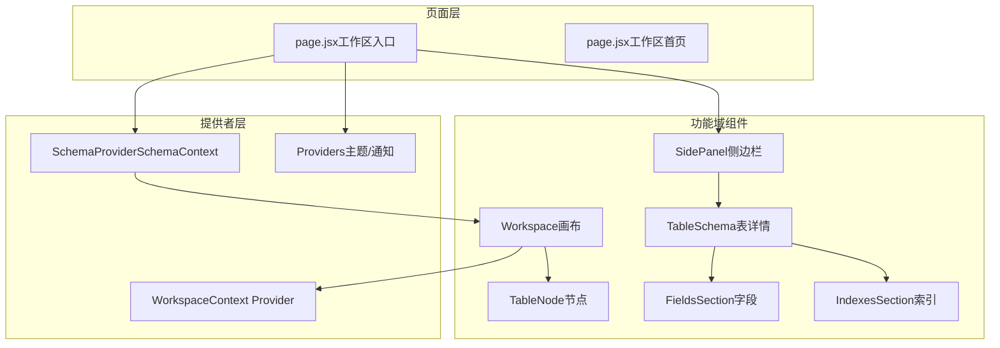
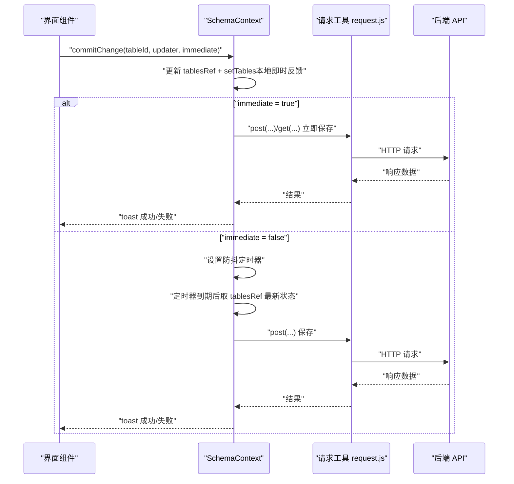
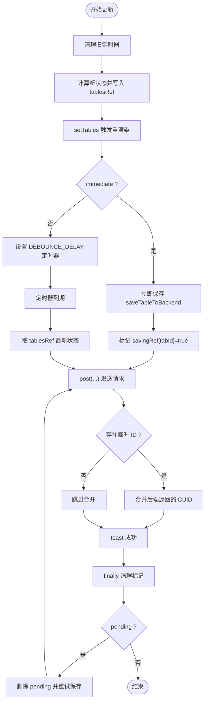
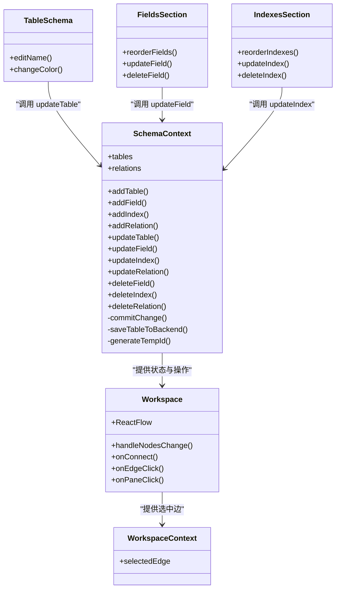
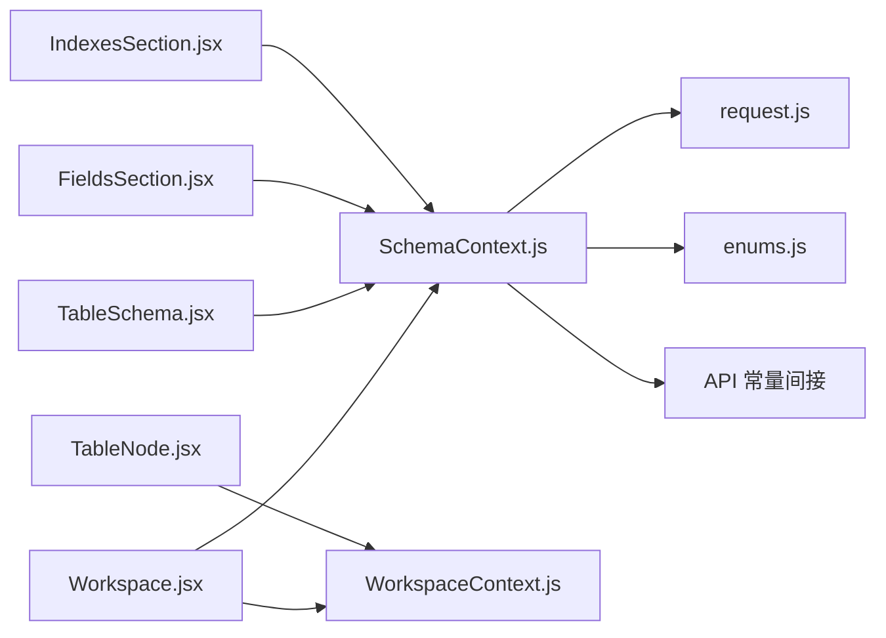

# 状态管理系统

<cite>
**本文引用的文件**
- [SchemaContext.js](file://src/features/schema/SchemaContext.js)
- [WorkspaceContext.js](file://src/features/canvas/WorkspaceContext.js)
- [Providers.jsx](file://src/components/Providers.jsx)
- [page.jsx（工作区入口）](file://src/app/workspace/[id]/page.jsx)
- [page.jsx（工作区首页）](file://src/app/workspace/page.jsx)
- [request.js](file://src/lib/request.js)
- [enums.js](file://src/lib/enums.js)
- [Workspace.jsx](file://src/features/canvas/Workspace.jsx)
- [TableSchema.jsx](file://src/features/schema/TableSchema.jsx)
- [FieldsSection.jsx](file://src/features/schema/FieldsSection.jsx)
- [IndexesSection.jsx](file://src/features/schema/IndexesSection.jsx)
- [TableNode.jsx](file://src/features/canvas/TableNode.jsx)
- [SidePanel.jsx](file://src/features/schema/SidePanel.jsx)
</cite>

## 目录
1. [简介](#简介)
2. [项目结构](#项目结构)
3. [核心组件](#核心组件)
4. [架构总览](#架构总览)
5. [详细组件分析](#详细组件分析)
6. [依赖分析](#依赖分析)
7. [性能考量](#性能考量)
8. [故障排查指南](#故障排查指南)
9. [结论](#结论)
10. [附录](#附录)

## 简介
本文件系统性阐述 Vibe DB 的状态管理系统，重点围绕基于 React Context 的全局状态架构，包括 SchemaContext 与 WorkspaceContext 的设计与实现；详细说明状态结构、状态更新机制、防抖保存策略与乐观更新策略；解释状态持久化方案、错误处理与回滚思路；并提供状态流转图、组件状态共享模式与性能优化策略，帮助开发者理解与扩展状态管理功能。

## 项目结构
Vibe DB 的状态管理采用“页面级 Provider + 功能域 Context”的分层组织方式：
- 页面入口负责注入 SchemaProvider，并向子树提供 schema 级别的全局状态。
- SchemaContext 提供表、字段、索引、关系等数据库模型的状态与操作接口。
- WorkspaceContext 提供画布交互上下文（如选中边信息），用于节点高亮与连接等交互。
- 通用 UI 与提示由 Providers 注入主题与通知系统。

图表来源
- [page.jsx（工作区入口）:80-120](file://src/app/workspace/[id]/page.jsx#L80-L120)
- [SchemaContext.js:43-391](file://src/features/schema/SchemaContext.js#L43-L391)
- [Workspace.jsx:45-218](file://src/features/canvas/Workspace.jsx#L45-L218)
- [WorkspaceContext.js:1-5](file://src/features/canvas/WorkspaceContext.js#L1-L5)
- [Providers.jsx:9-35](file://src/components/Providers.jsx#L9-L35)
- [SidePanel.jsx:22-38](file://src/features/schema/SidePanel.jsx#L22-L38)
- [TableSchema.jsx:12-114](file://src/features/schema/TableSchema.jsx#L12-L114)
- [FieldsSection.jsx:148-201](file://src/features/schema/FieldsSection.jsx#L148-L201)
- [IndexesSection.jsx:123-186](file://src/features/schema/IndexesSection.jsx#L123-L186)
- [TableNode.jsx:42-152](file://src/features/canvas/TableNode.jsx#L42-L152)

章节来源
- [page.jsx（工作区入口）:80-120](file://src/app/workspace/[id]/page.jsx#L80-L120)
- [page.jsx（工作区首页）:7-22](file://src/app/workspace/page.jsx#L7-L22)
- [Providers.jsx:9-35](file://src/components/Providers.jsx#L9-L35)

## 核心组件
- SchemaContext（全局 Schema 状态）
  - 状态结构：tables（表集合）、relations（关系集合）
  - 主要职责：加载/保存表、字段、索引、关系；生成临时 ID；调度保存；乐观更新关系
  - 关键导出：useSchema、SchemaProvider
- WorkspaceContext（画布交互上下文）
  - 状态结构：selectedEdge（当前选中的关系边）
  - 主要职责：在画布组件树中传递选中边信息，驱动节点高亮与交互
  - 关键导出：useWorkspace、WorkspaceContext Provider
- Providers（UI/通知）
  - 注入 Mantine 主题与 Sonner 通知，统一视觉风格与错误提示

章节来源
- [SchemaContext.js:43-391](file://src/features/schema/SchemaContext.js#L43-L391)
- [WorkspaceContext.js:1-5](file://src/features/canvas/WorkspaceContext.js#L1-L5)
- [Providers.jsx:9-35](file://src/components/Providers.jsx#L9-L35)

## 架构总览
SchemaContext 作为全局状态中枢，通过 commitChange 抽象统一的状态更新流程，结合 ref 与定时器实现“先本地更新、再异步保存”的体验与性能平衡。WorkspaceContext 以轻量上下文承载画布交互状态，与 SchemaContext 解耦。

图表来源
- [SchemaContext.js:147-173](file://src/features/schema/SchemaContext.js#L147-L173)
- [request.js:36-121](file://src/lib/request.js#L36-L121)

## 详细组件分析

### SchemaContext 设计与实现
- 状态结构
  - tables：每个表包含 id、name、color、position、fields、indexes
  - relations：每个关系包含 id、name、cardinality、source/target 表与字段
- 状态更新机制
  - commitChange：统一入口，先同步计算新状态并写入 tablesRef，再决定是否立即保存或延时保存
  - 防抖保存：每个表独立定时器，避免频繁请求；保存期间若有新变更，标记 pending 并在完成后重试
  - 保存去重：同一表正在保存时，新的变更不会重复发起请求，而是等待当前请求完成后自动重试
- 乐观更新策略
  - 关系更新与删除：先本地 setRelations，再异步调用后端；若失败则保持本地状态不变（无自动回滚）
- 序列化/反序列化
  - serializeTable：将内存态转换为后端期望的传输结构（含字段/索引顺序）
  - deserializeTable：将后端返回数据还原为内存态（含 positionX/Y -> position）
- 临时 ID 与后端 CUID 替换
  - 生成 temp-id，创建/新增字段/索引时使用；保存成功后用后端返回的真实 ID 替换，避免输入框光标丢失
- 错误处理与提示
  - 使用 request.js 统一封装请求与拦截器；失败时 toast 提示；超时与网络异常统一处理

图表来源
- [SchemaContext.js:147-173](file://src/features/schema/SchemaContext.js#L147-L173)
- [SchemaContext.js:85-135](file://src/features/schema/SchemaContext.js#L85-L135)

章节来源
- [SchemaContext.js:43-391](file://src/features/schema/SchemaContext.js#L43-L391)

### WorkspaceContext 设计与实现
- 作用：在画布组件树中传递 selectedEdge，用于节点高亮与快捷删除等交互
- 使用：Workspace.jsx 作为 Provider，TableNode 读取上下文进行高亮判断

章节来源
- [WorkspaceContext.js:1-5](file://src/features/canvas/WorkspaceContext.js#L1-L5)
- [Workspace.jsx:45-218](file://src/features/canvas/Workspace.jsx#L45-L218)
- [TableNode.jsx:42-152](file://src/features/canvas/TableNode.jsx#L42-L152)

### 侧边栏与面板组件
- SidePanel：根据 activePanel 渲染 DBML、数据表、关系三个面板
- TableSchema：表详情面板，支持表名编辑、颜色选择（本地预览 + 即时保存）
- FieldsSection：字段列表，支持拖拽排序、类型切换、可空/主键切换、删除字段；输入采用组件内防抖
- IndexesSection：索引列表，支持拖拽排序、类型切换、唯一性切换、删除索引；输入采用组件内防抖

图表来源
- [SchemaContext.js:43-391](file://src/features/schema/SchemaContext.js#L43-L391)
- [Workspace.jsx:45-218](file://src/features/canvas/Workspace.jsx#L45-L218)
- [WorkspaceContext.js:1-5](file://src/features/canvas/WorkspaceContext.js#L1-L5)
- [TableSchema.jsx:12-114](file://src/features/schema/TableSchema.jsx#L12-L114)
- [FieldsSection.jsx:148-201](file://src/features/schema/FieldsSection.jsx#L148-L201)
- [IndexesSection.jsx:123-186](file://src/features/schema/IndexesSection.jsx#L123-L186)

章节来源
- [SidePanel.jsx:22-38](file://src/features/schema/SidePanel.jsx#L22-L38)
- [TableSchema.jsx:12-114](file://src/features/schema/TableSchema.jsx#L12-L114)
- [FieldsSection.jsx:148-201](file://src/features/schema/FieldsSection.jsx#L148-L201)
- [IndexesSection.jsx:123-186](file://src/features/schema/IndexesSection.jsx#L123-L186)

### 状态持久化方案
- 表与关系的持久化：通过 SchemaContext 的 saveTableToBackend 与关系 API 调用实现
- 位置持久化：Workspace.jsx 在节点拖拽结束后立即保存位置，避免防抖带来的体验问题
- 临时 ID 到真实 ID 的替换：创建/新增元素时使用 temp-id，保存成功后用后端返回的 CUID 替换，确保 UI 与后端一致

章节来源
- [SchemaContext.js:85-135](file://src/features/schema/SchemaContext.js#L85-L135)
- [Workspace.jsx:131-162](file://src/features/canvas/Workspace.jsx#L131-L162)

### 错误处理与回滚机制
- 统一错误处理：request.js 提供请求/响应拦截器与错误封装，失败时 toast 提示
- 乐观更新的局限：关系更新/删除先本地修改，再异步请求；若失败，本地状态不回滚（需后端校验或前端二次提交）
- 建议改进：为关系操作增加“失败时回滚本地状态”的逻辑，或在 UI 层提供撤销按钮

章节来源
- [request.js:36-121](file://src/lib/request.js#L36-L121)
- [SchemaContext.js:342-363](file://src/features/schema/SchemaContext.js#L342-L363)

### 性能优化策略
- 本地优先：所有 UI 交互先更新本地状态，避免不必要的重渲染
- 防抖与去重：按表维度的防抖与保存去重，降低网络压力
- 引用同步：tablesRef 与本地状态同步，保证回调与定时器拿到最新数据
- 组件内防抖：字段/索引输入采用组件内防抖，减少全局状态抖动
- 位置保存即时化：拖拽结束时立即保存位置，避免频繁请求
- 临时 ID 与最小重渲染：替换临时 ID 时仅合并必要字段，避免整体 setTables 导致输入框光标丢失

章节来源
- [SchemaContext.js:147-173](file://src/features/schema/SchemaContext.js#L147-L173)
- [FieldsSection.jsx:44-62](file://src/features/schema/FieldsSection.jsx#L44-L62)
- [IndexesSection.jsx:40-52](file://src/features/schema/IndexesSection.jsx#L40-L52)
- [Workspace.jsx:131-162](file://src/features/canvas/Workspace.jsx#L131-L162)

## 依赖分析
- SchemaContext 依赖
  - request.js：统一请求封装与拦截器
  - enums.js：字段类型与索引类型选项
  - API 常量：TABLE_API、RELATION_API（通过导入路径间接使用）
- Workspace 与 TableNode 依赖
  - WorkspaceContext：传递选中边
  - useSchema：从 SchemaContext 获取 tables/relations 并派生节点/边

图表来源
- [SchemaContext.js:3-6](file://src/features/schema/SchemaContext.js#L3-L6)
- [request.js:1-142](file://src/lib/request.js#L1-L142)
- [enums.js:1-156](file://src/lib/enums.js#L1-L156)
- [Workspace.jsx:9-14](file://src/features/canvas/Workspace.jsx#L9-L14)
- [WorkspaceContext.js:1-5](file://src/features/canvas/WorkspaceContext.js#L1-L5)
- [TableSchema.jsx](file://src/features/schema/TableSchema.jsx#L10)
- [FieldsSection.jsx:9-12](file://src/features/schema/FieldsSection.jsx#L9-L12)
- [IndexesSection.jsx:8-12](file://src/features/schema/IndexesSection.jsx#L8-L12)

章节来源
- [SchemaContext.js:3-6](file://src/features/schema/SchemaContext.js#L3-L6)
- [Workspace.jsx:9-14](file://src/features/canvas/Workspace.jsx#L9-L14)

## 性能考量
- 重渲染控制
  - 使用 tablesRef 与 useMemo 降低不必要的渲染
  - 位置保存即时化避免频繁 setTables
- 网络请求优化
  - 防抖与去重减少请求次数
  - 临时 ID 替换合并最小化更新范围
- 交互体验
  - 组件内防抖提升输入流畅度
  - 本地颜色预览与即时保存平衡体验与一致性

[本节为通用性能建议，无需特定文件引用]

## 故障排查指南
- 保存失败
  - 检查 request.js 的拦截器与错误封装，确认 toast 是否显示具体错误
  - 若为网络异常或超时，查看超时控制与静默模式配置
- 输入框光标丢失
  - 确认是否因全量 setTables 导致重渲染；应使用最小化更新或临时 ID 合并策略
- 关系更新后未回滚
  - 乐观更新不会自动回滚；可在失败时手动恢复本地状态或提供撤销操作
- 节点位置未保存
  - 确认拖拽结束时 dragging === false 的条件是否满足，以及 savingPositionRef 的去重逻辑

章节来源
- [request.js:36-121](file://src/lib/request.js#L36-L121)
- [SchemaContext.js:85-135](file://src/features/schema/SchemaContext.js#L85-L135)
- [Workspace.jsx:131-162](file://src/features/canvas/Workspace.jsx#L131-L162)

## 结论
Vibe DB 的状态管理以 SchemaContext 为核心，结合 WorkspaceContext 实现了清晰的功能域分离与高效的交互体验。通过本地优先、防抖与去重、组件内防抖、临时 ID 合并与即时位置保存等策略，在保证用户体验的同时有效降低了网络压力。建议在未来增强关系操作的失败回滚能力，并进一步细化错误提示与调试信息，以提升开发与运维效率。

## 附录
- 状态结构速览
  - tables：包含 id、name、color、position、fields、indexes
  - relations：包含 id、name、cardinality、source/target 表与字段
- 常用操作
  - 表：新增、重排、更新属性（名称防抖/颜色即时）、删除字段/索引
  - 关系：新增（基于连接）、更新（乐观）、删除（乐观）

[本节为概览总结，无需特定文件引用]