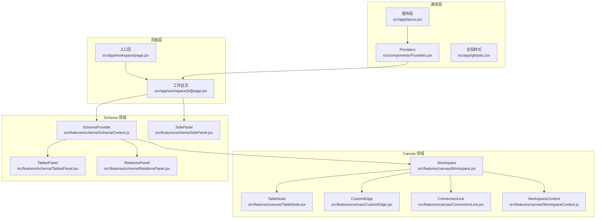
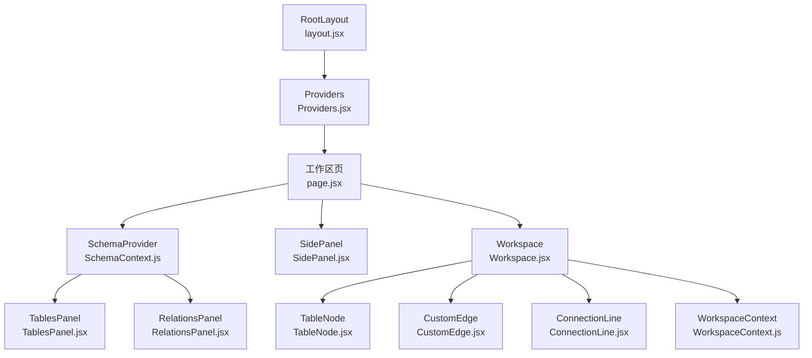
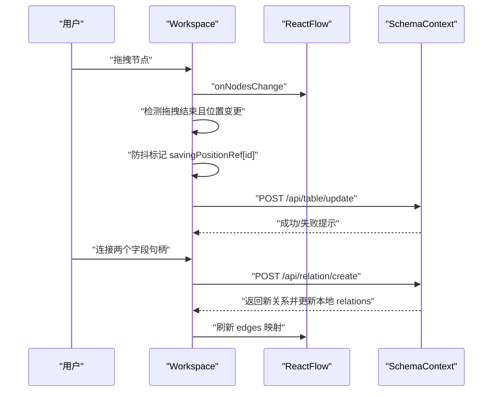
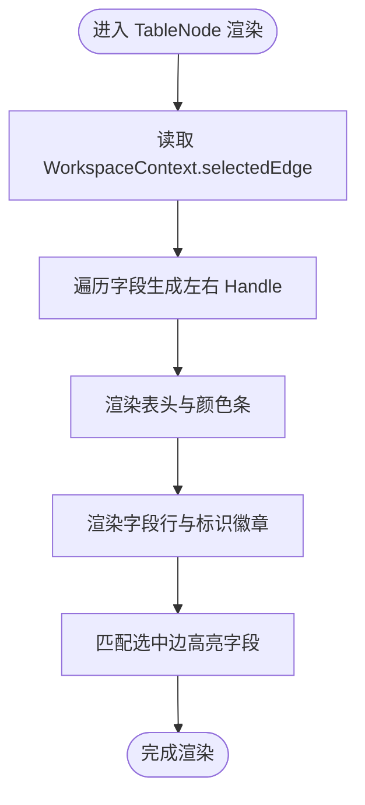
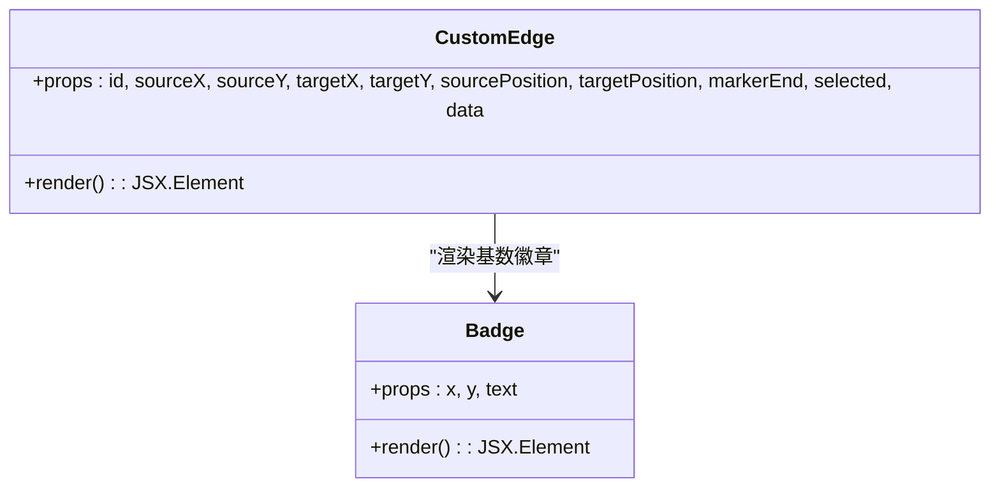
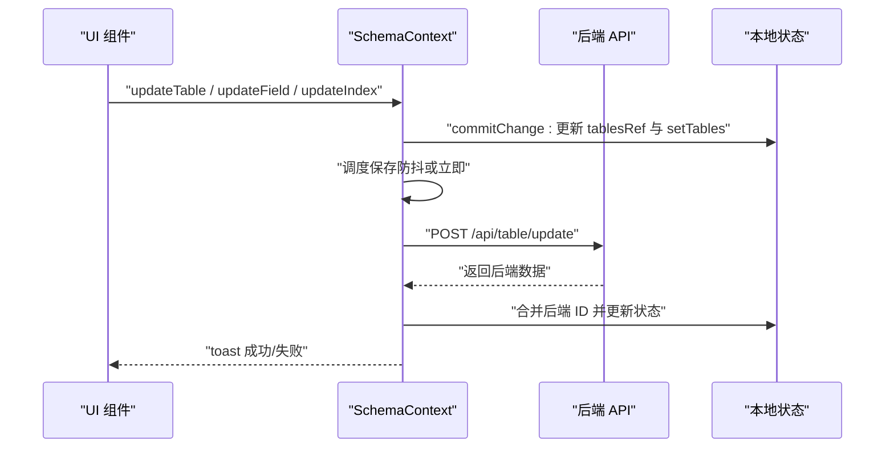
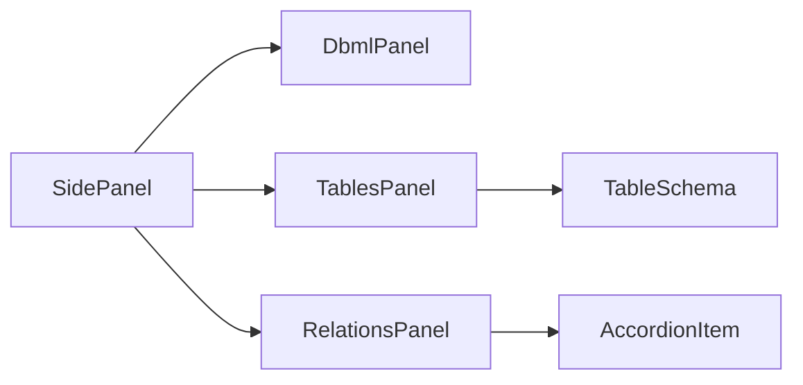
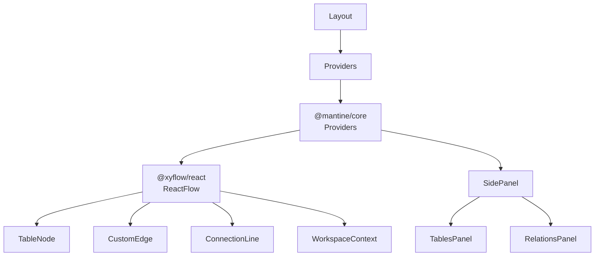

# 组件架构设计

<cite>
**本文引用的文件**
- [src/app/workspace/[id]/page.jsx](file://src/app/workspace/[id]/page.jsx)
- [src/app/workspace/page.jsx](file://src/app/workspace/page.jsx)
- [src/app/layout.jsx](file://src/app/layout.jsx)
- [src/components/Providers.jsx](file://src/components/Providers.jsx)
- [src/features/canvas/Workspace.jsx](file://src/features/canvas/Workspace.jsx)
- [src/features/canvas/WorkspaceContext.js](file://src/features/canvas/WorkspaceContext.js)
- [src/features/canvas/TableNode.jsx](file://src/features/canvas/TableNode.jsx)
- [src/features/canvas/CustomEdge.jsx](file://src/features/canvas/CustomEdge.jsx)
- [src/features/canvas/ConnectionLine.jsx](file://src/features/canvas/ConnectionLine.jsx)
- [src/features/schema/SchemaContext.js](file://src/features/schema/SchemaContext.js)
- [src/features/schema/SidePanel.jsx](file://src/features/schema/SidePanel.jsx)
- [src/features/schema/TablesPanel.jsx](file://src/features/schema/TablesPanel.jsx)
- [src/features/schema/RelationsPanel.jsx](file://src/features/schema/RelationsPanel.jsx)
- [src/app/globals.css](file://src/app/globals.css)
- [package.json](file://package.json)
</cite>

## 目录
1. [简介](#简介)
2. [项目结构](#项目结构)
3. [核心组件](#核心组件)
4. [架构总览](#架构总览)
5. [组件详细分析](#组件详细分析)
6. [依赖关系分析](#依赖关系分析)
7. [性能考量](#性能考量)
8. [故障排查指南](#故障排查指南)
9. [结论](#结论)
10. [附录](#附录)

## 简介
本设计文档面向 Vibe DB 的组件化架构，聚焦于基于 React 19 的客户端组件与服务器组件协同工作模式，系统阐述 Canvas 画布与 Schema 编辑面板的组件层次、通信机制、Props 传递策略、事件处理流程，并深入解析 Workspace、TableNode、CustomEdge 的设计模式与职责边界。同时提供生命周期管理、性能优化策略、可复用性设计建议以及样式与主题系统的组织方式，帮助开发者高效构建与扩展组件体系。

## 项目结构
Vibe DB 采用 Next.js App Router 结构，页面级路由位于 src/app 下，业务功能按领域拆分至 src/features，通用 UI 组件置于 src/components，全局样式与主题配置位于 src/app/globals.css 与 src/components/Providers.jsx。

- 页面入口
  - 入口页：src/app/workspace/page.jsx，负责引导用户选择 Schema 并跳转到工作区。
  - 工作区页：src/app/workspace/[id]/page.jsx，承载 SchemaProvider、侧边栏与画布 Workspace。
- 功能域
  - Canvas 领域：画布交互、节点与连线渲染、工作区上下文。
  - Schema 领域：表、字段、索引、关系的增删改查与持久化。
- 通用层
  - Providers.jsx 提供 Mantine 主题与通知系统；layout.jsx 注入 Provider。
  - 全局样式 globals.css 定义主题变量与动画。

图表来源
- [src/app/workspace/[id]/page.jsx:1-121](file://src/app/workspace/[id]/page.jsx#L1-L121)
- [src/app/workspace/page.jsx:1-23](file://src/app/workspace/page.jsx#L1-L23)
- [src/app/layout.jsx:1-19](file://src/app/layout.jsx#L1-L19)
- [src/components/Providers.jsx:1-36](file://src/components/Providers.jsx#L1-L36)
- [src/features/canvas/Workspace.jsx:1-219](file://src/features/canvas/Workspace.jsx#L1-L219)
- [src/features/canvas/TableNode.jsx:1-153](file://src/features/canvas/TableNode.jsx#L1-L153)
- [src/features/canvas/CustomEdge.jsx:1-87](file://src/features/canvas/CustomEdge.jsx#L1-L87)
- [src/features/canvas/ConnectionLine.jsx:1-15](file://src/features/canvas/ConnectionLine.jsx#L1-L15)
- [src/features/canvas/WorkspaceContext.js:1-5](file://src/features/canvas/WorkspaceContext.js#L1-L5)
- [src/features/schema/SchemaContext.js:1-392](file://src/features/schema/SchemaContext.js#L1-L392)
- [src/features/schema/SidePanel.jsx:1-39](file://src/features/schema/SidePanel.jsx#L1-L39)
- [src/features/schema/TablesPanel.jsx:1-111](file://src/features/schema/TablesPanel.jsx#L1-L111)
- [src/features/schema/RelationsPanel.jsx:1-89](file://src/features/schema/RelationsPanel.jsx#L1-L89)
- [src/app/globals.css:1-31](file://src/app/globals.css#L1-L31)

章节来源
- [src/app/workspace/[id]/page.jsx:1-121](file://src/app/workspace/[id]/page.jsx#L1-L121)
- [src/app/workspace/page.jsx:1-23](file://src/app/workspace/page.jsx#L1-L23)
- [src/app/layout.jsx:1-19](file://src/app/layout.jsx#L1-L19)
- [src/components/Providers.jsx:1-36](file://src/components/Providers.jsx#L1-L36)
- [src/app/globals.css:1-31](file://src/app/globals.css#L1-L31)

## 核心组件
- Workspace：画布容器，负责节点与连线的状态同步、拖拽位置保存、连接创建、选中态管理与键盘删除。
- TableNode：自定义节点，渲染表头、字段列表与字段标识徽章，动态挂载左右连接句柄，高亮与选中态联动。
- CustomEdge：自定义连线，绘制平滑曲线路径与基数标签徽章，支持选中态动画与样式切换。
- SchemaContext：SchemaProvider 提供统一的状态与 API 调用能力，封装防抖保存、临时 ID 管理、关系创建/更新/删除等。
- SidePanel/TablesPanel/RelationsPanel：侧边栏面板，分别承载 DBML、数据表与关系视图，配合 SchemaContext 实现 CRUD。

章节来源
- [src/features/canvas/Workspace.jsx:1-219](file://src/features/canvas/Workspace.jsx#L1-L219)
- [src/features/canvas/TableNode.jsx:1-153](file://src/features/canvas/TableNode.jsx#L1-L153)
- [src/features/canvas/CustomEdge.jsx:1-87](file://src/features/canvas/CustomEdge.jsx#L1-L87)
- [src/features/schema/SchemaContext.js:1-392](file://src/features/schema/SchemaContext.js#L1-L392)
- [src/features/schema/SidePanel.jsx:1-39](file://src/features/schema/SidePanel.jsx#L1-L39)
- [src/features/schema/TablesPanel.jsx:1-111](file://src/features/schema/TablesPanel.jsx#L1-L111)
- [src/features/schema/RelationsPanel.jsx:1-89](file://src/features/schema/RelationsPanel.jsx#L1-L89)

## 架构总览
整体采用“页面层 + 通用层 + 领域层”的分层架构。页面层负责路由与布局，通用层提供主题与通知，领域层通过 Context 解耦组件间状态与行为，Canvas 与 Schema 通过共享的 SchemaContext 协同工作。

图表来源
- [src/app/workspace/[id]/page.jsx:1-121](file://src/app/workspace/[id]/page.jsx#L1-L121)
- [src/features/schema/SchemaContext.js:1-392](file://src/features/schema/SchemaContext.js#L1-L392)
- [src/features/schema/SidePanel.jsx:1-39](file://src/features/schema/SidePanel.jsx#L1-L39)
- [src/features/schema/TablesPanel.jsx:1-111](file://src/features/schema/TablesPanel.jsx#L1-L111)
- [src/features/schema/RelationsPanel.jsx:1-89](file://src/features/schema/RelationsPanel.jsx#L1-L89)
- [src/features/canvas/Workspace.jsx:1-219](file://src/features/canvas/Workspace.jsx#L1-L219)
- [src/features/canvas/TableNode.jsx:1-153](file://src/features/canvas/TableNode.jsx#L1-L153)
- [src/features/canvas/CustomEdge.jsx:1-87](file://src/features/canvas/CustomEdge.jsx#L1-L87)
- [src/features/canvas/ConnectionLine.jsx:1-15](file://src/features/canvas/ConnectionLine.jsx#L1-L15)
- [src/features/canvas/WorkspaceContext.js:1-5](file://src/features/canvas/WorkspaceContext.js#L1-L5)
- [src/app/layout.jsx:1-19](file://src/app/layout.jsx#L1-L19)
- [src/components/Providers.jsx:1-36](file://src/components/Providers.jsx#L1-L36)

## 组件详细分析

### Workspace：画布容器与交互编排
- 客户端组件：声明 use client，作为画布主容器。
- 状态与同步
  - 使用 useNodesState/useEdgesState 管理节点与连线状态。
  - 通过 useMemo 基于 relations 生成初始 edges，确保与 Schema 层保持一致。
  - useEffect 将 tables 变化映射为节点，支持新增与更新。
- 事件处理
  - onNodesChange：拖拽结束后保存节点位置，使用防抖标记 savingPositionRef 避免重复保存。
  - onConnect：调用 addRelation 创建关系，内部已处理错误提示。
  - onEdgeClick/onPaneClick：维护选中边状态，Backspace 键删除选中边。
- 渲染与扩展
  - 注册自定义节点类型与连线类型，设置默认连线选项与连接线组件。
  - 通过 WorkspaceContext.Provider 向子节点暴露 selectedEdge。

图表来源
- [src/features/canvas/Workspace.jsx:130-187](file://src/features/canvas/Workspace.jsx#L130-L187)
- [src/features/schema/SchemaContext.js:309-340](file://src/features/schema/SchemaContext.js#L309-L340)

章节来源
- [src/features/canvas/Workspace.jsx:1-219](file://src/features/canvas/Workspace.jsx#L1-L219)
- [src/features/canvas/WorkspaceContext.js:1-5](file://src/features/canvas/WorkspaceContext.js#L1-L5)
- [src/features/schema/SchemaContext.js:1-392](file://src/features/schema/SchemaContext.js#L1-L392)

### TableNode：自定义节点与句柄渲染
- 设计要点
  - 为每个字段动态渲染左右 Handle，鼠标悬停时显示，实现可视化连接引导。
  - 顶部色块展示表颜色，字段行展示名称、类型与标识徽章（主键、索引、可空）。
  - 高亮逻辑：当存在选中边时，根据边的 source/target 与 fieldId 匹配高亮对应字段。
- 性能优化
  - 使用 memo 包裹 Workspace，减少无关重渲染。
  - Handle 的显隐与样式切换仅在 hover 时生效，降低 DOM 变更成本。

图表来源
- [src/features/canvas/TableNode.jsx:42-150](file://src/features/canvas/TableNode.jsx#L42-L150)
- [src/features/canvas/WorkspaceContext.js:1-5](file://src/features/canvas/WorkspaceContext.js#L1-L5)

章节来源
- [src/features/canvas/TableNode.jsx:1-153](file://src/features/canvas/TableNode.jsx#L1-L153)

### CustomEdge：自定义连线与基数标签
- 设计要点
  - 基于 getSmoothStepPath 生成平滑曲线路径，支持选中态样式与虚线动画。
  - 根据关系基数映射显示“1”、“N”徽章，标注两端基数。
- 扩展性
  - 可通过 data.cardinality 扩展更多关系类型与视觉提示。

图表来源
- [src/features/canvas/CustomEdge.jsx:35-84](file://src/features/canvas/CustomEdge.jsx#L35-L84)

章节来源
- [src/features/canvas/CustomEdge.jsx:1-87](file://src/features/canvas/CustomEdge.jsx#L1-L87)

### SchemaContext：状态与持久化编排
- 状态模型
  - tables、relations：画布与关系的核心数据。
  - 防抖保存：commitChange 统一封装，避免 React 严格模式下的重复执行。
  - 临时 ID：生成 temp- 前缀 ID，后端返回真实 CUID 后合并回本地状态，避免输入光标丢失。
- API 调用
  - 表：创建、更新、排序；字段：增删改排序；索引：增删改排序；关系：创建、更新、删除。
- 事件与回调
  - addRelation：从 ReactFlow 连接参数推导源表/字段，生成默认名称并创建关系。
  - updateRelation/deleteRelation：乐观更新 + 后端同步，失败回滚。

图表来源
- [src/features/schema/SchemaContext.js:147-173](file://src/features/schema/SchemaContext.js#L147-L173)
- [src/features/schema/SchemaContext.js:309-340](file://src/features/schema/SchemaContext.js#L309-L340)

章节来源
- [src/features/schema/SchemaContext.js:1-392](file://src/features/schema/SchemaContext.js#L1-L392)

### 侧边栏与面板：可组合的编辑界面
- SidePanel：根据 activePanel 动态渲染 DBML、数据表、关系面板。
- TablesPanel：支持拖拽排序、新建表、展开折叠、滚动区域。
- RelationsPanel：展示关系详情、基数选择、删除操作。

图表来源
- [src/features/schema/SidePanel.jsx:22-36](file://src/features/schema/SidePanel.jsx#L22-L36)
- [src/features/schema/TablesPanel.jsx:43-111](file://src/features/schema/TablesPanel.jsx#L43-L111)
- [src/features/schema/RelationsPanel.jsx:9-89](file://src/features/schema/RelationsPanel.jsx#L9-L89)

章节来源
- [src/features/schema/SidePanel.jsx:1-39](file://src/features/schema/SidePanel.jsx#L1-L39)
- [src/features/schema/TablesPanel.jsx:1-111](file://src/features/schema/TablesPanel.jsx#L1-L111)
- [src/features/schema/RelationsPanel.jsx:1-89](file://src/features/schema/RelationsPanel.jsx#L1-L89)

## 依赖关系分析
- 组件依赖
  - Workspace 依赖 TableNode、CustomEdge、ConnectionLine 与 WorkspaceContext。
  - 画布与 Schema 通过 SchemaContext 解耦，Workspace 仅消费 tables/relations 并通过 addRelation/deleteRelation 与之交互。
  - 侧边栏面板直接依赖 SchemaContext，实现对表与关系的 CRUD。
- 外部库
  - @xyflow/react：画布与节点/连线渲染。
  - @mantine/core：主题与 UI 组件。
  - sonner：全局通知。
  - react-split-pane：分割面板布局。

图表来源
- [package.json:16-39](file://package.json#L16-L39)
- [src/features/canvas/Workspace.jsx:1-219](file://src/features/canvas/Workspace.jsx#L1-L219)
- [src/features/canvas/TableNode.jsx:1-153](file://src/features/canvas/TableNode.jsx#L1-L153)
- [src/features/canvas/CustomEdge.jsx:1-87](file://src/features/canvas/CustomEdge.jsx#L1-L87)
- [src/features/canvas/ConnectionLine.jsx:1-15](file://src/features/canvas/ConnectionLine.jsx#L1-L15)
- [src/features/canvas/WorkspaceContext.js:1-5](file://src/features/canvas/WorkspaceContext.js#L1-L5)
- [src/features/schema/SchemaContext.js:1-392](file://src/features/schema/SchemaContext.js#L1-L392)
- [src/features/schema/SidePanel.jsx:1-39](file://src/features/schema/SidePanel.jsx#L1-L39)
- [src/features/schema/TablesPanel.jsx:1-111](file://src/features/schema/TablesPanel.jsx#L1-L111)
- [src/features/schema/RelationsPanel.jsx:1-89](file://src/features/schema/RelationsPanel.jsx#L1-L89)
- [src/components/Providers.jsx:1-36](file://src/components/Providers.jsx#L1-L36)
- [src/app/layout.jsx:1-19](file://src/app/layout.jsx#L1-L19)

章节来源
- [package.json:16-39](file://package.json#L16-L39)

## 性能考量
- 状态与渲染
  - Workspace 使用 memo 包裹，避免无关重渲染。
  - useNodesState/useEdgesState 仅在必要时更新，结合 useMemo 避免重复计算 edges。
- 保存策略
  - SchemaContext 的 commitChange 将副作用移出 updater，防止严格模式下重复执行。
  - 防抖保存与“正在保存”标记，避免并发写入与重复保存。
- 交互体验
  - TableNode 的 Handle 仅在 hover 时显示，减少 DOM 开销。
  - 选中边高亮通过字段 ID 匹配，避免全量重绘。
- 样式与动画
  - 全局 CSS 定义 edge-selected 动画，避免每个边实例重复注入样式标签。

章节来源
- [src/features/canvas/Workspace.jsx:218](file://src/features/canvas/Workspace.jsx#L218)
- [src/features/canvas/Workspace.jsx:130-187](file://src/features/canvas/Workspace.jsx#L130-L187)
- [src/features/schema/SchemaContext.js:147-173](file://src/features/schema/SchemaContext.js#L147-L173)
- [src/features/canvas/TableNode.jsx:42-150](file://src/features/canvas/TableNode.jsx#L42-L150)
- [src/app/globals.css:22-31](file://src/app/globals.css#L22-L31)

## 故障排查指南
- 无法保存节点位置
  - 检查 savingPositionRef 防抖标记是否被提前清除，确认 onNodesChange 的拖拽结束条件与位置变更判断。
  - 确认 POST /api/table/update 是否返回成功，查看 toast 提示。
- 关系创建失败
  - 核对 addRelation 的连接参数（sourceHandle/targetHandle）格式，确保移除了方向后缀。
  - 检查 SchemaContext 的 addRelation 是否抛出异常并显示错误提示。
- 侧边栏面板不显示内容
  - 确认 activePanel 值正确传入 SidePanel，检查 PANELS 映射是否存在对应键。
- 主题与样式异常
  - 确认 Providers 已包裹页面，MantineProvider 正常初始化。
  - 检查 globals.css 中的主题变量与动画类是否生效。

章节来源
- [src/features/canvas/Workspace.jsx:130-187](file://src/features/canvas/Workspace.jsx#L130-L187)
- [src/features/schema/SchemaContext.js:309-340](file://src/features/schema/SchemaContext.js#L309-L340)
- [src/features/schema/SidePanel.jsx:22-36](file://src/features/schema/SidePanel.jsx#L22-L36)
- [src/components/Providers.jsx:1-36](file://src/components/Providers.jsx#L1-L36)
- [src/app/globals.css:1-31](file://src/app/globals.css#L1-L31)

## 结论
Vibe DB 的组件架构以 React 19 的客户端组件为核心，结合 @xyflow/react 的画布能力与 Mantine 的主题系统，形成清晰的 Canvas 与 Schema 双域协作模式。通过 Workspace 与 SchemaContext 的解耦设计，实现了高效的事件编排、稳定的持久化策略与良好的用户体验。建议在后续迭代中进一步抽象通用交互（如拖拽、编辑、保存），增强可测试性与可维护性。

## 附录
- 组件组合模式
  - 通过 SchemaProvider 将状态与 API 能力注入到画布与面板组件，实现跨组件共享。
  - 侧边栏采用动态渲染与分割面板，提升空间利用率与交互效率。
- 样式与主题
  - 使用 MantineProvider 提供统一主题，全局 CSS 定义变量与动画，确保一致性与可扩展性。
- 版本与依赖
  - React 19、Next.js App Router、@xyflow/react、@mantine/core、sonner 等。

章节来源
- [src/app/workspace/[id]/page.jsx:80-121](file://src/app/workspace/[id]/page.jsx#L80-L121)
- [src/components/Providers.jsx:1-36](file://src/components/Providers.jsx#L1-L36)
- [src/app/globals.css:1-31](file://src/app/globals.css#L1-L31)
- [package.json:16-39](file://package.json#L16-L39)