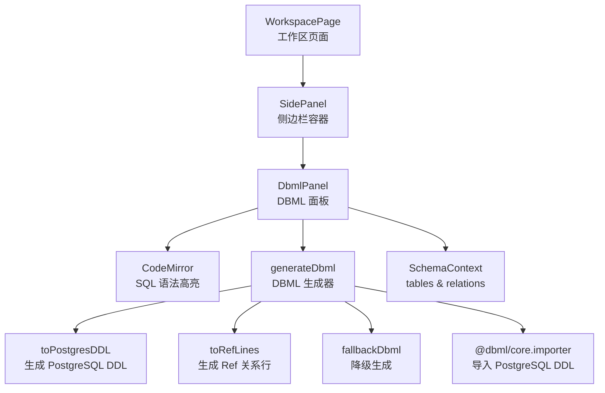
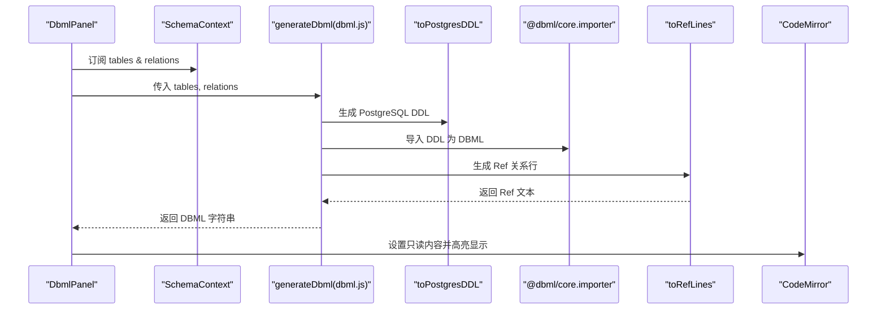
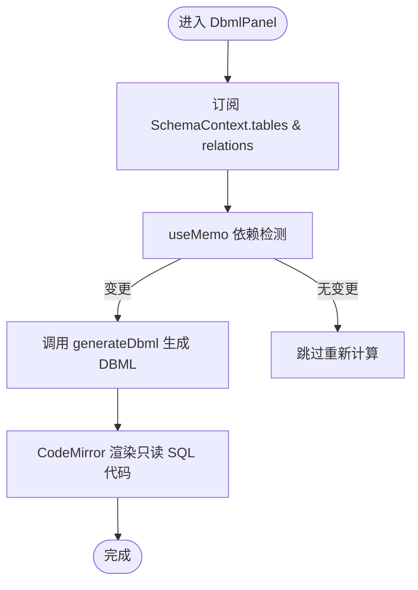
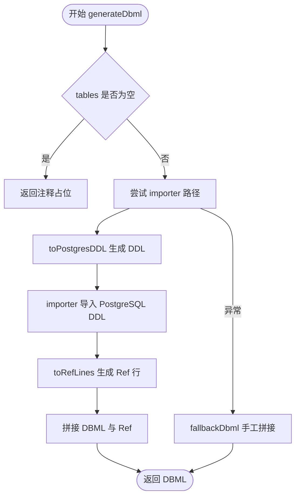
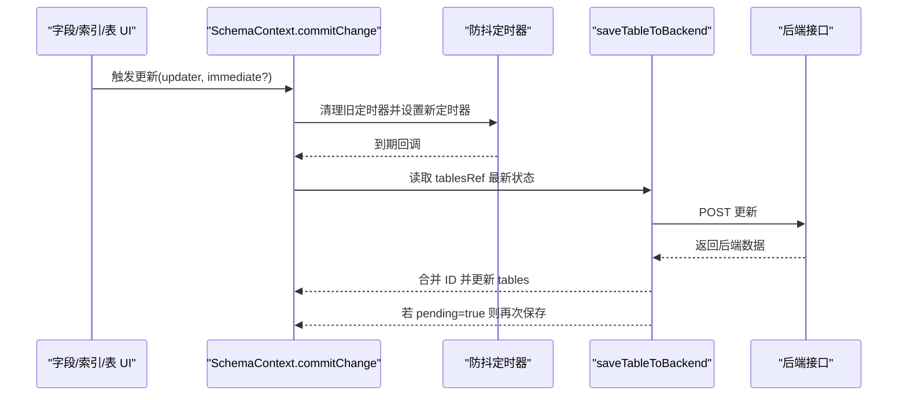
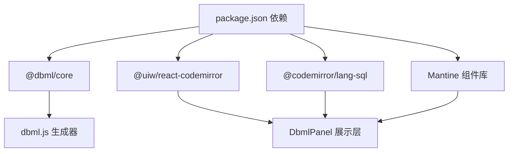

# DBML 导出系统

<cite>
**本文引用的文件**
- [DbmlPanel.jsx](file://src/features/schema/DbmlPanel.jsx)
- [dbml.js](file://src/features/schema/dbml.js)
- [SchemaContext.js](file://src/features/schema/SchemaContext.js)
- [SidePanel.jsx](file://src/features/schema/SidePanel.jsx)
- [Enums.js](file://src/lib/enums.js)
- [WorkspacePage.jsx](file://src/app/workspace/[id]/page.jsx)
- [package.json](file://package.json)
</cite>

## 目录
1. [简介](#简介)
2. [项目结构](#项目结构)
3. [核心组件](#核心组件)
4. [架构总览](#架构总览)
5. [详细组件分析](#详细组件分析)
6. [依赖分析](#依赖分析)
7. [性能考虑](#性能考虑)
8. [故障排查指南](#故障排查指南)
9. [结论](#结论)
10. [附录](#附录)

## 简介
本文件面向 DBML 导出系统，围绕 DbmlPanel 组件的界面设计、代码展示机制与实时同步进行深入解析；同时详解 dbml.js 中的语法转换算法、数据模型映射规则与代码生成逻辑，阐述 DBML 语法规范的实现细节、注释处理机制与格式化输出策略，并给出 DBML 代码高亮显示、复制粘贴与下载导出的扩展建议。最后提供扩展 DBML 语法支持、自定义导出模板与处理特殊数据类型的实践路径，以及与其他数据库工具的兼容性、版本升级策略与向后兼容性保障。

## 项目结构
该系统采用“上下文驱动 + 组件化”的前端架构，DbmlPanel 作为侧边栏面板之一，通过 SchemaContext 提供的数据流实时生成 DBML 文本并在 CodeMirror 中以 SQL 语法高亮展示。dbml.js 负责将结构化数据转换为 DBML 字符串，内部优先使用 @dbml/core 的 importer，异常时回退到手工拼接方案。

图表来源
- [WorkspacePage.jsx:80-121](file://src/app/workspace/[id]/page.jsx#L80-L121)
- [SidePanel.jsx:1-39](file://src/features/schema/SidePanel.jsx#L1-L39)
- [DbmlPanel.jsx:11-33](file://src/features/schema/DbmlPanel.jsx#L11-L33)
- [dbml.js:72-89](file://src/features/schema/dbml.js#L72-L89)

章节来源
- [WorkspacePage.jsx:80-121](file://src/app/workspace/[id]/page.jsx#L80-L121)
- [SidePanel.jsx:1-39](file://src/features/schema/SidePanel.jsx#L1-L39)
- [DbmlPanel.jsx:11-33](file://src/features/schema/DbmlPanel.jsx#L11-L33)
- [dbml.js:72-89](file://src/features/schema/dbml.js#L72-L89)

## 核心组件
- DbmlPanel：负责订阅 SchemaContext 的 tables 与 relations，调用 generateDbml 生成 DBML 文本，并通过 CodeMirror 以 SQL 语法高亮展示，开启行号但关闭折叠与活动行高亮，确保阅读体验。
- dbml.js：核心转换模块，提供 generateDbml 与 fallbackDbml，前者优先使用 @dbml/core.importer 将 PostgreSQL DDL 转换为 DBML，再追加手动构建的 Ref 关系；后者在异常时回退为纯手工拼接。
- SchemaContext：提供 CRUD 与排序等能力，维护 tables 与 relations 的本地状态，并通过防抖与排队机制将变更持久化至后端，确保输入流畅与网络请求可控。
- Enums：提供 PostgreSQL 字段类型分组、索引类型与关系基数选项，为 UI 选择与类型映射提供基础。

章节来源
- [DbmlPanel.jsx:11-33](file://src/features/schema/DbmlPanel.jsx#L11-L33)
- [dbml.js:72-89](file://src/features/schema/dbml.js#L72-L89)
- [SchemaContext.js:43-392](file://src/features/schema/SchemaContext.js#L43-L392)
- [Enums.js:105-156](file://src/lib/enums.js#L105-L156)

## 架构总览
DbmlPanel 通过 useMemo 依赖 tables 与 relations，当任一状态变化时，generateDbml 重新计算并更新 CodeMirror 的只读内容。dbml.js 内部以“DDL → DBML + Ref”两阶段生成，异常时回退到“Table/Field/Ref 手工拼接”。SchemaContext 提供统一的状态管理与持久化策略，确保编辑体验与数据一致性。

图表来源
- [DbmlPanel.jsx:11-33](file://src/features/schema/DbmlPanel.jsx#L11-L33)
- [dbml.js:72-89](file://src/features/schema/dbml.js#L72-L89)

## 详细组件分析

### DbmlPanel 组件
- 实时同步：依赖 useMemo 仅在 tables 或 relations 变更时重建 DBML，避免不必要的重渲染。
- 代码展示：使用 @codemirror/lang-sql 与 @uiw/react-codemirror，开启行号，关闭折叠与活动行高亮，文本尺寸为小号，便于在侧边栏中阅读。
- 交互特性：只读模式，不可编辑；滚动区域自适应高度，适配 SplitPane 布局。

图表来源
- [DbmlPanel.jsx:11-33](file://src/features/schema/DbmlPanel.jsx#L11-L33)

章节来源
- [DbmlPanel.jsx:11-33](file://src/features/schema/DbmlPanel.jsx#L11-L33)

### dbml.js 语法转换与生成逻辑
- 数据模型映射：
  - 表：Table 名称与字段列表映射为 DBML Table 块。
  - 字段：字段名、类型、主键与非空属性映射为 DBML 字段声明及属性标注。
  - 关系：通过 toRefLines 将 relations 映射为 DBML Ref 行，运算符由基数映射表决定。
- 语法转换算法：
  - 优先路径：toPostgresDDL → @dbml/core.importer → 追加 Ref。
  - 异常回退：直接拼接 Table/Field/Ref，保证可用性。
- 注释与格式化：
  - 当 tables 为空时返回提示注释。
  - 生成文本末尾追加空行与 Ref，保持块间分隔清晰。
- 错误处理：
  - 包裹 importer 调用于 try/catch，异常时走 fallbackDbml。

图表来源
- [dbml.js:72-89](file://src/features/schema/dbml.js#L72-L89)
- [dbml.js:94-114](file://src/features/schema/dbml.js#L94-L114)

章节来源
- [dbml.js:72-89](file://src/features/schema/dbml.js#L72-L89)
- [dbml.js:94-114](file://src/features/schema/dbml.js#L94-L114)

### SchemaContext 状态管理与持久化
- 防抖与排队：每个表维护独立的防抖定时器，避免频繁保存；正在保存中标记 pending，保存完成后若存在新变更则自动重试。
- ID 管理：新增实体时使用临时 ID，后端返回真实 ID 后仅合并 ID，保留本地编辑状态，避免输入框光标丢失。
- 变更调度：commitChange 将副作用（API 调用、定时器）置于 setTables 之外，规避 React 严格模式下 updater 重复执行导致的多次请求。

图表来源
- [SchemaContext.js:147-173](file://src/features/schema/SchemaContext.js#L147-L173)
- [SchemaContext.js:86-135](file://src/features/schema/SchemaContext.js#L86-L135)

章节来源
- [SchemaContext.js:147-173](file://src/features/schema/SchemaContext.js#L147-L173)
- [SchemaContext.js:86-135](file://src/features/schema/SchemaContext.js#L86-L135)

### 侧边栏与面板切换
- SidePanel 根据 activePanel 渲染对应面板，DbmlPanel 作为其中之一，标题为“DBML”，图标为代码块。
- WorkspacePage 提供工具栏，支持切换侧边栏面板与创建表。

章节来源
- [SidePanel.jsx:7-20](file://src/features/schema/SidePanel.jsx#L7-L20)
- [WorkspacePage.jsx:14-78](file://src/app/workspace/[id]/page.jsx#L14-L78)

## 依赖分析
- @dbml/core：负责将 PostgreSQL DDL 转换为标准 DBML，是主流程的关键依赖。
- @codemirror/lang-sql 与 @uiw/react-codemirror：提供 SQL 语法高亮与只读展示。
- Mantine 生态：Select、Input、Button 等组件用于字段/索引/关系的编辑与展示。
- 项目版本与脚本：package.json 展示了依赖版本与数据库相关脚本。

图表来源
- [package.json:16-39](file://package.json#L16-L39)
- [dbml.js:7](file://src/features/schema/dbml.js#L7)
- [DbmlPanel.jsx:4-5](file://src/features/schema/DbmlPanel.jsx#L4-L5)

章节来源
- [package.json:16-39](file://package.json#L16-L39)
- [dbml.js:7](file://src/features/schema/dbml.js#L7)
- [DbmlPanel.jsx:4-5](file://src/features/schema/DbmlPanel.jsx#L4-L5)

## 性能考虑
- 计算复用：DbmlPanel 使用 useMemo，仅在 tables 或 relations 变更时重新生成 DBML，降低渲染成本。
- 防抖保存：SchemaContext 对输入类变更采用防抖，减少网络请求频率，提升交互流畅度。
- 降级策略：当 importer 失败时快速回退到手工拼接，避免长时间阻塞 UI。
- 仅合并必要状态：后端返回真实 ID 时仅合并 ID，避免不必要的重渲染与光标丢失。

章节来源
- [DbmlPanel.jsx:14](file://src/features/schema/DbmlPanel.jsx#L14)
- [SchemaContext.js:147-173](file://src/features/schema/SchemaContext.js#L147-L173)
- [dbml.js:85-88](file://src/features/schema/dbml.js#L85-L88)

## 故障排查指南
- DBML 为空或注释占位
  - 现象：DbmlPanel 显示“暂无数据表”注释。
  - 原因：tables 为空。
  - 处理：先创建至少一个表与字段。
- 生成器异常
  - 现象：页面出现降级 DBML 或空白。
  - 原因：@dbml/core.importer 抛出异常。
  - 处理：检查 toPostgresDDL 输出是否符合预期；查看 fallbackDbml 生成结果定位问题。
- 关系未显示
  - 现象：DBML 中缺少 Ref 行。
  - 原因：relations 缺失或字段 ID 不匹配。
  - 处理：确认 relations 中 source/target 表与字段 ID 存在且匹配；检查基数映射。
- 保存冲突与光标丢失
  - 现象：编辑时光标跳动或保存失败。
  - 原因：并发保存或临时 ID 合并时机不当。
  - 处理：遵循 SchemaContext 的防抖与排队机制；确保仅合并 ID，保留本地编辑状态。

章节来源
- [dbml.js:72-74](file://src/features/schema/dbml.js#L72-L74)
- [dbml.js:85-88](file://src/features/schema/dbml.js#L85-L88)
- [dbml.js:46-65](file://src/features/schema/dbml.js#L46-L65)
- [SchemaContext.js:86-135](file://src/features/schema/SchemaContext.js#L86-L135)

## 结论
本系统通过 DbmlPanel 与 dbml.js 实现了从结构化数据到 DBML 的高效转换与实时展示。SchemaContext 提供稳健的状态管理与持久化策略，确保编辑体验与数据一致性。dbml.js 的双路径生成与降级回退机制提升了健壮性。未来可在以下方面进一步增强：引入 DBML 语法校验与格式化工具、扩展导出模板与下载功能、完善注释与元数据映射、加强与外部工具的兼容性与版本升级策略。

## 附录

### DBML 语法要点与实现细节
- 表与字段
  - 表块：Table <name> { ... }
  - 字段：字段名 类型 [属性列表]
  - 属性：pk（主键）、not null（非空）
- 关系
  - Ref: "<srcTable>.<srcField> <operator> <tgtTable>.<tgtField>"
  - 运算符映射：一对一(-)、一对多(<)、多对多(<>)
- 注释与格式化
  - 空表时返回注释占位。
  - DBML 与 Ref 之间添加空行分隔，保持块级结构清晰。

章节来源
- [dbml.js:9-14](file://src/features/schema/dbml.js#L9-L14)
- [dbml.js:46-65](file://src/features/schema/dbml.js#L46-L65)
- [dbml.js:72-74](file://src/features/schema/dbml.js#L72-L74)

### 代码高亮、复制粘贴与下载导出扩展建议
- 代码高亮
  - 已使用 @codemirror/lang-sql 与 @uiw/react-codemirror，保持只读与行号开启。
- 复制粘贴
  - 可在 DbmlPanel 上层增加复制按钮，调用 navigator.clipboard.writeText(value)。
- 下载导出
  - 建议在工具栏增加“下载 DBML”按钮，使用 Blob 与 a.download 生成 .dbml 文件。
- 注意
  - 扩展应保持只读展示不变，避免影响现有编辑流程。

章节来源
- [DbmlPanel.jsx:18-30](file://src/features/schema/DbmlPanel.jsx#L18-L30)

### 扩展 DBML 语法支持与自定义导出模板
- 扩展语法支持
  - 在 dbml.js 中新增映射规则（如复合主键、默认值、注释），在 toPostgresDDL 或手工拼接阶段体现。
  - 如需支持更多关系运算符，扩展 REF_OPERATORS 映射表。
- 自定义导出模板
  - 可在 generateDbml 外部提供模板函数，接收 DBML 字符串并进行二次加工（如注入注释、分组、排序）。
- 特殊数据类型处理
  - 在 Enums 中补充类型分组与 UI 选项，确保 UI 与生成器一致。
  - 对于复杂类型（如数组、JSONB、几何），保持类型字符串与 DBML 语法一致。

章节来源
- [dbml.js:9-14](file://src/features/schema/dbml.js#L9-L14)
- [dbml.js:19-41](file://src/features/schema/dbml.js#L19-L41)
- [Enums.js:105-156](file://src/lib/enums.js#L105-L156)

### 与其他数据库工具的兼容性与版本升级策略
- 兼容性
  - 通过 @dbml/core.importer 将 PostgreSQL DDL 转换为标准 DBML，提高跨工具兼容性。
  - 手工拼接作为降级方案，保证在 importer 不可用时仍可输出可用 DBML。
- 升级策略
  - 保持 generateDbml 的幂等性与异常回退，避免升级导致的功能中断。
  - 对 @dbml/core 版本升级进行回归测试，重点验证 DDL → DBML 的一致性。
- 向后兼容性
  - 保留 fallbackDbml，确保旧环境或异常场景仍可运行。
  - 对新增字段/属性，采用可选映射与默认值，避免破坏既有 DBML 结构。

章节来源
- [dbml.js:75-89](file://src/features/schema/dbml.js#L75-L89)
- [dbml.js:94-114](file://src/features/schema/dbml.js#L94-L114)
- [package.json:19](file://package.json#L19)