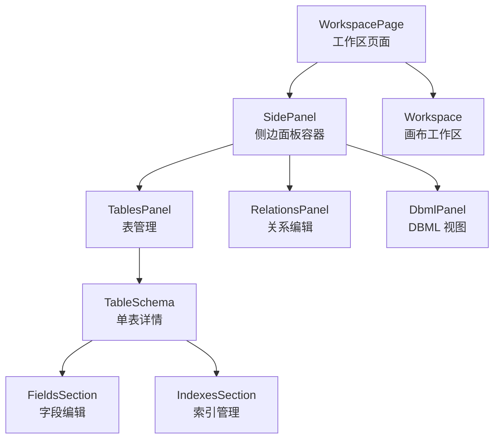
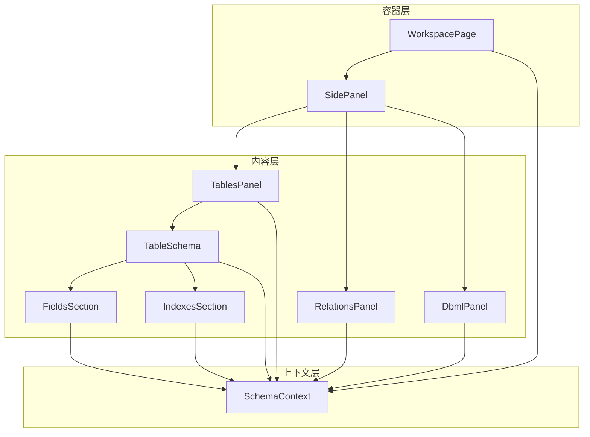
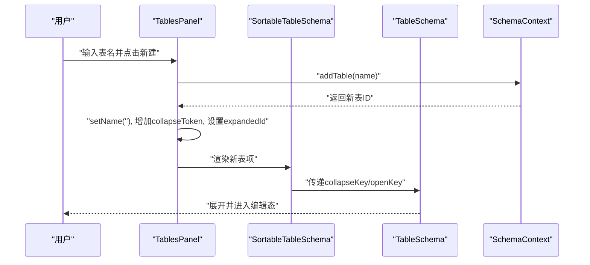
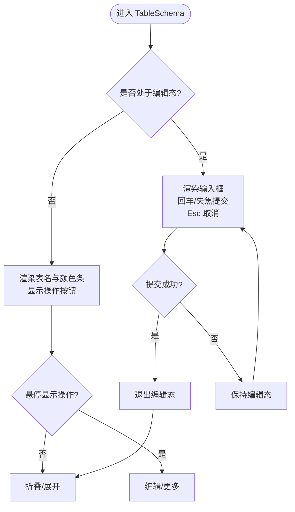
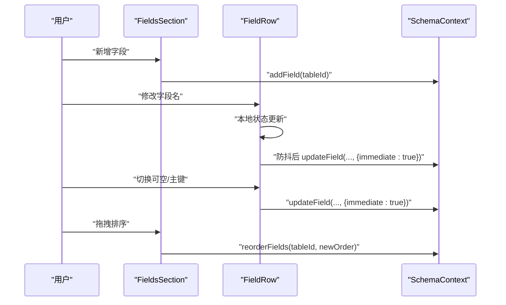
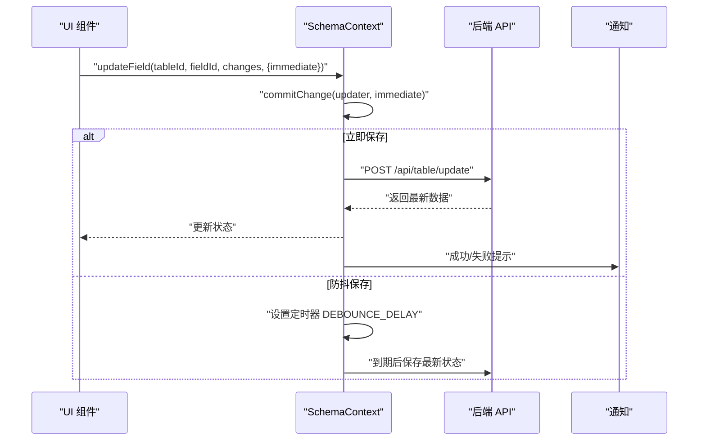
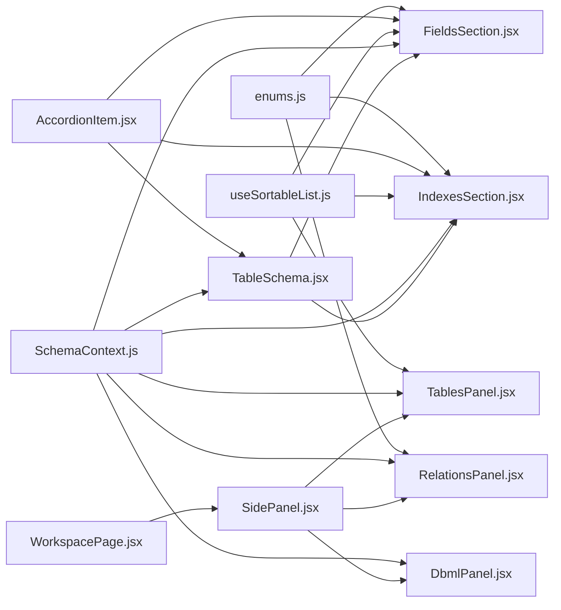

# 侧边面板系统

<cite>
**本文引用的文件**
- [src/app/workspace/[id]/page.jsx](file://src/app/workspace/[id]/page.jsx)
- [src/features/schema/SidePanel.jsx](file://src/features/schema/SidePanel.jsx)
- [src/features/schema/TablesPanel.jsx](file://src/features/schema/TablesPanel.jsx)
- [src/features/schema/RelationsPanel.jsx](file://src/features/schema/RelationsPanel.jsx)
- [src/features/schema/DbmlPanel.jsx](file://src/features/schema/DbmlPanel.jsx)
- [src/features/schema/TableSchema.jsx](file://src/features/schema/TableSchema.jsx)
- [src/features/schema/FieldsSection.jsx](file://src/features/schema/FieldsSection.jsx)
- [src/features/schema/IndexesSection.jsx](file://src/features/schema/IndexesSection.jsx)
- [src/features/schema/SchemaContext.js](file://src/features/schema/SchemaContext.js)
- [src/features/schema/dbml.js](file://src/features/schema/dbml.js)
- [src/components/AccordionItem.jsx](file://src/components/AccordionItem.jsx)
- [src/hooks/useSortableList.js](file://src/hooks/useSortableList.js)
- [src/lib/enums.js](file://src/lib/enums.js)
- [src/app/globals.css](file://src/app/globals.css)
</cite>

## 目录
1. [简介](#简介)
2. [项目结构](#项目结构)
3. [核心组件](#核心组件)
4. [架构总览](#架构总览)
5. [组件详解](#组件详解)
6. [依赖关系分析](#依赖关系分析)
7. [性能与可用性](#性能与可用性)
8. [故障排查指南](#故障排查指南)
9. [结论](#结论)
10. [附录](#附录)

## 简介
本技术文档围绕侧边面板系统进行深入解析，涵盖 SidePanel 视图模式切换机制、内容区域管理、TablesPanel 表管理、RelationsPanel 关系编辑、TableSchema 表结构展示、FieldsSection 字段编辑、IndexesSection 索引管理以及 DBML 面板的数据视图输出。同时，文档说明了展开收起动画、响应式布局适配与键盘快捷键支持，并提供可扩展的自定义与集成建议。

## 项目结构
侧边面板系统位于 schema 功能域，配合工作区页面与画布工作区共同构成完整的数据库建模体验。页面通过工具栏切换不同侧边面板，使用分割面板将侧边与画布并排展示。

图表来源
- [src/app/workspace/[id]/page.jsx:80-121](file://src/app/workspace/[id]/page.jsx#L80-L121)
- [src/features/schema/SidePanel.jsx:22-36](file://src/features/schema/SidePanel.jsx#L22-L36)
- [src/features/schema/TablesPanel.jsx:43-111](file://src/features/schema/TablesPanel.jsx#L43-L111)
- [src/features/schema/RelationsPanel.jsx:9-89](file://src/features/schema/RelationsPanel.jsx#L9-L89)
- [src/features/schema/DbmlPanel.jsx:11-36](file://src/features/schema/DbmlPanel.jsx#L11-L36)
- [src/features/schema/TableSchema.jsx:12-115](file://src/features/schema/TableSchema.jsx#L12-L115)
- [src/features/schema/FieldsSection.jsx:148-202](file://src/features/schema/FieldsSection.jsx#L148-L202)
- [src/features/schema/IndexesSection.jsx:123-187](file://src/features/schema/IndexesSection.jsx#L123-L187)

章节来源
- [src/app/workspace/[id]/page.jsx:80-121](file://src/app/workspace/[id]/page.jsx#L80-L121)
- [src/features/schema/SidePanel.jsx:7-20](file://src/features/schema/SidePanel.jsx#L7-L20)

## 核心组件
- SidePanel：根据 activePanel 参数动态渲染对应面板，统一标题栏与内容区域布局。
- TablesPanel：提供表的创建、拖拽排序与空态展示；内部嵌套 TableSchema。
- RelationsPanel：以手风琴形式展示关系，支持删除与关系类型选择。
- DbmlPanel：基于 SchemaContext 数据生成 DBML 文本视图。
- TableSchema：单表详情容器，支持表名编辑、颜色选择与折叠展开。
- FieldsSection：字段列表的增删改、拖拽排序与类型选择。
- IndexesSection：索引列表的增删改、拖拽排序与类型选择。
- SchemaContext：集中管理表、字段、索引、关系的状态与持久化。
- AccordionItem：折叠面板基础组件，提供展开动画与悬停动作显隐。
- useSortableList：封装 DnD Kit 拖拽排序逻辑。
- enums：提供字段类型、索引类型、关系基数等枚举配置。

章节来源
- [src/features/schema/SidePanel.jsx:22-36](file://src/features/schema/SidePanel.jsx#L22-L36)
- [src/features/schema/TablesPanel.jsx:43-111](file://src/features/schema/TablesPanel.jsx#L43-L111)
- [src/features/schema/RelationsPanel.jsx:9-89](file://src/features/schema/RelationsPanel.jsx#L9-L89)
- [src/features/schema/DbmlPanel.jsx:11-36](file://src/features/schema/DbmlPanel.jsx#L11-L36)
- [src/features/schema/TableSchema.jsx:12-115](file://src/features/schema/TableSchema.jsx#L12-L115)
- [src/features/schema/FieldsSection.jsx:148-202](file://src/features/schema/FieldsSection.jsx#L148-L202)
- [src/features/schema/IndexesSection.jsx:123-187](file://src/features/schema/IndexesSection.jsx#L123-L187)
- [src/features/schema/SchemaContext.js:43-392](file://src/features/schema/SchemaContext.js#L43-L392)
- [src/components/AccordionItem.jsx:6-78](file://src/components/AccordionItem.jsx#L6-L78)
- [src/hooks/useSortableList.js:10-26](file://src/hooks/useSortableList.js#L10-L26)
- [src/lib/enums.js:106-156](file://src/lib/enums.js#L106-L156)

## 架构总览
侧边面板系统采用“容器-内容-上下文”三层架构：
- 容器层：WorkspacePage 与 SidePanel 负责布局与视图切换。
- 内容层：TablesPanel、RelationsPanel、DbmlPanel 提供具体功能视图。
- 上下文层：SchemaContext 统一管理状态、调度保存与调用后端 API。

图表来源
- [src/app/workspace/[id]/page.jsx:80-121](file://src/app/workspace/[id]/page.jsx#L80-L121)
- [src/features/schema/SidePanel.jsx:22-36](file://src/features/schema/SidePanel.jsx#L22-L36)
- [src/features/schema/SchemaContext.js:43-392](file://src/features/schema/SchemaContext.js#L43-L392)

## 组件详解

### SidePanel：视图模式与内容区域管理
- 视图映射：通过常量对象维护面板映射，按 activePanel 渲染对应组件。
- 标题栏：统一展示当前面板标题与高亮色块。
- 内容区域：flex 布局，顶部标题 + 可滚动内容区，确保在分割面板中稳定占位。

章节来源
- [src/features/schema/SidePanel.jsx:7-20](file://src/features/schema/SidePanel.jsx#L7-L20)
- [src/features/schema/SidePanel.jsx:27-36](file://src/features/schema/SidePanel.jsx#L27-L36)

### TablesPanel：表管理与拖拽排序
- 表创建：输入框 + 新建按钮，回车触发创建；创建后自动展开并刷新折叠令牌。
- 表列表：空态图片与提示；有数据时启用 DndContext + SortableContext 实现拖拽排序。
- 单表渲染：每个表由 SortableTableSchema 包裹，支持拖拽与折叠控制。
- 折叠控制：通过 collapseToken 与 openKey 强制折叠/展开，确保交互一致性。

图表来源
- [src/features/schema/TablesPanel.jsx:50-55](file://src/features/schema/TablesPanel.jsx#L50-L55)
- [src/features/schema/TablesPanel.jsx:93-100](file://src/features/schema/TablesPanel.jsx#L93-L100)
- [src/features/schema/TableSchema.jsx:91-111](file://src/features/schema/TableSchema.jsx#L91-L111)
- [src/features/schema/SchemaContext.js:181-202](file://src/features/schema/SchemaContext.js#L181-L202)

章节来源
- [src/features/schema/TablesPanel.jsx:43-111](file://src/features/schema/TablesPanel.jsx#L43-L111)
- [src/hooks/useSortableList.js:10-26](file://src/hooks/useSortableList.js#L10-L26)

### TableSchema：表结构展示与编辑
- 表名编辑：双击进入编辑态，输入框聚焦；回车或失焦提交；Esc 取消。
- 颜色选择：ColorPickerInput 实时预览，结束时触发立即保存。
- 折叠控制：通过 AccordionItem 的 openKey/collapseKey 控制展开/折叠。
- 内容区：FieldsSection 与 IndexesSection 展示字段与索引；底部颜色选择器。

图表来源
- [src/features/schema/TableSchema.jsx:24-65](file://src/features/schema/TableSchema.jsx#L24-L65)
- [src/features/schema/TableSchema.jsx:37-45](file://src/features/schema/TableSchema.jsx#L37-L45)
- [src/components/AccordionItem.jsx:30-74](file://src/components/AccordionItem.jsx#L30-L74)

章节来源
- [src/features/schema/TableSchema.jsx:12-115](file://src/features/schema/TableSchema.jsx#L12-L115)

### FieldsSection：字段编辑与拖拽排序
- 字段增删改：菜单删除；输入框即时本地更新 + 防抖全局保存；类型选择立即保存。
- 可空/主键：图标切换，立即保存。
- 拖拽排序：使用 useSortableList，完成排序后批量更新顺序。
- 防抖策略：输入防抖 1 秒，减少后端压力并提升输入体验。

图表来源
- [src/features/schema/FieldsSection.jsx:19-144](file://src/features/schema/FieldsSection.jsx#L19-L144)
- [src/features/schema/FieldsSection.jsx:148-202](file://src/features/schema/FieldsSection.jsx#L148-L202)
- [src/features/schema/SchemaContext.js:219-259](file://src/features/schema/SchemaContext.js#L219-L259)
- [src/hooks/useSortableList.js:10-26](file://src/hooks/useSortableList.js#L10-L26)

章节来源
- [src/features/schema/FieldsSection.jsx:148-202](file://src/features/schema/FieldsSection.jsx#L148-L202)
- [src/lib/enums.js:106-124](file://src/lib/enums.js#L106-L124)

### IndexesSection：索引管理与拖拽排序
- 索引增删改：输入框本地更新 + 防抖保存；类型选择立即保存；唯一性切换。
- 主键索引识别：名称为 id 的索引视为主键索引，视觉区分。
- 拖拽排序：与字段一致的 DnD 实现，完成后批量更新顺序。

章节来源
- [src/features/schema/IndexesSection.jsx:123-187](file://src/features/schema/IndexesSection.jsx#L123-L187)
- [src/lib/enums.js:129-141](file://src/lib/enums.js#L129-L141)

### RelationsPanel：关系编辑界面
- 关系展示：手风琴项，左右展示主表/关联表与字段；支持删除。
- 关系类型：Select 下拉选择基数（一对一、一对多、多对多），立即保存。
- 数据来源：通过 tables 与 relations 计算表名与字段名，兼容缺失场景。

章节来源
- [src/features/schema/RelationsPanel.jsx:9-89](file://src/features/schema/RelationsPanel.jsx#L9-L89)
- [src/lib/enums.js:145-156](file://src/lib/enums.js#L145-L156)

### DbmlPanel：DBML 数据视图
- 数据生成：基于 tables 与 relations 生成 DBML 文本，使用 CodeMirror 只读展示。
- 降级策略：若导入失败，回退到手动拼接的最小 DBML 结构。

章节来源
- [src/features/schema/DbmlPanel.jsx:11-36](file://src/features/schema/DbmlPanel.jsx#L11-L36)
- [src/features/schema/dbml.js:72-115](file://src/features/schema/dbml.js#L72-L115)

### SchemaContext：状态管理与持久化
- 加载：首次挂载时拉取表与关系数据。
- 保存：commitChange 统一封装，支持防抖与立即保存；保存排队与去重，避免重复请求。
- 临时 ID：创建阶段使用临时 ID，后端返回后替换，避免输入框光标丢失。
- API：提供 addTable、updateTable、addField、updateField、addIndex、updateIndex、addRelation、updateRelation、deleteRelation 等方法。

图表来源
- [src/features/schema/SchemaContext.js:147-173](file://src/features/schema/SchemaContext.js#L147-L173)
- [src/features/schema/SchemaContext.js:85-135](file://src/features/schema/SchemaContext.js#L85-L135)

章节来源
- [src/features/schema/SchemaContext.js:43-392](file://src/features/schema/SchemaContext.js#L43-L392)

### 折叠面板与动画：AccordionItem
- 展开/折叠：点击标题切换；通过 openKey/collapseKey 强制打开/关闭。
- 动画：gridTemplateRows 与过渡时间实现平滑展开收起。
- 悬停动作：右侧动作区域随悬停显隐。

章节来源
- [src/components/AccordionItem.jsx:6-78](file://src/components/AccordionItem.jsx#L6-L78)

### 拖拽排序：useSortableList
- 传感器：PointerSensor，激活阈值 5px。
- 排序：arrayMove 计算新顺序，回调 onReorder。

章节来源
- [src/hooks/useSortableList.js:10-26](file://src/hooks/useSortableList.js#L10-L26)

### 键盘快捷键支持
- 表名编辑：回车提交、Esc 取消。
- 字段/索引名称编辑：回车提交、失焦提交。
- 关系类型：键盘选择后立即保存。

章节来源
- [src/features/schema/TableSchema.jsx:55-59](file://src/features/schema/TableSchema.jsx#L55-L59)
- [src/features/schema/FieldsSection.jsx:53-56](file://src/features/schema/FieldsSection.jsx#L53-L56)
- [src/features/schema/IndexesSection.jsx:48-52](file://src/features/schema/IndexesSection.jsx#L48-L52)

### 响应式布局适配
- 断点：全局 CSS 定义了自定义断点变量，可用于媒体查询适配。
- 侧边面板：默认最小/最大宽度约束，结合分割面板在桌面端稳定占用空间。
- 滚动区域：使用 ScrollArea 与 flex 布局，确保内容在不同窗口尺寸下可滚动。

章节来源
- [src/app/globals.css:17-20](file://src/app/globals.css#L17-L20)
- [src/app/workspace/[id]/page.jsx:97-109](file://src/app/workspace/[id]/page.jsx#L97-L109)

## 依赖关系分析

图表来源
- [src/lib/enums.js:106-156](file://src/lib/enums.js#L106-L156)
- [src/components/AccordionItem.jsx:6-78](file://src/components/AccordionItem.jsx#L6-L78)
- [src/hooks/useSortableList.js:10-26](file://src/hooks/useSortableList.js#L10-L26)
- [src/features/schema/SchemaContext.js:43-392](file://src/features/schema/SchemaContext.js#L43-L392)
- [src/features/schema/TablesPanel.jsx:43-111](file://src/features/schema/TablesPanel.jsx#L43-L111)
- [src/features/schema/RelationsPanel.jsx:9-89](file://src/features/schema/RelationsPanel.jsx#L9-L89)
- [src/features/schema/DbmlPanel.jsx:11-36](file://src/features/schema/DbmlPanel.jsx#L11-L36)
- [src/features/schema/TableSchema.jsx:12-115](file://src/features/schema/TableSchema.jsx#L12-L115)
- [src/features/schema/FieldsSection.jsx:148-202](file://src/features/schema/FieldsSection.jsx#L148-L202)
- [src/features/schema/IndexesSection.jsx:123-187](file://src/features/schema/IndexesSection.jsx#L123-L187)
- [src/app/workspace/[id]/page.jsx:80-121](file://src/app/workspace/[id]/page.jsx#L80-L121)

## 性能与可用性
- 防抖保存：字段与索引名称编辑采用 1 秒防抖，降低频繁 API 请求。
- 立即保存：开关类与类型选择等即时反馈，提升交互效率。
- 临时 ID：创建阶段使用临时 ID，后端返回后再替换，避免输入框光标丢失。
- 排队与去重：同一表并发保存时，仅触发一次请求，保存期间的新变更会在完成后重试。
- 拖拽优化：DnDKit 激活阈值与 CSS 过渡，保证拖拽顺滑与视觉反馈。
- 只读视图：DBML 使用只读编辑器，避免误操作。

## 故障排查指南
- 无法保存：检查 commitChange 是否被正确调用，确认 immediate 参数与防抖定时器状态。
- 输入框光标丢失：确认使用临时 ID 且保存后替换逻辑生效。
- 拖拽无效：检查 DndContext 与 SortableContext 的 items 与 idKey 是否匹配。
- 关系类型不更新：确认 updateRelation 的乐观更新与后端请求流程。
- DBML 导入失败：查看降级方案是否生效，检查 tables/relations 数据完整性。

章节来源
- [src/features/schema/SchemaContext.js:147-173](file://src/features/schema/SchemaContext.js#L147-L173)
- [src/features/schema/SchemaContext.js:343-363](file://src/features/schema/SchemaContext.js#L343-L363)
- [src/features/schema/dbml.js:72-89](file://src/features/schema/dbml.js#L72-L89)

## 结论
侧边面板系统通过清晰的容器-内容-上下文分层，实现了表、字段、索引与关系的可视化编辑与持久化。配合防抖保存、临时 ID、拖拽排序与折叠动画，提供了高效稳定的用户体验。DBML 视图进一步增强了数据导出与外部集成能力。

## 附录

### 自定义面板内容与扩展建议
- 新增面板：在 SidePanel 的面板映射中注册新面板，并在路由或工具栏中接入切换逻辑。
- 扩展编辑功能：在 SchemaContext 中增加对应 CRUD 方法，组件内通过 useSchema 调用。
- 集成新的数据视图：参考 DbmlPanel 的只读展示模式，使用 CodeMirror 或其他编辑器组件。

章节来源
- [src/features/schema/SidePanel.jsx:7-20](file://src/features/schema/SidePanel.jsx#L7-L20)
- [src/features/schema/SchemaContext.js:365-392](file://src/features/schema/SchemaContext.js#L365-L392)
- [src/features/schema/DbmlPanel.jsx:11-36](file://src/features/schema/DbmlPanel.jsx#L11-L36)