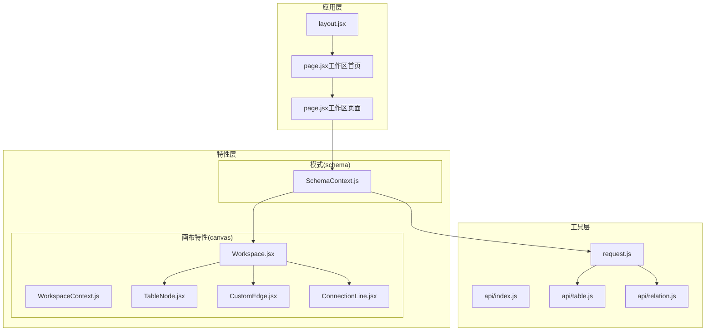
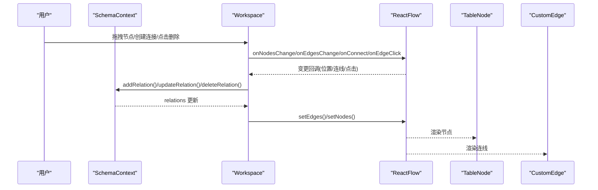
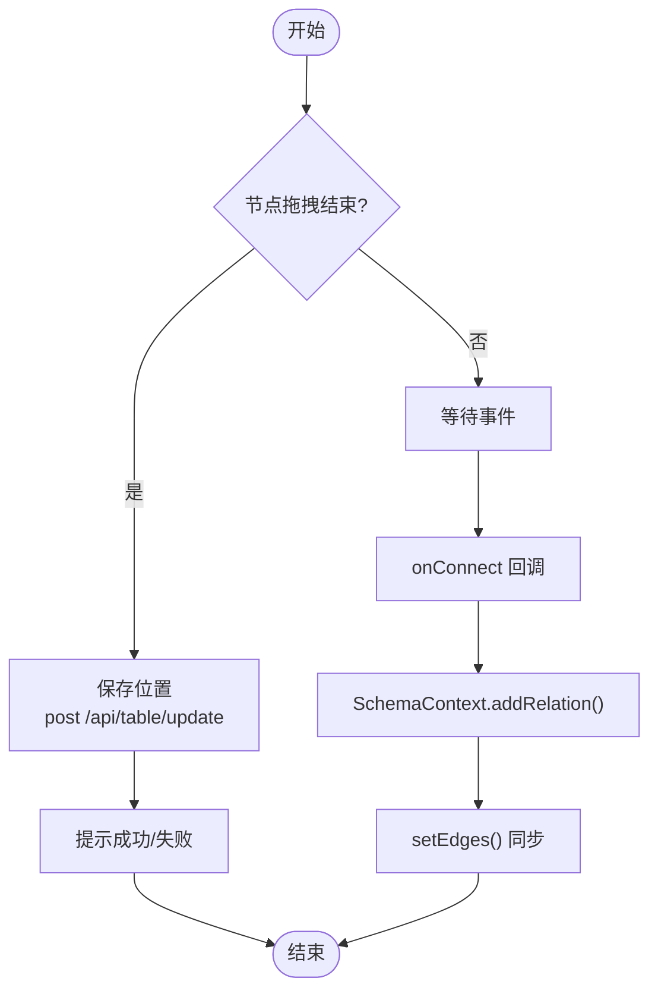
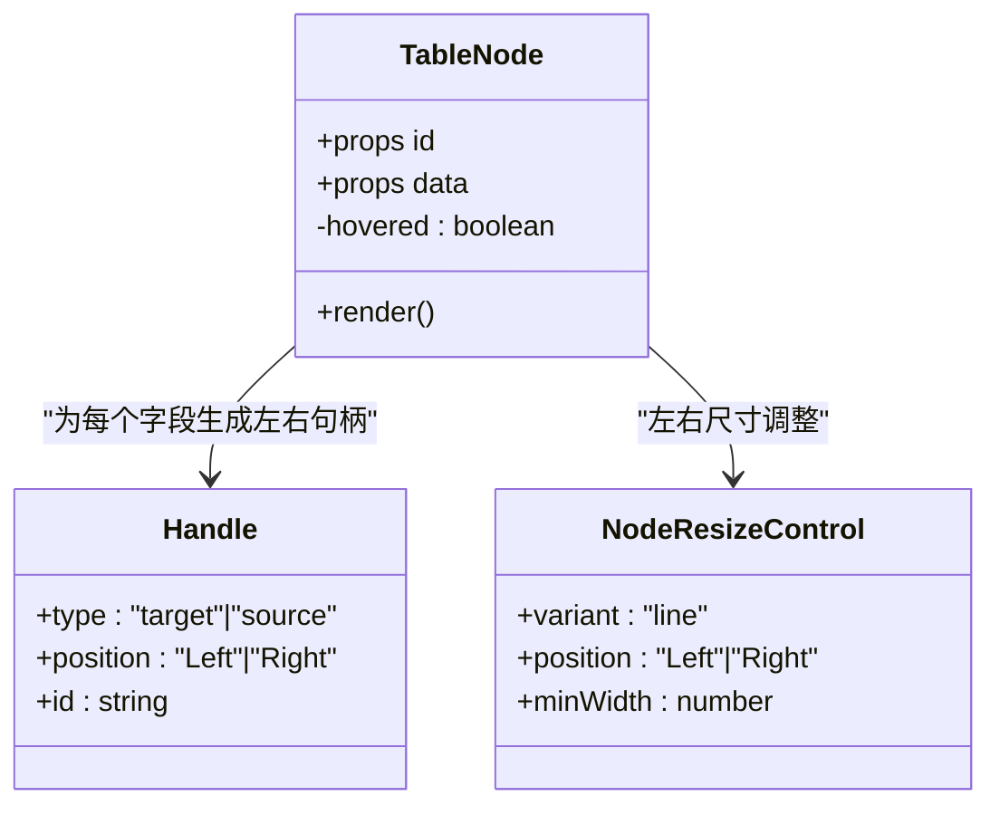
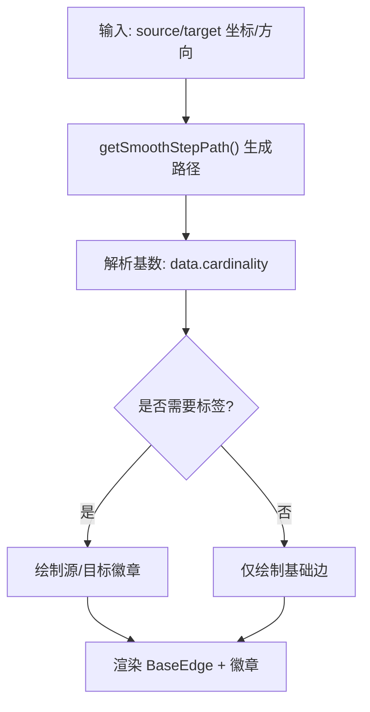
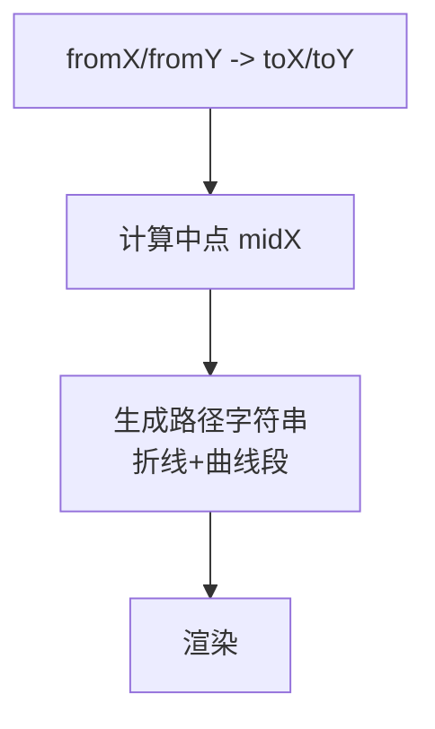
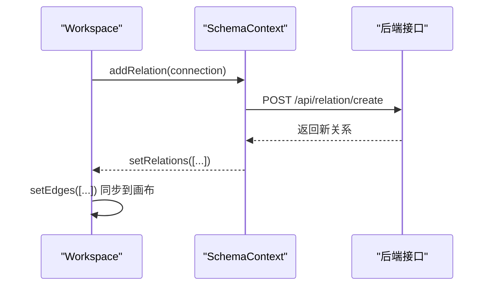
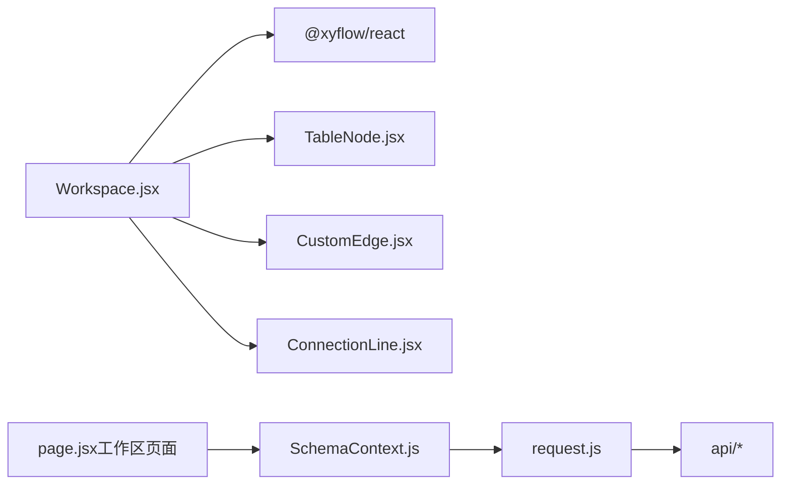

# 可视化画布系统

<cite>
**本文引用的文件**
- [Workspace.jsx](file://src/features/canvas/Workspace.jsx)
- [WorkspaceContext.js](file://src/features/canvas/WorkspaceContext.js)
- [TableNode.jsx](file://src/features/canvas/TableNode.jsx)
- [CustomEdge.jsx](file://src/features/canvas/CustomEdge.jsx)
- [ConnectionLine.jsx](file://src/features/canvas/ConnectionLine.jsx)
- [SchemaContext.js](file://src/features/schema/SchemaContext.js)
- [page.jsx（工作区入口）](file://src/app/workspace/[id]/page.jsx)
- [page.jsx（工作区首页）](file://src/app/workspace/page.jsx)
- [request.js](file://src/lib/request.js)
- [package.json](file://package.json)
- [layout.jsx](file://src/app/layout.jsx)
- [api/index.js](file://src/lib/api/index.js)
- [api/table.js](file://src/lib/api/table.js)
- [api/relation.js](file://src/lib/api/relation.js)
</cite>

## 目录
1. [简介](#简介)
2. [项目结构](#项目结构)
3. [核心组件](#核心组件)
4. [架构总览](#架构总览)
5. [组件详解](#组件详解)
6. [依赖关系分析](#依赖关系分析)
7. [性能考量](#性能考量)
8. [故障排查指南](#故障排查指南)
9. [结论](#结论)
10. [附录](#附录)

## 简介
本文件面向可视化画布系统的技术文档，聚焦 Workspace 组件的架构设计、与 React Flow 的集成方式以及实时交互机制。文档深入解析表节点（TableNode）的渲染逻辑、关系连线（CustomEdge）的绘制算法与连接线（ConnectionLine）的自定义实现；阐明 WorkspaceContext 上下文的状态管理模式、节点拖拽事件处理与位置保存机制；并覆盖画布缩放、平移、选择与删除等交互功能。最后提供扩展画布功能、自定义节点样式与处理复杂关系的实践建议，以及性能优化、内存管理与大规模数据处理的最佳实践。

## 项目结构
该系统采用按功能域分层的组织方式：
- 应用层：页面路由与布局，负责初始化上下文与容器布局。
- 特性层：画布特性（canvas）与模式（schema），分别承载画布交互与数据模型。
- 工具层：请求封装与 API 路径常量，统一网络访问与接口管理。
- 依赖层：Next.js、@xyflow/react、Mantine UI、Ant Design Icons 等。

图表来源
- [layout.jsx:10-18](file://src/app/layout.jsx#L10-L18)
- [page.jsx（工作区首页）:7-22](file://src/app/workspace/page.jsx#L7-L22)
- [page.jsx（工作区页面）:80-120](file://src/app/workspace/[id]/page.jsx#L80-L120)
- [Workspace.jsx:45-218](file://src/features/canvas/Workspace.jsx#L45-L218)
- [SchemaContext.js:43-392](file://src/features/schema/SchemaContext.js#L43-L392)
- [request.js:36-142](file://src/lib/request.js#L36-L142)
- [api/index.js:1-11](file://src/lib/api/index.js#L1-L11)
- [api/table.js:1-10](file://src/lib/api/table.js#L1-L10)
- [api/relation.js:1-10](file://src/lib/api/relation.js#L1-L10)

章节来源
- [layout.jsx:10-18](file://src/app/layout.jsx#L10-L18)
- [page.jsx（工作区首页）:7-22](file://src/app/workspace/page.jsx#L7-L22)
- [page.jsx（工作区页面）:80-120](file://src/app/workspace/[id]/page.jsx#L80-L120)

## 核心组件
- Workspace：画布容器，负责节点与连线的渲染、拖拽位置保存、连接创建、选择与删除等交互。
- TableNode：表节点渲染，包含字段列表、字段标识徽章、左右连接句柄与尺寸调整控件。
- CustomEdge：关系连线，基于平滑直角路径绘制，支持基数标签与选中态样式。
- ConnectionLine：连接预览线，自定义二次贝塞尔曲线路径，用于连接过程中的视觉反馈。
- WorkspaceContext：工作区上下文，向子组件暴露选中关系等状态。
- SchemaContext：模式上下文，负责表与关系的增删改查、序列化/反序列化、防抖保存与并发保护。

章节来源
- [Workspace.jsx:45-218](file://src/features/canvas/Workspace.jsx#L45-L218)
- [TableNode.jsx:42-153](file://src/features/canvas/TableNode.jsx#L42-L153)
- [CustomEdge.jsx:35-87](file://src/features/canvas/CustomEdge.jsx#L35-L87)
- [ConnectionLine.jsx:1-15](file://src/features/canvas/ConnectionLine.jsx#L1-L15)
- [WorkspaceContext.js:1-5](file://src/features/canvas/WorkspaceContext.js#L1-L5)
- [SchemaContext.js:43-392](file://src/features/schema/SchemaContext.js#L43-L392)

## 架构总览
系统以 SchemaContext 为中心，统一管理表与关系数据；Workspace 作为 React Flow 容器，将 SchemaContext 的状态映射为节点与连线；TableNode/CustomEdge/ConnectionLine 分别承担节点渲染、连线绘制与连接预览职责；request.js 提供统一网络访问能力，api/* 提供接口路径常量。

图表来源
- [Workspace.jsx:131-187](file://src/features/canvas/Workspace.jsx#L131-L187)
- [SchemaContext.js:307-363](file://src/features/schema/SchemaContext.js#L307-L363)

## 组件详解

### Workspace 组件
- 角色定位：画布容器，协调数据与交互。
- 数据映射：
  - 节点：由表集合 tables 通过 tablesToNodes 映射为节点数组，包含 id、type、position、style、data（label/color/fields）。
  - 边：由关系集合 relations 映射为边数组，source/target 与 handle 通过字段 id 与方向拼接形成唯一标识。
- 交互处理：
  - 节点拖拽结束时保存位置：监听 position 变化且 dragging=false，使用防重复保存标记 savingPositionRef，调用后端接口更新表位置。
  - 连接创建：onConnect 回调委托给 SchemaContext 的 addRelation，内部解析 handle 标识并构造关联请求。
  - 边选择与删除：onEdgeClick 设置选中边，onPaneClick 清空选中；键盘 Backspace 删除选中边并同步后端。
- 实时同步：当 relations 或 tables 发生变化时，通过 setEdges/setNodes 同步到 React Flow。

图表来源
- [Workspace.jsx:131-187](file://src/features/canvas/Workspace.jsx#L131-L187)
- [SchemaContext.js:307-340](file://src/features/schema/SchemaContext.js#L307-L340)

章节来源
- [Workspace.jsx:22-43](file://src/features/canvas/Workspace.jsx#L22-L43)
- [Workspace.jsx:49-79](file://src/features/canvas/Workspace.jsx#L49-L79)
- [Workspace.jsx:82-128](file://src/features/canvas/Workspace.jsx#L82-L128)
- [Workspace.jsx:131-187](file://src/features/canvas/Workspace.jsx#L131-L187)

### TableNode 组件
- 视觉结构：头部（颜色条+标题）、字段列表（字段名、类型、标识徽章）。
- 功能特性：
  - 字段级 Handle：每个字段在左右两侧提供连接句柄，句柄随鼠标悬停显隐。
  - 字段标识：主键、索引、可空等标识以徽章形式叠加显示。
  - 高亮逻辑：当存在选中边时，根据边的 source/target 与 handle 标识高亮对应字段。
  - 尺寸调整：提供左右两侧的 ResizeControl，限制最小宽度并设置横向拉伸光标。
- 渲染细节：基于 data.fields 动态生成句柄与行项，顶部偏移按固定高度累加。

图表来源
- [TableNode.jsx:42-153](file://src/features/canvas/TableNode.jsx#L42-L153)

章节来源
- [TableNode.jsx:42-153](file://src/features/canvas/TableNode.jsx#L42-L153)

### CustomEdge 组件
- 路径算法：使用平滑直角路径（smooth step）生成边路径，支持圆角半径。
- 基数标签：根据 data.cardinality 映射为“1/1”、“1/N”、“N/N”，并在源/目标端绘制圆形徽章。
- 选中样式：选中态下使用主题色、虚线与加粗描边，未选中态使用浅色实线。
- 标签位置：根据连接方向动态计算徽章 X 坐标，确保标签位于路径外侧。

图表来源
- [CustomEdge.jsx:35-87](file://src/features/canvas/CustomEdge.jsx#L35-L87)

章节来源
- [CustomEdge.jsx:35-87](file://src/features/canvas/CustomEdge.jsx#L35-L87)

### ConnectionLine 组件
- 自定义连接线：采用分段折线与二次贝塞尔曲线组合，形成“先水平再拐弯”的连接预览路径。
- 样式：使用虚线与细描边，便于区分预览与最终连线。
- 使用场景：在 Workspace 中通过 connectionLineComponent={ConnectionLine} 注入到 ReactFlow。

图表来源
- [ConnectionLine.jsx:1-15](file://src/features/canvas/ConnectionLine.jsx#L1-L15)
- [Workspace.jsx:207](file://src/features/canvas/Workspace.jsx#L207)

章节来源
- [ConnectionLine.jsx:1-15](file://src/features/canvas/ConnectionLine.jsx#L1-L15)
- [Workspace.jsx:207](file://src/features/canvas/Workspace.jsx#L207)

### WorkspaceContext 上下文
- 提供 selectedEdge 状态，TableNode 通过 useWorkspace 读取当前选中边，实现字段高亮联动。
- 作用域：仅在 Workspace 内部 Provider 包裹，避免跨组件污染。

章节来源
- [WorkspaceContext.js:1-5](file://src/features/canvas/WorkspaceContext.js#L1-L5)
- [Workspace.jsx:190-215](file://src/features/canvas/Workspace.jsx#L190-L215)
- [TableNode.jsx:44](file://src/features/canvas/TableNode.jsx#L44)

### SchemaContext 状态管理
- 数据加载：首次进入工作区时，异步加载表与关系列表。
- 表与关系操作：
  - addTable：创建新表并插入本地状态。
  - addRelation：解析 handle 标识，构造关联请求并更新本地 relations。
  - updateRelation/deleteRelation：乐观更新本地状态并调用后端接口。
- 保存机制：
  - commitChange：统一调度保存，支持立即保存与防抖保存两种模式。
  - 防抖保存：DEBOUNCE_DELAY=1500ms，避免频繁请求。
  - 并发保护：savingRef/pendingRef/saveTimersRef 三元结构，防止重复保存与丢失变更。
  - 临时 ID：创建阶段使用临时 ID，后端返回真实 ID 后进行合并，避免输入光标丢失。
- 序列化/反序列化：serializeTable/deserializeTable 保证前端状态与后端一致。

图表来源
- [SchemaContext.js:307-340](file://src/features/schema/SchemaContext.js#L307-L340)
- [Workspace.jsx:164-173](file://src/features/canvas/Workspace.jsx#L164-L173)

章节来源
- [SchemaContext.js:43-392](file://src/features/schema/SchemaContext.js#L43-L392)

## 依赖关系分析
- React Flow 集成：Workspace 引入 ReactFlow、Background、Controls，并注册自定义节点与边类型。
- 图标与UI：Ant Design Icons、Lucide React、Mantine UI 提供图标与组件基础。
- 网络层：request.js 封装 fetch，统一处理拦截器、超时与错误提示；api/* 提供接口路径常量。
- 依赖版本：@xyflow/react ^12.10.2、next ^16.2.1、mantine 9.0.0 等。

图表来源
- [Workspace.jsx:3-14](file://src/features/canvas/Workspace.jsx#L3-L14)
- [SchemaContext.js:4-6](file://src/features/schema/SchemaContext.js#L4-L6)
- [request.js:36-142](file://src/lib/request.js#L36-L142)
- [api/index.js:1-11](file://src/lib/api/index.js#L1-L11)
- [page.jsx（工作区页面）:80-120](file://src/app/workspace/[id]/page.jsx#L80-L120)

章节来源
- [package.json:16-39](file://package.json#L16-L39)
- [Workspace.jsx:3-14](file://src/features/canvas/Workspace.jsx#L3-L14)
- [SchemaContext.js:4-6](file://src/features/schema/SchemaContext.js#L4-L6)
- [request.js:36-142](file://src/lib/request.js#L36-L142)
- [api/index.js:1-11](file://src/lib/api/index.js#L1-L11)

## 性能考量
- 渲染优化
  - Workspace 使用 memo 包装，减少重渲染。
  - 节点与边的映射使用 useMemo，避免无关依赖导致的重复计算。
  - TableNode 仅在 hover 状态切换时更新句柄可见性，降低 DOM 变更频率。
- 交互节流
  - 节点拖拽结束后立即保存位置，避免频繁请求；使用 savingPositionRef 防重复保存。
  - SchemaContext 的 commitChange 支持防抖保存，DEBOUNCE_DELAY=1500ms，平衡体验与性能。
- 内存管理
  - 使用 refs（saveTimersRef/savingRef/pendingRef/tablesRef）存储临时状态，避免闭包捕获造成泄漏。
  - 删除关系时先本地乐观更新，再异步提交后端，减少 UI 卡顿。
- 大规模数据
  - 仅在 relations 或 tables 变化时重建边/节点数组，避免全量重绘。
  - 字段高亮基于 Set 查询，时间复杂度 O(1)，适合大量字段场景。
- 样式与资源
  - 使用 CSS 类控制高亮与选中态，避免内联样式的频繁重排。
  - 控制器与背景组件按需启用，减少额外开销。

## 故障排查指南
- 无法保存节点位置
  - 检查 Workspace 是否正确监听 position 变化且 dragging=false。
  - 确认 savingPositionRef 未被意外重置。
  - 核对后端接口 /api/table/update 是否可达，查看请求与响应日志。
- 连接创建失败
  - 确认 handle 标识格式为 {fieldId}-left 或 {fieldId}-right。
  - 检查 SchemaContext.addRelation 的请求参数是否完整。
- 删除关系无效
  - 确认键盘事件绑定在可获得焦点的容器上（Workspace 容器已设置 tabIndex）。
  - 检查 selectedEdge 是否正确设置与清空。
- 保存冲突或重复请求
  - 检查 SchemaContext 的 savingRef/pendingRef 逻辑，确认未同时触发多次保存。
  - 若出现临时 ID，确认后端返回真实 ID 合并流程正常。

章节来源
- [Workspace.jsx:131-187](file://src/features/canvas/Workspace.jsx#L131-L187)
- [SchemaContext.js:84-135](file://src/features/schema/SchemaContext.js#L84-L135)
- [SchemaContext.js:307-363](file://src/features/schema/SchemaContext.js#L307-L363)

## 结论
本系统通过清晰的分层设计与上下文协作，实现了稳定高效的可视化画布体验。Workspace 作为核心容器，结合 React Flow 的强大能力，提供了直观的节点拖拽、连接创建与关系管理；SchemaContext 则保障了数据一致性与性能表现。通过本文档的架构解读与最佳实践建议，开发者可以安全地扩展画布功能、自定义节点样式并处理复杂的表关系。

## 附录

### 交互功能一览
- 缩放与平移：由 ReactFlow 的 Controls 与 Background 提供内置支持。
- 选择与删除：点击边进行选择，点击画布取消选择，按下 Backspace 删除选中边。
- 连接预览：通过自定义 ConnectionLine 提供流畅的连接反馈。

章节来源
- [Workspace.jsx:196-212](file://src/features/canvas/Workspace.jsx#L196-L212)
- [ConnectionLine.jsx:1-15](file://src/features/canvas/ConnectionLine.jsx#L1-L15)

### 扩展与定制实践
- 自定义节点样式
  - 在 TableNode 中调整头部颜色条、字段行高与高亮颜色，满足品牌规范。
  - 通过 Handle 的样式与透明度控制，优化连接提示的可见性。
- 自定义连线样式
  - 在 CustomEdge 中调整路径圆角、线条宽度与选中态样式，适配不同主题。
  - 通过基数标签位置计算，确保标签不与路径重叠。
- 复杂关系处理
  - 在 SchemaContext 中扩展 addRelation 的默认基数与命名规则，支持多表关联与复合键。
  - 使用 commitChange 的 immediate 参数区分即时保存与防抖保存，提升编辑体验。

章节来源
- [TableNode.jsx:10-17](file://src/features/canvas/TableNode.jsx#L10-L17)
- [CustomEdge.jsx:57-61](file://src/features/canvas/CustomEdge.jsx#L57-L61)
- [SchemaContext.js:147-173](file://src/features/schema/SchemaContext.js#L147-L173)