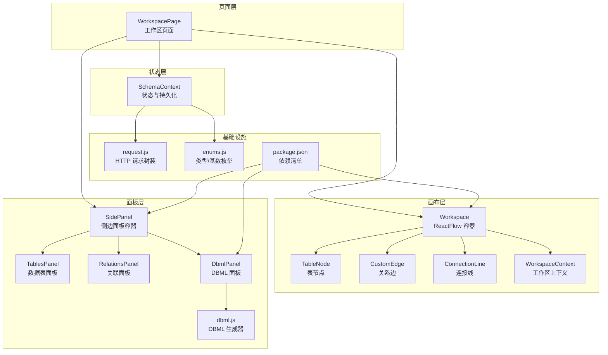
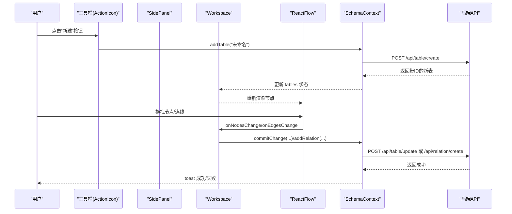
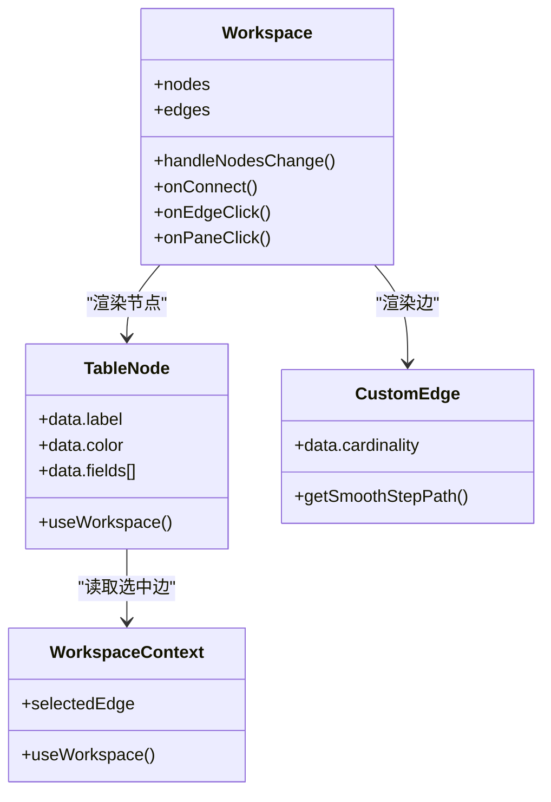
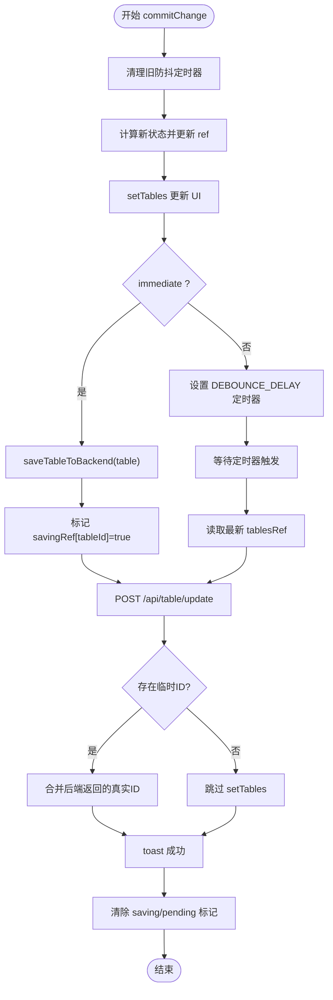
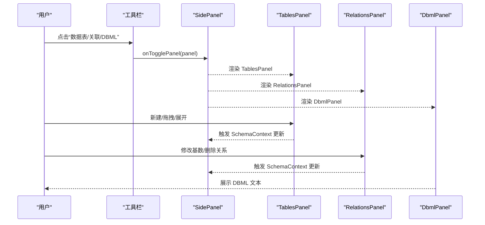
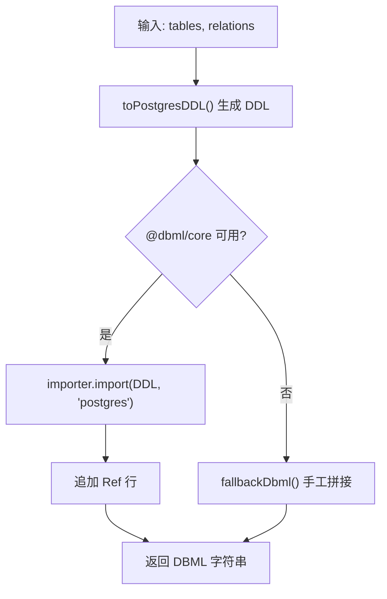
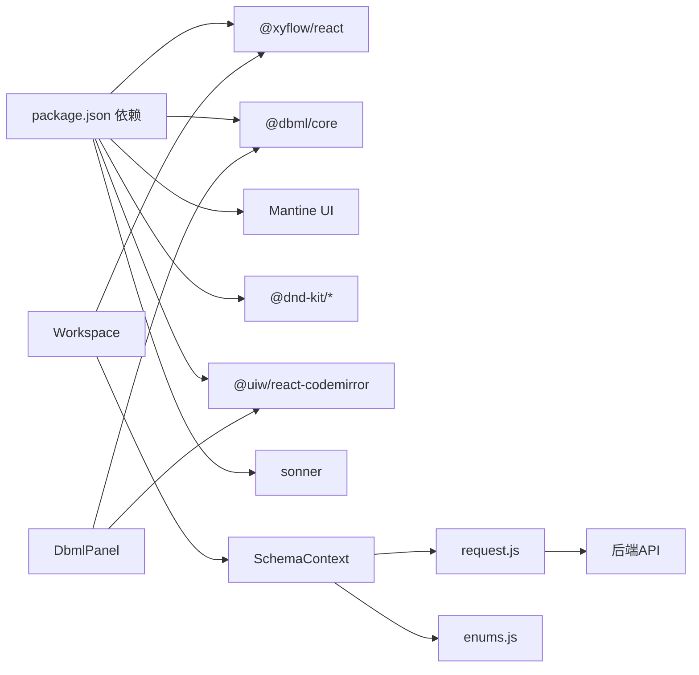

# 核心功能模块

<cite>
**本文引用的文件**
- [src/app/workspace/[id]/page.jsx](file://src/app/workspace/[id]/page.jsx)
- [src/features/canvas/Workspace.jsx](file://src/features/canvas/Workspace.jsx)
- [src/features/canvas/WorkspaceContext.js](file://src/features/canvas/WorkspaceContext.js)
- [src/features/canvas/TableNode.jsx](file://src/features/canvas/TableNode.jsx)
- [src/features/canvas/CustomEdge.jsx](file://src/features/canvas/CustomEdge.jsx)
- [src/features/canvas/ConnectionLine.jsx](file://src/features/canvas/ConnectionLine.jsx)
- [src/features/schema/SchemaContext.js](file://src/features/schema/SchemaContext.js)
- [src/features/schema/SidePanel.jsx](file://src/features/schema/SidePanel.jsx)
- [src/features/schema/TablesPanel.jsx](file://src/features/schema/TablesPanel.jsx)
- [src/features/schema/RelationsPanel.jsx](file://src/features/schema/RelationsPanel.jsx)
- [src/features/schema/DbmlPanel.jsx](file://src/features/schema/DbmlPanel.jsx)
- [src/features/schema/dbml.js](file://src/features/schema/dbml.js)
- [src/lib/enums.js](file://src/lib/enums.js)
- [src/lib/request.js](file://src/lib/request.js)
- [package.json](file://package.json)
</cite>

## 目录
1. [简介](#简介)
2. [项目结构](#项目结构)
3. [核心组件](#核心组件)
4. [架构总览](#架构总览)
5. [详细组件分析](#详细组件分析)
6. [依赖分析](#依赖分析)
7. [性能考虑](#性能考虑)
8. [故障排查指南](#故障排查指南)
9. [结论](#结论)
10. [附录](#附录)

## 简介
本文件面向功能开发者与最终用户，系统性梳理 Vibe DB 的核心功能模块：可视化画布系统、状态管理系统、侧边面板系统与 DBML 导出系统。文档解释模块间协作关系、数据流与用户交互流程，给出功能特性、使用场景、最佳实践、扩展点与集成方式，并通过图示与路径指引帮助快速定位实现细节。

## 项目结构
Vibe DB 采用 Next.js 应用结构，核心功能集中在 features 目录：
- 可视化画布：基于 @xyflow/react 实现，负责表节点与关系连线的渲染与交互。
- 状态管理：SchemaContext 提供统一的状态与持久化策略，封装 API 调用与本地优化。
- 侧边面板：按“DBML/数据表/关联”三个面板切换，分别展示与编辑模型信息。
- DBML 导出：将当前 schema 转换为 DBML 文本，支持回退与 @dbml/core 转换。

图表来源
- [src/app/workspace/[id]/page.jsx:80-121](file://src/app/workspace/[id]/page.jsx#L80-L121)
- [src/features/schema/SchemaContext.js:43-392](file://src/features/schema/SchemaContext.js#L43-L392)
- [src/features/canvas/Workspace.jsx:45-219](file://src/features/canvas/Workspace.jsx#L45-L219)
- [src/features/canvas/TableNode.jsx:42-153](file://src/features/canvas/TableNode.jsx#L42-L153)
- [src/features/canvas/CustomEdge.jsx:35-87](file://src/features/canvas/CustomEdge.jsx#L35-L87)
- [src/features/schema/SidePanel.jsx:22-39](file://src/features/schema/SidePanel.jsx#L22-L39)
- [src/features/schema/TablesPanel.jsx:43-111](file://src/features/schema/TablesPanel.jsx#L43-L111)
- [src/features/schema/RelationsPanel.jsx:9-89](file://src/features/schema/RelationsPanel.jsx#L9-L89)
- [src/features/schema/DbmlPanel.jsx:11-36](file://src/features/schema/DbmlPanel.jsx#L11-L36)
- [src/features/schema/dbml.js:72-115](file://src/features/schema/dbml.js#L72-L115)
- [src/lib/request.js:36-142](file://src/lib/request.js#L36-L142)
- [src/lib/enums.js:143-156](file://src/lib/enums.js#L143-L156)
- [package.json:16-55](file://package.json#L16-L55)

章节来源
- [src/app/workspace/[id]/page.jsx:80-121](file://src/app/workspace/[id]/page.jsx#L80-L121)
- [package.json:16-55](file://package.json#L16-L55)

## 核心组件
- 可视化画布系统：以 ReactFlow 为核心，提供节点拖拽、连线、缩放、背景网格与控制控件；节点与边均为自定义组件，支持字段高亮与基数标签。
- 状态管理系统：SchemaContext 负责加载/保存表与关系，提供防抖与排队保存、临时 ID 管理、乐观更新与错误提示；统一暴露 CRUD 方法。
- 侧边面板系统：三面板切换（DBML/数据表/关联），数据表面板支持拖拽排序与批量展开折叠；关联面板支持修改基数与删除关系。
- DBML 导出系统：将 tables + relations 转换为 DBML 文本，优先使用 @dbml/core，失败时回退为手工拼接；DbmlPanel 使用 CodeMirror 展示只读 SQL 语法高亮文本。

章节来源
- [src/features/canvas/Workspace.jsx:45-219](file://src/features/canvas/Workspace.jsx#L45-L219)
- [src/features/schema/SchemaContext.js:43-392](file://src/features/schema/SchemaContext.js#L43-L392)
- [src/features/schema/SidePanel.jsx:22-39](file://src/features/schema/SidePanel.jsx#L22-L39)
- [src/features/schema/DbmlPanel.jsx:11-36](file://src/features/schema/DbmlPanel.jsx#L11-L36)
- [src/features/schema/dbml.js:72-115](file://src/features/schema/dbml.js#L72-L115)

## 架构总览
整体采用“页面容器 + 上下文提供者 + 功能模块”的分层设计。页面层负责布局与工具栏，上下文提供者集中处理状态与持久化，功能模块各自职责清晰且通过上下文解耦。

图表来源
- [src/app/workspace/[id]/page.jsx:14-78](file://src/app/workspace/[id]/page.jsx#L14-L78)
- [src/features/schema/SchemaContext.js:147-173](file://src/features/schema/SchemaContext.js#L147-L173)
- [src/features/canvas/Workspace.jsx:131-173](file://src/features/canvas/Workspace.jsx#L131-L173)

## 详细组件分析

### 可视化画布系统
- 节点与边
  - TableNode：每个字段左右两侧提供连接 Handle，悬停时显示，支持字段标识徽标（主键/索引/可空）与高亮。
  - CustomEdge：平滑阶梯边，支持基数标签（1/1、1/N、N/N），选中时样式变化。
  - ConnectionLine：自定义连线样式，配合默认边类型使用。
- 交互与状态
  - Workspace 使用 useNodesState/useEdgesState 管理节点与边，监听节点位置变化并即时保存（拖拽结束触发）。
  - 支持通过连接器创建关系，点击边或空白处进行选择与删除。
  - 通过 WorkspaceContext 暴露 selectedEdge，TableNode 基于该状态高亮相关字段。
- 性能与体验
  - 节点拖拽结束后立即保存，避免频繁请求；使用防抖与去重标记减少重复保存。
  - 边根据 relations 动态同步，保持与状态一致。

图表来源
- [src/features/canvas/Workspace.jsx:45-219](file://src/features/canvas/Workspace.jsx#L45-L219)
- [src/features/canvas/TableNode.jsx:42-153](file://src/features/canvas/TableNode.jsx#L42-L153)
- [src/features/canvas/CustomEdge.jsx:35-87](file://src/features/canvas/CustomEdge.jsx#L35-L87)
- [src/features/canvas/WorkspaceContext.js:1-5](file://src/features/canvas/WorkspaceContext.js#L1-L5)

章节来源
- [src/features/canvas/Workspace.jsx:45-219](file://src/features/canvas/Workspace.jsx#L45-L219)
- [src/features/canvas/TableNode.jsx:42-153](file://src/features/canvas/TableNode.jsx#L42-L153)
- [src/features/canvas/CustomEdge.jsx:35-87](file://src/features/canvas/CustomEdge.jsx#L35-L87)
- [src/features/canvas/ConnectionLine.jsx](file://src/features/canvas/ConnectionLine.jsx)
- [src/features/canvas/WorkspaceContext.js:1-5](file://src/features/canvas/WorkspaceContext.js#L1-L5)

### 状态管理系统
- 数据加载
  - 初始化时根据 schemaId 加载 tables 与 relations，反序列化位置与字段顺序。
- 保存策略
  - commitChange 统一封装更新与保存，支持立即保存与防抖保存两种模式。
  - saveTableToBackend 实现“正在保存标记 + 待重保存队列”，避免并发冲突与重复请求。
  - 临时 ID 生成与替换：创建阶段使用临时 ID，后端返回真实 ID 后合并，避免输入框光标丢失。
- 关系管理
  - addRelation 从连接信息解析源/目标字段，生成默认名称并调用后端创建。
  - updateRelation 乐观更新，再异步提交；deleteRelation 先本地移除再调用后端删除。
- API 交互
  - 通过 request.js 统一发起 GET/POST/PUT/DELETE，内置拦截器、超时与错误提示。

图表来源
- [src/features/schema/SchemaContext.js:147-173](file://src/features/schema/SchemaContext.js#L147-L173)
- [src/features/schema/SchemaContext.js:86-135](file://src/features/schema/SchemaContext.js#L86-L135)

章节来源
- [src/features/schema/SchemaContext.js:43-392](file://src/features/schema/SchemaContext.js#L43-L392)
- [src/lib/request.js:36-142](file://src/lib/request.js#L36-L142)

### 侧边面板系统
- 面板路由
  - SidePanel 根据 activePanel 渲染对应面板：DbmlPanel、TablesPanel、RelationsPanel。
- 数据表面板
  - 支持新增表、拖拽排序、展开/折叠；使用 DndKit 实现拖拽，结合 useSortableList 管理排序回调。
- 关联面板
  - 展示主表/关联表与字段信息，支持修改基数与删除关系；通过枚举提供中文选项。

图表来源
- [src/app/workspace/[id]/page.jsx:85-119](file://src/app/workspace/[id]/page.jsx#L85-L119)
- [src/features/schema/SidePanel.jsx:22-39](file://src/features/schema/SidePanel.jsx#L22-L39)
- [src/features/schema/TablesPanel.jsx:43-111](file://src/features/schema/TablesPanel.jsx#L43-L111)
- [src/features/schema/RelationsPanel.jsx:9-89](file://src/features/schema/RelationsPanel.jsx#L9-L89)
- [src/features/schema/DbmlPanel.jsx:11-36](file://src/features/schema/DbmlPanel.jsx#L11-L36)

章节来源
- [src/features/schema/SidePanel.jsx:22-39](file://src/features/schema/SidePanel.jsx#L22-L39)
- [src/features/schema/TablesPanel.jsx:43-111](file://src/features/schema/TablesPanel.jsx#L43-L111)
- [src/features/schema/RelationsPanel.jsx:9-89](file://src/features/schema/RelationsPanel.jsx#L9-L89)

### DBML 导出系统
- 转换流程
  - generateDbml：先将 tables 转为 PostgreSQL DDL，再用 @dbml/core 导入为 DBML；随后追加关系 Ref 行。
  - 若转换失败则回退为手工拼接（Table {...} 与 Ref 行）。
- 展示
  - DbmlPanel 使用 CodeMirror 以 SQL 语法高亮展示只读 DBML 文本，随 tables/relations 变化实时更新。

图表来源
- [src/features/schema/dbml.js:72-115](file://src/features/schema/dbml.js#L72-L115)
- [src/features/schema/DbmlPanel.jsx:11-36](file://src/features/schema/DbmlPanel.jsx#L11-L36)

章节来源
- [src/features/schema/dbml.js:72-115](file://src/features/schema/dbml.js#L72-L115)
- [src/features/schema/DbmlPanel.jsx:11-36](file://src/features/schema/DbmlPanel.jsx#L11-L36)

## 依赖分析
- 外部库
  - @xyflow/react：画布与节点/边渲染。
  - @dbml/core：DBML 转换。
  - @mantine/*：UI 组件与主题。
  - @dnd-kit/*：拖拽排序。
  - @uiw/react-codemirror：SQL 语法高亮。
  - sonner：消息提示。
- 内部依赖
  - request.js：统一 HTTP 请求封装。
  - enums.js：类型与基数枚举。
  - SchemaContext：状态与持久化。
  - Canvas 组件：TableNode/CustomEdge/Workspace。

图表来源
- [package.json:16-55](file://package.json#L16-L55)
- [src/lib/request.js:36-142](file://src/lib/request.js#L36-L142)
- [src/lib/enums.js:143-156](file://src/lib/enums.js#L143-L156)
- [src/features/schema/SchemaContext.js:43-392](file://src/features/schema/SchemaContext.js#L43-L392)
- [src/features/canvas/Workspace.jsx:45-219](file://src/features/canvas/Workspace.jsx#L45-L219)
- [src/features/schema/DbmlPanel.jsx:11-36](file://src/features/schema/DbmlPanel.jsx#L11-L36)

章节来源
- [package.json:16-55](file://package.json#L16-L55)

## 性能考虑
- 保存策略
  - 防抖保存：输入类变更使用 DEBOUNCE_DELAY，减少频繁请求。
  - 立即保存：开关/选择类变更立即保存，避免等待。
  - 正在保存标记与待重保存队列：避免并发与重复保存。
- 画布渲染
  - 节点/边状态与 props 保持稳定，减少重渲染。
  - 仅在拖拽结束时保存位置，降低网络压力。
- UI 体验
  - CodeMirror 只读展示 DBML，避免编辑误触。
  - 临时 ID 合并策略避免输入框光标跳动。

[本节为通用指导，无需列出具体文件来源]

## 故障排查指南
- 保存失败
  - 现象：toast 报错“保存失败”。
  - 排查：检查 request.js 的拦截器与错误处理；确认后端接口是否返回 success 字段；查看 SchemaContext 的保存流程。
- 超时与网络异常
  - 现象：请求超时或网络异常提示。
  - 排查：request.js 设置了超时控制与错误拦截，确认网络连通性与后端服务状态。
- DBML 导出异常
  - 现象：DBML 文本为空或报错。
  - 排查：dbml.js 的回退逻辑会在转换失败时降级为手工拼接；检查 tables/relations 是否为空或字段缺失。
- 关系创建失败
  - 现象：创建关系后未出现在画布或面板。
  - 排查：确认 addRelation 的连接信息与 handleId 格式；检查 relations 是否正确写入与同步。

章节来源
- [src/lib/request.js:36-142](file://src/lib/request.js#L36-L142)
- [src/features/schema/SchemaContext.js:86-135](file://src/features/schema/SchemaContext.js#L86-L135)
- [src/features/schema/dbml.js:72-115](file://src/features/schema/dbml.js#L72-L115)

## 结论
Vibe DB 的核心模块围绕“状态中心 + 可视化画布 + 侧边面板 + DBML 导出”构建，通过 SchemaContext 统一状态与持久化，Canvas 提供直观的建模交互，SidePanel 与 DbmlPanel 支撑模型编辑与导出。模块间通过上下文解耦、API 封装与防抖/排队机制保障一致性与性能。建议在扩展新功能时遵循现有模式：统一状态、最小化副作用、明确保存策略与错误处理。

[本节为总结，无需列出具体文件来源]

## 附录
- 使用场景
  - 快速建模：通过画布拖拽创建表与字段，连接器建立关系。
  - 模型维护：侧边面板调整表/字段/索引/关系属性。
  - 导出与分享：DBML 面板复制 DBML 文本，对接下游工具链。
- 最佳实践
  - 输入类变更使用防抖保存，避免频繁请求。
  - 临时 ID 仅在创建阶段使用，确保后端返回真实 ID 后及时合并。
  - 关系创建时保持字段类型匹配，合理选择基数。
  - DBML 导出前先检查索引与字段完整性。
- 扩展点与集成
  - 插件机制：可在 SchemaContext 中扩展新的 CRUD 方法与保存策略。
  - 集成方式：通过 request.js 注册拦截器实现鉴权/埋点；通过 enums.js 扩展字段类型与基数选项。
  - 代码示例路径
    - [工作区页面与工具栏:80-121](file://src/app/workspace/[id]/page.jsx#L80-L121)
    - [SchemaContext 状态与保存:43-392](file://src/features/schema/SchemaContext.js#L43-L392)
    - [画布容器与事件处理:45-219](file://src/features/canvas/Workspace.jsx#L45-L219)
    - [表节点与字段标识:42-153](file://src/features/canvas/TableNode.jsx#L42-L153)
    - [关系边与基数标签:35-87](file://src/features/canvas/CustomEdge.jsx#L35-L87)
    - [DBML 生成与回退:72-115](file://src/features/schema/dbml.js#L72-L115)
    - [DBML 面板展示:11-36](file://src/features/schema/DbmlPanel.jsx#L11-36)
    - [类型与基数枚举:143-156](file://src/lib/enums.js#L143-156)
    - [HTTP 请求封装:36-142](file://src/lib/request.js#L36-L142)

[本节为补充说明，无需列出具体文件来源]