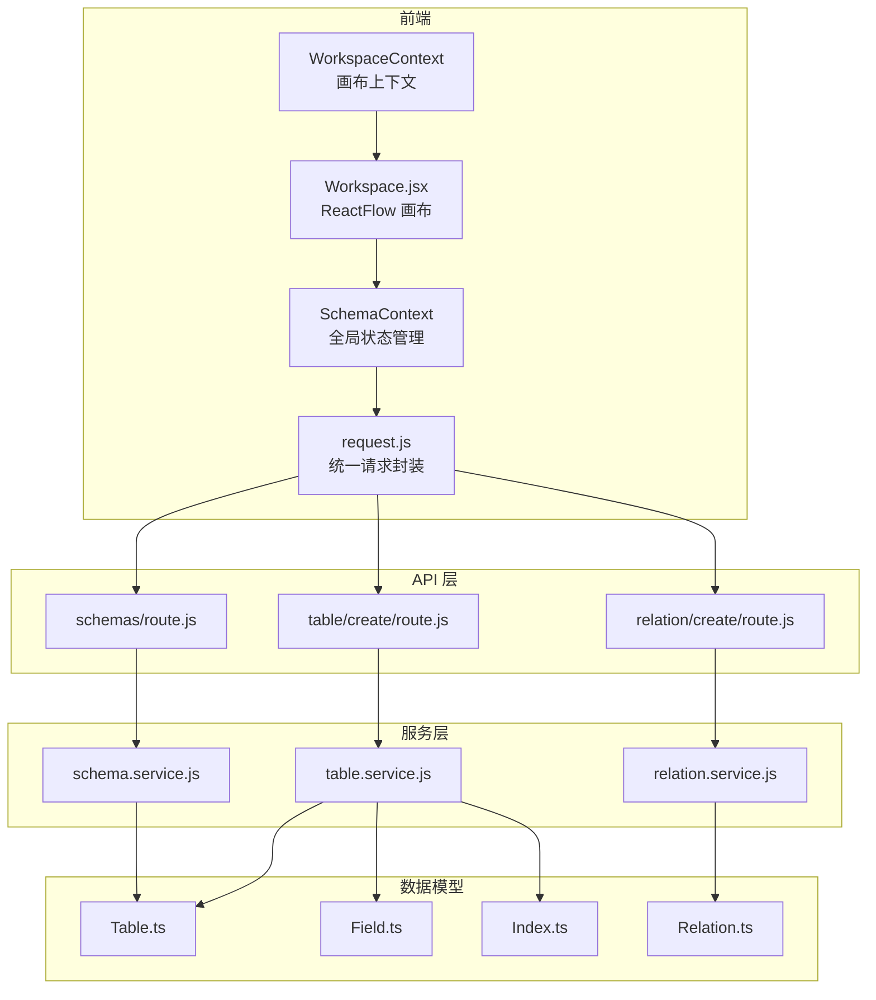
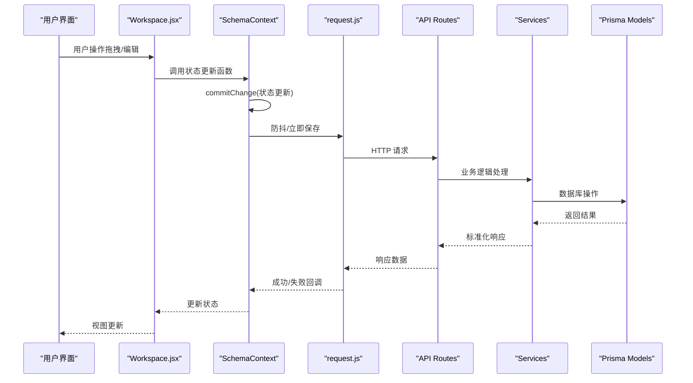
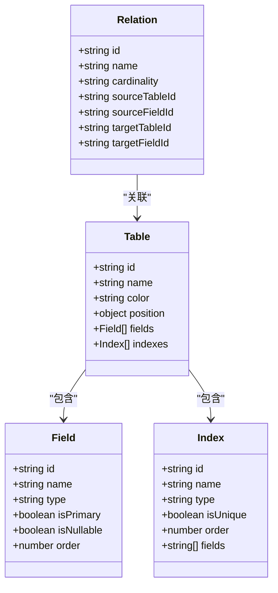
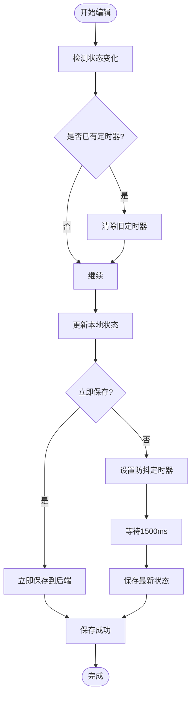
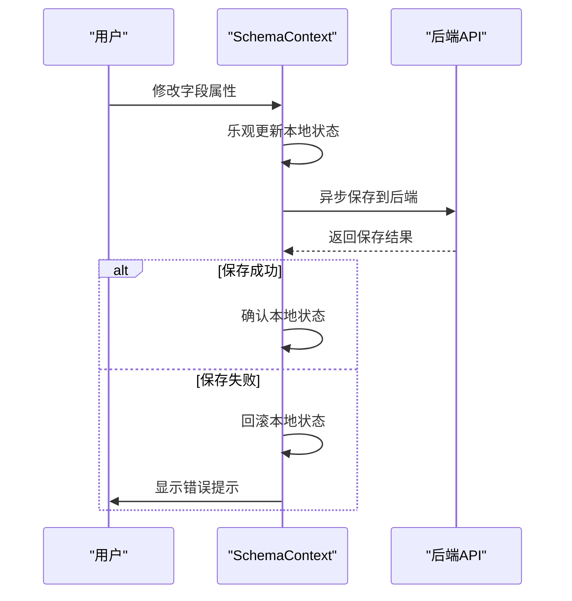
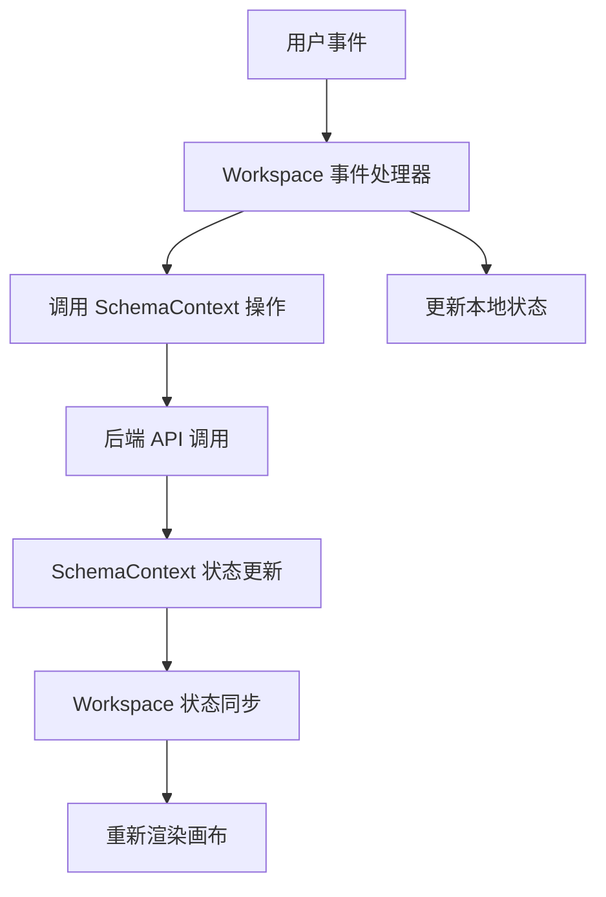
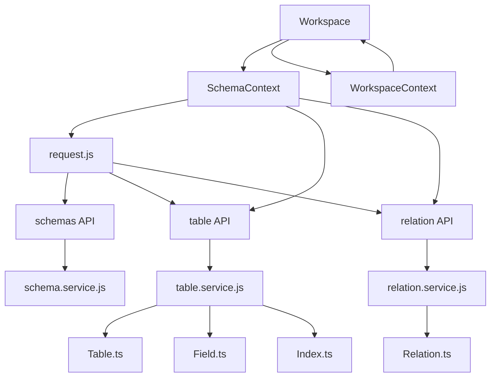

# 状态管理系统

<cite>
**本文档引用的文件**
- [SchemaContext.js](file://src/features/schema/SchemaContext.js)
- [WorkspaceContext.js](file://src/features/canvas/WorkspaceContext.js)
- [Workspace.jsx](file://src/features/canvas/Workspace.jsx)
- [request.js](file://src/lib/request.js)
- [route.js](file://src/app/api/schemas/route.js)
- [route.js](file://src/app/api/table/create/route.js)
- [route.js](file://src/app/api/relation/create/route.js)
- [schema.service.js](file://src/server/services/schema.service.js)
- [table.service.js](file://src/server/services/table.service.js)
- [relation.service.js](file://src/server/services/relation.service.js)
- [Table.ts](file://src/generated/prisma/models/Table.ts)
- [Field.ts](file://src/generated/prisma/models/Field.ts)
- [Index.ts](file://src/generated/prisma/models/Index.ts)
- [Relation.ts](file://src/generated/prisma/models/Relation.ts)
</cite>

## 目录
1. [简介](#简介)
2. [项目结构](#项目结构)
3. [核心组件](#核心组件)
4. [架构总览](#架构总览)
5. [详细组件分析](#详细组件分析)
6. [依赖分析](#依赖分析)
7. [性能考虑](#性能考虑)
8. [故障排除指南](#故障排除指南)
9. [结论](#结论)
10. [附录](#附录)

## 简介
本系统是一个基于 React 的数据库模式可视化编辑器，采用前端状态管理与后端 API 的分层架构。系统通过 SchemaContext 提供全局状态管理，支持表、字段、索引、关系的 CRUD 操作；通过 WorkspaceContext 和 Workspace 组件实现画布交互与选中状态管理；通过防抖保存策略和乐观更新机制确保用户体验与数据一致性。

## 项目结构
系统采用前后端分离的三层架构：
- 前端状态层：SchemaContext 负责全局状态管理，WorkspaceContext 提供画布上下文
- 前端组件层：Workspace.jsx 集成 ReactFlow 实现画布交互
- API 层：Next.js App Router API Routes 提供 REST 接口
- 服务层：各 service 文件封装业务逻辑与数据校验
- 数据模型层：Prisma 自动生成的类型定义

**图表来源**
- [SchemaContext.js:1-392](file://src/features/schema/SchemaContext.js#L1-L392)
- [Workspace.jsx:1-219](file://src/features/canvas/Workspace.jsx#L1-L219)
- [request.js:1-142](file://src/lib/request.js#L1-L142)
- [route.js:1-23](file://src/app/api/schemas/route.js#L1-L23)
- [route.js:1-16](file://src/app/api/table/create/route.js#L1-L16)
- [route.js:1-14](file://src/app/api/relation/create/route.js#L1-L14)

**章节来源**
- [SchemaContext.js:1-392](file://src/features/schema/SchemaContext.js#L1-L392)
- [Workspace.jsx:1-219](file://src/features/canvas/Workspace.jsx#L1-L219)
- [request.js:1-142](file://src/lib/request.js#L1-L142)

## 核心组件
系统的核心由三个组件构成：

### SchemaContext - 全局状态架构
SchemaContext 是整个状态管理系统的核心，负责：
- 全局状态存储：tables、relations
- 防抖保存机制：DEBOUNCE_DELAY=1500ms
- 乐观更新：本地状态优先，后端成功后再同步
- 临时 ID 管理：生成 temp-{timestamp}-{random} 格式的临时 ID
- 并发控制：savingRef、pendingRef、saveTimersRef

关键特性：
- 使用 useRef 追踪最新状态，避免闭包陷阱
- commitChange 函数统一处理状态更新和保存调度
- serializeTable/deserializeTable 实现前后端数据格式转换
- 支持立即保存（immediate=true）和防抖保存（immediate=false）

### WorkspaceContext - 画布交互上下文
提供画布级别的选中状态管理：
- selectedEdge 状态管理
- 事件传播机制：键盘事件、鼠标事件
- 与 SchemaContext 协同工作

### Workspace - 画布组件
集成 ReactFlow 实现可视化编辑：
- 节点渲染：TableNode 组件
- 边渲染：CustomEdge 组件
- 交互处理：拖拽、连接、删除
- 位置保存：拖拽结束后立即保存

**章节来源**
- [SchemaContext.js:43-392](file://src/features/schema/SchemaContext.js#L43-L392)
- [WorkspaceContext.js:1-5](file://src/features/canvas/WorkspaceContext.js#L1-L5)
- [Workspace.jsx:45-219](file://src/features/canvas/Workspace.jsx#L45-L219)

## 架构总览
系统采用分层架构，确保关注点分离和可维护性：

**图表来源**
- [Workspace.jsx:131-162](file://src/features/canvas/Workspace.jsx#L131-L162)
- [SchemaContext.js:147-173](file://src/features/schema/SchemaContext.js#L147-L173)
- [request.js:36-121](file://src/lib/request.js#L36-L121)

## 详细组件分析

### SchemaContext 状态管理机制

#### 状态数据模型设计
系统使用扁平化的状态结构，每个实体包含：
- 表(Table)：id、name、color、position、fields、indexes
- 字段(Field)：id、name、type、isPrimary、isNullable、order
- 索引(Index)：id、name、type、isUnique、order、fields
- 关系(Relation)：id、name、cardinality、source/target 表字段

**图表来源**
- [Table.ts:325-414](file://src/generated/prisma/models/Table.ts#L325-L414)
- [Field.ts:291-358](file://src/generated/prisma/models/Field.ts#L291-L358)
- [Index.ts:279-340](file://src/generated/prisma/models/Index.ts#L279-L340)
- [Relation.ts:291-366](file://src/generated/prisma/models/Relation.ts#L291-L366)

#### 防抖保存策略
系统实现了智能的防抖保存机制：

**图表来源**
- [SchemaContext.js:147-173](file://src/features/schema/SchemaContext.js#L147-L173)
- [SchemaContext.js:85-135](file://src/features/schema/SchemaContext.js#L85-L135)

#### 乐观更新机制
系统采用乐观更新策略提升用户体验：

**图表来源**
- [SchemaContext.js:342-352](file://src/features/schema/SchemaContext.js#L342-L352)

#### CRUD 操作实现
系统为每种实体提供了完整的 CRUD 操作：

**表操作 (Table CRUD)**
- 添加表：addTable - 生成临时 ID，创建后替换为真实 ID
- 更新表：updateTable - 支持立即保存（颜色/坐标）和防抖保存（名称）
- 删除表：通过软删除实现
- 重排序：reorderTables

**字段操作 (Field CRUD)**
- 添加字段：addField - 使用临时 ID
- 更新字段：updateField - 支持立即保存（开关/选择）和防抖保存（名称）
- 删除字段：deleteField
- 重排序：reorderFields

**索引操作 (Index CRUD)**
- 添加索引：addIndex - 使用临时 ID
- 更新索引：updateIndex - 支持立即保存（开关/选择）和防抖保存（名称）
- 删除索引：deleteIndex
- 重排序：reorderIndexes

**关系操作 (Relation CRUD)**
- 创建关系：addRelation - 从 ReactFlow connection 生成
- 更新关系：updateRelation - 乐观更新
- 删除关系：deleteRelation - 乐观更新

**章节来源**
- [SchemaContext.js:179-363](file://src/features/schema/SchemaContext.js#L179-L363)

### Workspace 画布交互机制

#### 选中状态管理
WorkspaceContext 提供了画布级别的选中状态：
- selectedEdge 状态：跟踪当前选中的关系边
- 事件处理：键盘事件（Backspace 删除）、鼠标点击事件
- 状态同步：与 relations 状态保持一致

#### 事件传播机制

**图表来源**
- [Workspace.jsx:179-187](file://src/features/canvas/Workspace.jsx#L179-L187)
- [Workspace.jsx:164-173](file://src/features/canvas/Workspace.jsx#L164-L173)

#### 画布节点映射
系统实现了表到节点的双向映射：
- tablesToNodes：将表数据转换为 ReactFlow 节点
- 节点数据包含：标签、颜色、字段列表、索引标识
- 动态更新：当表状态变化时自动同步到节点

**章节来源**
- [Workspace.jsx:22-43](file://src/features/canvas/Workspace.jsx#L22-L43)
- [Workspace.jsx:45-128](file://src/features/canvas/Workspace.jsx#L45-L128)

### API 层集成与数据验证

#### 请求封装与拦截器
request.js 提供了统一的请求封装：
- 拦截器系统：支持请求和响应拦截器
- 超时控制：默认 10 秒超时
- 错误处理：统一的错误格式和 toast 提示
- 业务校验：HTTP 状态码和业务 success 字段检查

#### 服务层数据验证
各 service 文件使用 Zod schema 进行数据验证：
- schema.service.js：创建 Schema 时的输入验证
- table.service.js：创建/更新 Table 的输入验证
- relation.service.js：创建/更新 Relation 的输入验证

**章节来源**
- [request.js:36-121](file://src/lib/request.js#L36-L121)
- [schema.service.js:9-15](file://src/server/services/schema.service.js#L9-L15)
- [table.service.js:11-31](file://src/server/services/table.service.js#L11-L31)
- [relation.service.js:10-19](file://src/server/services/relation.service.js#L10-L19)

## 依赖分析

### 组件耦合关系

**图表来源**
- [SchemaContext.js:3-7](file://src/features/schema/SchemaContext.js#L3-L7)
- [Workspace.jsx:9-14](file://src/features/canvas/Workspace.jsx#L9-L14)
- [request.js:4-6](file://src/lib/request.js#L4-L6)

### 数据流依赖
系统遵循单向数据流原则：
- 用户操作触发 SchemaContext 状态更新
- SchemaContext 通过 request.js 发起 API 调用
- API 层调用对应 service 进行业务处理
- service 层操作 Prisma 模型进行数据持久化
- 数据变更回传到 SchemaContext 更新状态
- Workspace 组件监听状态变化重新渲染

**章节来源**
- [SchemaContext.js:43-82](file://src/features/schema/SchemaContext.js#L43-L82)
- [Workspace.jsx:45-79](file://src/features/canvas/Workspace.jsx#L45-L79)

## 性能考虑

### 防抖优化策略
- 编辑输入：1500ms 防抖延迟，减少不必要的 API 调用
- 位置保存：拖拽结束后立即保存，避免频繁的实时同步
- 状态更新：使用 useRef 追踪最新状态，避免闭包陷阱

### 内存管理
- 定时器清理：每次新的编辑都会清理之前的防抖定时器
- 并发控制：savingRef 防止同时保存多个相同资源
- 状态引用：tablesRef 保证后续逻辑获取到最新状态

### 渲染优化
- React.memo：Workspace 组件使用 memo 优化重渲染
- useMemo：relations 到 edges 的转换使用 useMemo 缓存
- 条件渲染：只在必要时更新节点和边的状态

## 故障排除指南

### 常见问题与解决方案

#### 保存失败处理
当后端保存失败时：
1. SchemaContext 会显示错误 toast 提示
2. 本地状态保持不变，等待用户手动修复
3. 系统会在下次保存时自动重试

#### 临时 ID 处理
- 创建实体时使用临时 ID（temp-{timestamp}-{random}）
- 后端返回真实 ID 后，系统会自动替换
- 避免输入框光标丢失的问题

#### 并发冲突解决
- savingRef 标记防止同时保存
- pendingRef 标记保存期间的新变更
- 自动重试机制确保最终一致性

#### API 调用错误
- request.js 统一处理 HTTP 错误和业务错误
- 超时控制：默认 10 秒超时
- 错误格式标准化：包含 code、msg、data 字段

**章节来源**
- [SchemaContext.js:85-135](file://src/features/schema/SchemaContext.js#L85-L135)
- [request.js:84-120](file://src/lib/request.js#L84-L120)

## 结论
该状态管理系统通过合理的架构设计和优化策略，实现了高性能、高可用的数据库模式可视化编辑体验。SchemaContext 提供了强大的全局状态管理能力，Workspace 组件实现了流畅的画布交互，API 层确保了数据的一致性和安全性。系统的防抖保存、乐观更新、并发控制等机制有效平衡了用户体验和数据完整性。

## 附录

### 状态调试工具使用指南
1. **浏览器开发者工具**：查看 Redux DevTools 或 React DevTools
2. **网络面板**：监控 API 请求和响应
3. **控制台日志**：启用详细日志输出
4. **状态快照**：定期导出状态进行对比分析

### 性能监控方法
1. **React Profiler**：分析组件渲染性能
2. **内存使用**：监控内存泄漏和内存增长
3. **网络性能**：监控 API 响应时间和成功率
4. **用户行为分析**：记录用户操作频率和热点区域

### 错误恢复机制
1. **自动重试**：保存失败时自动重试
2. **状态回滚**：乐观更新失败时回滚本地状态
3. **数据校验**：前后端双重数据验证
4. **降级策略**：网络异常时的离线模式

### 扩展状态管理功能的方法
1. **自定义 Hook**：基于现有 SchemaContext 扩展新功能
2. **中间件模式**：添加请求/响应拦截器
3. **插件系统**：支持第三方扩展插件
4. **状态持久化**：实现本地存储和同步机制