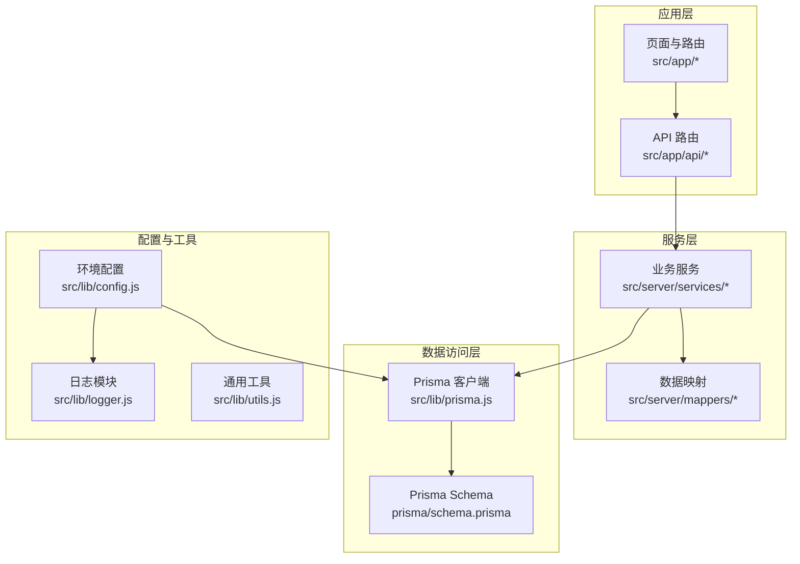
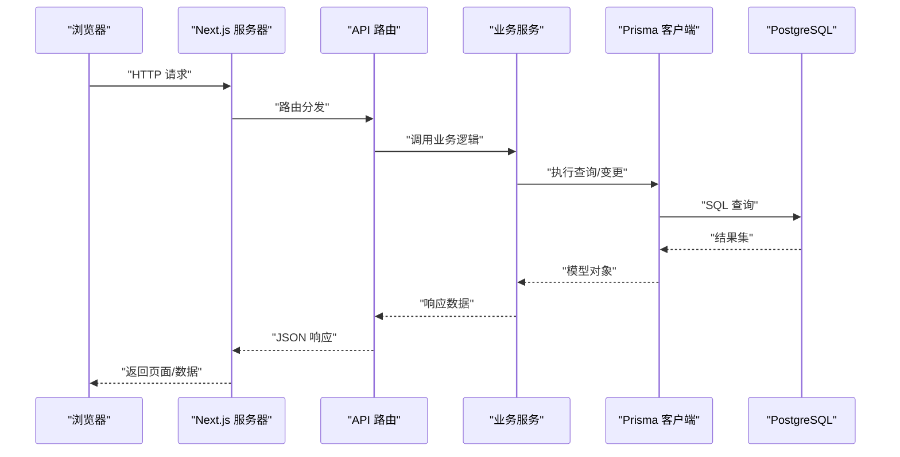
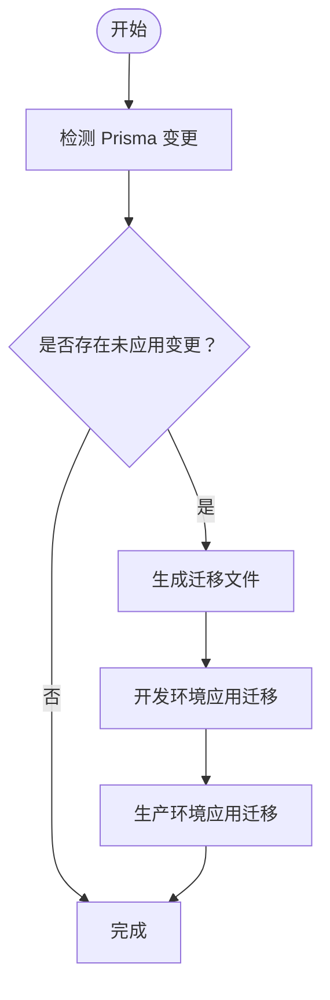
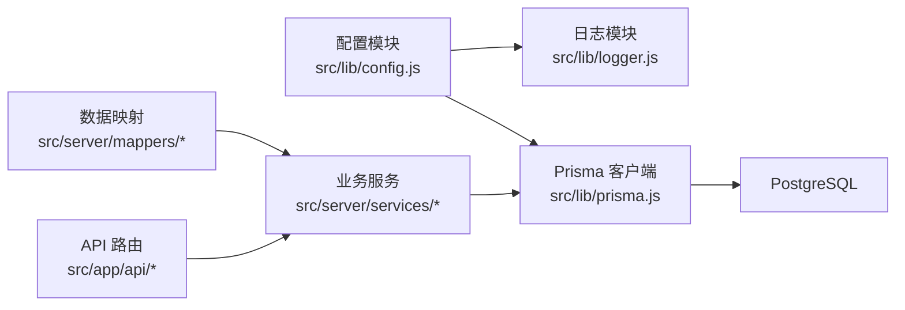

# 部署与运维

<cite>
**本文引用的文件**
- [package.json](file://package.json)
- [next.config.js](file://next.config.js)
- [prisma/schema.prisma](file://prisma/schema.prisma)
- [prisma.config.ts](file://prisma.config.ts)
- [src/lib/config.js](file://src/lib/config.js)
- [src/lib/logger.js](file://src/lib/logger.js)
- [src/lib/prisma.js](file://src/lib/prisma.js)
- [.gitignore](file://.gitignore)
- [src/lib/utils.js](file://src/lib/utils.js)
</cite>

## 目录
1. [简介](#简介)
2. [项目结构](#项目结构)
3. [核心组件](#核心组件)
4. [架构总览](#架构总览)
5. [详细组件分析](#详细组件分析)
6. [依赖关系分析](#依赖关系分析)
7. [性能考虑](#性能考虑)
8. [故障排除指南](#故障排除指南)
9. [结论](#结论)
10. [附录](#附录)

## 简介
本文件面向运维工程师与系统管理员，提供 Vibe DB 的完整部署与运维指导。内容涵盖生产环境配置、环境变量管理、安全设置、数据库迁移与备份恢复、监控告警、性能优化、负载均衡与缓存策略、日志管理与错误追踪、CI/CD 流水线与自动化测试等。文档基于仓库现有实现进行提炼，并提供可操作的实践建议。

## 项目结构
Vibe DB 是一个基于 Next.js 的前端应用，使用 Prisma 进行数据库访问与迁移。项目采用分层组织：
- 应用层：Next.js 页面与 API 路由
- 服务层：业务服务与数据映射
- 数据访问层：Prisma 客户端与适配器
- 工具与配置：日志、配置、通用工具
- 数据库：PostgreSQL（通过 Prisma schema 指定）

图表来源
- [src/lib/prisma.js:1-16](file://src/lib/prisma.js#L1-L16)
- [prisma/schema.prisma:1-69](file://prisma/schema.prisma#L1-L69)
- [src/lib/config.js:1-33](file://src/lib/config.js#L1-L33)
- [src/lib/logger.js:1-65](file://src/lib/logger.js#L1-L65)

章节来源
- [package.json:1-55](file://package.json#L1-L55)
- [next.config.js:1-7](file://next.config.js#L1-L7)
- [prisma/schema.prisma:1-69](file://prisma/schema.prisma#L1-L69)

## 核心组件
- 环境配置模块：根据 NODE_ENV 自动选择开发/生产配置，读取数据库连接串与应用 URL，并设置日志级别与美化输出开关。
- 日志模块：开发环境同时输出到控制台与文件；生产环境仅输出到文件；按日期切割日志文件。
- Prisma 客户端：通过 PostgreSQL 适配器连接数据库，全局单例模式以避免重复连接。
- Next.js 配置：启用严格模式与外部包优化，提升运行时稳定性与性能。

章节来源
- [src/lib/config.js:1-33](file://src/lib/config.js#L1-L33)
- [src/lib/logger.js:1-65](file://src/lib/logger.js#L1-L65)
- [src/lib/prisma.js:1-16](file://src/lib/prisma.js#L1-L16)
- [next.config.js:1-7](file://next.config.js#L1-L7)

## 架构总览
下图展示从浏览器到数据库的典型请求链路，以及关键配置点：

图表来源
- [src/lib/prisma.js:1-16](file://src/lib/prisma.js#L1-L16)
- [prisma/schema.prisma:1-69](file://prisma/schema.prisma#L1-L69)

## 详细组件分析

### 数据库与迁移
- 数据库类型：PostgreSQL（在 Prisma schema 中声明）
- 连接方式：通过 DATABASE_URL 环境变量传递连接串，Prisma 客户端使用 PostgreSQL 适配器建立连接
- 迁移策略：
  - 开发环境：使用 Prisma Dev 迁移命令，自动检测变更并生成迁移文件
  - 生产环境：使用 Prisma Deploy 迁移命令，确保零停机或最小停机窗口
- 迁移锁：仓库包含迁移锁文件，用于防止并发迁移冲突

图表来源
- [prisma/schema.prisma:1-69](file://prisma/schema.prisma#L1-L69)
- [package.json:10-14](file://package.json#L10-L14)

章节来源
- [prisma/schema.prisma:1-69](file://prisma/schema.prisma#L1-L69)
- [package.json:10-14](file://package.json#L10-L14)

### 环境变量与安全
- 必需环境变量
  - DATABASE_URL：PostgreSQL 连接串
  - NODE_ENV：开发/生产环境标识
  - NEXT_PUBLIC_APP_URL：前端可访问的应用 URL
  - LOG_LEVEL：日志级别（可选）
- 安全建议
  - 严禁将敏感信息提交至版本控制；.gitignore 已忽略常见环境文件与日志目录
  - 在生产环境使用只读数据库用户权限，限制 DDL 权限
  - 使用密钥管理服务存储 DATABASE_URL，避免明文配置
  - 启用 HTTPS 并强制安全传输

章节来源
- [src/lib/config.js:15-23](file://src/lib/config.js#L15-L23)
- [.gitignore:1-8](file://.gitignore#L1-L8)

### 日志与可观测性
- 日志行为
  - 开发环境：控制台彩色美化 + JSON 文件输出
  - 生产环境：仅 JSON 文件输出
  - 按日期切割日志文件，便于归档与检索
- 建议
  - 结合集中式日志系统（如 ELK/Fluent Bit/Loki）收集容器或主机日志
  - 设置日志轮转与保留策略，避免磁盘占满
  - 对敏感字段脱敏（如 SQL 参数），避免泄露

章节来源
- [src/lib/logger.js:1-65](file://src/lib/logger.js#L1-L65)
- [src/lib/config.js:25-29](file://src/lib/config.js#L25-L29)

### 性能与资源
- Next.js 配置
  - 严格模式：提升开发阶段的错误暴露能力
  - 外部包优化：将 Prisma 客户端标记为外部包，减少打包体积
- 建议
  - 启用静态导出或 ISR/SSR 以降低首屏延迟
  - 使用 CDN 缓存静态资源
  - 对热点查询建立合适索引，结合数据库慢查询日志优化

章节来源
- [next.config.js:1-7](file://next.config.js#L1-L7)

### 错误处理与容错
- 全局日志记录：统一通过 Pino 输出，便于问题定位
- 通用工具：提供日期格式化与相对时间格式化，辅助错误上下文
- 建议
  - 在 API 层封装统一响应与错误包装
  - 引入重试与熔断机制（针对数据库连接抖动）
  - 对关键操作增加幂等性校验

章节来源
- [src/lib/logger.js:1-65](file://src/lib/logger.js#L1-L65)
- [src/lib/utils.js:1-44](file://src/lib/utils.js#L1-L44)

## 依赖关系分析
- 组件耦合
  - 业务服务依赖数据映射层与 Prisma 客户端
  - Prisma 客户端依赖环境变量中的 DATABASE_URL
  - 日志模块依赖配置模块与运行时环境
- 外部依赖
  - PostgreSQL：作为数据存储后端
  - Prisma：ORM 与迁移工具
  - Next.js：Web 框架与构建系统

图表来源
- [src/lib/config.js:1-33](file://src/lib/config.js#L1-L33)
- [src/lib/logger.js:1-65](file://src/lib/logger.js#L1-L65)
- [src/lib/prisma.js:1-16](file://src/lib/prisma.js#L1-L16)

章节来源
- [src/lib/config.js:1-33](file://src/lib/config.js#L1-L33)
- [src/lib/prisma.js:1-16](file://src/lib/prisma.js#L1-L16)

## 性能考虑
- 数据库层面
  - 为高频查询字段建立索引，避免全表扫描
  - 使用连接池参数优化并发与超时
  - 定期统计与分析慢查询日志
- 应用层面
  - 合理使用缓存（如 Redis）缓存热点数据与查询结果
  - 对大列表分页与懒加载，减少一次性渲染压力
  - 启用 Gzip/Brotli 压缩与静态资源缓存
- 运维层面
  - 使用水平扩展与多副本部署，配合负载均衡
  - 监控 CPU、内存、连接数与 QPS，设置阈值告警

## 故障排除指南
- 启动失败
  - 检查 DATABASE_URL 是否正确且可达
  - 确认 Prisma 迁移已成功应用
- 访问异常
  - 核对 NEXT_PUBLIC_APP_URL 与反向代理配置
  - 查看日志文件定位错误堆栈
- 数据库问题
  - 使用 Prisma Studio 或数据库客户端验证表结构与数据
  - 关注慢查询与锁等待
- 日志排查
  - 开发环境可直接查看控制台输出
  - 生产环境检查日志文件是否按日期切割与落盘

章节来源
- [src/lib/logger.js:1-65](file://src/lib/logger.js#L1-L65)
- [package.json:10-14](file://package.json#L10-L14)

## 结论
本指南基于仓库现有实现，提供了从环境配置、数据库迁移、日志与监控到性能优化与故障排除的完整运维路径。建议在生产环境中结合企业级平台（Docker/Kubernetes/云平台）进一步标准化部署与治理，并持续完善 CI/CD 与安全策略。

## 附录

### 环境变量清单
- DATABASE_URL：数据库连接串（必需）
- NODE_ENV：开发/生产（必需）
- NEXT_PUBLIC_APP_URL：应用访问地址（可选，默认本地）
- LOG_LEVEL：日志级别（可选）

章节来源
- [src/lib/config.js:15-23](file://src/lib/config.js#L15-L23)

### 数据库迁移与备份恢复
- 迁移
  - 开发：检测变更并生成迁移文件，随后应用
  - 生产：在维护窗口内应用迁移，必要时回滚
- 备份
  - 使用数据库原生命令导出快照
  - 定期校验备份完整性与可恢复性
- 恢复
  - 在隔离环境验证备份可用性
  - 逐步切换流量并监控一致性

### 监控与告警
- 指标
  - 应用：QPS、响应时间、错误率、连接池使用率
  - 数据库：连接数、慢查询数、缓冲池命中率
- 告警
  - 设定阈值与降噪规则，避免告警风暴
  - 结合日志与指标联动定位根因

### 负载均衡与缓存策略
- 负载均衡
  - 使用反向代理或云负载均衡分发请求
  - 配置健康检查与会话亲和（如需要）
- 缓存
  - 静态资源：CDN 缓存
  - 动态数据：Redis 缓存热点查询结果
  - 注意缓存失效策略与一致性

### CI/CD 流水线与自动化
- 构建
  - 使用 npm/yarn 执行构建脚本
- 测试
  - 单元测试与集成测试（建议在流水线中执行）
- 部署
  - Docker 容器化（见后续章节）
  - Kubernetes/云平台部署（见后续章节）

章节来源
- [package.json:5-14](file://package.json#L5-L14)

### Docker 容ainer 化部署（实践建议）
- 构建镜像
  - 基于官方 Node 镜像，安装依赖并构建应用
- 运行容器
  - 挂载日志目录到宿主机或使用日志驱动
  - 通过环境变量注入 DATABASE_URL 与应用 URL
- 健康检查
  - 配置 HTTP 探针检查 /health 或内部可用性端点
- 安全
  - 使用只读根文件系统与非 root 用户运行
  - 限制容器资源配额与重启策略

### Kubernetes 部署（实践建议）
- Deployment
  - 多副本与滚动更新策略
  - 资源请求与限制
- Service
  - ClusterIP/LoadBalancer/Ingress 配置
- ConfigMap/Secret
  - 存放非敏感配置与数据库连接串
- PersistentVolume
  - 为日志目录提供持久化存储
- HPA
  - 基于 CPU/自定义指标自动扩缩容

### 云平台部署（实践建议）
- 选择托管数据库（如云数据库实例）并配置网络白名单
- 使用平台提供的容器服务或无服务器函数承载应用
- 启用平台内置的监控、告警与日志服务
- 使用平台密钥管理服务管理敏感配置