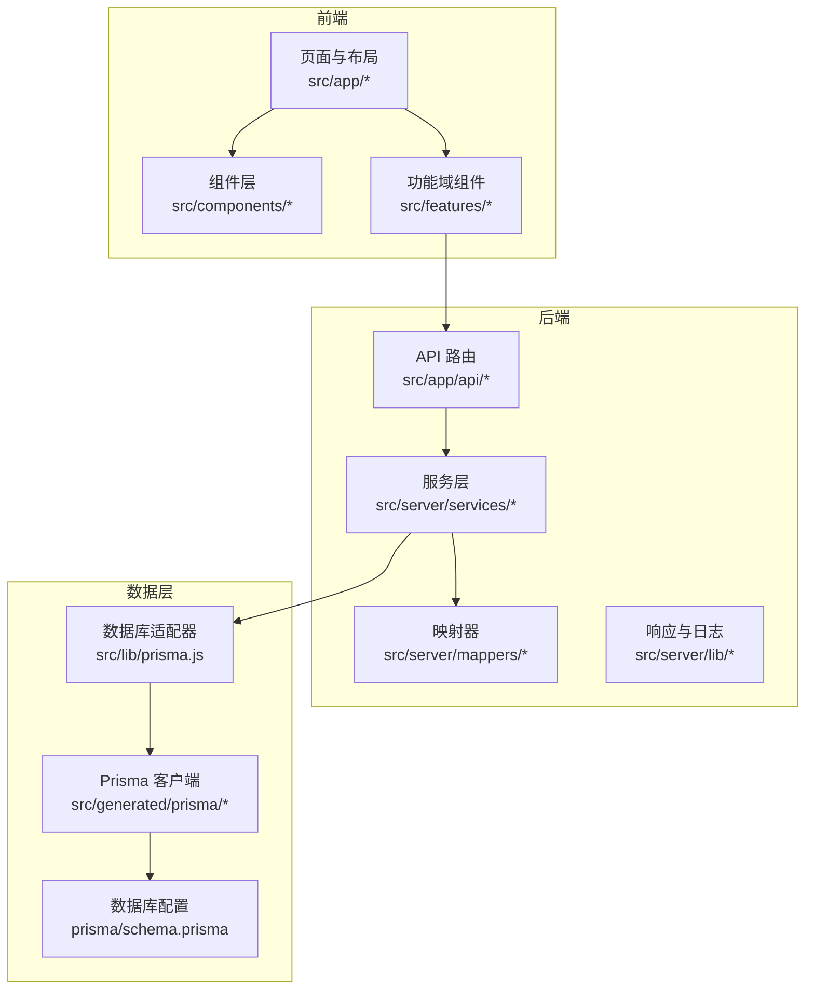
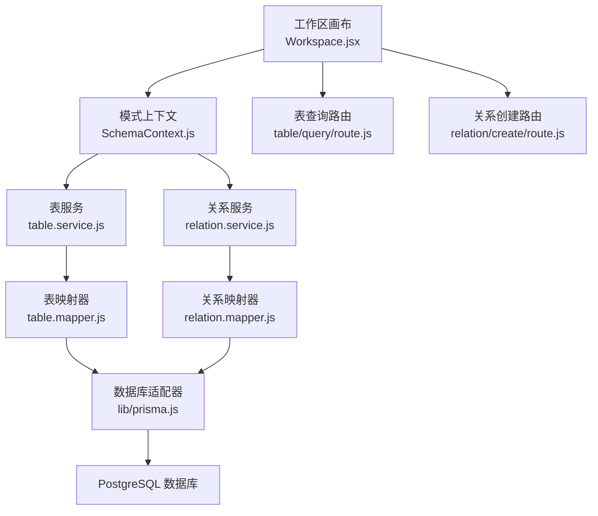
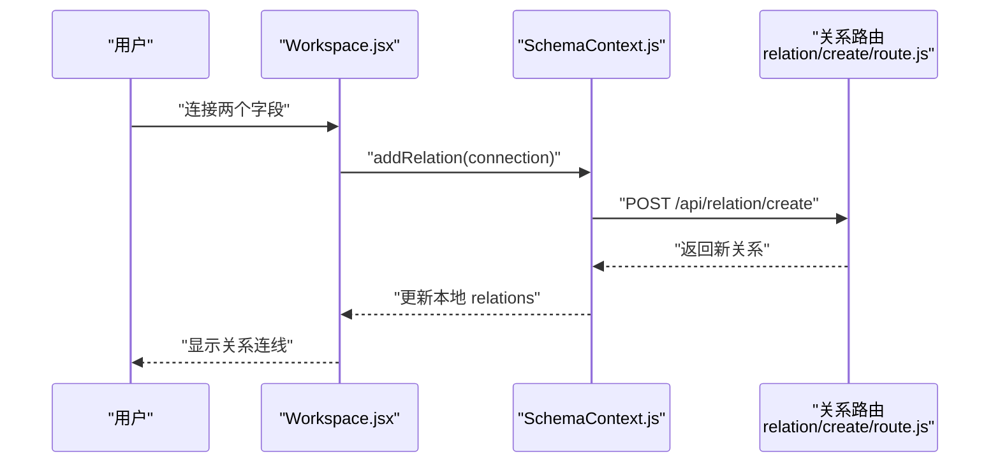
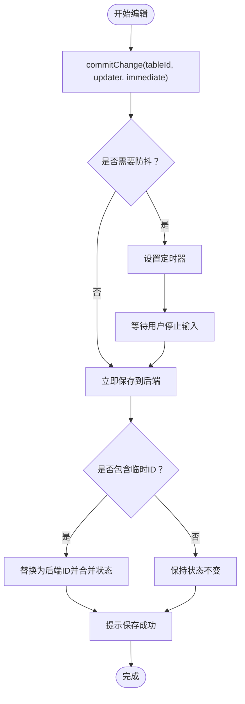
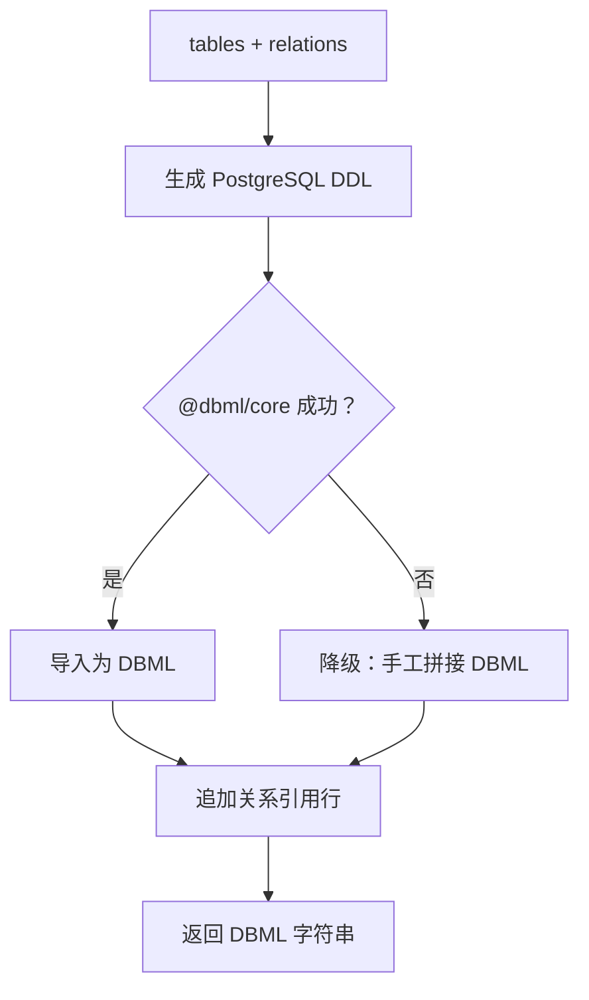
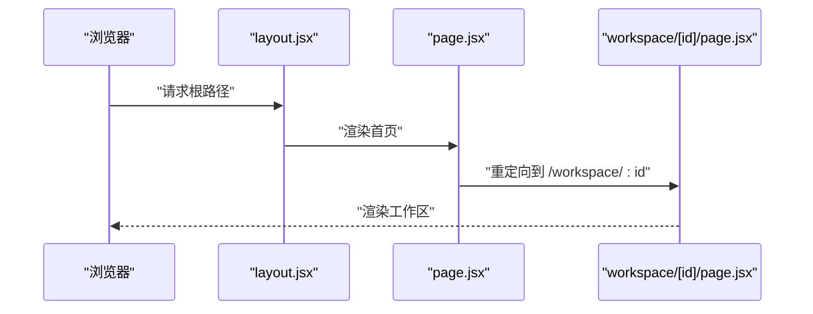
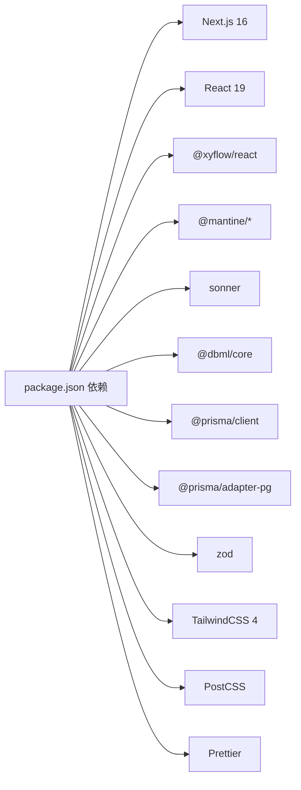

# 项目概述

<cite>
**本文档引用的文件**
- [package.json](file://package.json)
- [next.config.js](file://next.config.js)
- [prisma/schema.prisma](file://prisma/schema.prisma)
- [src/app/layout.jsx](file://src/app/layout.jsx)
- [src/app/page.jsx](file://src/app/page.jsx)
- [src/components/Providers.jsx](file://src/components/Providers.jsx)
- [src/features/canvas/Workspace.jsx](file://src/features/canvas/Workspace.jsx)
- [src/features/schema/SidePanel.jsx](file://src/features/schema/SidePanel.jsx)
- [src/lib/prisma.js](file://src/lib/prisma.js)
- [src/lib/config.js](file://src/lib/config.js)
- [src/app/api/table/query/route.js](file://src/app/api/table/query/route.js)
- [src/app/api/relation/create/route.js](file://src/app/api/relation/create/route.js)
- [src/features/schema/dbml.js](file://src/features/schema/dbml.js)
- [src/features/schema/SchemaContext.js](file://src/features/schema/SchemaContext.js)
- [src/app/workspace/[id]/page.jsx](file://src/app/workspace/[id]/page.jsx)
</cite>

## 目录
1. [简介](#简介)
2. [项目结构](#项目结构)
3. [核心组件](#核心组件)
4. [架构总览](#架构总览)
5. [详细组件分析](#详细组件分析)
6. [依赖分析](#依赖分析)
7. [性能考虑](#性能考虑)
8. [故障排除指南](#故障排除指南)
9. [结论](#结论)

## 简介
Vibe DB 是一个基于 Next.js 16 的全栈数据库可视化设计工具，专注于通过拖拽式界面实现数据库模式的直观设计与管理。其核心价值主张在于：
- 拖拽式界面设计：通过可视化画布快速构建数据库实体关系。
- 实时数据库模式编辑：支持对表、字段、索引及关系进行即时编辑与持久化。
- DBML 导出能力：可将当前设计导出为 DBML 文本，便于团队协作与版本管理。

技术栈选择（Next.js 16、React 19、Prisma ORM、PostgreSQL）的优势体现在：
- Next.js 16：提供稳定的 SSR/SSG 能力与现代化路由体系，适合构建高性能全栈应用。
- React 19：具备更优的并发特性与状态管理能力，提升交互流畅度。
- Prisma ORM：类型安全的数据库访问层，简化 CRUD 与复杂查询，配合迁移工具保障数据库演进。
- PostgreSQL：成熟的关系型数据库，支持复杂查询与高并发场景。

目标用户群体与使用场景：
- 数据库设计者与架构师：用于快速建模与关系梳理。
- 开发团队：通过 DBML 导出与版本控制，统一数据库设计规范。
- 教育与学习者：通过可视化界面降低数据库设计的学习门槛。

## 项目结构
项目采用按功能域分层的组织方式，前端以 Next.js App Router 为核心，后端 API 位于 app/api 下，数据访问通过 Prisma 客户端与服务层封装，核心业务逻辑集中在 SchemaContext 与 Canvas 组件中。

图表来源
- [src/app/layout.jsx:1-19](file://src/app/layout.jsx#L1-L19)
- [src/app/workspace/[id]/page.jsx](file://src/app/workspace/[id]/page.jsx#L1-L121)
- [src/features/schema/SchemaContext.js:1-392](file://src/features/schema/SchemaContext.js#L1-L392)
- [src/lib/prisma.js:1-16](file://src/lib/prisma.js#L1-L16)
- [prisma/schema.prisma:1-69](file://prisma/schema.prisma#L1-L69)

章节来源
- [src/app/layout.jsx:1-19](file://src/app/layout.jsx#L1-L19)
- [src/app/page.jsx:1-6](file://src/app/page.jsx#L1-L6)
- [src/components/Providers.jsx:1-36](file://src/components/Providers.jsx#L1-L36)
- [src/app/workspace/[id]/page.jsx](file://src/app/workspace/[id]/page.jsx#L1-L121)

## 核心组件
- 布局与主题提供者：RootLayout 与 Providers 负责全局样式与主题注入，确保一致的 UI 体验。
- 工作区画布：Workspace 使用 @xyflow/react 构建可拖拽的表节点与关系连线，支持节点位置持久化与键盘删除关系。
- 侧边面板：SidePanel 提供 DBML、数据表、关联三个面板，分别对应不同维度的模式编辑。
- 模式上下文：SchemaContext 统一管理表、字段、索引与关系的状态，内置防抖保存与临时 ID 管理，确保编辑体验与数据一致性。
- API 路由：table/query 与 relation/create 等路由封装了服务层调用，提供结构化的响应与错误处理。
- DBML 生成：dbml.js 将当前模式转换为 DBML 文本，支持导入 PostgreSQL DDL 并补充关系引用。

章节来源
- [src/components/Providers.jsx:1-36](file://src/components/Providers.jsx#L1-L36)
- [src/features/canvas/Workspace.jsx:1-219](file://src/features/canvas/Workspace.jsx#L1-L219)
- [src/features/schema/SidePanel.jsx:1-39](file://src/features/schema/SidePanel.jsx#L1-L39)
- [src/features/schema/SchemaContext.js:1-392](file://src/features/schema/SchemaContext.js#L1-L392)
- [src/app/api/table/query/route.js:1-20](file://src/app/api/table/query/route.js#L1-L20)
- [src/app/api/relation/create/route.js:1-14](file://src/app/api/relation/create/route.js#L1-L14)
- [src/features/schema/dbml.js:1-115](file://src/features/schema/dbml.js#L1-L115)

## 架构总览
系统采用前后端分离但紧密耦合的设计：前端负责可视化与交互，后端提供 REST 风格 API；数据层通过 Prisma ORM 与 PostgreSQL 协作，确保类型安全与可维护性。

图表来源
- [src/features/canvas/Workspace.jsx:1-219](file://src/features/canvas/Workspace.jsx#L1-L219)
- [src/features/schema/SchemaContext.js:1-392](file://src/features/schema/SchemaContext.js#L1-L392)
- [src/app/api/table/query/route.js:1-20](file://src/app/api/table/query/route.js#L1-L20)
- [src/app/api/relation/create/route.js:1-14](file://src/app/api/relation/create/route.js#L1-L14)
- [src/lib/prisma.js:1-16](file://src/lib/prisma.js#L1-L16)
- [prisma/schema.prisma:1-69](file://prisma/schema.prisma#L1-L69)

## 详细组件分析

### 工作区画布（Workspace）
- 功能要点
  - 将表集合转换为节点，字段索引状态通过节点数据传递。
  - 基于关系数组生成边，支持自定义边样式与点击事件。
  - 节点拖拽结束后立即保存位置至后端，防止重复保存。
  - 支持键盘删除选中关系，提升交互效率。
- 性能与可靠性
  - 使用 useMemo 优化边生成，减少无效重渲染。
  - 通过引用对象标记保存状态，避免重复写入。

图表来源
- [src/features/canvas/Workspace.jsx:164-173](file://src/features/canvas/Workspace.jsx#L164-L173)
- [src/features/schema/SchemaContext.js:309-340](file://src/features/schema/SchemaContext.js#L309-L340)
- [src/app/api/relation/create/route.js:1-14](file://src/app/api/relation/create/route.js#L1-L14)

章节来源
- [src/features/canvas/Workspace.jsx:1-219](file://src/features/canvas/Workspace.jsx#L1-L219)

### 模式上下文（SchemaContext）
- 状态管理
  - 统一管理 tables 与 relations，并提供增删改查方法。
  - 对表属性（名称）采用防抖保存，对颜色/坐标等立即保存，兼顾体验与性能。
- 临时 ID 与幂等保存
  - 新建实体时生成临时 ID，提交后由后端返回真实 ID，避免输入框光标跳动。
  - 保存过程中若检测到新变更，会自动重试，确保最终一致性。
- 关系操作
  - 从连接信息解析源/目标字段，自动生成关系名称与方向。
  - 支持乐观更新与回滚提示，增强交互反馈。

图表来源
- [src/features/schema/SchemaContext.js:147-173](file://src/features/schema/SchemaContext.js#L147-L173)
- [src/features/schema/SchemaContext.js:86-135](file://src/features/schema/SchemaContext.js#L86-L135)

章节来源
- [src/features/schema/SchemaContext.js:1-392](file://src/features/schema/SchemaContext.js#L1-L392)

### DBML 导出（dbml.js）
- 设计思路
  - 先将表与字段转换为 PostgreSQL DDL，再通过 @dbml/core 导入为标准 DBML。
  - 手动追加关系引用行，覆盖导入器无法识别的外键关系。
  - 若导入失败则降级为手工拼接，保证输出可用性。
- 输出用途
  - 便于团队共享、版本控制与第三方工具集成。

图表来源
- [src/features/schema/dbml.js:72-89](file://src/features/schema/dbml.js#L72-L89)
- [src/features/schema/dbml.js:94-114](file://src/features/schema/dbml.js#L94-L114)

章节来源
- [src/features/schema/dbml.js:1-115](file://src/features/schema/dbml.js#L1-L115)

### 页面与路由（App Router）
- 入口与布局
  - 根布局注入主题与通知组件，全局样式统一。
  - 首页重定向至工作区，提供统一入口。
- 工作区页面
  - 通过参数获取 schemaId，初始化 SchemaProvider。
  - 工具栏切换侧边面板，SplitPane 控制面板宽度与可见性。

图表来源
- [src/app/layout.jsx:1-19](file://src/app/layout.jsx#L1-L19)
- [src/app/page.jsx:1-6](file://src/app/page.jsx#L1-L6)
- [src/app/workspace/[id]/page.jsx](file://src/app/workspace/[id]/page.jsx#L80-L121)

章节来源
- [src/app/layout.jsx:1-19](file://src/app/layout.jsx#L1-L19)
- [src/app/page.jsx:1-6](file://src/app/page.jsx#L1-L6)
- [src/app/workspace/[id]/page.jsx](file://src/app/workspace/[id]/page.jsx#L1-L121)

## 依赖分析
- 前端依赖
  - Next.js 16 与 React 19：提供现代框架能力与并发特性。
  - @xyflow/react：可视化画布与拖拽连线。
  - @mantine/* 与 sonner：UI 主题与通知提示。
  - @dbml/core：DBML 解析与导入。
- 后端依赖
  - @prisma/client 与 @prisma/adapter-pg：类型安全的数据库访问与适配器。
  - zod：请求参数校验。
- 开发与构建
  - TailwindCSS 4 与 PostCSS 生态：样式工具链。
  - Prettier 与插件：代码格式化。

图表来源
- [package.json:16-53](file://package.json#L16-L53)

章节来源
- [package.json:1-55](file://package.json#L1-L55)
- [next.config.js:1-7](file://next.config.js#L1-L7)

## 性能考虑
- 保存策略
  - 表属性名称采用防抖保存，减少频繁网络请求；颜色/坐标等即时保存，提升交互反馈。
  - 保存期间检测新变更并自动重试，避免丢失最新修改。
- 渲染优化
  - 使用 useMemo 优化关系边的生成，避免每次渲染都重新计算。
  - 仅在节点拖拽结束时触发保存，降低写入频率。
- 数据库访问
  - Prisma 客户端通过适配器连接 PostgreSQL，结合迁移工具保障结构演进与查询性能。

## 故障排除指南
- 保存失败
  - 现象：保存提示失败或无响应。
  - 排查：检查网络请求状态与后端日志；确认 schemaId 是否正确传入；查看临时 ID 是否成功替换为后端 ID。
- 关系创建异常
  - 现象：连线后未显示关系或报错。
  - 排查：确认连接两端字段 ID 与 handle 格式；检查服务层返回值与前端状态同步。
- DBML 导出为空
  - 现象：导出结果为空或仅含注释。
  - 排查：确认存在表；检查 DDL 生成与导入过程；必要时启用降级方案。

章节来源
- [src/features/schema/SchemaContext.js:122-135](file://src/features/schema/SchemaContext.js#L122-L135)
- [src/app/api/relation/create/route.js:1-14](file://src/app/api/relation/create/route.js#L1-L14)
- [src/features/schema/dbml.js:72-89](file://src/features/schema/dbml.js#L72-L89)

## 结论
Vibe DB 通过现代化的前端框架与严谨的后端架构，实现了数据库设计的可视化与高效协作。其核心优势在于：
- 直观的拖拽式设计与实时保存机制，显著降低数据库建模门槛。
- 完整的 DBML 导出能力，满足团队协作与版本管理需求。
- 基于 Prisma 的类型安全与可维护性，为长期演进提供保障。

对于初学者，建议从工作区页面入手，逐步熟悉表、字段、索引与关系的创建与编辑；对于有经验的开发者，可重点关注 SchemaContext 的状态管理策略与 API 路由的服务层封装，以充分利用项目的工程化实践。